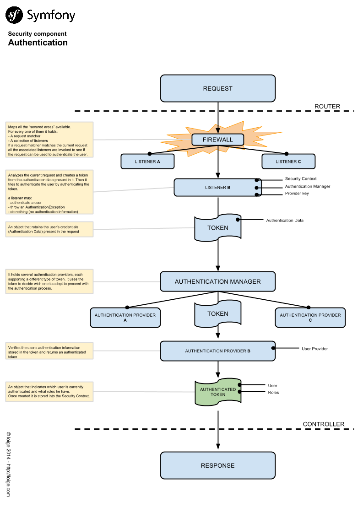

The [Symfony2 security component](http://symfony.com/doc/current/components/security/introduction.html) has the fame of being one of the most complex in the framework. I tend to believe that's partially true, not because the component is really that complex, but because there are (really) a lot of concepts involved and it may be difficult to understand them all at once and have a clear vision as a whole.

I am in the process of writing an [OAuth bundle](https://github.com/Oryzone/OryzoneOauthBundle) and I faced the need to deeply understand how the authentication process work in Symfony2 to being able to integrate the OAuth protocol with the Symfony authentication component.
Notice that I know there are a lot of great and stable OAuth bundles out there (have a look at the great [HWIOAuthBundle](https://github.com/hwi/HWIOAuthBundle) to which I had chance to submit small contributions in the past). My intention is not to build a better one, but I want to build my own bundle with some peculiar features and use it as a way to experiment and learn new things. But I am getting off topic!

Going back to the Symfony2 security component, the point is that I found out difficult at first glance to get a clear idea of what is going on behind the scenes and what I need to write to create a custom authentication mechanism.

So in this post I will try to collect few interesting resources that helped me understanding it better and a [graph](#symfony-authentication-graph) I drawn to resume what I learned.

## Interesting links

I highly suggest you to read them in the proposed order.

- [Symfony Security component documentation](http://symfony.com/doc/current/components/security/introduction.html): must read! The official documentation about the security component. It covers both authentication and authorization. Be warned that it will probably not make things clear at first, but I believe you must start your learning from there!
- [Diving into security layer](http://www.screenfony.com/blog/symfony-custom-authentication-provider): a great blog post from [Francesco Tassi](http://www.ftassi.com/) of [Screenfony](http://www.screenfony.com/). It carefully describes which classes and interfaces are involved in the authentication layer and how they are wired togheter. He does not present any example of code, but in my opinion this is one of the most interesting and clarifying post about this topic.
- [Love and Loss: A Symfony Security Play](http://www.slideshare.net/kriswallsmith/love-and-loss-a-symfony-security-play): slides by the great [Kris Wallsmith](http://kriswallsmith.net/) from the Symfony Live 2013 in Portland. Also a [Video](http://kriswallsmith.net/post/56350579294/video-of-the-tech-talk-love-loss-a-symfony) is available. That's a great resource because Kris tries to explain with visual graphs how the various components are tied together and how the whole flow goes from request to response. Very clarifying!
- [Symfony2: Introduction to The Security Component Part I](http://php-and-symfony.matthiasnoback.nl/2012/07/symfony2-introduction-to-the-security-component-part-i/), [Part II](http://php-and-symfony.matthiasnoback.nl/2012/08/symfony2-introduction-to-the-security-component-part-ii/) & [Part III](http://php-and-symfony.matthiasnoback.nl/2012/09/symfony2-introduction-to-the-security-component-part-iii/): a series of articles by [Matthias Noback](http://php-and-symfony.matthiasnoback.nl/) that cover the various aspect of the Symfony security (both about authentication and authorization). They have been merged to the official documentation, so read it fast as a good way to recap ideas.
- [Security in real life](http://symfony.com/video/1/security-in-real-life/English): A video from the Symfony Live Paris 2012 by [Johannes Schmitt](http://jmsyst.com/blog/). Johannes explains some common problems people face with the Symfony security component. He also provides a great introduction describing the most important classes and how they are tied together.
- [Custom authentication provider](http://symfony.com/doc/current/cookbook/security/custom_authentication_provider.html): a cookbook article from the official documentation that presents a code example on how to write a custom authentication provider to integrate the WSSE protocol in Symfony. Great code example!
- [How to Authenticate Users with API Keys](http://symfony.com/doc/current/cookbook/security/api_key_authentication.html): another great cookbook article that will shed some light on the topic by providing a simple example.
- [How to Create a Custom Form Password Authenticator](http://symfony.com/doc/current/cookbook/security/custom_password_authenticator.html): yet another interesting cookbook article with a code example on how to modify the authentication logic behind the form (username/password) based authenticator.
- [Code of the RememberMe Listener](https://github.com/symfony/symfony/blob/master/src/Symfony/Component/Security/Http/Firewall/RememberMeListener.php): the code of the RememberMeListener class. A great and simple example on how to write a security authentication listener.

## Symfony Authentication graph

Notice that the following graph tries to represent the classical schema available in the Symfony Standard Edition. As the framework is extensible at any given point you are free to change the whole logic. The generic idea is that you start with a `Request` object and you should check if it can be used to produce an `AuthenticatedToken` according to some authentication logic.

Get the image in [full resolution on Google Drive](https://docs.google.com/drawings/d/1uTA7gQZ5IEV51Nv-HKR98sKWQNBUhEm0PPueJcoRW7c/edit?usp=sharing) (you can also propose edits with comments if you want) or [Download the PDF](./symfony_security_component_authentication_flow.pdf).

That's all, I hope this post has been useful. If you have interesting link related to this topic feel free to add them in the comment box and I will add them into the article.
