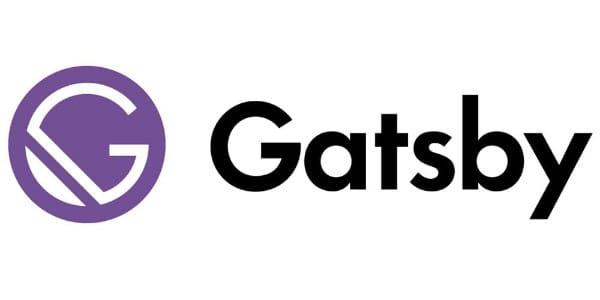
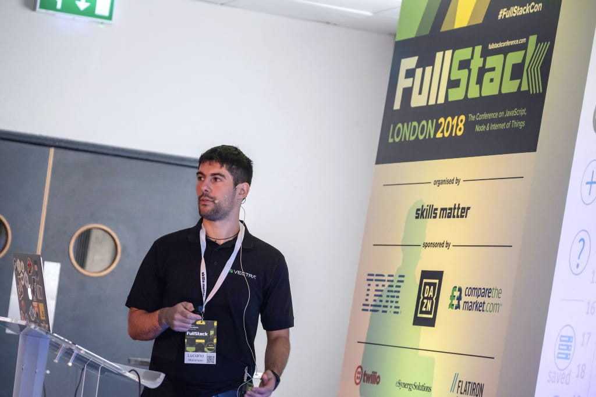

It is that time of the year when I have to look back at the previous year and see what were my achievements, my failures and set my expectations for my 2019.

**Full disclosure**: I write this type of posts mostly for myself, so I expect this to be
boring to death and most likely useless for everyone else.

You have been warned, read at your own risk!

## Static blog migration

Interesting achievement of the last year is that I finally migrated this blog from Ghost to a static setup using totally free and Open Source tools, which costs me **0.00 $ per month**.

I am using [GatsbyJS](https://www.gatsbyjs.org) as the engine for the static website.

If you are curious to see my setup (and maybe even correct typos in my articles), I have everything open sourced at
[lmammino/loige.co](https://github.com/lmammino/loige.co).

I don't think my GatsbyJS config is particularly interesting, but the entire publishing pipeline might be worth some words.

As per January 2019, this blog is published on [GitHub pages](https://pages.github.com/) using the [gh-pages branch](https://github.com/lmammino/loige.co/tree/gh-pages) which I publish using the very handy [`gh-pages` package](http://npm.im/gh-pages).

The static website is served through [Cloudflare CDN](https://www.cloudflare.com/cdn), which takes care of speeding up the delivery across the globe and other handy things like making sure the website runs on `https` correctly.

Every time I push on master, a [CirlceCI](https://circleci.com) build is triggered, and, if the build succeeds, a new version of the website is published automatically.

Checkout my [CircleCI config](https://github.com/lmammino/loige.co/blob/master/.circleci/config.yml) if you want to do something similar.

I wanted to do something like this for a while, so being able to achieve this was a big win for me!

## Conference talks

Pretty much like in the last 2 years, I tried to invest some of my time in engaging with the community through conference talks.

This year wasn't my best, but I still managed to deliver 8 talks and a workshop around the world. For the first time I delivered one outside Europe in the amazing New York.

Here's the full list of talks for 2018, you can find more details in the usual [speaking section](https://loige.co/speaking/) with links to slides and videos when available:

- "_Getting started with Serverless and Lambda Functions_" (workshop), Codemotion Rome (April)
- "_Unbundling the JavaScript module bundler_", Codemotion Rome (April)
- "_The future will be Serverless_", JS Day Verona (May)
- "_Cracking JWT tokens: a tale of magic, Node.JS and parallel computing_", Web Rebels Oslo (June)
- "_Cracking JWT tokens: a tale of magic, Node.JS and parallel computing_", Buzz JS New York (June)
- "_Unbundling the JavaScript module bundler_", Dublin JS (July)
- "_Cracking JWT tokens: a tale of magic, Node.JS and parallel computing_", FullStack London (July)
- "_Unbundling the JavaScript module bundler_", Øredev Malmo (November)
- "_Processing TeraBytes of data every day and sleeping at night_", Codemotion Milan (November)

Compared to 2017, when I presented 17 talks/workshops, this is a -52.94% "growth" rate. Ouch! 😵

In reality, I don't mind at all this level of commitment for conferences and workshops and I'll try to keep
2019 to a similar rate to 2018 and not overcommit.

## Career

From a career perspective I spent my 2018 at Vectra, where I worked "_automating the hunt for cyberattackers and speeding-up incident response_", which essentially means building software that help companies to identify cyber attacks and resolve them as quick as possible and with the least amount of effort.

One year at Vectra has been a blast and I had the pleasure (and luck 🍀) to be able to contribute to some important success stories:

 - I was involved in bootstrapping and scaling up a new European site that started from 3 and now counts 20+ people (engineering and sales). All world-class professionals with whom I love to work and from whom I can learn a lot every day.
 - Built a new product line from scratch. The product is already making revenue! This is a quite complicated product that is able to ingest and make searchable [Terabytes of data every day](https://loige.link/terabytes)!
 - Witnessed an astounding [104% growth in annual recurring revenue](https://www.vectra.ai/news/vectra-announces-104-growth-in-annual-recurring-revenue-during-2018).

 One year in the making, there was no shortage of personal skills development:

 - Improved my knowledge of **AWS**, including [getting certificated as Solution Architect](https://loige.co/aws-solution-architect-associate-exam-notes-tips).
 - Improved my knowledge of several technologies I love: **Terraform**, **Ansible**, **Packer**, **ElasticSearch**, **Node.js**, **JavaScript**, **Python**.
 - Got some new interesting use cases for **Serverless architectures**.
 - Started to acquire totally new skills like **GoLang**.
 - Deep dived into binary protocols like **Capnp** and got much better understanding of some low level mechanics like **serialization** and **memory management** (thank you [@gbinside](https://twitter.com/gbinside) for your forbearing mentorship on this).
 - Worked a lot on **Node.js performance optimizations**.
 - Learned a bit about **network security**.
 - Been exposed to some high level **AI/ML** concepts.
 - I have been a team leader and an architect, which meant that I had to engage a lot with peers and customers which probably improved some soft skills: **empathy**, **communication**, **teamwork**, **patience**, **accountability**, etc (I hope I also improved my english in the process 😅).

With this premise, I expect my 2019 at Vectra to be even more exciting than 2018. I am sure I'll learn and grow a ton.

There is a lot of work to do to keep the current growth rate, and I'll do my best to do my part!

## Side projects

In 2017, I launched and contributed to a number of interesting side projects.
In 2018, I didn't launch any new one, but I tried to take care at best of the
projects launched in the previous year, so I am going to recap here what happened with each one of them.

### Fullstack bulletin

[FullStack Bulletin](https://fullstackbulletin.com), a newsletter for ambitious FullStack developers, has been ongoing in 2018 with the same format of 2017 except some minor improvement. It recently surpassed 1000 subscribers, all through organic growth.

This projejcts takes me 30-60 minutes of work every week, but I am happy to keep investing the time as it works for me as well to stay up to date with the latest FullStack trends.

I still plan to invest on it during 2019 and maybe try to improve the format (new layout, new books, new quotes, etc.).

### Serverless lab

[Serverless Lab](https://serverlesslab.com) is a side-project started by [Padraig "Podge" O'Brien](https://twitter.com/podgeypoos79) and myself to help companies to get started quickly with serverless technologies on AWS.

During 2018, we took a chance to improve and update our material, but we used it for only one workshop.

It really takes a lot of time to find interested crowds. So far, all the engagement was mostly organic.

I am not sure yet how much I will commit on this project in 2019. I'll try to see if there's interest in the market.

### Middy

[Middy](https://middy.js.org) is a _Node.js middleware engine for AWS Lambda_. It basically allows you to take care of tedious and repetitive tasks such as validation, input deserialization and output serialization by encapsulating this external logic into reusable and testable middlewares.

In 2018 middy had a decent success. Here some numbers:

 - almost 500 stars on Github
 - an average of 6.000 downloads a week
 - 31 contributors over 124 releases.

I am quite proud of this project, even though in the latest months I felt like I didn't have the time, neither the energies to properly take care of it. My response time has become unacceptable and open PRs and Issues have been accumulating. I am a bit worried that the project will start to drift away.

I recently [asked more support to the other contributors](https://github.com/middyjs/middy/issues/263), basically stepping away from being the main maintainer.

I have to thank you some people for being there and trying their best to support the project:

 - [Yan Cui](https://github.com/theburningmonk) (who also wrote [an amazing article that mentions middy](https://epsagon.com/blog/enforce-consistent-error-handling-in-aws-lambda-with-wrappers/))
 - [Vlad Holubiev](https://twitter.com/vladholubiev)
 - [David Wells](https://github.com/DavidWells)

 And all the other contributors.

A stable version for the 1.0.0 branch has not been released yet. I'll try to focus on getting it done in 2019 and to try to be a little bit more responsive in replying to PRs and issues.

Meanwhile I hope new people will be able to jump on board and support the project.

### Fastify

[Fastify](https://www.fastify.io), started by [
Tomas Della Vedova](https://twitter.com/delvedor) and [Matteo Collina](https://twitter.com/matteocollina) is a **fast and low overhead web framework for Node.js**.

I have been marginally contributing to this fantastic project, taking care of setting up the official website (including the docs) and its automated pipeline.

In 2018, I did some minor improvements, but nothing major.

I admire all the contributors to the project as they managed to invest an incredible amount of energies in the project and attracted a pool of very talented people creating a strong community of users.

I am glad and grateful that I am being considered one of the core team members, even though I am very far away from putting the same amount of energy that the other contributors do.

I want to narrow my focus in 2019 so I don't have any special plan to contribute more to Fastify in 2019, but I'll try to be available to give my support on improving the website where needed.

## Blog posts

In 2018 I wasn't a very active author... So I'll go straight to the list of new posts published in this blog during the year:

- [AWS Command line: S3 content from stdin or to stdout](https://loige.co/aws-command-line-s3-content-from-stdin-or-to-stdout) (~7.800 views)
- [AWS Solution Architect Associate exam, my notes and tips](https://loige.co/aws-solution-architect-associate-exam-notes-tips) (~5.800 views)
- [Emerging JavaScript pattern: multiple return values](https://loige.co/emerging-javascript-pattern-multiple-return-values) (~3.200 views)
- [A random emoji in your terminal prompt. How and Why!](https://loige.co/random-emoji-in-your-prompt-how-and-why) (~1.500 views)

It's interesting to see that there's still a lot of the traffic driven by old (and maybe outdated) articles from the previous years like:

- [Extracting data from Wikipedia using curl, grep, cut and other shell commands](https://loige.co/extracting-data-from-wikipedia-using-curl-grep-cut-and-other-bash-commands) (~7.300 views)
- [Using Let’s Encrypt and Certbot to automate the creation of certificates for OpenVPN
](https://loige.co/using-lets-encrypt-and-certbot-to-automate-the-creation-of-certificates-for-openvpn) (~7.200 views)
- [Developing a web application with Lumen and MySql](https://loige.co/developing-a-web-application-with-lumen-and-mysql) (~7.000 views)
- [Gulp and FTP: update a website "on the fly"](https://loige.co/gulp-and-ftp-update-a-website-on-the-fly) (~4.000 views).

The total number of page views amounts to about 65.000 views, which compared to the previous year total of 57.000 is a slight increase of 14.04%!

I guess I have to write more and find more interesting topics if I want to keep this blog relevant in 2019! Also I should probably focus more on one or two topics, rather then writing about random fun stuff that comes into my mind!

## External posts

Aside from the articles published on my blog I had the pleasure to collaborate with Avanscoperta and [Gojko Adzic](https://twitter.com/gojkoadzic) writing an interview from the title "[Is Serverless the future of Cloud Computing?](https://blog.avanscoperta.it/it/2018/08/31/is-serverless-the-future-of-cloud-computing)".

It's always fun and rewarding to write guest posts and it's a nice way to get my name out from my common channels.

I guess in 2019 I should keep doing that and maybe build some new relationship with other publishers :)

## Open Sourcing

In 2018, I kept spending some time working out some small open source contributions. Here's a quick list of my main GitHub contributions:

 - [lmammino/fib-it](https://github.com/lmammino/fib-it): 6 ways to generate a fibonacci sequence in JavaScript.
 - [lmammino/twaffle](https://github.com/lmammino/twaffle): A TWitter rAFFLE script.
 - [lmammino/get-poop-done](https://github.com/lmammino/get-poop-done): A crappy-but-lovely™ todo list app.
 - [lmammino/invok](https://github.com/lmammino/invok): Command line tool to Invoke Go lambda functions locally.
 - [salesforce/ja3](https://github.com/salesforce/ja3) (contribution): JA3 is a standard for creating SSL client fingerprints in an easy to produce and shareable way.
 - [felixhageloh/uebersicht](https://github.com/felixhageloh/uebersicht) (contribution): Keep an eye on what's happening on your machine and in the world.
 - [gatsbyjs/gatsby](https://github.com/gatsbyjs/gatsby) (contribution): Build blazing fast, modern apps and websites with React.
 - [tj/node-blocked](https://github.com/tj/node-blocked) (contribution): Check if the Node.js event loop is blocked.
 - [lmammino/capnp-stream](https://github.com/lmammino/capnp-stream): A Node.js readable stream for Cap’n Proto encoded binary input.
 - [fastify/fastify-http-proxy](https://github.com/fastify/fastify-http-proxy) (contribution): Proxy your http requests to another server, with hooks.
 - [lmammino/benchmark-distributed-jwt-cracker](https://github.com/lmammino/benchmark-distributed-jwt-cracker): A benchmark suite using AWS for distributed-jwt-cracker.
 - [lmammino/metrica](https://github.com/lmammino/metrica): Event Emitter based node library that emits process metrics (uptime, memory, cpu) at given intervals.
 - [zeek/zeek](https://github.com/zeek/zeek) (contribution): Zeek (formerly known as Bro) is a powerful network analysis framework that is much different from the typical IDS you may know.
 - [lmammino/lambda-runtime-node8-capnp](https://github.com/lmammino/lambda-runtime-node8-capnp): Docker container image that resembles AWS lambda runtime for Node.js 8.10 and CapnProto 0.6.1
 - [lmammino/lambda-runtime-node8](https://github.com/lmammino/lambda-runtime-node8): Docker container image that resembles AWS lambda runtime for Node.js 8.10.0
 - [lmammino/openssl-rfc-mapping](https://github.com/lmammino/openssl-rfc-mapping): A quick'n'dirty script to map OpenSSL RFC to machine parseable data.
 - [lmammino/stream-accumulator](https://github.com/lmammino/stream-accumulator): Accumulate all the data flowing through a stream and emit it as a single chunk or as a promise.
 - [maxogden/mississippi](https://github.com/maxogden/mississippi) (contribution): A collection of useful stream utility modules for writing better code using streams.
 - [lmammino/lumpy](https://github.com/lmammino/lumpy): A lumpy and dummy JavaScript module bundler for those who are stuck in the past.
 - [lmammino/tick-stream](https://github.com/lmammino/tick-stream): A simple transform stream that can log a tick every time data is pushed through a pipe.
 - [nickjj/ansible-docker](https://github.com/nickjj/ansible-docker) (contribution): Install / Configure Docker and Docker Compose using Ansible.
 - [jsdoc2md/dmd](https://github.com/jsdoc2md/dmd) (contribution): The default output template for jsdoc2md.

👍 Comparing last year (19) to this year (22) I had a +15.79% repo contributions increase. Another pretty good vanity metric!

## Previous years goals

Now it's time to check whether I met [the goals I set last year](https://loige.co/2017-a-year-in-review#expectations-for-next-year):

- ✅ **MOAR conference talks/workshops (at least 8)**.
- 😭 **Write at least 8 quality blog posts (excluding this one!)**: did only 5!
- 😐 **Learn a lot about Security, Machine Learning and networking**: I guess I learned a bit, but probably not as much as I was expecting last year.
- 😐 **Keep contributing to Fastify**: didn't do a lot.
- 😐 **Keep working on Middy**: Initially well, lately not so much...
- ✅ **Move my blog to a static publishing engine and (possibly) use a serverless hosting approach**.
- 😐 **Learn enough about Rust and build something with it**: studied for a while, but didn't really build anything. I feel I kind of dropped it in favor of GoLang.
- ✅ **Learn enough about Elastic Search and build something with it**.
- 😐 **Learn enough about Kubernetes and build something with it**: Again, studied a bit but didn't really do much with it.
- ✅ **Do stuff with CSS Grids and Flexbox**.
- ✅ **Keep learning AWS and serverless**.
- 😐 **More serious and constant BJJ training**: kept training, but I should probably be more serious about it!

## Expectations for next year

Ok, it's finally time to move to the good intentions for the next year! I have been very long already so I'll just sort this part out with a simple unordered checklist, I am already looking forward to seeing, in one year time, how many items will be crossed:

- Keep doing conference talks/workshops (at least 8)
- Write at least 8 quality blog posts (excluding this one!)
- Keep learning about Security, Machine Learning and networking
- Release Middy v1.0
- Publish a new book (or a new edition ✌️)
- Get proficient in GoLang
- Learn a bit about Social Media and digital marketing
- Keep learning AWS and serverless
- Get an advanced AWS certification
- Play with new database technologies (e.g. CockroachDB & Clickhouse)
- Improve FullStack bulletin
- More serious and constant BJJ training!

That's all... If you are still reading, either you are a bot 🤖 or you are my new hero 💪!

In the latter case, I'd really love you to leave a comment here and let me know something about your 2018 and what you envision for your 2019.

See you in the next post, CIAO!
