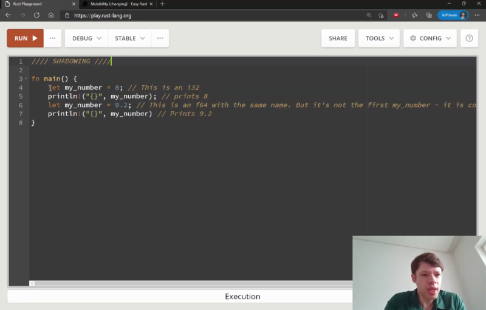
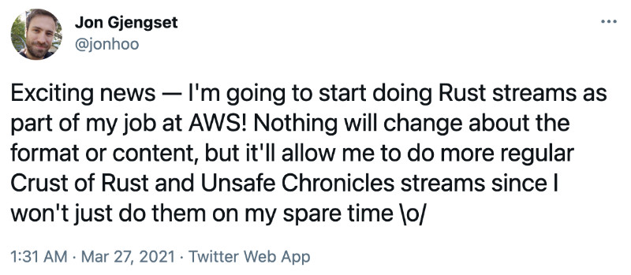
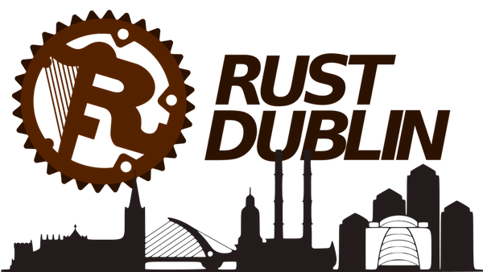
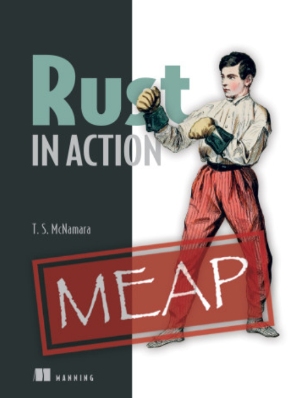
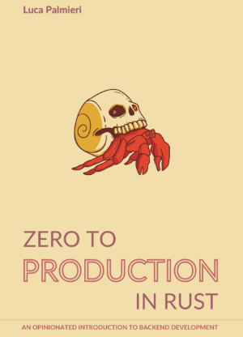
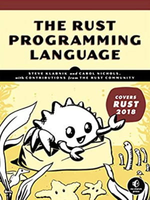
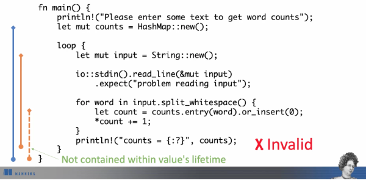

In this article, we want to provide a list of some free and paid resources that we loved the most in our journey to learning Rust.

Rust is certainly not the easiest of programming languages, especially at first glance, but once you can overcome the initial "wall of fear" and start to grasp some of the key concepts, Rust becomes a language that you are going to love and you will probably be looking for more and more excuses to use it and learn it further. For this reason, we wanted to collect a list of resources that can help new Rust adventures to find their path towards becoming real "rustaceans".

It's important to mention that this list is totally subjective and not comprehensive. We are only listing material that we had a chance to explore and that we enjoyed. We are sure there is still a lot of great content out there that we haven't found yet! So if you think something is missing here, let us know in the comments box below! We will also be mentioning some paid content, but we are not receiving any fee or using referral links when we mention these resources.

## Who are we

Just to put this in context, this article is written by Luciano and Stjepan, 2 software engineers with different backgrounds and expertise who came to love Rust. If you want to know more about us and understand why we are enjoying Rust, check out our bios at the end of this post.

## Free material

### Official guides

#### The Rust Programming Language - a.k.a. "The book"

The obvious place to start is the official [Rust book](https://doc.rust-lang.org/book/)! The Rust Programming Language is an open-book written by Steve Klabnik and Carol Nichols is a must-read for everyone starting their journey with Rust. It is a quite comprehensive document that explores all the main Rust concepts with very clear examples and a few interesting projects spanning multiple chapters: from a guessing game on the CLI to a multi-threaded web server. The best part of it is that it is a free resource, maintained by the Rust community itself. It has been kept up to date during the last few years, so it's a resource you can always come back to if you want to review some of the topics you are struggling with.

#### Rust by example

[Rust by example](https://doc.rust-lang.org/stable/rust-by-example/) is another wonderful official resource. It is structured as a book, but it feels more like a cheat sheet. It is divided into small chapters and subchapters. Every section is something you can read in about 5 minutes to learn a new Rust concept. You can treat it as reference material and you can get back to it anytime you struggle to remember some specific details like how do you write a unit test or what's the exact syntax of a `match` block. The reason why we love this resource is that it puts a lot of focus on the code. There is certainly more code than text and you will be learning by reading code and comment blocks embedded in the code; a great way to get used to the Rust syntax while you learn the concepts around the language.

#### The Rustonomicon

[The Rustonomicon](https://doc.rust-lang.org/nomicon/) is a free book for those who are already pretty confident with Rust and want to learn _the dark arts of unsafe Rust_! Rust can have portions of code that are _unsafe_. What that means is that the compiler will let you do things that might be unsafe and it's up to you to use this power responsibly. Unsafe code is not necessarily bad but needs to be used with caution and this book will guide you through all the nitty-gritty details that you need to be aware of before starting to write unsafe Rust. Read it if you want to avoid _unleashing indescribable horrors_!

### Non-official guides

#### Rust Design Patterns

[Rust Design Patterns](https://rust-unofficial.github.io/patterns/) is another open-book that is focused on teaching idiomatic Rust. It explores some Rust specific concepts but also revisits the classic **behavioural**, **creational** and **structural** design patterns and adapts them to the Rust idioms. Of course, it also takes the opportunity to explore idiomatic Rust patterns such as _RAII_ and _NewType_. As you might have noticed if you know us, we are real fans of design patterns, so we couldn't skip this book! Check it out after you have completed The Book and Rust by example.

#### Possible Rust

[Possible Rust](https://www.possiblerust.com) is a beautifully designed website that talks about "what's actually possible with Rust". The website is divided into 2 main sections: guides and patterns. Guides aim at explaining interesting Rust concepts like Foreign Function Interfaces (FFI), Traits, Enums, etc, while the Patterns section tries to explore interesting gotchas like ["what can you do when you can't make a trait object"](https://www.possiblerust.com/pattern/3-things-to-try-when-you-can-t-make-a-trait-object). There isn't a lot of material just yet, but we are sure that this resource is worth checking out and that it will grow over time. Keep it in your bookmarks or feed reader!

#### Easy Rust

Did we already say that Rust is not the easiest language to learn? Well, that's actually the same premise from which [Easy Rust](https://dhghomon.github.io/easy_rust/) is starting from. This is another open-book that tries to approach Rust concepts in a simple way, making them much more approachable and digestible, especially to people that are approaching Rust for the first time or engineers coming from higher-level languages. We especially loved some of the analogies in the book, for instance, pointers are compared to entries in a table of contents of a book. In our opinion, it is a great complement to the official Rust Book, but what makes it even more interesting is that recently the contents of this book were made available also in the form of videos [available on YouTube](https://www.youtube.com/playlist?list=PLfllocyHVgsRwLkTAhG0E-2QxCf-ozBkk)!

#### Learning Rust

[Learning Rust](https://learning-rust.github.io/) is another well-rounded open guide on Rust. With its beautiful website divided into a few major sections, it explores the basics of Rusts but also more advanced concepts such as ownership, borrowing, generics and traits. This resource focuses a lot on providing simple explanations and incentivises learning through reading Rust code with its rich set of code samples.

#### Rust Cookbook

Also called "Cookin' with Rust", [Rust Cookbook](https://rust-lang-nursery.github.io/rust-cookbook/) defines itself as being _"a collection of simple examples that demonstrate good practices to accomplish common programming tasks, using the crates of the Rust ecosystem"_. As many of the resources already presented so far, Rust Cookbook is built in the form of an open-book (using mdbooks) so it is completely available as an open-source project. The focus of this book is to complement many of the resources we already described above. It does not try to explore the basics of the language but instead, it takes a practical stance against common everyday problems such as concurrency, compression, cryptography and data structures. For every one of these areas it provides a number of interesting examples and suggests some of the most common third-party libraries (crates) that are generally used to tackle these problems.

#### Learn Rust With Entirely Too Many Linked Lists

Linked lists are… fun! I mean sort of! Definitely, the kind of thing you have been bogged down implementing if you took a computer science degree. In fairness, there is nothing wrong with linked lists even though they are no one's favourite for sure!

So why should we care about linked lists in Rust? Well, [Learn Rust With Entirely Too Many Linked Lists](https://rust-unofficial.github.io/too-many-lists/) might provide a good answer to this question.

Linked are built heavily around references so, if you grasp a little bit of Rust already, you might guess that by building a Linked List in Rust you will have to engage in a bloody fight with the borrow checker! This open-book illustrates a number of different approaches to tackle this challenge and, through a series of failed attempts, you will learn many interesting details about Rust and the borrow checker.

This resource is definitely recommended if you are starting to feel confident about your Rust knowledge and you want to start exploring more advanced topics in a practical way.

### Blogs

#### Amos (fasterthanlime)

If you want to learn more about Rust, why it is a fantastic language, why and when it might not be so good, and how it is becoming even better, the best place to get into that is [Amos (fasterthanlime)'s  blog](https://fasterthanli.me/).

Amos has a very engaging writing style. He can write very lengthy posts but they are always extremely enjoyable. Maybe because of his extensive in-depth knowledge, maybe because of his entertaining writing style and the support of the __Cool bear__!

If there one article you shouldn't miss in this blog that certainly is [Half an hour to learn Rust](https://fasterthanli.me/articles/a-half-hour-to-learn-rust).

#### Yoshua Wuyts

Yoshua has been quite an influential developer in the JavaScript community and we had a chance to meet him at several conferences. Always inspiring, Yoshua has been transitioning more and more to Rust in the latest years and he has been documenting his journey in [his great blog](https://blog.yoshuawuyts.com/).

His blog is a very good place to learn about async Rust, streams, iterators, etc. Yoshua works on several open-source projects and gives a lot of insight into the pros and cons of async in general.

Given our background as web developers, our favourite article so far is [Async HTTP](https://blog.yoshuawuyts.com/async-http/).

#### Steve Klabnik

Steve Klabnik is one of the most influential people in the Rust community. No surprise that some of the most influential Rust posts come from [his blog](https://steveklabnik.com/). In this blog, there's a lot of content on software engineering in general, and on how other languages and their problems (and solutions) compare to Rust.

If you don't know where to start, we recommend [Rust has finally outgrown me](https://steveklabnik.com/writing/rust-has-finally-outgrown-me).

#### Tyler Neely

If you’re into databases, performance optimization, distributed systems, check out [Tyler Neely's blog](https://tylerneely.com/) and look no further. The author writes about low-level problems, tips and tricks, linux, etc. Their project, [Sled](https://sled.rs/) is a fantastic tool if you want to experiment with embedded databases and Rust.

#### Luca Palmieri

[A learning journal by Luca Palmieri](https://www.lpalmieri.com/) is another valuable resource to find Rust learning material. Luca is the author of the in-progress book _Zero to Production in Rust_ (more on this later) and some of the chapters of the book have been published in the form of blog posts. Luca is a very prolific author and there is really a lot of good material, mostly around web development with Rust. One of our favourite articles is [Choosing a Rust web framework, 2020 edition](https://www.lpalmieri.com/posts/2020-07-04-choosing-a-rust-web-framework-2020-edition/) which compares the major Rust web frameworks and provides pointers on which one you should choose for your next web project.

### Streams (youtube & twitch channels)

If you prefer a more visual way to learn or if you simply enjoy video material, here's a lit of the Youtube channels and Twitch streams dedicated to Rust that we have been enjoying the most.

#### Streaming Rust with Ryan Levick

One of our favourite Rust YouTube channels is [Streaming Rust with Ryan Levick](https://www.youtube.com/channel/UCpeX4D-ArTrsqvhLapAHprQ). Ryan is a Microsoft engineer who has been spending a lot of time streaming Rust material. His content is quite varied, there are intro videos for beginners but also more advanced videos like [static VS dynamic dispatch](https://www.youtube.com/watch?v=tM2r9HD4ivQ&t=2064s) or [FFI](https://www.youtube.com/watch?v=jNNz4h3iIlw). What we like the most about Ryan is that he is great at explaining concepts, both simple and complicated ones. Every video is a little gem and the examples are always spot on.

If you prefer to watch the live versions of his videos you can also [find Ryan on Twitch](https://www.twitch.tv/ryanlevick).

#### Jon Gjengset

Jon Gjengset is another brilliant author who is streaming about Rust. He is also another content creator that we admire for his capacity of making complex topics easy and understandable. He has 2 main series about Rust right now:

 - [Crust of Rust](https://www.youtube.com/playlist?list=PLqbS7AVVErFiWDOAVrPt7aYmnuuOLYvOa): a very good series for the mid-level Rustucean who wants to get better with more advanced concepts such as _iterators_, _smart pointers_, _lifetime annotations_, etc.
 - [The Unsafe Chronicles](https://www.youtube.com/playlist?list=PLqbS7AVVErFj1t4kWrS5vfvmHpJ0bIPio): A deep dive into the world of unsafe Rust.
 
Currently, _The Unsafe Chronicles_ series has only one video, but the author recently posted on Twitter that we should be expecting a lot more of his time spent on creating new exciting content! How cool is that?

If you prefer to watch Jon live, you can [find him on Twitch](https://www.twitch.tv/jonhoo).

#### Tim McNamara

Tim is the author of the book _Rust in Action_ (more on this later), but he is also a prolific video streamer. He has been doing an excellent introduction to Rust video series called [Learn Rust Programming](https://www.youtube.com/playlist?list=PLwtLEJr-BkXZ9PmoAlqaFdoj47o61TWrS). We think that series is a pretty great place to start with Rust. One of the videos we loved the most is about [error handling in Rust](https://www.youtube.com/watch?v=K_NO5wJHFys&list=PLwtLEJr-BkXZ9PmoAlqaFdoj47o61TWrS&index=9&t=187s).

Also, special love goes to Tim for doing a [live review](https://loige.co/learning-rust-through-open-source-and-live-code-reviews) of Luciano's first crate ([jwtinfo](https://crates.io/crates/jwtinfo)), which is a testament to how much Tim cares about educating people about the Rust programming language.

If you want to follow Tim (you should!) you can find him on [YouTube](https://www.youtube.com/c/timClicks) and [Twitch](https://www.twitch.tv/timclicks).

#### Genus-v programming

[Genus-v programming](https://www.youtube.com/c/GenusvProgramming) is another great YouTube channel with some interesting Rust material. It is mostly focused on web development with Rust and that's probably why it fell under our radar.

One of our favourite playlists (unsurprisingly) is [Web Development with Rust](https://www.youtube.com/playlist?list=PLECOtlti4Psr4hXVX5GuSvLKp0-RZjz93) which shows how to use Actix to build a GraphQL API and an authentication server.

#### Systems with JT

[Systems with JT](https://www.youtube.com/channel/UCrW38UKhlPoApXiuKNghuig) is the YouTube channel of Jonathan Turner. Jonathan has been a very active Rust developer. He is the author of [Nushell](https://www.nushell.sh/) and, of course, in his channel, he has a good number of videos dedicated to Rust. Right now, our favourite series is the one where Jonathan explains [how to create a line editor in Rust](https://www.youtube.com/watch?v=xXVyHsRR168&list=PLP2yfE2-FXdQw0I6O4YdIX_mzBeF5TDdv).

### Newsletters

The two main Newsletter we follow and recommend are [Awesome Rust Newsletter](https://rust.libhunt.com/newsletter) and [This Week in Rust](https://this-week-in-rust.org/). Both are excellent resources to keep yourself up to date with the latest news in the Rust world.

Another resource that is worth recommending, even though it is not strictly a newsletter, is [Read Rust](https://readrust.net/), which provides a collection of really high-quality articles about Rust. You can subscribe to the RSS feed if you want to receive instant notifications for new content!

### Podcasts

As far as we are aware, there isn't a hell of a lot of Rust podcasts (yet). The two we have been sporadically listening to are [The Rustacean Station Podcast](https://rustacean-station.org/) and [New Rustacean](https://newrustacean.com/).

Another one that is quite good, although not strictly about Rust, is [The Bikeshed](https://www.bikeshed.fm/) which occasionally contains episodes that explore Rust (see [#133](https://www.bikeshed.fm/133) and [#134](https://www.bikeshed.fm/134)).

### Communities & Meetups

If you like to interact more with the Rust communities there a few "places" we can certainly recommend!

The first one is the [official Rust Discord community](https://discord.gg/jrJFDJuTcu).

Then, there are a few meetup groups that we have been sporadically attending (all virtual at this time): [Rust London](https://www.meetup.com/Rust-London-User-Group/), [Rust Berlin](https://www.meetup.com/Rust-Berlin/) and [Rust Dublin](https://www.meetup.com/Rust-Dublin/).

### Exercises and Workshops

A most recommended way to learn Rust is... practice, practice, practice! But it is possible that you might not have ideas on what to build right now... and, if you do, the specific idea might not provide the easiest of learning curves!

There are certainly a few resources that we can recommend if you are willing to write more and more Rust code to get better at Rust!

The first one that we should absolutely mention is [Rustlings](https://github.com/rust-lang/rustlings/). This is an official resource that allows you to practice Rust concepts by giving you exercises and tests (that you can use to validate your solution). The exercises are related to the topics discussed in the official Rust book, so you can do them as you progress through the book.

Another interesting resource is a workshop by Luca Palmieri called [Build your own Jira with Rust](https://github.com/LukeMathWalker/build-your-own-jira-with-rust/). In this workshop, you start with a semi-structured project and you have to fill in the blanks. Every file is a small Rust lesson and you'll get to learn a new concept or two by providing a correct implementation.

Finally, when you start to feel a bit more comfortable with Rust, we do recommend you try to solve the excellent coding challenges proposed by [Advent of Code](https://adventofcode.com/) in Rust. We are actually [doing that](https://github.com/lmammino/rust-advent) and so far it has been a lot of fun!

### Open-source projects

Another interesting thing you could do to solidify your understanding of Rust and learn to write more idiomatic code is to look at the code of famous open-source libraries.

You don't have to read all the code line by line (some projects are massive!) but, just having random glances here and there in the code or simply looking at the code structure and the documentation can be very beneficial and you could learn a lot from it.

Here's a list of libraries we do recommend you to take a look at:

- [Tokio](https://github.com/tokio-rs/tokio), [Async-std](https://github.com/async-rs/async-std) and [Smol](https://github.com/smol-rs/smol) (async runtimes)
- [Serde](https://github.com/serde-rs/serde) (serialization library)
- [Clap](https://github.com/clap-rs/clap) (CLI helper library)
- [Rand](https://github.com/rust-random/rand) (random value generation)
- [Chrono](https://github.com/chronotope/chrono) (date and time library)
- [Nannou](https://nannou.cc/) (a creative coding framework)
- [Amethyst](https://amethyst.rs/) and [Bevy](https://bevyengine.org/) (game development)
- [Sled](https://github.com/spacejam/sled) (embedded database)
- [mdbooks](https://github.com/rust-lang/mdBook) (create a book from markdown)

## Paid material

### Books

If you like learning by reading books, this list should have you covered.

#### Rust in Action (Tim McNamara)

[Rust in Action by Tim McNamara (Manning)](https://www.manning.com/books/rust-in-action) is probably one of our favourite books. It has been in the works for a good number of years but it's very very close to hitting the press. The book can be already purchased through the Manning MEAP program (you get the digital version and all the updates, then when the print edition is finally available, you'll receive it by post).

The reason why we enjoyed this book so much is that it takes a very practical stance. Rust concepts are taught by building interesting projects such as your own floating-point number implementation, a CPU emulator, a custom file format, a key-value store database, etc.

### Zero to Production in Rust (Luca Palmieri)

[Zero to Production in Rust by Luca Palmieri (self-published)](https://www.zero2prod.com/) is a really good book about backend web development in Rust.
We particularly like this book for various reasons.

First of all, it's clearly a work of dedication and love. We had more than one opportunity to speak with Luca and it's clear how much time and dedication he is putting into this project.

Since the book is a work in progress, you can read the new chapters as soon as they are available. It's great to see how the community has been engaging around the project helping the author to make the best out of this book.

Luca is putting together a book that revolves around one main example: building an e-mail subscription platform. At first glance, one might think this is a very simple example, but in reality, there's enough complexity around this domain to fill an entire book and, most importantly, learn Rust in the process!

In addition to this, we love the particular style that the author uses throughout the book. In every chapter, before any piece of code is written, there is an entire section about what the requirements are and why we really need to build a certain feature. Then, every piece of code has its own test and changes are actually introduced with a strict test-driven approach. This is quite unusual for a technical book, but that's actually why we like this book. While reading it, it seems like you are having a conversation with your product manager or your team lead and you realise you could actually use Rust at work, no big deal!

We think there is a lot to learn from this book, not just about Rust but even about product development and good software engineering practices. Highly recommended!

### Programming Rust

[Programming Rust by Jim Blandy, Jason Orendorff and Leonora F.S. Tindall (O'Reilly)](https://www.oreilly.com/library/view/programming-rust-2nd/9781492052586/) is one of the most popular Rust books out there. We had an opportunity to read the first edition and it's a very solid book. The second edition should be coming this summer.

In the first edition, there were a few sections (especially in the first chapters) that were a bit hard to get, but we heard that the authors have been putting a lot of effort in listening to readers feedback and making sure the second edition will come out much more polished and approachable.

Given the success of the first edition, we are simply looking forward to get our hands on the second edition!

### The Rust Programming Language (Steve Klabnik, Carol Nichols)

The Rust Programming Language is the print edition of the actual "official" Rust book that we discussed at the beginning of this post. There isn't much else to add, except maybe that if you enjoy reading printed books (and want to support the authors), this is a great book to have!

### Video Courses

To conclude this article, in this last section, we will explore some paid video courses that you can check if you prefer videos as learning material.

#### Rust in Motion

[Rust in Motion by Carol Nichols and Jake Goulding (Manning)](https://www.manning.com/livevideo/rust-in-motion) is a great video introduction to Rust. The material is geared towards beginners so it's a great way to start learning Rust.

One of the things that we have been enjoying the most from this video course is the explanation of Rust lifetimes. We particularly liked how lifetimes are visualised and all the examples presented in the chapter make it easy to understand this fundamental concept of Rust.

#### Building web APIs with Rust

[Building web APIs with Rust by Paris Liakos (Udemy)](https://www.udemy.com/course/web-dev-with-rust-rocket-diesel/) is a quite good beginner-level introduction to building web applications with Rust using **Rocket** for web framework and **Diesel** as the ORM.

In about 2 hours and a half, you could have a feeling for what it means to do web development with Rust.

## Conclusion

This concludes our list of resources for learning Rust.

We really hope you found all the material here useful and we look forward to hearing how your journey to becoming a "rustacean" is going!

Let us know in the comment which material you are enjoying the most and if you come across some other interesting material that we didn't mention in this post.

Until then... enjoy writing Rust code!

CIAO 👋

## About the authors

### Stjepan Golemac

Stjepan is a full-stack engineer with interests in machine learning, high-frequency trading, p2p, decentralization, and Rust. Working mostly with JavaScript and TypeScript in the past, he became a huge fan of Rust mostly because it enables humans to produce safe and usually correct code, but also because of its latency and performance guarantees. If you want to see what he’s been up to, or just want to say hi, you can check out [his blog](https://sgolem.com) or send him a message on [Twitter](https://twitter.com/SGolemac).

### Luciano Mammino

Luciano is the owner and main author of this blog. He is a full-stack developer who, in the latest years, has been focusing more and more on scalable cloud architectures. He has been attracted by Rust because it is a great language to learn and appreciate interesting lower-level details of the programming world like memory management and thread-safety. If you want to find out more about Luciano you can check out the [about section](https://loige.co/about) of this website or engage with him [on Twitter](https://twitter.com/loige).
