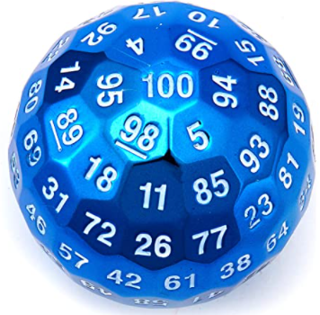

In this article, I will describe Rust _return type polymorphism_ (a.k.a. _generic returns_), a feature that I recently discovered and that I have been pretty intrigued about.

I am seeing this feature for the first time in a programming language and at first glance, it did seem like some sort of built-in compiler magic, available only in the standard library. In reality, it is a generalised feature that you can use in your own code every day.

Keep in mind that I am still quite a beginner with Rust, so my description might not be the most accurate but I will try to make a point on why I like this feature and how it works by using some examples. Hopefully, you will find this topic as interesting as I did!

Ok, enough chit chat, let's get into it! 🧐


## Return type polymorphism, what?!

Before trying to explain what return type polymorphism actually is, let me show you a couple of interesting examples that might look familiar to you if you have been playing with Rust already:

```rust
use std::collections::HashSet;

fn main() {
    let nums = [2, 17, 22, 48, 1997, 2, 22];
    let nums_square_no_dups: HashSet<i32> = nums.iter().map(|x| x * x).collect();
    println!("{:?}", nums_square_no_dups); // {2304, 484, 3988009, 4, 289}
}
```

Ok, did you see it? I mean, how in the world is that `collect()` figuring out that I want to "collect" values from an iterator into a `HashSet` of integers? Indeed, it is giving me exactly a `HashSet` of integers!

Not convinced yet? We can also change this example slightly and see what happens... Let's try with `Vec`:

```rust
fn main() {
    let nums = [2, 17, 22, 48, 1997, 2, 22];
    let nums_square: Vec<i32> = nums.iter().map(|x| x * x).collect();
    println!("{:?}", nums_square); // [4, 289, 484, 2304, 3988009, 4, 484]
}
```

Ok that's not removing duplicates anymore and it's preserving the order of elements, but that's not the point! The point is that `collect()` is still giving us what we want. This time we are asking for a `Vec` and indeed we get a `Vec` rather than a `HashMap`.

Note that this code is almost the same as the previous one. We didn't change anything other than the type declaration (and a variable name, but that's irrelevant)!

Also, keep in mind that, while Rust can ofter infer your types and, most often, you don't have to provide explicit type definitions, when using `collect()` the type definition is necessary.

Let's see what happens if we try to remove `Vec<i32>`:

```rust
fn main() {
    let nums = [2, 17, 22, 48, 1997, 2, 22];
    let nums_square = nums.iter().map(|x| x * x).collect();
}
```

This example won't to compile because collect doesn't know what is the return type, so we get this nice-looking error:

```text
error[E0282]: type annotations needed
 --> src/main.rs:3:9
  |
  |     let nums_square = nums.iter().map(|x| x * x).collect();
  |         ^^^^^^^^^^^ consider giving `nums_square` a type
```

I hope you starting to get the point. Some functions like `collect()` can _behave_ differently, based on the expected return type! The return type needs to be explicit, so the Rust compiler can pick the right behaviour for you.

Ok, this is one of the first things I learned in Rust when doing coding challenges and I have been thinking for a while _"this is just some iterator magic and it probably works only for a few standard types"_...

Then, more recently I saw some other piece of code that was doing something like this:

```rust
fn main () {
    let a: u8 = Default::default();
    let b: i64 = Default::default();
    let c: String = Default::default();
    let d: (u16, usize) = (Default::default(), Default::default());

    dbg!(a); // a = 0
    dbg!(b); // b = 0
    dbg!(c); // c = ""
    dbg!(d); // d = (0,0)
}
```

Ok, types have default values, so what?

Yeah, nothing impressive, I know... But yet again, we are always calling the same function, this time `Default::default()`, and it's giving us the default value for the specific type we need!

In all honesty, I am almost glanced over this one thinking it was some other nice Rust compile-time magic for built-in types. Until I noticed a small note saying _"by the way, you can have a default value for your custom types if you want to"_.

That got my attention, and the example I saw was something like this:

```rust
#[derive(Debug)]
struct Point3D {
    x: f64,
    y: f64,
    z: f64,
}

// it's easy pal, just implement the `Default` trait
impl Default for Point3D {
    fn default() -> Self {
        Point3D {
            x: 0_f64,
            y: 0_f64,
            z: 0_f64,
        }
    }
}

fn main() {
    let origin: Point3D = Default::default();
    println!("{:?}", origin); // Point3D { x: 0.0, y: 0.0, z: 0.0 }
}
```

The [`Default` trait](https://doc.rust-lang.org/std/default/trait.Default.html) allows you to define what's the default value for your custom types. The trait forces you to implement a `default()` method which must return an instance of the given type (`Self`).

Again, nothing extremely exciting here... except that at this point something clicked in my head and I started to ask myself _"so this is some sort of generalised feature that everyone can use..."_.

My suspicion was that the `Default::default()` function can somehow infer the expected return type and, if that type implements the `Default` trait, then it simply calls the `default()` function for that type. 

Of course, I immediately went and looked for the actual [implementation of `Default::default()`](https://doc.rust-lang.org/1.51.0/src/core/default.rs.html#158) to validate my guess.

Now, I am not going to claim I understood the implementation 100% (there are some lovely macros in there and my brain can't compile those just yet), but I had a feeling that I was on the right path with my guess.

The interesting bit is the full signature of the `Default::default()` function:

```rust
pub fn default<T: Default>() -> T {
    // ...
}
```

I read this as:

  - `Default::default()` has a generic parameter `T`
  - `T` has a constraint: it can be any type as long as it implements the `Default` trait
  - finally (and this is the important point), `T` is the type that `Default::default()` must return

And this is where the _magic_ is coming from. The implementation is actually generic over the return type. Also, by using the `Default` trait constraint, we can have an extensible definition: anyone can implement new types that will work with `Default::default()`. More on this later...

For now, this is enough theory to digest, let's try to do something with it!


## Let's build something

Over the years, I learned that my brain can appreciate new programming concepts when I can build something using them. So, I rolled up my sleeves and started to think _"OK, what can I possibly build with this?"_

I suppose, a good question here is _"When do I want to do different things based on different expected return type?"_

I came up with a simple idea related to board games. Something like D&D where you have different kind of dice (different number of faces). 

Can we use return type polymorphism to be able to _roll_ different type of dice?


I think we can! This is more or less what I did with my first attempt:

```rust
use rand::{thread_rng, Rng};

trait Roll<T> {
    fn roll() -> T;
}

#[derive(Debug)]
struct D6(u8);
#[derive(Debug)]
struct D8(u8);

struct Die {}

impl Roll<D6> for Die {
    fn roll() -> D6 {
        D6 {
            0: thread_rng().gen_range(1..=6),
        }
    }
}

impl Roll<D8> for Die {
    fn roll() -> D8 {
        D8 {
            0: thread_rng().gen_range(1..=8),
        }
    }
}

fn main() {
    // let's roll a D6
    let roll: D6 = Die::roll();
    println!("{:?}", roll); // D6(3)

    // let's roll a D8
    let roll: D8 = Die::roll();
    println!("{:?}", roll); // D8(3)
}
```

For simplicity, I am showing only how I implemented `D6` and `D8`. If you want the full version, check out my [D&D dice Rust playground](https://play.rust-lang.org/?version=stable&mode=debug&edition=2018&gist=4191ce04d3db0f102cd73a31e0864cb9).

The interesting part of this implementation is that I have 2 different implementations for the function `Die::roll()`, one returns a `D6` (6-faces die) roll and the other returns a `D8` (8-faces die) roll.

Rust will automatically call the correct implementation based on what's the expected return type for that invocation.

Well done to me for using return type polymorphism!


## Let's make it extensible

Ok, but my silly implementation has a problem: it is not extensible.

I mean, what if I turn this code into a library and someone needs to implement a custom die with 100 faces? Or what if they want a trick die that always rolls 100?



How can we support this use case?

Well, that's pretty much what `Default::default()` does, so it should be possible, right?

Ok, here's an idea:

 - We can define a public `Rollable` trait that makes dice, well ... _rollable_
 - Our standard `D6` and `D8` will implement the `Rollable` trait to be rollable themselves
 - We provide one single implementation for our `roll()` function
 - We make that one implementation generic over a `T` where `T` must implement `Rollable`
 - `T` is also the return type for `roll()`
 - Now, this implementation of `roll()` just needs to use the `Rollable` trait on the current type for `T`

This idea isn't really original. We are pretty much mimicking what `Default::default()` does with the trait `Default`, except that their naming choice is maybe slightly more confusing, since the module, the function and the trait are all called _default_ 😰 ...

Let's see how it looks like in code:

```rust
use rand::{thread_rng, Rng};

/// This is the trait that every die needs to implement to be... well... "rollable", right?
pub trait Rollable {
    /// Roll the die
    fn roll() -> Self;
    /// Get the value from the latest roll
    fn val(&self) -> u8;
}

/// A generic function to roll a given die.
pub fn roll<T: Rollable>() -> T {
    Rollable::roll() // <- Note that here `Rollable` is the current type for a given call!
}

/// A D6 die (6 faces): a roll will give you a `u8` in the `1..=6` range.
#[derive(Debug)]
pub struct D6(u8);

impl Rollable for D6 {
    fn roll() -> D6 {
        D6 {
            0: thread_rng().gen_range(1..=6),
        }
    }
    fn val(&self) -> u8 {
        self.0
    }
}

/// A D8 die (8 faces): a roll will give you a `u8` in the `1..=8` range.
#[derive(Debug)]
pub struct D8(u8);

impl Rollable for D8 {
    fn roll() -> D8 {
        D8 {
            0: thread_rng().gen_range(1..=8),
        }
    }
    fn val(&self) -> u8 {
        self.0
    }
}
```

That's pretty much it, now we can keep using our `D6` and `D8` as before:

```rust
fn main() {
    // let's roll a D6
    let r: D6 = roll();
    println!("{:?}", r); // D6(3)

    // let's roll a D8
    let r: D8 = roll();
    println!("{:?}", r); // D8(3)
}
```

But now, anyone using this library, can also implement their own custom dice:

```rust
#[derive(Debug)]
struct Fake100(u8);

impl Rollable for Fake100 {
    fn roll() -> Fake100 {
        Fake100 { 0: 100 } // <- forces it to roll 100
    }
    fn val(&self) -> u8 {
        self.0
    }
}

fn main() {
    println!("I bet I'll get a 100 this time!");
    let d: Fake100 = roll();
    println!("Look what I got: {}!", d.val()) // <- yeah this will always be 100
}
```

Pretty neat, isn't it!?

I actually did end up publishing this silly example [as a library](https://crates.io/crates/rollz). Check it out. Who knows, maybe you do really want to implement a board game of some sort!


## The turbo-fish syntax

There is still one interesting detail to discuss before we can wrap this up.

We already saw that, when a function is using return type polymorphism, we need to explicitly declare the expected type. 

What if you want to call a function implementing return type polymorphism but you don't want to assign it? Let's say we want to use the returned value immediately, maybe in a `println!()`:

```rust
fn main() {
    println!("{:?}",  roll());
}
```

How can Rust understand what we want?

In fact, it doesn't! If you try to compile that code you will get a beautiful error message:

```text
error[E0282]: type annotations needed
  --> src/main.rs:47:23
   |
   |     println!("{:?}",  roll());
   |                       ^^^^ cannot infer type for type parameter `T` declared on the function `roll`
```

The compiler also suggests running `rustc --explain E0282` to get a detailed guide on how to solve this problem. You gotta give it to the Rust team, they have done such a tremendous job in terms of providing great documentation!

Now, if you are patient enough to run that command and read the guide, you will find that we can solve this issue with the so-called **turbo-fish** syntax!

The turbo-fish syntax looks like... a fish: `::<>`  ... yeah, with some degree of imagination!

So, this is how we actually use it to specify **at call time** the type for the generic parameter:

```rust
fn main() {
    println!("{:?}",  roll::<D6>());
}
```

OK... Maybe `::<D6>()` looks a bit more like a fish...

Anyhow, with this syntax, the type for the parameter `T` is not ambiguous anymore: we are explicitly saying we want a `D6`!

In reality, the turbo fish is the extended syntax for functions with generic types, except that, when we are doing an assignment with an well defined type, the Rust compiler is smart enough to infer the type of generic parameters and make our life easier.

**Update 2021-04-14:** Note though that Rust can infer types from function arguments, so in most cases you can still rely on type inference. Let's see a quick example:

```rust
fn try_dodge_attack(d6: D6, d8: D8) -> bool {
    d6.val() + d8.val() > 10
}

fn main() {
    let escaped = try_dodge_attack(roll(), roll());
    println!(
        "{}",
        match escaped {
            true => "You dogded!",
            false => "Ouch! The attack hit you!",
        }
    );
}
```

In this example, we are calling `try_dodge_attack(roll(), roll())` and we don't have to use the turbo-fish syntax. The Rust compiler looks at the type declaration of the function arguments and figures out that we want to roll a `D6` and a `D8`.


## Conclusion

This concludes our exploration of Rust return type polymorphism.

I do hope you found this topic (and this article!) as interesting as I did and feel more than welcome to let me know in the comments if you did know about this capability already. Are you already using it in production somewhere? I'd be really curious to know your use case, so please share it with me 😇

If you want a much more polished and detailed explanation of this idea check out this brilliant blog post by [James Coglan](https://twitter.com/jcoglan) called [Generic returns in Rust](https://blog.jcoglan.com/2019/04/22/generic-returns-in-rust/).

That's all from me now, see you in the next post! 👋

<small>Thanks to [@AlleviTommaso](https://twitter.com/AlleviTommaso) for reviewing this article!</small>
