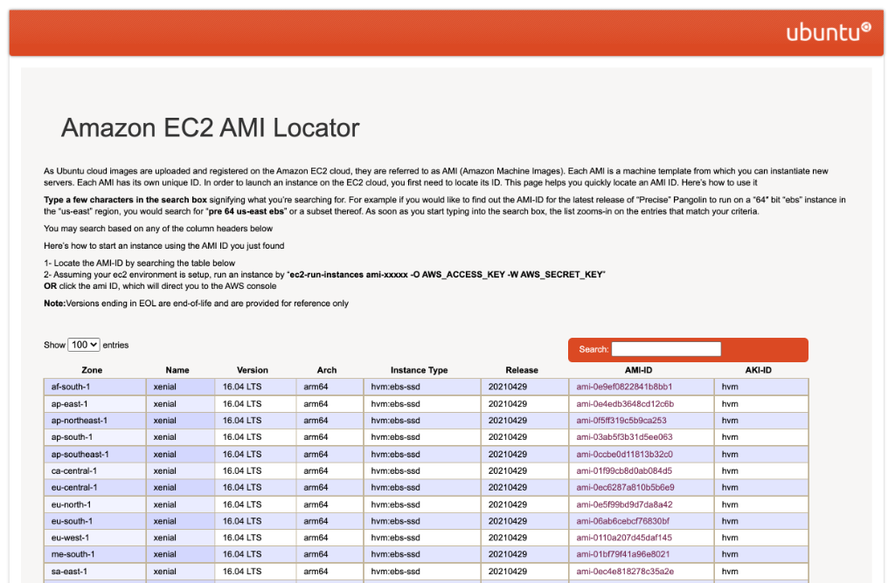
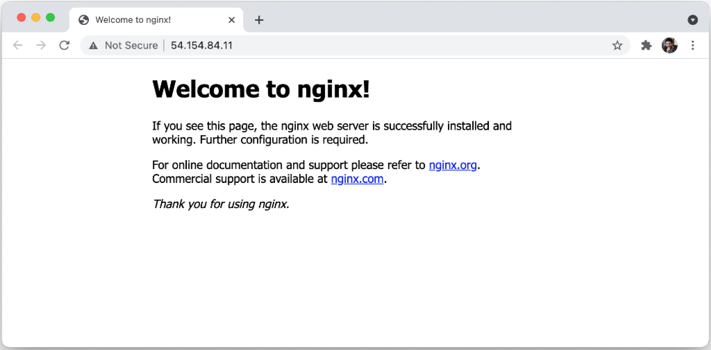

You are using CDK and you need to provision an EC2 instance. What if you prefer to use **Ubuntu** over **Amazon Linux**? In this article, we will see exactly how to do that, and, hopefully, we will learn a bunch of interesting things in the process!

I have to be honest, I am more on the Ubuntu camp than I am in the Amazon Linux one... It's a subjective preference. I find myself more comfortable with `apt`, `snap`, `systemd` and other Ubuntu nuances than I am with `yum` and other things in Amazon Linux. Plus, I find easier to find resources about how to do all sort of things with Ubuntu.

So, the story goes that I was playing with CDK and I was trying to deploy a simple Node.js application to an EC2 instance. All the CDK examples I could find were using Amazon Linux, but I thought it wouldn't be too complicated to switch to Ubuntu instead. I already had a Systemd service definition written for my app and a script to install all dependencies using `apt`.

How hard could it be to use Ubuntu? It turns out there are some dark corners and the necessary documentation is scattered around the web. I will try to document my finding and provide a complete example in this article. We will also see how to install the `aws` CLI and other necessary AWS utilities in our Ubuntu-based virtual machine. Once you do all these things, you should have a Ubuntu image that is pretty much on par with the Amazon Linux one.


## What is CDK

Ok, if you know CDK already, you can just skip this section. If you don't, how on the world wide web did you end up on this page? 😅

[CDK](https://aws.amazon.com/cdk/) stands for **Cloud Development Kit** and it's a relatively new tool from Amazon to write infrastructure as code (_IaC_).

CDK allows you to define all your cloud infrastructure programmatically so you can keep it versioned and you can have a reproducible deployment process. If you use CDK you won't have to go in the AWS web console and click around to provision resources, you'll write code and use command-line tools (or CI/CD pipelines) to do that for you.

If you have used tools like **Terraform** or **CloudFormation** already, CDK addresses the same type of problems. What's different with CDK is that you don't have to write a ton of JSON, Yaml or learn a new markup language such as [HCL](https://github.com/hashicorp/hcl).

In fact, with CDK you can use your favorite programming language (TypeScript, Python, Java and C# are supported right now) and you can define the resources in your cloud infrastructure by importing classes and instantiating objects.

Just to give you an example, this is how you can create a new SSM parameter using CDK (TypeScript):

```typescript
import * as ssm from '@aws-cdk/aws-ssm'

new ssm.StringParameter(stack, 'Parameter', {
  allowedPattern: '.*',
  description: 'The value Foo',
  parameterName: 'FooParameter',
  stringValue: 'Foo',
  tier: ssm.ParameterTier.ADVANCED,
})
```

You can see already that the main advantage of CDK is that you'll be able to use your favorite language, your favorite code editor or IDE and get other nice things like syntax highligting, type checking, auto-completion, etc.

I have found that there's much less guesswork or "writing configuration by trial and error" when using CDK as opposed to writing plain CloudFormation configuration or using Terraform.

It's worth knowing that CDK is not a standalone tool, but it's an abstraction built on top of CloudFormation. So when you _synthesise_ (which is how you say _compile_ in CDK lingo) a CDK stack, you actually get a CloudFormation stack. When you run `cdk deploy` you are actually deploying that stack with CloudFormation. This way, you still get all the benefits of CloudFormation, but you also get a nicer way to write down your infrastructure as code.

If you want to know how to get started with CDK check out the official guide [Getting started with the AWS CDK](https://docs.aws.amazon.com/cdk/latest/guide/getting_started.html).


## Defining An EC2 resource with CDK

From here, I am assuming you have already installed CDK and generated a project with `cdk init`.

If you want to have a look at the final version of the code we will be discussing here, you can check out the [project repository on GitHub](https://github.com/lmammino/cdk-ubuntu-ec2).

To provision an EC2 instance with CDK using TypeScript we need to install the package `@aws-cdk/aws-ec2`:

```bash
npm i --save @aws-cdk/aws-ec2
```

Then we can define the instance in a Stack with the following code (intentionally incomplete):

```typescript
import * as cdk from '@aws-cdk/core'
import * as ec2 from '@aws-cdk/aws-ec2'

export class MyAppStack extends cdk.Stack {
  const defaultVpc = ec2.Vpc.fromLookup(this, 'VPC', {
    isDefault: true,
  })

  const myVm = new ec2.Instance(this, 'myVm', {
    // the type of instance to deploy (e.g. a 't2.micro')
    instanceType: new ec2.InstanceType('t2.micro'),
    // the id of the image to use for the instance
    machineImage: someAmiId,
    // A reference to the object representing the VPC
    // you want to deploy the instance into
    vpc: defaultVpc
    // ... more configuration
  })
}
```

As you can see that there are 3 mandatory pieces of information we need to provide:

  - The [type of EC2 instance](https://aws.amazon.com/ec2/instance-types/) we want to run (i.e. `t2.micro`)
  - The id of the machine image (more on this in the next section)
  - The id of the VPC (Virtual Private Cloud) where you want to deploy your instance. For example, in the snippet above, we are using the default VPC in your AWS account.

You can also specify a ton of other optional configuration options (Security Groups, a role for IAM permissions, volumes, etc). For a full list of supported options you can check out [the official documentation for the CDK EC2 Instance construct](https://docs.aws.amazon.com/cdk/api/latest/docs/@aws-cdk_aws-ec2.Instance.html).

Ok, now how do we specify that we want to use an Ubuntu-based image? Let's talk about AMIs!


## Ubuntu AMIs and where to find them

When provisioning EC2 instances on AWS you have to provide a virtual machine image (an _AMI_ in AWS lingo). You can build and manage your own custom private images or use one of the many public images for different Linux distributions.

These two approaches have their pros and cons:

  - If you use a public image, you will need to use an init script to provision the machine with all the needed software and configuration. This is a quick and easy way to experiment and iterate over different versions of your virtual machines. On the other hand, this approach might be slow, depending on how much stuff you need to do at every boot.
  - If you build your own custom images you'll need to have a pipeline (or some other reproducible approach) to bootstrap a base image, install all your software and create a new image from there. This path adds a bit more complexity but then your images will have everything built in and the bootstrap will probably be much faster.

In this article we will go with a public image (Ubuntu) and we will provide the additional bits and pieces by using an init script.

If you are interested in the "build your own image" approach, I'd recommend you to check out [EC2 Image Builder](https://aws.amazon.com/image-builder/) or [Packer](https://www.packer.io/) (a brilliant tool for building VM images from the same authors of Terraform).

So, back to our main question: _how do we find a base image with Ubuntu installed_?

There's an entire website dedicated to finding public AMIs for just Ubuntu: [Ubuntu Amazon EC2 AMI Locator](https://cloud-images.ubuntu.com/locator/ec2/).

[](https://cloud-images.ubuntu.com/locator/ec2/)

Every image is built for a specific AWS region, processor architecture, and instance type. Every image is identified by a unique ID called _AMI ID_.

When provisioning a new EC2 instance you need to specify the wanted _AMI ID_ and make sure to select the correct one for the region you are deploying your instance to.

There are a couple of different ways to do that.


### Machine AMI map

The simplest way to specify AMI IDs for all the regions we want to support is to use the [`ec2.MachineImage.genericLinux()`](https://docs.aws.amazon.com/cdk/api/latest/docs/@aws-cdk_aws-ec2.MachineImage.html#static-genericwbrlinuxamimap-props) helper function.

This function accepts a map of AMI IDs where keys are regions and values are AMI IDs.

Here's an example:

```typescript
const machineImage = ec2.MachineImage.genericLinux({
  'eu-west-1': 'ami-0298c9e0d2c86b0ed',
  'us-east-1': 'ami-019212a8baeffb0fa',
  'ap-east-1': 'ami-04c4bc345657bf245',
  // ... add all the regions you need to support
})
```

Here I have copied some AMI IDs manually from the Ubuntu Amazon EC2 AMI Locator website.

This is a bit of tedious copy-paste ( 🍝 ) to do and you need to make sure you do it right. Furthermore, what if there's an update? There will be new IDs and we will need to update them manually again... 🥲

Of course, there's an easier and more maintainable way! 😋


### Machine AMI from a public SSM parameter

The better way is to use the function [`ec2.MachineImage.fromSSMParameter()`](https://docs.aws.amazon.com/cdk/api/latest/docs/@aws-cdk_aws-ec2.MachineImage.html#static-fromwbrssmparameterparametername-os-userdata).

As the name suggests, this function allows us to use take the AMI ID from an SSM parameter.
At a first glance, this idea might not sound particularly appealing. In fact, using SSM adds another layer of complexity. We would need to store the wanted AMI ID in SSM first somehow, only to consume the value later from our CDK stack.

The good news is that there are some public SSM parameters that are already pre-populated with the latest ubuntu AMI IDs.

Let's try to run this in our terminal (you'll need to have the [AWS CLI](https://aws.amazon.com/cli/) installed and configured):

```bash
aws ssm get-parameter --name "/aws/service/canonical/ubuntu/server/focal/stable/current/amd64/hvm/ebs-gp2/ami-id"
```

The command above will output something like this:

```json
{
  "Parameter": {
    "Name": "/aws/service/canonical/ubuntu/server/focal/stable/current/amd64/hvm/ebs-gp2/ami-id",
    "Type": "String",
    "Value": "ami-0298c9e0d2c86b0ed",
    "Version": 221,
    "LastModifiedDate": "2021-07-21T14:31:50.717000+01:00",
    "ARN": "arn:aws:ssm:eu-west-1::parameter/aws/service/canonical/ubuntu/server/focal/stable/current/amd64/hvm/ebs-gp2/ami-id",
    "DataType": "aws:ec2:image"
  }
}
```

As the name of the SSM parameter suggests, these SSM parameters are managed directly by Canonical (the company behind Ubuntu). You can also see that there is a specific path structure to identify the AMI ID. If you are curious to find out more and to discover all the available images you can check out [Finding Ubuntu Images with the AWS SSM Parameter Store](https://discourse.ubuntu.com/t/finding-ubuntu-images-with-the-aws-ssm-parameter-store/15507).

One more thing to notice is that SSM parameters are region-specific. You can have the same parameter key in different regions and therefore have different values in different regions (given the same key).

I am running this command using `eu-west-1` as the default region and you can see that the `Value` matches the AMI ID we have manually specified with the AMI map approach. Try to switch your region using the `--region` flag and you will get the correct AMI ID for the given region.

This is a rather clever usage of SSM if you ask me! 🤩

Enough chit chat, let's see how to use this approach with CDK:


```typescript
const machineImage = ec2.MachineImage.fromSSMParameter(
  '/aws/service/canonical/ubuntu/server/focal/stable/current/amd64/hvm/ebs-gp2/ami-id',
  ec2.OperatingSystemType.LINUX
)
```

That's it! Now we can pass the `machineImage` value to the settings of our EC2 instance!


## A simple EC2 instance with Ubuntu

Ok, now we have all the building blocks to provision the most basic Ubuntu-based EC2 instance.

This is how the code for our stack (`lib/*stack.ts`) looks like so far:

```typescript
import * as cdk from '@aws-cdk/core'
import * as ec2 from '@aws-cdk/aws-ec2'

export class CdkUbuntuEc2Stack extends cdk.Stack {
  constructor (scope: cdk.Construct, id: string, props?: cdk.StackProps) {
    super(scope, id, {
      env: {
        account: process.env.CDK_DEPLOY_ACCOUNT || process.env.CDK_DEFAULT_ACCOUNT,
        region: process.env.CDK_DEPLOY_REGION || process.env.CDK_DEFAULT_REGION
      },
      ...props
    })

    const defaultVpc = ec2.Vpc.fromLookup(this, 'VPC', {
      isDefault: true
    })

    const machineImage = ec2.MachineImage.fromSSMParameter(
      '/aws/service/canonical/ubuntu/server/focal/stable/current/amd64/hvm/ebs-gp2/ami-id',
      ec2.OperatingSystemType.LINUX
    )

    const myVm = new ec2.Instance(this, 'myVm', {
      instanceType: new ec2.InstanceType('t2.micro'),
      machineImage: machineImage,
      vpc: defaultVpc
    })
  }
}
```

If we try to run `cdk deploy` we should see something like this:


We can now say `y` to confirm the deployment and sit patiently with our fingers crossed... 🤞

Ok ... ⏱ wait over!

If all went well, we should see something like this in the console:

```plain
 ✅  CdkUbuntuEc2Stack

Stack ARN:
arn:aws:cloudformation:eu-west-1:012345678901:stack/CdkUbuntuEc2Stack/a0d34481-a364-4261-864b-3cb16f57dc15
```

Our machine is deployed! 🎉

As a small aside, I have to say that [I love the usage of some good emojis in the terminal](/random-emoji-in-your-prompt-how-and-why), well-done AWS!

But let's be fair, our virtual machine is not very useful... it doesn't do anything right now!

Let's try to update our machine and make it do something useful. For instance, we could install nginx and enable ingress on port 80 so that, once the machine is provisioned, we will be able to see the default nginx welcome page.

In a real-life scenario, you might do something a bit more sophisticated to deploy and run a real application on the machine.


### Adding a security group to an EC2 with CDK

Let's start by adding a security group to our EC2, this is something we can do by adding the following code to our stack:

```typescript
const myVmSecurityGroup = new ec2.SecurityGroup(this, 'myVmSecurityGroup', {
  vpc: defaultVpc
})
myVmSecurityGroup.addIngressRule(ec2.Peer.anyIpv4(), ec2.Port.tcp(80), 'httpIpv4')
myVmSecurityGroup.addIngressRule(ec2.Peer.anyIpv6(), ec2.Port.tcp(80), 'httpIpv6')
```

Then we need to associate this new security group to the instance by setting the `securityGroup` property: 

```typescript
const myVm = new ec2.Instance(this, 'myVm', {
  // ...
  securityGroup: myVmSecurityGroup,
  // ...
})
```

Ok, now our virtual machine will be able to accept ingress traffic on port `80` from all IPv4 and IPv6 addresses.


### Installing software by using CloudFormation init with CDK

CloudFormation supports [a way to execute init scripts once a machine boots](https://docs.aws.amazon.com/AWSCloudFormation/latest/UserGuide/aws-resource-init.html).

CDK supports this feature as well and we can use it with the `init` configuration option in our VM definition:

```typescript
const myVm = new ec2.Instance(this, 'myVm', {
  // ...
  init: ec2.CloudFormationInit.fromElements(
    ec2.InitCommand.shellCommand('sudo apt-get update -y'),
    ec2.InitCommand.shellCommand('sudo apt-get install -y nginx')
  )
  // ... more configuration
})
```


### CDK signal problems with Ubuntu

At this point we are ready to do another deployment, so let's run `cdk deploy`.

This time the deployment should take a long time (10-15mins) and then fail with an error that should look like the following:

```plain
CdkUbuntuEc2Stack: deploying...
CdkUbuntuEc2Stack: creating CloudFormation changeset...
17:28:01 | UPDATE_FAILED        | AWS::EC2::Instance        | myVm11CC711A
Failed to receive 1 resource signal(s) within the specified duration
```

It took me a while to figure out what was going wrong and how to solve this problem.

One thing that I eventually did during my investigation was to run `cdk synth` to see the CloudFormation stack that was being generated and deployed by CDK.

In there I noticed that as part of the [user data script](https://docs.aws.amazon.com/AWSEC2/latest/UserGuide/user-data.html), the following command gets executed: `/opt/aws/bin/cfn-signal`.

Then, with a bit of timed effort, I managed to establish an SSH connection to an instance while it was being provisioned (and before it was destroyed by CDK) and I realized that the default Ubuntu distribution does not have `cfn-signal` installed.

This makes sense. This is a specific AWS utility that is pre-installed in Amazon Linux, but there is no reason why it should be installed in Ubuntu or other generic Linux distributions.

So now the problem is "How do we install cfn-signal?"

The answer to this question is "by using a custom user data script"!


## Installing AWS Linux utilities on an Ubuntu Image using CDK

We can install `cfn-signal` and other AWS Linux utilities in our virtual machine by creating a custom user data script.

User data scripts run before the init step is executed, so by doing this we should be able to fix our current issue.

After some research and by putting together different resources I managed to get a working script to install the [AWS Linux utilities](https://github.com/aws-quickstart/quickstart-linux-utilities) on Ubuntu:

```bash
#/usr/bin/env bash
apt-get update -y;
apt-get install -y git awscli ec2-instance-connect;
until git clone https://github.com/aws-quickstart/quickstart-linux-utilities.git; do echo "Retrying"; done;
cd /quickstart-linux-utilities;
source quickstart-cfn-tools.source;
qs_update-os || qs_err;
qs_bootstrap_pip || qs_err;
qs_aws-cfn-bootstrap || qs_err;
mkdir -p /opt/aws/bin;
ln -s /usr/local/bin/cfn-* /opt/aws/bin/;
```

Note that this script also installs the AWS CLI and `ec2-instance-connect`. These are not strictly necessary for our use case, but they are nice to have.

In CDK, we can create a user data script with these commands as follows:

```typescript
const userData = ec2.UserData.forLinux()
userData.addCommands(
  'apt-get update -y',
  'apt-get install -y git awscli ec2-instance-connect',
  'until git clone https://github.com/aws-quickstart/quickstart-linux-utilities.git; do echo "Retrying"; done',
  'cd /quickstart-linux-utilities',
  'source quickstart-cfn-tools.source',
  'qs_update-os || qs_err',
  'qs_bootstrap_pip || qs_err',
  'qs_aws-cfn-bootstrap || qs_err',
  'mkdir -p /opt/aws/bin',
  'ln -s /usr/local/bin/cfn-* /opt/aws/bin/'
)
```

Then, `userData` needs to be passed to our `machineImage` as the third argument:

```typescript
const machineImage = ec2.MachineImage.fromSSMParameter(
  '/aws/service/canonical/ubuntu/server/focal/stable/current/amd64/hvm/ebs-gp2/ami-id',
  ec2.OperatingSystemType.LINUX,
  userData
)
```

With these changes, we should be able to get everything working, but before doing that let's do one last change: let's add an output parameter so that, once our stack is deployed, we can see the URL to our web server running nginx.

### Adding an output value in CDK

Adding an output value is quite simple with CDK, we just need to instantiate a new [`cdk.CfnOutput`](https://docs.aws.amazon.com/cdk/api/latest/docs/@aws-cdk_core.CfnOutput.html) object:

```typescript
const webVmUrl = new cdk.CfnOutput(this, 'webVmUrl', {
  value: `http://${myVm.instancePublicIp}/`,
  description: 'The URL of our instance',
  exportName: 'webVmUrl'
})
```

Now if we run `cdk deploy`, after a few minutes we should see an output like the following:


```plain
 ✅  CdkUbuntuEc2Stack

Outputs:
CdkUbuntuEc2Stack.webVmUrl = http://54.154.84.11/

Stack ARN:
arn:aws:cloudformation:eu-west-1:012345678901:stack/CdkUbuntuEc2Stack/22c0faa4-adb4-4724-a4c4-c8ea21b7ac07
```

If we visit the URL in the output parameter we should see the default nginx welcome page:



It's working, we made it! 🥳

If you want to see how the full code looks like you can check out the ["official" repository for this project](https://github.com/lmammino/cdk-ubuntu-ec2).

If you want to clean up your account and destroy the stack created by this project, you can run:

```bash
cdk destroy
```


## Conclusion

In this article we learned how to use CDK to provision an Ubuntu-based virtual machine and how to configure it to run the default installation of nginx.

In the process we also learned a bunch of related concepts such as:
 - what is CDK
 - how to use it to define an EC2 instance
 - how to reference an AMI
 - how to add security groups
 - how to use user data and init script
 - how to install the AWS Linux Utilities
 - ...and finally how to create a CDK output argument.

WOW that was quite a journey, and there I thought this would be a short article! 😅

I hope I didn't bore you to death and that this article was somewhat useful! [Let me know what you think in the comments](#comments) and feel free to [connect with me on Twitter](https://twitter.com/loige) for more [AWS](/tag/aws) and cloud chats.

If you are interested in working more with AWS and the cloud, you might also want to check out [fourTheorem](https://www.fourtheorem.com/), a group of business focused technologists that [has already helped many companies](https://www.fourtheorem.com/case-studies) to get the best out of the cloud (yes, this is where I work 🙃).

See you in the next post!

Bye 👋

<small>Thanks to [Eoin Shanaghy](https://twitter.com/eoins) for kindly reviewing this article!</small>
