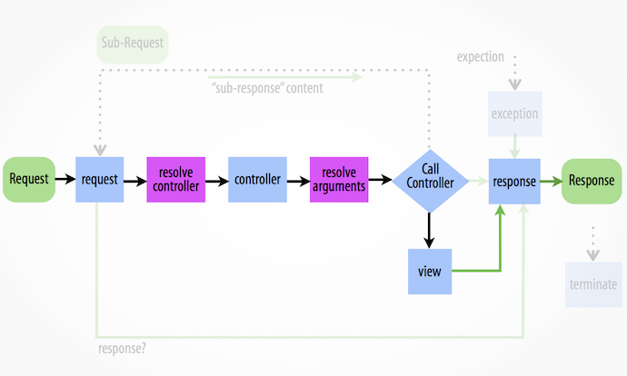

One of the things I like most of the Symfony framework is its [Http Kernel component](https://packagist.org/packages/symfony/http-kernel). Not only it does offer a very straightforward abstraction to handle requests and responses in an object-oriented way but it also allows you to interact with the whole response generation process through [events](http://symfony.com/doc/current/components/http_kernel/introduction.html#creating-an-event-listener).

[](http://symfony.com/doc/current/components/http_kernel/introduction.html)

This approach is very convenient and flexible and in fact the Http Kernel component is the foundation of the Symfony framework but also of several other famous frameworks (Silex, Laravel) and CMSes (Drupal, BackBee CMS).

## The Kernel Response event

One event that I’ve been using a lot lately is the [Kernel Response event](http://api.symfony.com/master/Symfony/Component/HttpKernel/Event/FilterResponseEvent.html) which allows you to edit the response after it has been generated.

Thanks to this event you can easily modify the response object (cookies, headers, content, etc.) before it gets sent out to the user without affecting the specific logic of every controller thus avoiding code cluttering and duplication.

I will present two different real case scenarios to show how useful (and simple) it is.

### Example 1. Add custom Http headers to notify remaining api calls

Let's suppose we developed a wonderful rate limited api and now we want to add some custom headers to notify the user about how much he is using the API.
It seems a good idea to copy the approach adopted by the GitHub APIs and add three custome headers: `X-RateLimit-Limit` (maximum number of requests per period), `X-RateLimit-Remaining` (remaining requests in the current period) and `X-RateLimit-Reset` (the timestamp on which the current period ends).

As I don't want to implement a fully working solution here let's assume we have already written a rate limit checker service registered as `rate_limit_checker` that implements the following interface:

```php
interface RateLimitCheckerInterface
{
	public function getRateLimit();

	public function getRateLimitRemaining();

    public function getRateLimitReset();
}
```

Let's now write our `RateLimitHeadersListener`:

```php
use Symfony\Component\HttpKernel\Event\FilterResponseEvent;

final class RateLimitHeadersListener
{
	private $rateLimitChecker;

	public function __construct(
    	RateLimitCheckerInterface $rateLimitChecker
    ){
    	$this->rateLimitChecker = $rateLimitChecker;
    }

    public function onKernelResponse(FilterResponseEvent $event)
    {
        $headers = $event->getResponse()->headers;

        $headers->set(
        	'X-RateLimit-Limit',
            $this->rateLimitChecker->getRateLimit()
        );

        $headers->set(
        	'X-RateLimit-Remaining',
            $this->rateLimitChecker->getRateLimitRemaining()
        );

        $headers->set(
        	'X-RateLimit-Reset',
            $this->rateLimitChecker->getRateLimitReset()
        );
    }
}
```

Now we need to register the listener as a tagged service:

```yaml
#services.yml
rate_limit_listener:
  class: RateLimitHeadersListener
  arguments: ['@rate_limit_checker']
  tags:
    - {
        name: kernel.event_listener,
        event: kernel.response,
        method: onKernelResponse,
      }
```

That's it. Really straightforward, isn't it?
Should be clear now that, by using this event based approach, we don't have to touch the logic of every single controller.

Take a small break and get ready to jump to another example.

### Example 2. Create a cookie to track referrals

Well, now imagine that we have to build an affiliate program based on referral links ([I did it](https://sbaam.com/affiliates?_r=9oj) lately).

The general idea is that our affiliates are identified by an ID that they can attach to every url of the website as query parameter. This way every URL of our website can be an entry point for our visitors and our affiliates are free to promote the content that is more relevant for them.
Doing so we need to verify every possibile request to check for the referrral parameter and keep track of the whole session of the visitor (or even better monitor him for a given amount of days) to see if his visits converts into some kind of action for which we have to reward the affiliate.
To write a more formal specification we have to:

1. Allow any of our affiliates to share links with a special referral code as query parameter: `?_ref=<REF_ID>` (where `REF_ID` is the unique id of the affiliate).
2. Intercept visitor referred by affiliates through the referral parameter and identify the referral
3. Create a cookie to track the referred visitor for 30 days

Again we can use the Kernel Response Event and create a dedicated listener for this task. Before doing so suppose we have already developed a mechanism to store our affiliates and that we have coded a `affiliate_repository` service which implementats of the following interface:

```php
interface AffiliateRepositoryInterface
{
	public function findOneById($id);
}
```

Now let's write our listener to intercept clicks on referral links:

```php
final class AffiliateLinkClickListener
{
	private $affiliateRepository;

    public function __construct(
    	AffiliateRepositoryInterface $affiliateRepository
    ){
    	$this->affiliateRepository = $affiliateRepository;
    }

    public function onKernelResponse(FilterResponseEvent $event)
    {
    	$request = $event->getRequest();
        $response = $event->getResponse();

        // 1.
        if ($request->query->has('_ref')) {
        	$affiliateId = $request->query->get('_ref');
            // 2.
            if (null !== $this->affiliateRepository->findOneById($affiliateId)) {
            	// 3.
                $cookie = new Cookie('_ref', $affiliateId, new \DateTime('+30 days'));
                $response->headers->setCookie($cookie);
            }
        }
    }
}
```

The code is pretty simple here:

1. We check if there's a `_ref` parameter in the current request
2. If so we check if we have an affiliate with the id found in the `_ref` parameter
3. If that's the case we create a cookie that will allow us to keep track of the referral for 30 days.

Obviously don't forget to register the listener as a tagged service:

```yaml
#services.yml
affiliate_link_click_listener:
  class: AffiliateLinkClickListener
  arguments: ['@affiliate_repository']
  tags:
    - {
        name: kernel.event_listener,
        event: kernel.response,
        method: onKernelResponse,
      }
```

As I said, this mechanisms allows you to track the reference but you also need to track any conversion and check the cookie to see if it has been generated by some affiliate.

## Conclusion

As in every tutorial, bear in mind that the code is just a sample to give you a general idea about an approach you can follow to solve some generic problem. You need to adapt it to your use case and consider relevant factors such as security, testing, etc.

Let me know what you think with a comment ([comments](#disqus_thread)) and feel free to suggest other real-life use cases for the Kernel Response Event.

Thanks!

PS: Huge thanks to [@AxelLessio](http://twitter.com/AxelLessio) and [@JavierEguiluz](http://twitter.com/javiereguiluz) for taking the time to review my very bad english ;)
