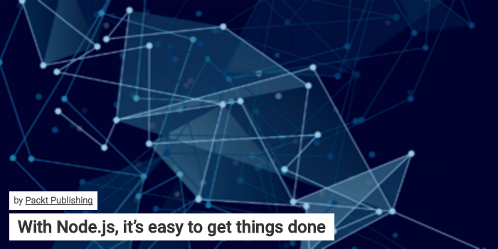
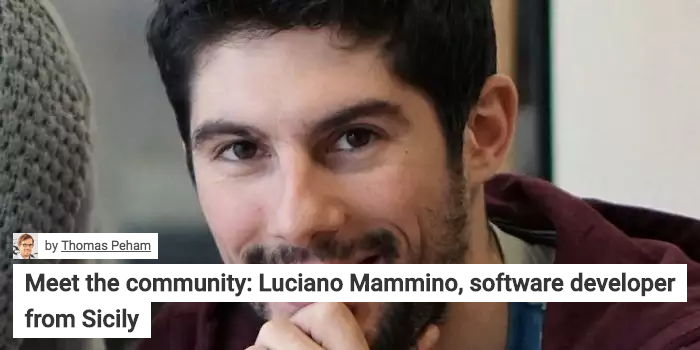

In the last month I had the pleasure to seeing published two interviews regarding my life as developer with [Node.js](/tag/node-js) and [JavaScript](/tag/javascript) and about being a book author with [Node.Js design patterns second edition](https://www.nodejsdesignpatterns.com).

The first interview was made with the **Packt Publishing team** and it was published in their own website:

**[With Node.js, it’s easy to get things done](https://www.packtpub.com/books/content/nodejs-its-easy-get-things-done)**

The second interview was made by [Thomas Peham](https://twitter.com/tompeham), marketing manager at [UserSnap](http://usersnap.com/blog/):

**[Meet the community: Luciano Mammino, software developer from Sicily](http://usersnap.com/blog/developer-community-luciano-mammino/)**

I think both interviews turned out to be pretty cool, especially because I had a chance to express my vision about the future of JavaScript and Node.js, technologies on which I am investing most of my time.

Feel more than welcome to let me know if you share my vision or not here in the comments.

Until next time!
