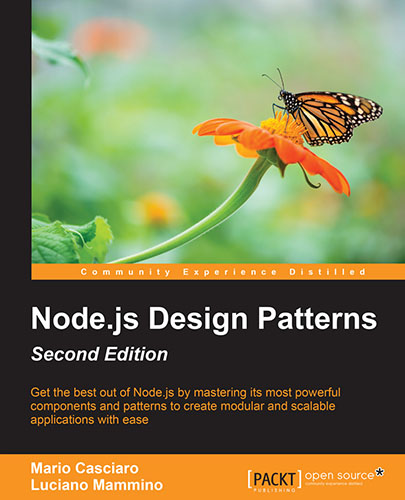
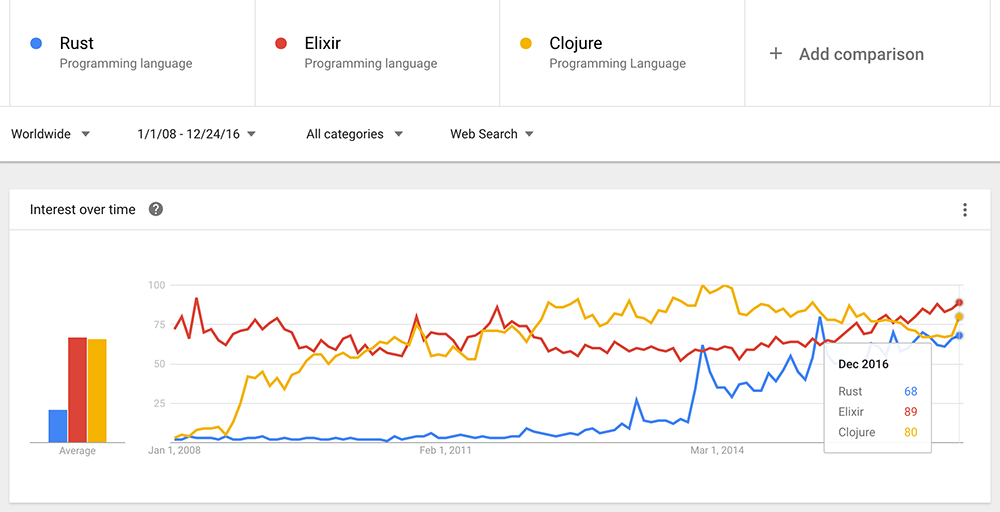

2016 is almost over and I just realised that it has been one of my most productive and exciting years ever. With that in mind I would love to write a recap of all the good and bad things (mostly from a career perspective) that happened in my life during this year. I want to keep track and benchmark my productivity over the coming years. This might be boring for you to read but I hope it's going to serve myself as a good motivation to keep doing better over the years, both in terms of career and quality of life.

## Co-authoring a book about Node.js and Design patterns

One of the biggest achievements this year (and possibly during the course of my entire life) was to co-author a technical book!
From November last year to July this year I helped the great [Mario Casciaro](https://twitter.com/mariocasciaro) and _Packt Publishing_ joining them as co-author to revise "**Node.js Design Patterns**" and come up with a shiny [second edition](https://www.nodejsdesignpatterns.com).
Being part of this initiative served me a double value. First of all, it was an amazing learning experience, I had to get my hands dirty with so many [Node.js](/tag/node-js) details and patterns and nail most of them in a relatively short timespan. Now I feel like I'm fully aware of what's going on under the hood of Node.js and I am confident I can write pretty decent Node.js code using the right patterns for specific needs. In the second place, being a book author gave me much more visibility as a Node.js enthusiast and now I have more chances to interact with other people interested in this trending topic.

If you are curious about Node.js and Design Patterns you can check out the official website of the book at: [https://www.nodejsdesignpatterns.com](https://www.nodejsdesignpatterns.com).

## Career

In terms of career, this October I also moved from my position of Senior PHP Developer at _Smartbox_ to a new role as Senior Software Developer at [Planet9 Energy](http://planet9energy.com). I am still pretty new in the company, but so far this change has been very exciting for a bunch of reasons:

- I get to work with a team of insanely skilled professionals like [@hughsheehy](https://twitter.com/hughsheehy), [@tech_fort](https://twitter.com/tech_fort), [@Podgeypoos79](https://twitter.com/Podgeypoos79), [@quasi_modal](https://twitter.com/quasi_modal), Aleksandar Čambas (who doesn't like Twitter!) and [@katavic_d](https://twitter.com/katavic_d). It's a pleasure to learn from them and with them everyday!
- Most of my work is in Node.js so I can stick to a language (JavaScript) I am loving and keep improving my knowledge and experience with it.
- I can be part of many architectural discussions and decisions about how we evolve a very sophisticated product that is managing an insane amount of data.

I really look forward to keep doing my best next year and see some of the things we are building going live!

## Conferences and meet-ups talks

This year I did my first official conference talk at Codemotion Milan in November. If you are interested in Universal JavaScript and React you can find all the details (slides, video and notes) here: [My Universal JavaScript Web Applications talk at Codemotion Milan 2016](http://loige.co/my-universal-javascript-web-applications-talk-at-codemotion-milan-2016-2/).

I was quite satisfied with the result of the talk, even if I think I still have a lot to improve.

This was the official feedback from the organizers and the audience:

> 220 people attended your session, among them 68% rated it as “Good”, 30% as “Neutral” and 2% as “Bad”.

In march I also made a talk at the PHP Dublin meet-up group about web application performance. Check it out here: [6 Tips to Build Fast Web Applications (Php Dublin March 2016 Talk)](http://loige.co/6-tips-to-build-fast-web-applications-php-dublin-march-2016-talk/).

I really enjoyed both experiences and I hope I will have more chances next year to deliver tech talks in meet-ups and conferences around Europe.

## Blog posts

I have to admit this year I wasn't a very prolific author, I guess the book drained all my energies during my free time. Anyway, I still managed to write some posts. Here are the most interesting ones (based on actual reading stats):

- [Extracting data from Wikipedia using curl, grep, cut and other shell commands](http://loige.co/extracting-data-from-wikipedia-using-curl-grep-cut-and-other-bash-commands/) (~18.000 views)
- [Gulp and FTP: update a website "on the fly"](http://loige.co/gulp-and-ftp-update-a-website-on-the-fly/) (~7.000 views)
- [To promise or to callback? That is the question...](http://loige.co/to-promise-or-to-callback-that-is-the-question/) (~3.000 views)
- [Introducing Gulp cozy - Manage your gulp tasks in a cozier way](http://loige.co/introducing-gulp-cozy-manage-your-gulp-tasks-in-a-cozier-way/) (~2.000 views)

Also it's worth noticing that an article from 2015 is still driving a significant portion of traffic: [Developing a web application with Lumen and MySql](http://loige.co/developing-a-web-application-with-lumen-and-mysql/) (~20.000 views).

Even considering such small amount of posts, the blog reached an impressive total of about 90.000 page views.

## External posts and Interviews

I also had the time (and the pleasure) to keep going with some interesting collaboration with websites I love like [Scotch.io](https://scotch.io/) and [RisingStack](https://community.risingstack.com/). These are the posts that I enjoyed writing for external websites:

- [React on the Server for Beginners: Build a Universal React and Node App](https://scotch.io/tutorials/react-on-the-server-for-beginners-build-a-universal-react-and-node-app) (~56.000 views)
- **ZeroMQ & Node.js Tutorial - Cracking JWT Tokens** [Part 1](https://community.risingstack.com/zeromq-node-js-cracking-jwt-tokens-1/) & [Part 2](https://community.risingstack.com/zeromq-node-js-cracking-jwt-tokens-part2/) (~7.000 views in total)

I also had the pleasure to have two interviews about being a software developer and a book author:

- Usersnap: [Meet the community: Luciano Mammino, software developer from Sicily](http://usersnap.com/blog/developer-community-luciano-mammino/) (~1.000 views)
- Packt blog: [With Node.js, it’s easy to get things done](https://www.packtpub.com/books/content/nodejs-its-easy-get-things-done) (undisclosed stats)

Finally, I'd love to mention that one of my best posts from 2015 has been translated to Italian and published on [HTML5Today.it](http://html5today.it), "[Performance: 6 regole per sviluppare applicazioni web](http://html5today.it/tutorial/performance-6-regole-sviluppare-applicazioni-web/)".

## Open Sourcing

This year I also spent some time working out some small open source contributions, mostly creating little Node.js libraries or command line utilities for different purposes. Here's the complete list of the open source repository I have been working on sorted by the number of stars received:

- [Atinux/schema-inspector](https://github.com/Atinux/schema-inspector) (contribution): Schema-Inspector is an JSON API sanitisation and validation module.
- [silas/node-consul](https://github.com/silas/node-consul) (contribution): Node.js Consul client
- [lmammino/judo-heroes](https://github.com/lmammino/judo-heroes): A React application to showcase rendering with Universal JavaScript
- [lmammino/flickr-set-get](https://github.com/lmammino/flickr-set-get): A simple command line app to download photos from a flickr set
- [lmammino/distributed-jwt-cracker](https://github.com/lmammino/distributed-jwt-cracker): An experimental distributed JWT token cracker built using Node.js and ZeroMQ
- [lmammino/godaddy-dns](https://github.com/lmammino/godaddy-dns): A Node.js script to programmatically update GoDaddy DNS records
- [lmammino/indexed-string-variation](https://github.com/lmammino/indexed-string-variation): Experimental JavaScript module to generate all possible variations of strings over an alphabet using an n-ary virtual tree
- [lmammino/gulp-cozy](https://github.com/lmammino/gulp-cozy): Manage your gulp tasks in a cozier way
- [lmammino/jwt-cracker](https://github.com/lmammino/jwt-cracker): Simple HS256 JWT token brute force cracker
- [lmammino/ghost2hexo](https://github.com/lmammino/ghost2hexo): A command line tool to convert Ghost json export to a set of source posts for Hexo
- [lmammino/x2j-cli](https://github.com/lmammino/x2j-cli): Node.js command line script to convert xml input into json output (can be piped easily)
- [lmammino/vtt-creator](https://github.com/lmammino/vtt-creator): Very basic Node.js/JavaScript library to generate VTT open subtitles files
- [lmammino/package-strip-deps](https://github.com/lmammino/package-strip-deps): A little command line utility that allows to strip dependencies from a NPM package.json file

## Learning

During the last 5 months I slowly started to have a look into the (quite new) [Elixir programming language](http://elixir-lang.org/).

For those who never heard before, let me quote the official website:

> Elixir is a dynamic, functional language designed for building scalable and maintainable applications.

> Elixir leverages the Erlang VM, known for running low-latency, distributed and fault-tolerant systems, while also being successfully used in web development and the embedded software domain.

Why, you might wonder? In the last 2 or 3 year I wanted to spend some time with a pure functional language but Haskell, Clojure, Lisp and other more famous language never really convinced me different reasons. Elixir, for some weird reasons, immediately catch my attention. Plus, it seems to be competing quite well with other "new-shiny" languages:

Finally I also have to admit that my friend [@bit_shark](https://twitter.com/bit_shark) had me brainwashed with "how cool Elixir is"! Thanks for that!

Also some other honourable mentions in my learning path this year have been:

- [AWS](https://aws.amazon.com/) (mostly API Gateway, Lambda, Redshift, DynamoDB, S3, EC2, RDS, Route53 and Cloudfront)
- [Serverless framework](http://serverless.com/)
- [React](/tag/react/)
- [ZeroMQ](/tag/zeromq/)
- A bit of Python and [Scrapy](https://scrapy.org/)
- A bit of Docker

## Failures

Well, so far so good, but... I have to admit it wasn't all peaches and dandelions. There were some failures here and there and it's good to take them into account.

The first and more important failure was not being able to focus on a side project. There is a _kind-of-secret-project™_ I have been working on with my great friend [@andreaman87](https://twitter.com/andreaman87). I think I prioritised and planned really badly the time I wanted to spend on this project and I kept delaying my tasks. That's a bit of a shame and I need to apologise with Andrea for that!

Also another failure has been in my non-tech life, I haven't been able to train Brazilian Jiu Jitsu as much as I should have done and I feel like my game and my knowledge hasn't improved a lot! I guess I am going to keep my white belt still for a while :D

## Expectations for next year

Ok, it's finally time to move to the good intentions for the next year! I have been very lengthy already so I'll just sort this part out with a simple unordered checklist, I am already looking forward to see, in one year time, how many items will be crossed:

- Keep improving my knowledge of Node.js and everything related
- Publish the first version of my side project with Andrea
- Getting better with AWS and the Serverless framework
- Move my blog to a static publishing engine and (possibly) use a serverless hosting approach
- Keep investing time on Elixir and build something with it
- Presentations and talks in conferences and meet-ups
- Get more proficient with VIM (Cheers to [@quasi_modal](https://twitter.com/quasi_modal) for giving me [an amazing book](https://leanpub.com/painless_vim) as Christmas present!)
- Keep open sourcing stuff
- Travel more!
- More serious and constant BJJ training! 👊

Well, That's all... I hope I didn't bore you to death!
Anyway, **I'd really love to know what was your biggest achievement in 2016**. If you feel like you want to share this information with me feel free to [write me on Twitter](https://twitter.com/loige) or to post a comment here! I'll make sure to have a pint in your honour! :D

"**Merry X-Mas and Happy New Year**" to you all! 🎅🏻
