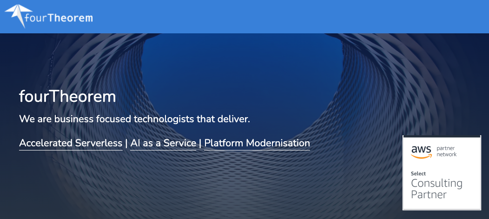
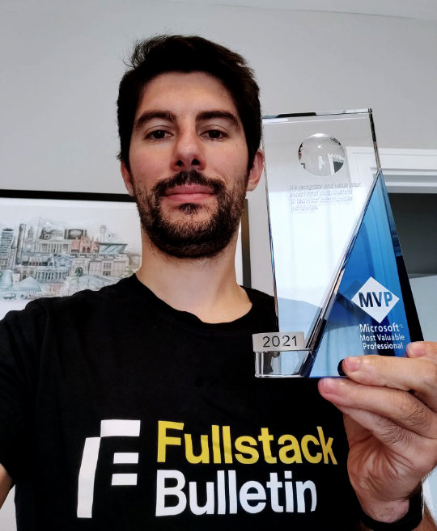

A post where I reflect on my professional life in 2021 as a look ahead for what to expect in 2022.

As usual, let me tell you that I write this kind of posts for myself and I don't expect other people to be able to read this and be engaged. So, if you really feel like you want to venture forward and have a peek on my 2021, well, I am flattered... but make sure to grab a coffee, because this might get a little (just a little...) boring!

Yes, this GIF is probably the least boring element of the whole article! 😍

## Joining fourTheorem

The biggest highlight of my 2021 is that in February I joined [fourTheorem](https://www.fourtheorem.com/) as a **Senior Architect**.

If you never heard about fourTheorem, here's what you need to know. It's a great service company founded by [Peter Elger](https://www.linkedin.com/in/peterelger), [Fiona McKenna](https://www.linkedin.com/in/fiona-mc-kenna-174172a2) and [Eoin Shanaghy](https://www.linkedin.com/in/eoins).

The company, while still relatively new and small, has a large amount of expertise in [serverless](/tag/serverless), **platform modernisation** and [AI as a service](https://www.manning.com/books/ai-as-a-service). Most importantly, fourTheorem has a huge amount of experience with [AWS](/tag/aws). We are **AWS Consulting Partners** and we have been helping small and big customers to transition to the cloud and get the best out of it!

I have to admit I was initially skeptical about being able to work with a company that is not focused on delivering one single product but that is mainly helping many other companies to do that. In the past I rarely had a great experience when being on the other side and dealing with other service companies.

But I was immediately reassured by the fact that Eoin and Peter are not just two amazingly good technical founders, but they also have an impressive track record working with companies of all sizes: from small startups to big corporations. Together with Fiona, the founding trio has a very inspiring vision for what they want the company to become.

I immediately had the feeling that they wanted to build something very different from the other service companies out there. This feeling became apparent pretty quickly just after the first week, when I saw how they managed to embed their team into the customer's team and work together in all the phases of the product. FourTheorem can literally be an extension of a team, bringing not just people and technology skills, but also a very practical and agile approach to software delivery.

And after almost a year, I cannot hide the fact that I have never been happier in a technical position. I can work in an environment with fantastic colleagues, an amazing culture, in a very supportive environment where I am learning a ton. Most importantly, I feel like there is a lot of potential and that I can have an impact.

Finally I get a significant amount of "work time" to invest in content creation, open source and to study (new tech, certifications, etc.). This is something that I consider integral part of my professional career path and it's great to see that it is valued and supported!

Mandatory disclaimer: we are always hiring, so if you are interested feel free to reach out to me on [Twitter](https://twitter.com/loige) or [LinkedIn](https://www.linkedin.com/in/lucianomammino/).

Also... if you are looking for help for your cloud migration or to improve your AWS deployments, don't be shy, [let's have a coffee-chat](https://www.fourtheorem.com/contact)! 😉

> Be not afraid of discomfort. If you can't put yourself in a situation where you are uncomfortable, then you will never grow. You will never change. You'll never learn.
> 
> — Jason Reynolds

## Becoming an MVP

In 2021 I was awarded the title of **Most Valuable Professional** ([MVP](https://mvp.microsoft.com/en-us/)) for **Developer Technologies** by **Microsoft**:

The MVP program awards _exceptional community leadership_ across the world of tech.

Apparently, to become an MVP, you need to do the following 4 things:

  - Demonstrate community leadership and influence
  - Be a technical expert
  - Be a great advocate for the community
  - Contribute to the success of our products

If nothing else, this makes me think that the community is getting some value from the work I am doing and this can only push me to do more!

I am really glad that the amazing [Francesco Sciuti](https://www.linkedin.com/in/francescosciuti) (who nominated me) thinks that I have done such a good job to deserve the award and thanks Microsoft for agreeing with him! ❤️

One funny thing is that, during the due diligence phase, Microsoft makes you fill a big form to list all the things you think had the most impact on the community. Having written posts like this in the last few years helped me a lot to come up with a consistent list. Maybe it wasn't such a bad idea to write these posts after all...

If you are curious, you can also [check out my profile](https://mvp.microsoft.com/en-us/PublicProfile/5004232?fullName=Luciano%20Mammino) on the MVP network.

> It's not like after winning an award, your job is done and you can relax. You still have to work hard.
> 
> — Diljit Dosanjh

## Public speaking

In 2021 I had the pleasure (and the immense luck) to be able to do quite a lot of publick speaking.

It's hard to pick a favourite but, being such a fan of Node.js, there's one that I am particularly proud about: [NodeConf Remote](https://www.nodeconfremote.com/)!

Here's the full list of talks, workshops and interviews that I delievered in 2021:

  - An opinionated intro to Node.js - Devrupt Hospitality Hackaton ([Slides](https://loige.link/devrupt-node))
  - From Node.js to Design Patterns - Codemotion DevCast ([Slides](https://loige.link/devrupt-node))
  - Let's play with Node.js streams (workshop) - CityJS ([Slides](https://loige.link/streams-city))
  - Let's play with Node.js streams (workshop) - Codemotion ([Slides](https://loige.link/streams-cm))
  - A podcast about Node.js with Vishwas Narayan ([Slides](https://www.youtube.com/watch?v=Wmu53Xos7Ug))
  - My first Rust crate: jwtinfo (lightning talk) - Rust Dublin Meetup ([Slides](https://loige.link/rust-jwt), [Video](https://youtu.be/FuqLMqGcEE4))
  - Chats and career advice with Superheroes Valley
  - Live stream with Fabio Biondi - Node.js Streams ([Video](https://www.youtube.com/watch?v=hOHTQgOtg3w))
  - Finding a lost song with Node.js & async iterators - Node.js Dublin meetup ([Slides](https://loige.link/async-it))
  - Interview with Gitbar podcast ([Podcast Episode](https://www.gitbar.it/episodes/ep-73-js-con-luciano-mammino_2))
  - Javascript: repetita iuvant - Codemotion DevCast ([Slides](https://loige.link/devcast2))
  - Teach Kelvin Your Thing: JavaScript Async iterators ([Video](https://www.youtube.com/watch?v=l2CA9FtW1Pw))
  - An intro to the JAMStack & Eleventy - Codemotion ([Slides](https://loige.link/11ty-jam), [Video](https://talks.codemotion.com/an-intro-to-the-jamstack--eleventy))
  - Reiterating JavaScript and Node.js iterators - RomaJS ([Slides](https://loige.link/iter), [Video](https://www.youtube.com/watch?v=2jzN7Ns5jeQ))
  - A chat with Luca Brunello ([Video](https://www.youtube.com/watch?v=-M6zWYVwuz4))
  - AWS Observability without the pain ([Slides](https://fth.link/o11y-no-pain))
  - Finding a lost song with Node.js & async iterators - Sailsconf ([Slides](https://loige.link/iter-sails), [Video](https://www.youtube.com/watch?v=yott9nYsEZ8))
  - How to send gzipped requests with boto3 ([Slides](https://loige.link/gzip-boto3))
  - Quality questions with the NoobDev podcast ([Podcast Episode](https://anchor.fm/noobdevtalks/episodes/Episode-11