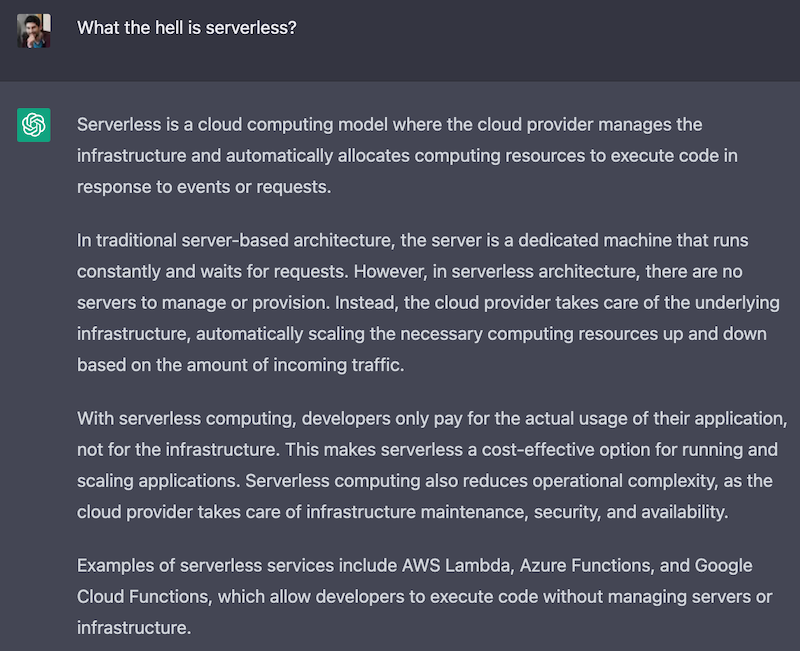

Rust is such a cool language, even though it might take a bit to get the hang of it. But trust me, the payoff is huge. As someone who's all into serverless stuff and loves playing around with AWS, I've been digging into how to write AWS Lambda functions in Rust and whether it's worth the sweat.

MEGA-Spoiler: Yep, you guessed it from the title - it's totally worth it. And in this article, you're gonna find out why, so stick around!

Okay, so there's this pic in the article of Morpheus holding a Lambda in one hand and Ferry, the Rust mascot, in the other. But guess what? You don't have to pick just one. It's not a do-or-die choice. You can have both cakes and eat them too!

## What is serverless and why do I like it

Let's start with a bit of a generic intro. If you are already familiar with [serverless](/tags/serverless), feel free to skip this section.

How do we learn anything these days? We ask ChatGPT, of course! So let's see what it thinks about serverless.

<strong>Dear ChatGPT, what the hell is serverless?</strong>

<em>Serverless is a cloud computing model where the cloud provider manages the infrastructure and automatically allocates computing resources to execute code in response to events or requests.

In traditional server-based architecture, the server is a dedicated machine that runs constantly and waits for requests. However, in serverless architecture, there are no servers to manage or provision. Instead, the cloud provider takes care of the underlying infrastructure, automatically scaling the necessary computing resources up and down based on the amount of incoming traffic.

With serverless computing, developers only pay for the actual usage of their application, not for the infrastructure. This makes serverless a cost-effective option for running and scaling applications. Serverless computing also reduces operational complexity, as the cloud provider takes care of infrastructure maintenance, security, and availability.

Examples of serverless services include AWS Lambda, Azure Functions, and Google Cloud Functions, which allow developers to execute code without managing servers or infrastructure.</em>

Pretty good definition for generative AI, but let me give you my (shorter) summary:

- Serverless, is a way of running applications in the cloud.
- Of course, there are servers somewhere, we just don't have to manage them.
- We pay (only) for what we use.
- We code in small units of compute (functions), which are triggered by events.

Now, why is all of this very cool?

In my experience, serverless helps with **focusing a lot more on business logic** and less on other concerns such as infrastructure, scalability, etc. Of course, there's still a learning curve and there are tradeoffs. We are not going to get into the details in this article, so, for now, take this at face value: serverless gives us more time to focus on what matters for the business: providing value to the customers.

Serverless can also **increase team agility**. By virtue of forcing us to think in terms of small, event-driven functions, we are forced to think about keeping the code-base modular. This can help the team in many ways. For instance, it can be easier to distribute and parallelise the work. Also, if at some point we realise we want to rewrite or re-engineer part of the software since the various units are generally more decoupled, it should be easier to do that. You might have seen this one coming, but if we want to rewrite an entire piece of functionality in Rust, we can do that without having to rewrite the entire code base. We can change things incrementally, one function at a time! I am actually in the process of rewriting a serverless project in Rust and I am doing it [live on Twitch](https://twitch.tv/loige) ([recordings here](https://www.youtube.com/playlist?list=PLbNOKnE-Oyr1tsUft4j0QZDyk5iFcVVy_)), just in case you are curious to see some examples...

Serverless gives us some degree of **automatic scalability**. Lambdas will be spawned up and down depending on the number of events happening. If we have a sudden surge of user activity, the system is generally able to provide the necessary amount of computing power to handle that. This is not an absolute. In reality, it is important to understand how cloud providers achieve this level of auto-scalability. The way they do it is not always effective for all use cases, but in practice, it's something that can help a lot and that works well for the most common cases.

So yes, serverless is great, but it's important to say that **it is not a silver bullet**. Certain scenarios are still better implemented with bare metal virtual machines, where you have to do all the hard work of managing servers... Or with long-running containers deployed on some container orchestration platform, where you have less infrastructure to manage, but still significantly more than what you get with serverless functions.

## AWS Lambda

Let's add another bit of context here. Feel free to skip it if you are already familiar with what AWS Lambda is.

[AWS Lambda](https://aws.amazon.com/lambda/) is the FaaS (Function as a Service) offering from AWS.

Lambda allows us to write your business logic as functions that are automatically triggered when certain events happen.

Just to give you some examples, such events could be:

- An HTTP request is made against an API Gateway
- A new file was created in an S3 bucket
- A new job was published in a Job queue
- A scheduled event
- A manual invocation
- An invocation orchestrated by a workflow (e.g. a Step Function)

And to make things a bit more concrete, here are some realistic examples of what we can do with this idea:

- Build an HTTP API that implements a payment gateway using API Gateway and Lambda.
- Automatically generate thumbnails for new videos uploaded to an S3 bucket.
- Synchronise data from an FTP drive on a schedule
- Scrape data from a website
- Send welcome emails when a new user signs up (using an SQS queue or an Event Bridge event)
- Analyse system and application logs and generate alarms for suspicious activities
- Rotate secrets and restart the necessary applications

And so much more...

Lambda is pretty cool (you know I love it!), but it comes with some important limitations.

As of today, a Lambda execution **cannot last more than 15 minutes**. Also, **the payload size is limited** (both request and response payloads are constrained). And finally, **you cannot have a lambda with a GPU**.

There are other subtleties, but these limitations alone should make you think about some use cases where Lambda wouldn't be a great fit. Therefore, don't try to do everything with Lambda. It's not another silver bullet (in tech, nothing is, really)!

If everything you have is a ~~Lambda~~ hammer...😏

## AWS Lambda pricing model

One of the reasons why I think Rust is a promising solution for writing Lambda functions is because of potential pricing implications, therefore it is important to understand Lambda's pricing model.

The [pricing model for AWS Lambda](https://aws.amazon.com/lambda/pricing/) is (relatively) simple and it's based on the idea that _we should pay only for what we use_. The actual formula is:

> Cost = Allocated Memory ✖️ Execution Time

To better understand what this means in practice, let's discuss an example.

Let's say we create a new Lambda function and assign `512 MB` of RAM to it. At the time of writing in the `eu-west-1` region (Ireland) the cost per millisecond for this configuration is `$ 0.000_000_008_300`. How many zeroes is that?! Anyway, let's say we run this function for the maximum time available: 15 minutes, ergo `900_000 ms`, this is what we end up with:

> $ 0.000_000_008_300 * 900_000 ms = 0.<em>007</em> $

Yes, _007_ ... I know this was a bad joke, but let's pretend you liked it and let's move on... 😅

The real question is: is _.007 $_ a lot? Or is it very cheap? Well, I guess _it depends_ (of course it does!).

If we are running this Lambda function once a week, it's basically for free... If we are running it a thousand times per minute, we end up paying about _300.00 $_ per month, which isn't my definition of cheap! And imagine what happens if we have thousands of requests per second!

But this should give you an idea of the pricing model and how it scales.

In general, for unpredictable usage patterns (sporadic or very spiky invocations), Lambda tends to be a cheap solution, but when you have a consistently high rate of invocations, it might get quite expensive and there could be significantly cheaper alternatives.

When it comes to serverless, it's also important to consider the **TCO (Total Cost of Ownership)** which should also include the cost of maintaining the infrastructure (provisioning, patching, security, etc.). This tends to be very low with serverless, while it gets more expensive with more traditional approaches.

So, yeah, cost is always a complex matter, but if you want to deep dive into better understanding how the price equation might influence your choice of computing technology, I'd recommend reading this excellent article: ["Why AWS Lambda Pricing Has to Change for the Enterprise
"](https://www.infoq.com/articles/aws-lambda-price-change/) by [Eoin Shanaghy](https://twitter.com/eoins).

## Lambda functions and CPU allocation

Now, you might be wondering, how come CPU doesn't come into play in the pricing model? What if we need to run a very CPU-intensive task and we would like to have multiple cores to distribute the load and speed up the computation?

Well, the catch is that we don't _explicitly_ get to configure the number of vCPUs, we automatically get a certain amount of vCPUs proportionally to how much memory we are configuring for our Lambda.

The number of vCPUs that we will get can be seen in the following table:

| Memory         | vCPUs |
|