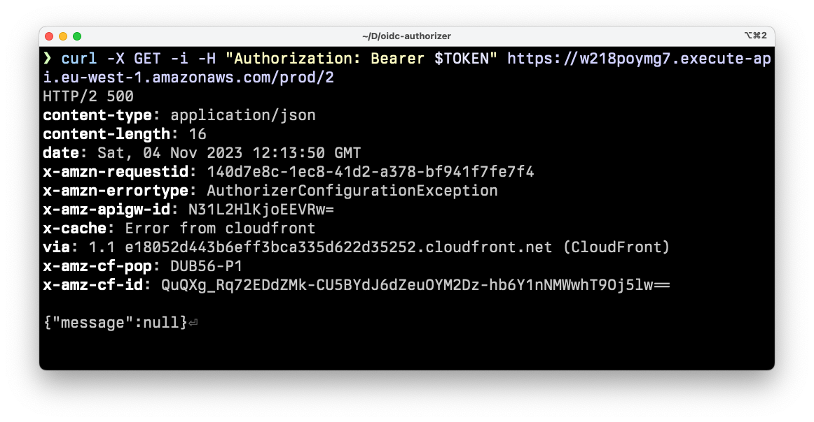
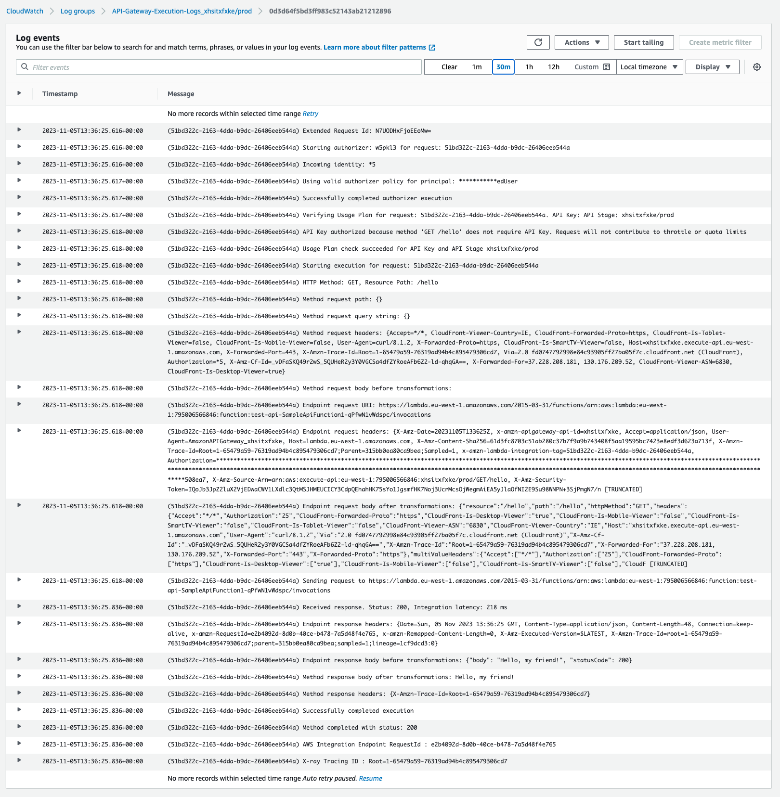

Last week, while working on [a custom REST API Gateway Lambda authorizer](https://github.com/lmammino/oidc-authorizer), I spent some time trying to debug a mysterious `500` error with a `{"message":null}` body. In this article, I will share why this was happening and how to debug this kind of error when building custom API Gateway authorizers.

## The use case

Before diving into the problem, let me give you a bit of context about the use case I was working on. As I said, I was working on an open-source project implementing a custom authorizer for AWS API Gateway. The project is simply called [`oidc-authorizer`](https://github.com/lmammino/oidc-authorizer) and it's already available on GitHub and the [Serverless Application Repository (SAR)](https://serverlessrepo.aws.amazon.com/applications/eu-west-1/795006566846/oidc-authorizer). This authorizer is implemented as a Lambda function and it allows you to authenticate requests following to OIDC (OpenID Connect) protocol.

To better understand what that means, let's have a look at this lovely diagram (that I am proud to have drawn by myself):


In this diagram, we see a user that sends an authenticated request to API Gateway. API Gateway is configured to use a lambda as a custom authorizer. The lambda talks with a given OIDC provider to get the public key to validate the user token and responds to API Gateway to Allow or Deny the request.

This type of authentication is based on the idea that a token (in this case, a _JWT_) can be trusted only if it's signed by an authority we trust. That's why we need to talk with the OIDC provider to get the public key to validate the signature of the token.

I have been speaking and writing at length about [JWT](/tag/jwt) before, so I am just going to say that if you want to deep dive into the fascinating topic of OIDC you can check out the [official specification of the OIDC standard](https://openid.net/specs/openid-connect-core-1_0.html). If you have the guts to read protocol specifications, it's a very interesting read, I promise! 😇


## The problem

Ok, all pretty cool, but what was the problem?

The problem is that I am a terrible programmer and when I started testing my first version of the authorizer my code was quite buggy and it didn't work in the way that REST API Gateway Authorizers are supposed to work.

I take responsibility for that, but that's only part of the problem. The other side of the coin is that AWS wasn't really giving me a useful error message: the only thing I could see when making a request was a `500` error with a response body containing only the JSON payload `{"message":null}`.



The full response:

```plain
HTTP/2 500
content-type: application/json
content-length: 16
date: Sat, 04 Nov 2023 12:13:50 GMT
x-amzn-requestid: [...]
x-amzn-errortype: AuthorizerConfigurationException
x-amz-apigw-id: w218poymg7
x-cache: Error from cloudfront
via: 1.1 [...]cloudfront.net (CloudFront)
x-amz-cf-pop: [...]
x-amz-cf-id: [...]

{"message":null}
```

Shrugh... What do you do in these cases? 🤷

You try to look for some logs in CloudWatch, right? Well, I did that and I found nothing. API Gateway doesn't have a log group by default and I was expecting to see some logs from my Lambda function, but there was nothing useful there!


## The solution

The solution is to enable extensive logging for API Gateway.

So, how do we do that?

We can do that using Infrastructure as code using CloudFormation or SAM.

These are the logical steps we need to follow:

1. Create a Role that allows API Gateway (at the service level) to write logs to CloudWatch
2. Use the [`AWS::ApiGateway::Account`](https://docs.aws.amazon.com/AWSCloudFormation/latest/UserGuide/aws-resource-apigateway-account.html) resource to assign the role we just created to API Gateway.
3. Updated the specific instance of a REST API Gateway stage to enable logging and tracing on it.


## Enabling API Gateway logging to CloudWatch with CloudFormation

OK, let's start with the code for the first 2 steps using the following CloudFormation template:

```yaml
# apigw-logging.yaml

AWSTemplateFormatVersion: "2010-09-09"
Description: Allow API Gateway to write logs to CloudWatch

Resources:
  
  ApiCWLRoleArn:
    Type: AWS::ApiGateway::Account
    Properties:
      CloudWatchRoleArn: !GetAtt CloudWatchRole.Arn

  CloudWatchRole:
    Type: AWS::IAM::Role
    Properties:
      AssumeRolePolicyDocument:
        Version: "2012-10-17"
        Statement:
          Action: "sts:AssumeRole"
          Effect: Allow
          Principal:
            Service: apigateway.amazonaws.com
      Path: /
      ManagedPolicyArns:
        - "arn:aws:iam::aws:policy/service-role/AmazonAPIGatewayPushToCloudWatchLogs"
```

To avoid overwriting other roles, we should only have one `AWS::ApiGateway::Account` resource per region per account, so we are creating a generic stack only to allow API Gateway to send logs to CloudWatch. We will be defining our APIs in other stacks.

Let's say we call this file `apigw-logging.yaml`. We can now deploy it with the following command:

```bash
aws cloudformation deploy \
  --template-file apigw-logging.yaml \
  --stack-name apigw-logging \
  --capabilities CAPABILITY_IAM
```

Make sure to specify a region either with the `--region` flag or by setting the `AWS_DEFAULT_REGION` environment variable.

If all goes well, you should see an output like this:

```plain
Waiting for changeset to be created..
Waiting for stack create/update to complete
Successfully created/updated stack - apigw-logging
```

> **Note**: if you prefer to use SAM (which we will use later), you can use it to deploy the template above with the following command: `sam deploy --guided --template apigw-logging.yaml`.


## Enable logging and tracing for a specific API Gateway stage using SAM

Now that we have a role that allows API Gateway to write logs to CloudWatch, we can enable logging and tracing for a specific API Gateway stage.

This time, to make our life a bit easier, we prefer to use [SAM](https://aws.amazon.com/serverless/sam/) (rather than CloudFormation) to define our API Gateway. SAM is a superset of CloudFormation that allows us to define serverless applications more concisely.

So, let's say we have another SAM template that defines an API Gateway and the stage we want to enable logging. The template could look like this:

```yaml
# api.yaml

AWSTemplateFormatVersion: "2010-09-09"
Transform: AWS::Serverless-2016-10-31
Description: AWS SAM template with a simple API definition

Resources:
  ApiGatewayApi:
    Type: AWS::Serverless::Api
    Properties:
      StageName: prod
      Description: Our production API
      # Enable traces and logs for the API Gateway stage
      TracingEnabled: true
      MethodSettings:
        - HttpMethod: "*"
          LoggingLevel: INFO
          ResourcePath: "/*"
          MetricsEnabled: true
          DataTraceEnabled: true

  # A sample API endpoint backed by a Lambda function
  SampleApiFunction1:
    Type: AWS::Serverless::Function
    Properties:
      Events:
        ApiEvent:
          Type: Api
          Properties:
            Path: /hello
            Method: get
            RestApiId:
              Ref: ApiGatewayApi
      Runtime: python3.9
      Handler: index.handler
      InlineCode: |
        def handler(event, context):
            return {'body': 'Hello, my friend!', 'statusCode': 200}

# Prints the full URL of our test endpoint
Outputs:
  HelloEndpoint:
    Description: "API Gateway endpoint"
    Value: !Sub "https://${ApiGatewayApi}.execute-api.${AWS::Region}.amazonaws.com/prod/hello"
```

Let's deploy this stack with:

```bash
sam deploy --guided --template api.yaml
```

Note that SAM will warn us that we haven't set any authorization for our API Gateway. That's fine for now, we will add it later. But you need to make sure you reply `Y` to the following question:

```plain
SampleApiFunction1 has no authentication. Is this okay?
```

If all goes well, you should see an output containing the URL of our endpoint. If you call it you should see the message: _"Hello, my friend!"_.


## Adding a custom authorizer to our API Gateway

Now that we have an API Gateway with a stage that has logging and tracing enabled, we can add a custom authorizer to it.

The goal of this article is not to deep dive into how to write a custom API Gateway authorizer. If you want a deep dive into that, I warmly recommend this fantastic article by [Alex DeBrie](https://twitter.com/alexbdebrie): ["The Complete Guide to Custom Authorizers with AWS Lambda and API Gateway"](https://www.alexdebrie.com/posts/lambda-custom-authorizers/).

Just to have a simple example to work with, let's say that we want to authorise all requests that provide an `Authorization` header that contains an odd number.

So the following headers will be authorized: ✅

```plain
Authorization: 1
Authorization: 3
Authorization: 5
...
```

While, the following headers will be denied: ❌

```plain
Authorization: 2
Authorization: 4
...
Authorization: something else
```

Even failing to pass the `Authorization` header will result in a denial.

The code for our custom Authorizer could look like this (don't judge my terrible Python skillz, pleaze 😅):

```python
# handler.py

def handler(event, context):
  authorization_token = event['authorizationToken']
  endpoint = event['methodArn']
  try:
    if int(authorization_token) % 2 == 1:
      # valid authorization response
      return {
        "principalId": "authenticatedUser",
        "policyDocument": {
          "Version": "2012-10-17",
          "Statement": [
            {
              "Action": "execute-api:Invoke",
              "Effect": "Allow",
              "Resource": "*"
            }
          ]
        }
      }
  except:
    pass
  
  # deny response
  return {
    "policyDocument": {
      "Version": "2012-10-17",
      "Statement": [
        {
          "Action": "execute-api:Invoke",
          "Effect": "Deny",
          "Resource": str(endpoint)
        }
      ],
    }
  }
```

If you save this Python code in a file called `handler.py` in the same folder where we have our `api.yaml` template, then we can add the authorizer to the template like this:

```yaml
# api.yaml

Resources:
  # [...]

    # Authorizer Lambda
    SimpleApiAuthorizerLambda:
      Type: AWS::Serverless::Function
      Properties:
        Runtime: python3.9
        Handler: handler.handler
        CodeUri: .
```

This only creates the Lambda resource, but to configure it as an authorizer, we need to add the following section to the `ApiGatewayApi` resource:

```yaml
# api.yaml

Resources:
  # [...]

  ApiGatewayApi:
    Type: AWS::Serverless::Api
    Properties:
      # [...]
      Auth:
        DefaultAuthorizer: SimpleApiAuthorizer
        Authorizers:
          SimpleApiAuthorizer:
            FunctionPayloadType: REQUEST
            FunctionArn: !GetAtt SimpleApiAuthorizerLambda.Arn
```

Ok, we are finally ready to deploy our updates to the `api.yaml` template with:

```bash
sam deploy --guided --template api.yaml
```

If all went well, we should now be ready to send requests to our API Gateway and see the authorizer in action.

Let's try to send a request with a valid authorization header:

```bash
curl -i -X GET -H 'Authorization: 17' <your-api-url>/hello
```

You should see a response like this:

```plain
HTTP/2 200
content-type: application/json
content-length: 21
date: Sun, 05 Nov 2023 13:24:15 GMT
x-amzn-requestid: 7a8c5040-e76b-400f-8407-0c6ed9b72e46
x-amz-apigw-id: N7Sb5GwpDoEEf9A=
x-amzn-trace-id: Root=1-6547977f-2ec69acd4fd64cb0285e36d7
x-cache: Miss from cloudfront
via: 1.1 33388636a7cb2afa812b276d900f88d4.cloudfront.net (CloudFront)
x-amz-cf-pop: DUB56-P1
x-amz-cf-id: DOa6otRm_gZyYG0rn-FM-vC1HhjzuhJIAzfms02bbny_0DpmKMTc3w==

Hello, my friend!
```

If instead we send a request without an `Authorization` header we should see something like:

```plain
HTTP/2 401
content-type: application/json
content-length: 26
date: Sun, 05 Nov 2023 13:25:29 GMT
x-amzn-requestid: e9ab5f97-9a5a-4f34-94d7-87df74a235de
x-amzn-errortype: UnauthorizedException
x-amz-apigw-id: N7SnfFYZjoEEolg=
x-amzn-trace-id: Root=1-654797c9-3cd1a8f5095fef3e3297ac26
x-cache: Error from cloudfront
via: 1.1 93951ac7649a5f7c158d327385b2aeb8.cloudfront.net (CloudFront)
x-amz-cf-pop: DUB56-P1
x-amz-cf-id: PuyPcm7sY13bfhigJXgNGTgYkT5CjinaK_uD6bl0jDNdGn_U0_pmHw==

{"message":"Unauthorized"}
```

Finally, if we send an invalid value for the `Authorization` header (e.g. not a number or an even number) we should see something like this:

```plain
HTTP/2 403
content-type: application/json
content-length: 82
date: Sun, 05 Nov 2023 13:26:18 GMT
x-amzn-requestid: 49a6b913-a965-4f66-a9e1-7b4ccf3b96cc
x-amzn-errortype: AccessDeniedException
x-amz-apigw-id: N7SvJHWQDoEEXeA=
x-amzn-trace-id: Root=1-654797fa-6ae95da234f15ba6587fb36d
x-cache: Error from cloudfront
via: 1.1 4b0861a8035fd11b1a90183c566020e2.cloudfront.net (CloudFront)
x-amz-cf-pop: DUB56-P1
x-amz-cf-id: gA-hS_7NeRjCtmKPc2P76uGyxaDNmWpE8iUZQMsxMHBoWm2W4uTPqw==

{"Message":"User is not authorized to access this resource with an explicit deny"}
```

Note how there's a difference in the error response between not sending an `Authorization` header and sending an invalid one. In the first case, we get a `401` with a `{"message":"Unauthorized"}` body, while in the second case, we get a `403` with a `{"Message":"User is not authorized to access this resource with an explicit deny"}` body.

In the first case, API Gateway is automatically handling the response for us and our custom authorizer lambda is not even invoked. In the second case, the authorizer is invoked and it returns a `Deny` response, which produces a `403` error and that specific error message.


## Looking at the API Gateway logs

Ok, I have been kind enough to give you a working authorizer, so we didn't really have to debug much... but we should still have a look at the API Gateway logs to see what they look like and why they could be really useful in case something went wrong and we needed to troubleshoot.

To look at the logs, we need to go to the [CloudWatch console](https://console.aws.amazon.com/cloudwatch/). From there, we need to select the `Logs` section and then the `Log groups` section. We should see a list of log groups and we should be able to find the one for our API Gateway. It should be called something like `API-Gateway-Execution-Logs_<your-api-id>/prod`.



As you can see, in these logs you can see quite a bit of detail about all the steps that API Gateway is performing before and after invoking our custom authorizer. This is really useful to understand what's going on and where the problem could be.


## Conclusion

And this brings us to the end of this article!

I hope you enjoyed it and that you learned something new.

If you have any questions or feedback, please let me know in the [comments](#comments) below or on [X, formerly Twitter](https://twitter.com/loige).