2023: End of another year!

Another year is gone and it's time for another review of all the things I have accomplished professionally (and not) in 2023.

I feel the usual disclaimer is mandatory here: I generally write these posts for myself and I don't expect other people to read them. So this is going to be a long boring post and I hope that if you are willing to read through it you are doing it from the comfort of your bed and that it's going to be a good read for you before falling asleep.

## First time at re:Invent

It's hard to pick what was my favourite thing of the year, but I want to start by sharing that 2023 marked my attendance of re:Invent. re:Invent is the biggest conference organized by AWS and it takes place every year in Las Vegas. It's a huge event with more than 60k attendees and it's a great opportunity to learn about the latest news from AWS and to meet a lot of people from the community.

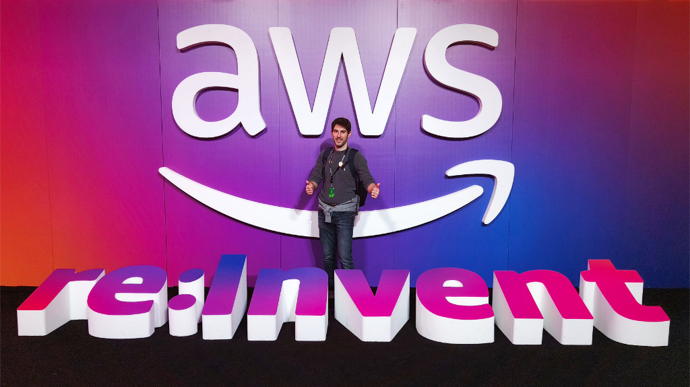

I admit I did not attend many talks but I managed to attend a few interesting ones and participate in different community events. This allowed me to focus on networking and meet so many amazing people from the community. I also had the opportunity to meet in person a lot of people I have been engaging with remotely for years and that was a great experience.

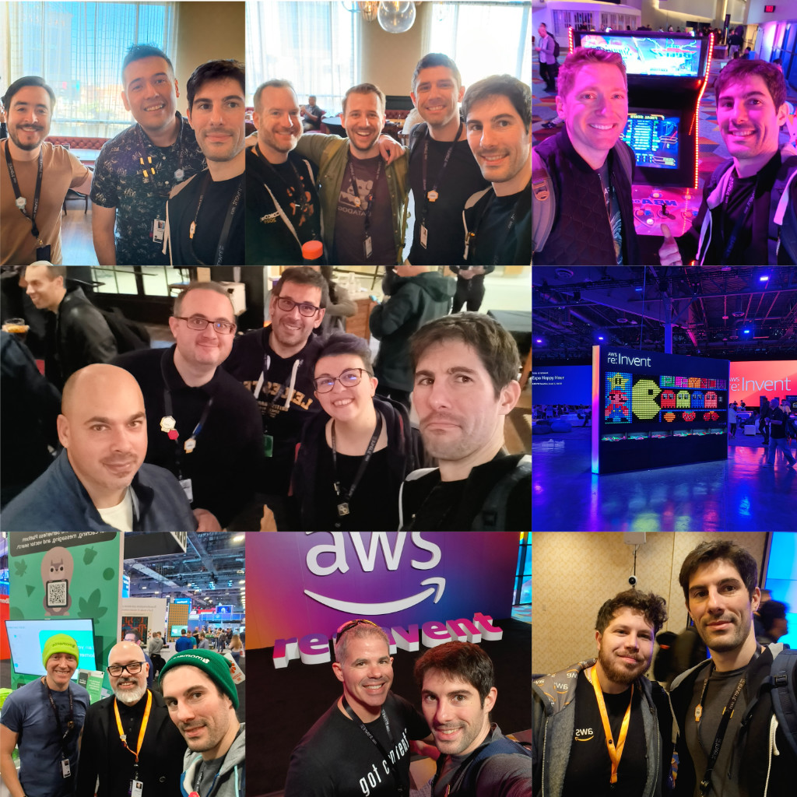

<small>These are only a few of the many people I met! From the upper left: [Andres Moreno](https://twitter.com/andmoredev), [Franchesco Romero](https://twitter.com/elchesco), [Matthew Bonig](https://twitter.com/mattbonig), [AJ Stuyvenberg](https://twitter.com/astuyve), [Alex DeBrie](https://twitter.com/alexbdebrie), [Allen Helton](https://twitter.com/AllenHeltonDev), [Jacopo Nardiello](https://twitter.com/jnardiello), [Luca Bianchi](https://twitter.com/bianchiluca), [Paolo Latella](https://twitter.com/LatellaPaolo), [Monica Colangelo](https://twitter.com/monicaontech), Mario & Pacman, Allen Helton (again!), [Luca Mezzalira](https://twitter.com/lucamezzalira), [Jon Myer](https://twitter.com/_JonMyer), [Andrea Amorosi](https://twitter.com/dreamorosi).</small>

These are really only a few of the many awesome folks you can meet in an event like re:Invent and I wish I had taken more pictures!

I had the pleasure to be able to interview a few more people for an episode of [AWS Bites Podcast](https://awsbites.com) where I asked them questions such as "How to get started with AWS and Serverless", "What is your favourite and least favourite thing about AWS", "What's your bold prediction for the future of serverless", "Multi-cloud, yes or no?", and, of course "What about AI? How is it going to change things?".

<iframe style="position: absolute; top:0; left: 0; width: 100%; height: 100%;" src="https://www.youtube.com/embed/k7asMzLk9Jo" frameborder="0" allowfullscreen></iframe>

I also want to give a shout-out to a few folks who delivered some amazing talks that I'd recommend checking out:

- [Getting started building serverless event-driven applications (SVS205)](https://www.youtube.com/watch?v=1aTQI-Kqs2U) by [Emily Shea](https://twitter.com/em__shea)
- [“Rustifying” serverless: Boost AWS Lambda performance with Rust (COM306)](https://www.youtube.com/watch?v=Mdh_2PXe9i8) by [EfiMerdler-Kravitz](https://twitter.com/TServerless).
- [Advanced event-driven patterns with Amazon EventBridge (COM301-R)](https://www.youtube.com/watch?v=6X4lSPkn4ps) by [Sheen Brisals](https://twitter.com/sheenbrisals)
- [Advanced data modeling with Amazon DynamoDB (DAT410)](https://www.youtube.com/watch?v=PVUofrFiS_A) by Alex DeBrie
- [Demystifying and mitigating AWS Lambda cold starts (COM305)](https://www.youtube.com/watch?v=2EDNcPvR45w) by AJ Stuyvenberg
- [Advanced AWS CDK: Lessons learned from 4 years of use (COM302)](https://www.youtube.com/watch?v=Wzawix9bMAE) by Matthew Bonig

In case you are curious, all the other talks are available on the official [AWS Events YouTube channel](https://www.youtube.com/@AWSEventsChannel). There's also a dedicated playlist for all the [breakout session talks](https://www.youtube.com/playlist?list=PL2yQDdvlhXf_HQ1BmWQHoe1o5-SQMCUfl).

A big thank you is mandatory to the AWS Hero program team: **Taylor Jacobsen**, **Farrah Campbell**, and **Albert Zhao**. They did an amazing job at organizing the AWS Heroes Lounge and the AWS Heroes reception. They also did a great job at making sure that all the AWS Heroes had a great time at re:Invent and that we had the opportunity to meet and network with each other. I am really grateful for the opportunity to be part of this amazing program and I am looking forward to the next re:Invent!

One last thing I want to mention is that re:Invent is a fantastic place for collaborating on content creation. I had the pleasure to collaborate with [Chriss Williams](https://twitter.com/mistwire) doing a [quick interview](https://www.youtube.com/watch?v=ErJ8KpYd5B8) for his [vBrownBag channel](https://www.youtube.com/@vBrownBag). I also spoke with [Julian Wood](https://twitter.com/julian_wood) at their ServerlessLand booth (yet to be published) and with [Sam Williams](https://www.linkedin.com/in/sam-complete-coding/) from Complete Coding (yet to be published as well).

> Life is beautiful not because of the things we see or do. Life is beautiful because of the people we meet.
> 
> — Simon Sinek

## Middy

Now, let's talk a bit about [Middy](https://middy.js.org/)!

Middy is a Node.js middleware framework specifically designed for AWS Lambda! I've been part of this project since the early days of Lambda (even though the very first public commit only happened on August 3, 2017), and it's been quite a journey.

However, I must admit, I can't take credit for the success of the framework over the last four years. All the kudos go to the dedicated efforts of [Will Farrell](https://github.com/willfarrell), who has been tirelessly maintaining Middy, and of course, to the fantastic community that surrounds it!

The biggest news for Middy this year are the following:

- Secured a substantial sponsorship from [fourTheorem](https://fourTheorem.com)
- Secured a significant sponsorship from **AWS itself**! This is massive also because AWS is now officially endorsing Middy as a framework for building Lambda functions as part of their [AWS PowerTools suite](https://docs.powertools.aws.dev/lambda/typescript/latest/).
- Released a new major version: Middy v5.0!

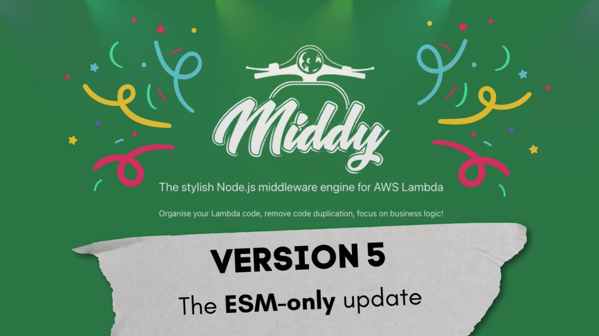

I had the pleasure to contribute a bit to this new Major release by helping with improving the internal typings and by making some minor improvements to the website. I admit the TypeScript stuff was wild and I had to learn tons of tricks to make it work, but I am happy with the result and I am looking forward to contributing more to Middy in the future. A big thanks to all the people who helped through [this massive PR](https://github.com/middyjs/middy/pull/616/files). The Middy community is awesome and this is a testament to how much you can learn and grow by contributing to open source projects.

If you are using Middy and you want to know how to upgrade to V5, you can check out this dedicated [Migration guide from Middy v4 to Middy v5](https://middy.js.org/docs/upgrade/4-5/).

But let's talk numbers! Middy is constantly growing in its adoption, but how much?

[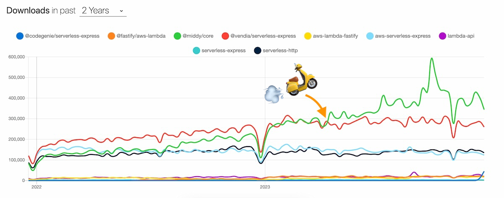](https://npmtrends.com/@codegenie/serverless-express-vs-@fastify/aws-lambda-vs-@middy/core-vs-@vendia/serverless-express-vs-aws-lambda-fastify-vs-aws-serverless-express-vs-lambda-api-vs-serverless-express-vs-serverless-http)

In this graph we can see that, in 2023, Middy became the number one middleware framework for Lambda, surpassing [`@vendia/serverless-express`](https://www.npmjs.com/package/@vendia/serverless-express). If I have to guess this is because Middy is purely focused on Lambda and it doesn't just try to adapt the HTTP-first Express paradigm to Lambda. The fact that `@vendia/serverless-express` has been now moved to [`@codegenie/serverless-express`](https://www.npmjs.com/package/@codegenie/serverless-express) might have been another contributing factor since the switch is fragmenting the data and most likely causing migration friction...

If we zoom-in on the download numbers for Middy, the numbers, IMHO, look quite rewarding:

- Total downloads of the year: almost **18mln downloads** (core only) + almost **78mln downloads** including all the other 35 supporting packages ([data](https://docs.google.com/spreadsheets/d/1zYddbgGfGcthN5BAeyYLDiKtVtCg7LPVptCtdetHNzc/edit?usp=sharing))
- A peak of almost **600k downloads/week** for Middy core

[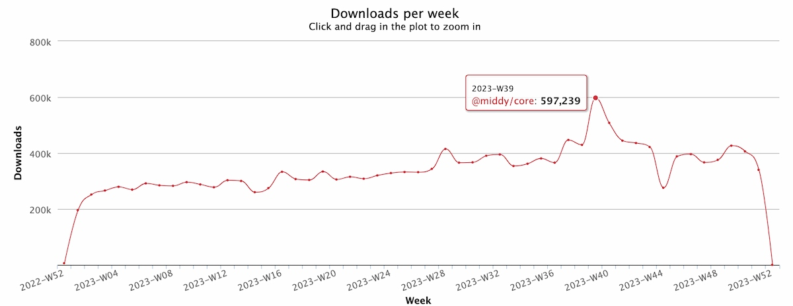](https://npm-stat.com/charts.html?package=%40middy%2Fcore&from=2023-01-01&to=2023-12-31)

If we look at some vanity metrics (GitHub stars count), there was some nice steady growth as well:

[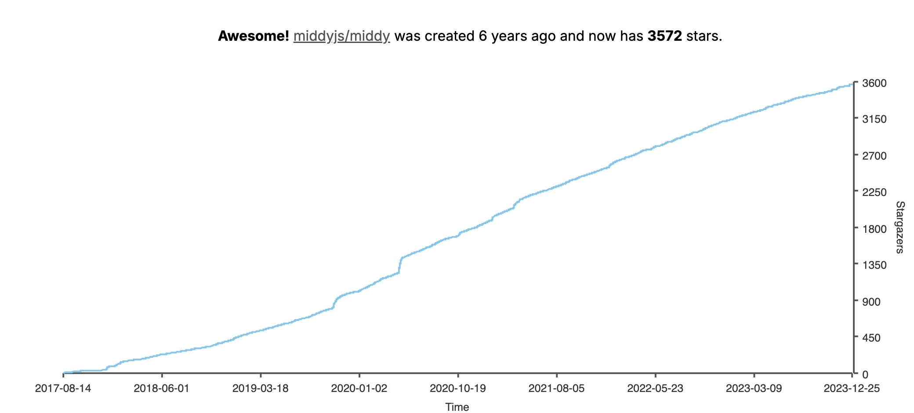](https://starchart.cc/middyjs/middy)

We are so close to **3600 stars**, so if you use Middy and find value in it, consider [giving it a star on GitHub](https://github.com/middyjs/middy) and help us reach this vanity milestone! 😋
 
One final call to action: if you like Middy and care about its future, it would be only fair to [consider sponsoring Will Farrell on GitHub](https://github.com/sponsors/willfarrell). He is the one who is putting most of the effort into maintaining the project and he is doing an amazing job at it. 🙏

> Side projects create the greatest companies because they begin as freedom machines, labors of love and truth vehicles. Precious time is traded to pursue something pure.
>
> — Brian Norgard

## Almost 3 years at FourTheorem

February next year will mark my third year as a Senior Architect at [fourTheorem](https://fourTheorem.com). It's crazy to think that, because I am still as happy as I was in the first few months which I admit is something fairly unusual for me since I have been a bit of a job-hopper before changing jobs regularly every ~2 years.  Now I am not just happy to stick around with fourTheorem, but I am also looking forward to years to come!

If you ask me why, I probably wouldn't have a straight answer. Or, at least, I wouldn't be able to pinpoint a single factor that contributes to my happiness. I think it's a combination of many things: great culture, interesting projects (always challenging and with lots of variety), amazing colleagues both at human and technical levels, and a lot of freedom to experiment and grow. Finally, I feel that the work we do is meaningful and has a positive impact on our customers and the community. And looking back at my career, I think this is something that is not obvious at all in the tech world.

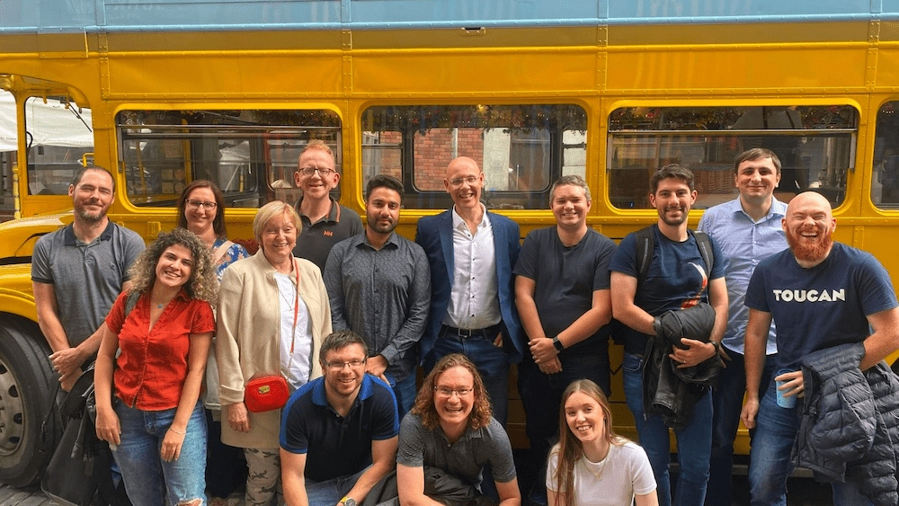

<small>Most of the cheerful team at fourTheorem</small>

Some of the things we have done in 2023:

- Welcomed 2 new colleagues: [David Lynam](https://twitter.com/t00cool), Senior Cloud Architect, and [Conor Maher](https://twitter.com/conzy_m), Senior Infrastructure Engineer and organiser of the [AWS South East User Group in Ireland](https://www.meetup.com/aws-user-group-south-east/).
- Our team spoke at over 30 conferences in 4 different continents, including AWS Cloud Day Dublin and the AWS AI & Data Conference, where [Eoin Shanaghy](https://twitter.com/eoins) (our CTO) conducted a one-on-one interview with **Werner Vogels**, CTO of Amazon.
- We celebrated two wins at the JSDAY Awards 2023: **Best Place to Work with JavaScript in Ireland** and **Most Valued JavaScript Open Source Project** for Middy.
- We proudly became an **Amazon ECS Service Delivery Launch Partner**, validating our expertise in Amazon ECS and AWS Fargate.
- We open-sourced some new very cool projects such as [`podwhisperer` for automating podcast transcripts](https://github.com/fourTheorem/podwhisperer) and [`episoder` for automating chapters, tags, titles, and video descriptions from transcripts](https://github.com/fourTheorem/episoder).
- We also kept investing in an open-source project we launched last year: [`slic-watch` for automating observability on AWS](https://github.com/fourTheorem/slic-watch) which got mostly rewritten in TypeScript (thanks to all the efforts of our colleague [Diren Akkoc](https://twitter.com/AkkocDiren)).

What can we expect in the next year? Hard to say for sure, but I am sure it's going to be exciting and rewarding!

I am also happy to see that the company is growing and that we are always on the lookout for talent. If you like the cloud and you think you might be interested in joining us, reach out to me and/or check out the [fourTheorem careers page](https://fourtheorem.com/careers/).

Finally, if you and your company are looking for help with AWS and the cloud, whether you are doing a cloud migration, an app modernization, building a scalable MVP for a startup idea or trying to optimize your cloud bill, [reach out to us](https://fourtheorem.com/contact-us/) and we'll be more than happy to help!

> It does not matter how slowly you go as long as you do not stop.
>
> — Confucius

## Public speaking

I am not sure if I can call myself a _public speaker_, but I do enjoy speaking at conferences and meetups. I think it's a great way to share knowledge and to meet new people. I also think it's a great way to step out of your comfort zone, challenge yourself and grow as a person. If it's something you haven't done yet, I would recommend considering it.

I have been doing public speaking since 2016 and in 2023 I reached a total of **137 talks**! 🎉

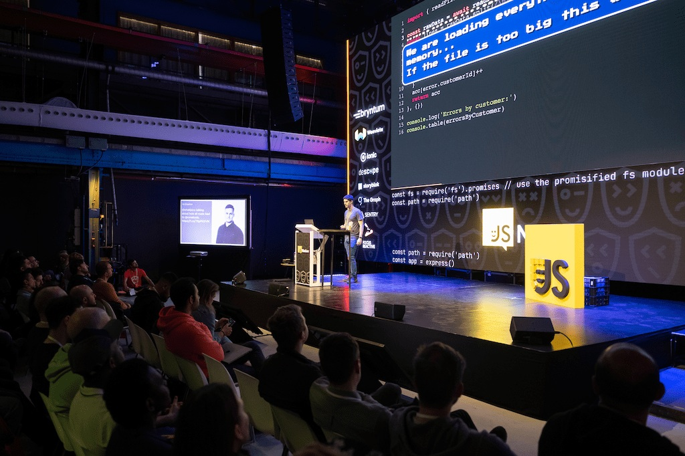

<small>This is me delivering a talk about JavaScript iteration protocols at JSNation in Amsterdam. What an awesome experience!</small>

One of my favourite speaking events was to deliver my first talk at a Rust conference (RustNation UK)! 🦀 This is really important for me because I feel I am still at the very beginning of my Rust journey and being able to speak in front of a crowd interested in Rust and possibly more knowledgeable than me was a great experience. I am looking forward to doing more of this in the future! 

The talk is called _"What I learned by solving 50 Advent of Code challenges in Rust"_. It had a great reception and it's available on YouTube with more than 12k views and tons of comments!

<iframe style="position: absolute; top:0; left: 0; width: 100%; height: 100%;" src="https://www.youtube.com/embed/udHjmno-tfA" frameborder="0" allowfullscreen></iframe>

<small>Spoiler, I'll be presenting at RustNation UK again in 2024! 🎉</small>

Here's the full list of talks I delivered in 2023:

- _Interview with Caffé Sviluppo_ (Podcast interview in Italian, remote) ([Video](https://www.youtube.com/watch?v=ggvowBqTtD8))
- _Building an invite-only microsite with Next.js & Airtable_ (talk at Global Summit for Node.js, remote) ([Slides](https://loige.link/pizzapazza), [Video](https://www.youtube.com/live/seGVmqw2vTY?si=uh8cil7Zd0oa1crG&t=3527))
- _What I learned by solving 50 Advent of Code challenges in Rust_ (talk at Rust Nation, London) ([Slides](https://loige.link/crablearn), [Video](https://www.youtube.com/watch?v=udHjmno-tfA))
- _Serverless su AWS_ (podcast interview with Gitbar podcast, remote, Italian) ([Episode](https://www.gitbar.it/episodes/ep147-serverless-su-aws-con-luciano-mammino-fourtheorem))
- _Did you know JavaScript has iterators?_ (talk at DublinJS meetup, Dublin) ([Slides](https://loige.link/iterate))
- _The evolution of Async JavaScript and its patterns_ (talk at Node.js ONE Africa conference, remote) ([Slides](https://loige.link/async-evo), [Video](https://www.youtube.com/watch?v=DRxod84Ftws))
- _AWS Application Composer e Amazon CodeCatalyst_ (talk at AWS User Group Roma, remote)
- _A modern application is ASAP_ (talk at AWS Cloud Day, Dublin)
- _Your Lambdas, In Rust!_ (talk at Conf42: Cloud Native, remote) ([Slides](https://loige.link/rusty-lambdas), [Video](https://youtu.be/jJjdKJHqKkI))
- _Production-ready lambdas with Node.js_ (talk at JSDay Verona) ([Slides](https://loige.link/prod-lambda))
- _A serverless architecture for high performance financial modelling_ (talk at Serverless Architecture Conference London) ([Slides](https://fth.link/sa23), [Video](https://www.youtube.com/watch?v=9NyeoWqdIQk))
- _Your Lambdas, In Rust!_ (talk at AWS Fest remote) ([Slides](https://loige.link/lambda-rs), [Video](https://www.youtube.com/watch?v=NwH2VZUnVU0))
- _JavaScript Iteration Protocols_ (talk at JSNation Amsterdam) ([Slides](https://loige.link/iter-nation), [Video](https://portal.gitnation.org/contents/javascript-iteration-protocols))
- _AWS On Air_ (interview at AWS Summit London) ([Video](https://www.youtube.com/watch?v=Jc42iaSKaIc))
- _Production-ready lambdas with Node.js_ (talk at Sailsconf) ([Slides](https://loige.link/lambda-pirate), [Video](https://www.youtube.com/watch?v=_OBBwuplpBY))
- _The senior dev: an opinionated take_ (remote talk at Java Challenger) ([Slides](https://loige.link/senior), [Video](https://www.youtube.com/live/oO6zgqFuKCY?feature=share&t=7061))
- _Easier Observability with SLIC Watch_ (remote talk at Serverless Office Hours) ([Slides](https://fth.link/observe), [Video](https://www.youtube.com/watch?v=wexRZ_9Zfwk))
- _Rust, Serverless and AWS_ (talk at Rust Dublin) ([Slides](https://loige.link/oxidize-lambda), [Video](https://www.youtube.com/watch?v=He4inXmMZZI))
- _Automating observability on AWS with SLIC Watch_ (talk at Ship It Conference Dublin) ([Slides](https://fth.link/auto-obs)
- _Chats with "La locanda del tech"_ (remote panel - in Italian) ([Video](https://www.youtube.com/watch?v=GHG3CxAWy6I))
- _Easier Observability with SLIC Watch_ (talk at ServerlessDays Belfast At Night) ([Slides](https://fth.link/sls-night), [Video](https://www.youtube.com/watch?v=x8qpPpdsg1E))
- _Lambda in Rust_ (talk at AWS User Group Dublin) ([Slides](https://loige.link/lambda-rust))
- _Did you know JavaScript has iterators?_ (talk at JavaScript Global Summit) ([Slides](https://loige.link/iter-summit))
- _Everything I know about S3 pre-signed URLs_ (talk at AWS Community Summit Manchester) ([Slides](https://fth.link/sign-before), [Video](https://www.youtube.com/watch?v=3sbz5y_WXTY))
- _Did you know JavaScript has iterators?_ (talk at Node.js Conference) ([Slides](https://loige.link/iter-garda))
- _Your Lambdas, In Rust!_ (talk at Codemotion Milan Milan) ([Slides](https://loige.link/lamb-rs), [Video](https://talks.codemotion.com/your-lambdas-in-rust))
- _Your Lambdas, In Rust!_ (talk at AWS User Group South East Waterford) ([Slides](https://fth.link/rust-lambda))
- _AWS Serverless Hero at re:Invent_ (interview with vBrownBag) ([Video](https://www.youtube.com/watch?v=ErJ8KpYd5B8))
- _Serverless Tips from an AWS Hero_ (online interview) ([Video](https://www.youtube.com/watch?v=mfeF2aO8TTI))

What do you think? Is there any topic here that catches your attention? If so, let me know and I'll be happy to work on more content around the same topic!

> It usually takes me more than three weeks to prepare a good impromptu speech
>
> — Mark Twain

## AWS Bites

AWS Bites is a weekly podcast that Eoin Shanagy and I started in 2021. We are now in our third season and we are still growing steadily! 🎉

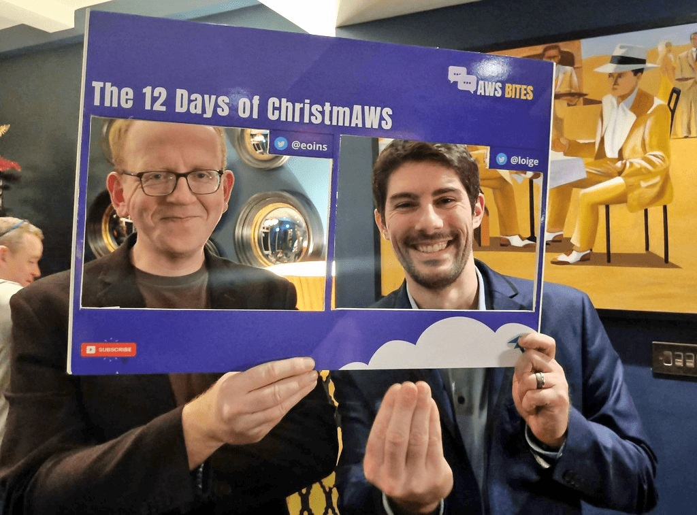

<small>Here's Eoin and I during the fourTheorem Christmas dinner. Our colleague Conor made for us this awesome cutout so that we can feel like real podcasters! I am doing the Italian _pinch gesture_, because I am Italian, so I am entitled to it! 😅</small>

This year we released **46 episodes** which is almost one every week! It feels great to have been so consistent! We also surpassed the **100-episode mark**! 🎉

Let's have a quick look at our YouTube numbers for 2023:

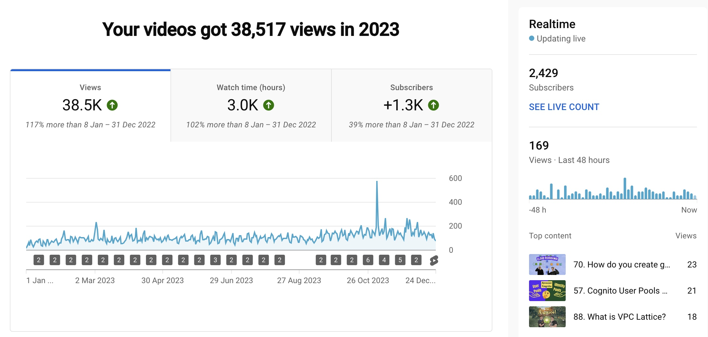

- We more than **doubled our number of views** from last year reaching **~39k views**.
- We also **doubled the watch time** reaching **3k hours of watch time**.
- We have **grown our subscriber base by ~40%** reaching **~2.5 subscribers**.

Our followers seem to have enjoyed the following 3 episodes the most:

- [70. How do you create good AWS diagrams?](https://awsbites.com/70-how-do-you-create-good-aws-diagrams/)
- [57. Cognito User Pools vs. Identity Pools](https://awsbites.com/57-cognito-user-pools-vs-identity-pools/)
- [88. What is VPC Lattice?](https://awsbites.com/88-what-is-vpc-lattice/)

Now let's compare these with some podcast numbers, based on what Spotify gives us:

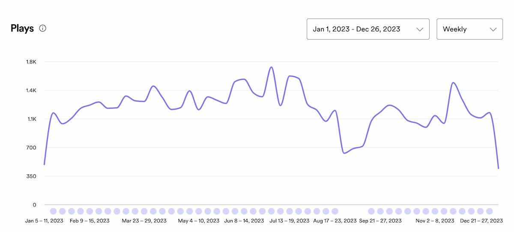

- We reached **almost 60k plays** in 2023, which is almost **double the number of plays** we had in 2022.
- We streamed in **79 different countries** (with USA, UK, India, Canada and Germany being in our top 5).
- We have **grown our follower base by 123%** reaching **~2k Spotify followers**.
- The favourite episode was: [60. What is AWS Lambda?](https://awsbites.com/60-what-is-aws-lambda/)
- The most shared episode was: [83. Bucket List of S3 Best Practices](https://awsbites.com/83-bucket-list-of-s3-best-practices/)

If you are curious to see more details you can check out [our Spotify for Podcasters wrapped 2023 YouTube short](https://youtube.com/shorts/F6c_Ab8lwMk).

If you enjoy AWS Bites, let us know what you think about it, what can we do to deliver more value to you, which topics you care about, etc. We are always looking for feedback and we are always happy to hear from our listeners on what we can do better!

> If you have knowledge, let others light their candles in it.
>
> — Margaret Fuller

## Live coding on Twitch

In 2023 I continued my activity of [live coding on Twitch](https://twitch.tv/loige) together with my friend [Roberto Gambuzzi](https://twitter.com/gbinside). I actually want to take the opportunity to give Roberto a big shout-out not just for the great company during these live coding streams (where he always brings a huge amount of expertise and some great fun too), but also for keeping me on track with streaming (more or less) regularly! So, yes, _Thanks Roberto!_ 🙏

Let's now share some stats:

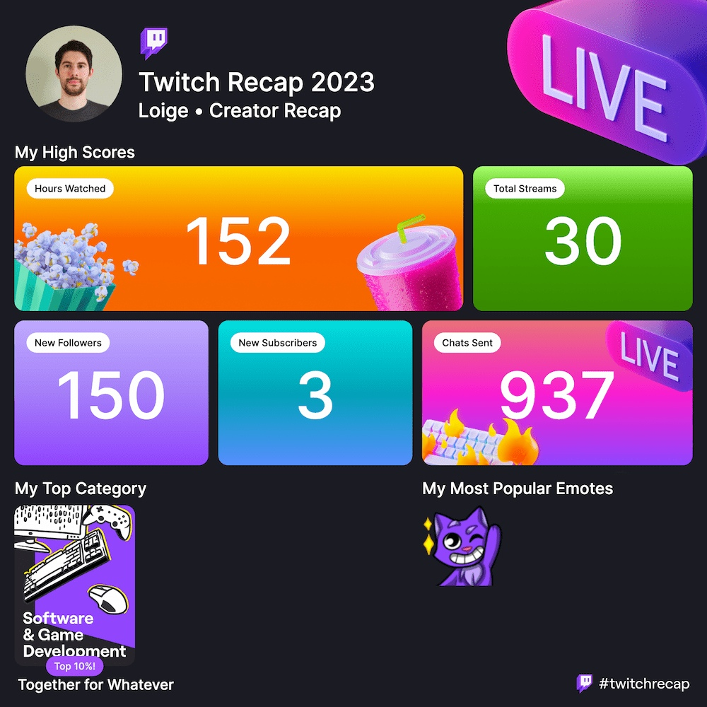

Compared to last year we had **fewer streams (30 vs 36)**, **fewer new followers (150 vs 250)** and **fewer hours watched (152 vs 223)**. A bit of a downward trend, but to be honest I am not too worried about it. We don't stream because we have some kind of master plan to grow a huge community, but more as an excuse to keep learning about Rust and getting better as software engineers. In that sense, I think that the time spent doing this activity has been absolutely well spent!

This year we focused much less on Advent of Code and we tried to invest more time learning about new interesting Rust crates and working on a few side projects. Here's a summary of some of the most interesting streams (with a link to the respective recordings on YouTube):

- [Learning `nom`: Rust library to build parsers](https://www.youtube.com/watch?v=Igajh2Vliog).
- [Learning `axum`: Rust web framewrork](https://www.youtube.com/watch?v=lXiXdPmRqSk).
- [Learning `dotenv` & `reqwest` Rust libraries](https://www.youtube.com/watch?v=rqUH1Dnz8Ho).
- [Learning `serde`: Rust serialization and deserialization library](https://www.youtube.com/watch?v=mrOYFegU60U).
- [Learning about Rust Async Iterators using `async_stream`](https://www.youtube.com/watch?v=3Iezt-yUxd8).
- [Learning the Rust crates `zip` and `image`](https://www.youtube.com/watch?v=YkTIGz_QAZM).
- [Using `pyO3`, a Rust library to create Python packages](https://www.youtube.com/watch?v=0FTEIBAzRyY).
- [Using Zig with Python](https://www.youtube.com/watch?v=yp9qdHYafOI).
- [Using `neon`, a Rust library to create Node.js modules](https://www.youtube.com/watch?v=jkC4vik8__k).
- [Various streams on how to re-design the automation around FullStack Bulletin](https://www.youtube.com/playlist?list=PLbNOKnE-Oyr1tsUft4j0QZDyk5iFcVVy_).
- [Various streams on building a Twitch chat integration in Rust](https://www.youtube.com/playlist?list=PLbNOKnE-Oyr1I-Ddj4LX-VqDHj4qjTb49)
- More Advent of Code in Rust ([Stream 1](https://www.youtube.com/watch?v=1mCrhSVQTGM) and [Stream 2](https://www.youtube.com/watch?v=S7FwAUMt-kw)).

If you think these kinds of topics are interesting, make sure to [follow us on Twitch](https://twitch.tv/loige) and [check out the recording on YouTube](https://youtube.com/loige).

Finally, a big shout-out to all the people who joined us during the streams and helped us with their comments and suggestions. We really appreciate it and we are looking forward to seeing you again in 2024! 🙏

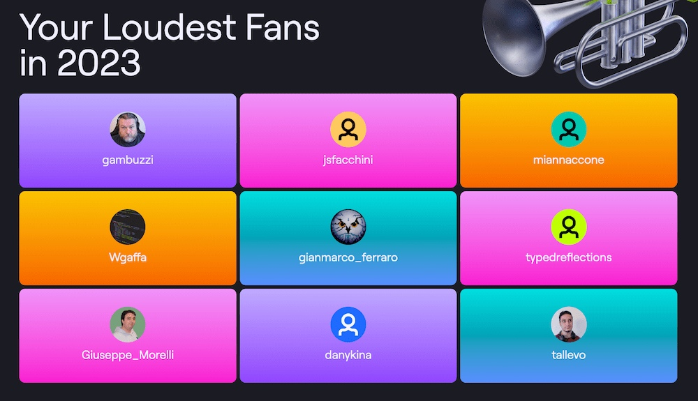

> There’s progression you don’t see and feel.
> There’s a starting point, and with time and focus.
> As long as you reevaluate and reassess, and constantly objectively look at what you’re doing, and then pursue it with passion and focus, you get better at things.
>
> — Joe Rogan

## Node.js Design Patterns

[Node.js Design Patterns](https://nodejsdesignpatterns.com/) is a book I co-authored with the amazing [Mario Casciaro](https://twitter.com/mariocasciaro). It is s still doing quite well even after 3.5 years since the third edition was published.

The thing that is most rewarding about this book is that it keeps getting praised as one of the best resources to go from beginner to master with JavaScript and Node.js. I am really happy to see that the book is still relevant and that it's helping people to learn and grow!

[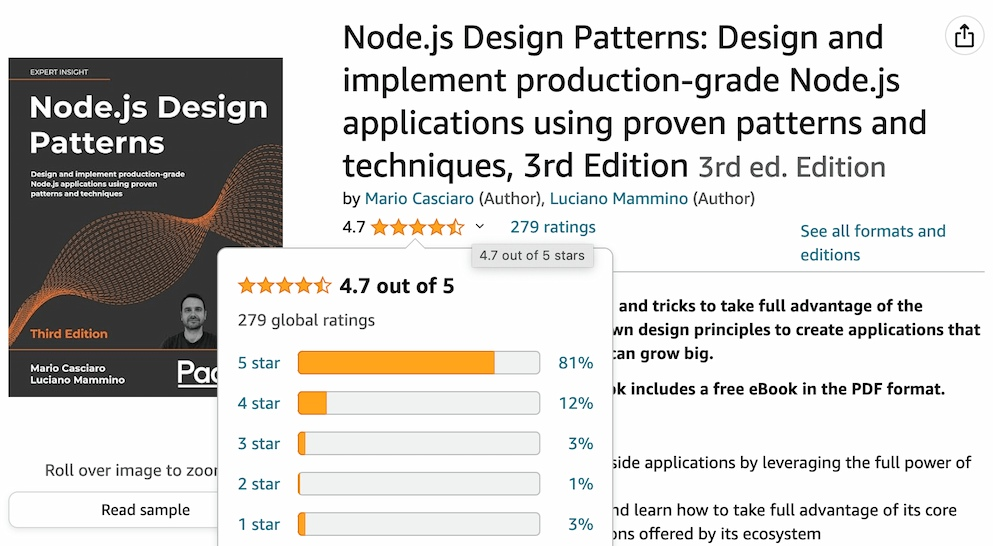](https://nodejsdp.link/buy)

In 2023 we kept getting great reviews and we currently have **4.7/5 stars on Amazon** (compared to 4.6 last year) and a total of 279 reviews (compared to 227 last year).

Let me just quote [a review from 2023](https://www.amazon.com/gp/customer-reviews/R26EIBOMYLHUMZ/ref=cm_cr_othr_d_rvw_ttl?ie=UTF8&ASIN=1839214112) that I particularly liked:

> An excellent book, highly recommend it. Extremely useful, I read it 2 times and planning for the third one.

And here's [another one from GoodReads](https://www.goodreads.com/review/show/5727966468):

> As a CS student who just wants to get into backend development with Node.js, all the time a hear terms like microservices, messaging, streams, containers, event loop, and caching, and I just get overwhelmed by the many terms I hear, until someone recommended this book to me, and it just guided me where everything falls in place, it's not comprehensive it helps you explore and do small examples on how to do these stuff with Node.js. Trust me, it's not just another "Design Patterns" book :)

At the time of writing the book is also doing quite well in a few categories:

- **#110,600 in the global Amazon ranking** (this one doesn't mean much but it's always a funny number to observe)
- **#18 in JavaScript Programming** (compared to #22 last year)
- **#23 in Web Services** (compared to #11 last year)

The book covers the most modern design patterns to make sure you write efficient and scalable Node.js and JavaScript code. It is also up to date to use modern language features such as ESM (EcmaScript modules), Async Iterators, and modern libraries and frameworks. The book targets Node.js 14 which is now deprecates, so, altough I believe the book is still very modern and relevant, it might be a good time to start thinking about a new edition. I am not sure if I can commit to it yet, but I'll keep you posted if something happens!

Meanwhile, if you have read the book, what do you think? Is there something missing? Something else you'd like to see in it? Let me know!

> A book is a garden, an orchard, a storehouse, a party, a company by the way, a counselor, a multitude of counselors.
>
> — Charles Baudelaire

## FullStack Bulletin

[FullStack Bulletin](https://fullstackbulletin.com/) is a free weekly newsletter about full-stack web development. I have been running this project with my dear friend [Andrea Mangano](https://twitter.com/andreaman87) for the last 6 years, now.

[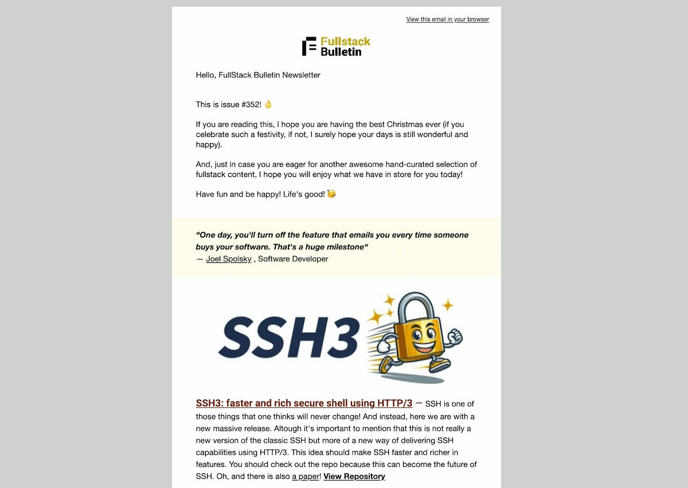](https://us15.campaign-archive.com/?u=b015626aa6028495fe77c75ea&id=d91a7c0643)

<small>A screenshot of one of the latest issues of FullStack Bulletin - Issue #352 published on 2023-12-25</small>

In 2023 we reached more than **350 published issues** and a total of **3000 subscribers** (compared to 2500 last year)! 🎉

This year we invested a bit in improving our layout, adding more variety to our content, improving the [automation](https://github.com/fullStackBulletin/automation) around the newsletter, and, generally speaking, we tried to make the newsletter messaging more personal and direct.

We are still running this project at a loss (Mailchimp is expensive! 💸), just for the sheer love of sharing full-stack content that we find interesting (and a bit selfishly as a tool to keep ourselves up to date with the news of the ever-evolving world of web development).

If you are interested in full-stack web development, make sure to [subscribe to FullStack Bulletin](https://fullstackbulletin.com/) and let us know what you think about it!

You can also support the project financially by sponsoring an issue! We can offer a sponsored banner, and a sponsored article slot. We can even discuss custom sponsorship packages. [Reach out to us](mailto:luciano@fullstackbulletin.com) if you are interested in knowing the details.

A bit shout-out to our sponsors in 2023: **MisterDA**, **ConfigCat**, and **Packt**. Thanks for supporting us! 🙏

> Curation is a natural and necessary extension of content creation. That is, as great as your content may be, your audience wants to learn from other experts and differing perspectives.
>
> — Pawan Deshpande

## LifeFoliage: the Landscape Hunt game

In 2023, I was able to carve out some of my free time to support the [LifeFoliage](https://www.lifefoliage.eu/) project. LifeFoliage is a project funded by The Life Programme, the EU’s funding instrument for the environment and climate action. The project is very active in the Italian territory where it is focused on helping the local ecosystem to preserve and protect the local flora and fauna in a variety of ways.

One of the things LifeFoliage does is monitor and raise awareness about the local flora and fauna. They do that by routinely performing remote sensing through satellite images, which is something that allows them to spot changes in the vegetation and to identify things like fires or deforestation activities.

In this context, they wanted to create a publicly available game that could capture the essence of their work. This is how [Landscape Hunt](https://game.lifefoliage.eu/) was born.

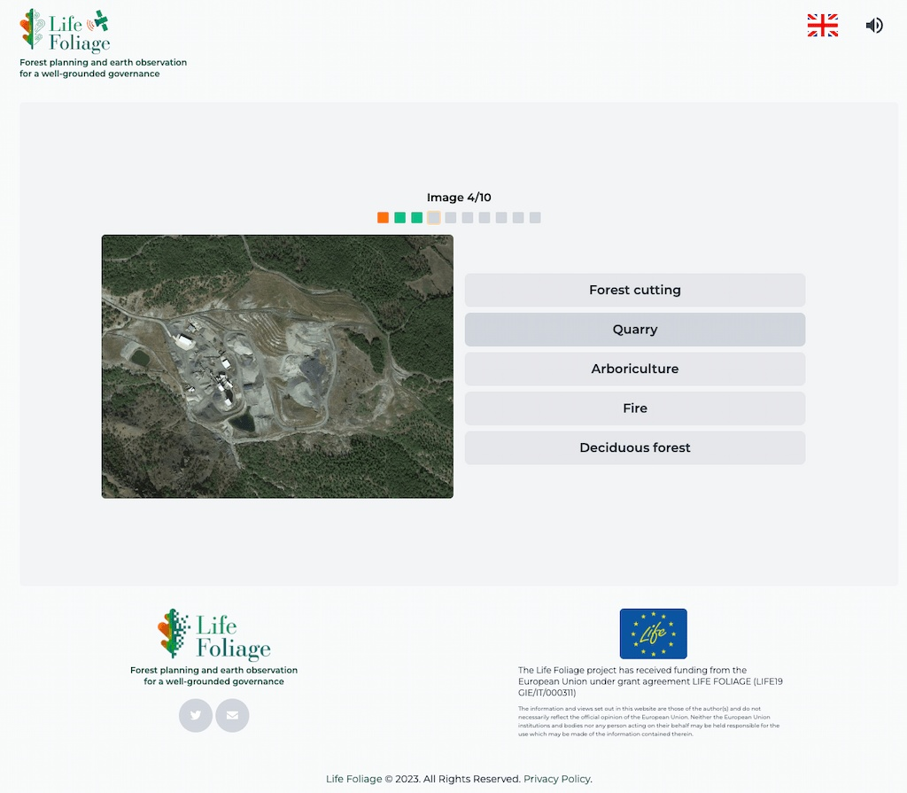

<small>A screenshot of a game session of LandScape Hunt</small>

Landscape Hunt is a game where you are presented with a series of satellite images and you have to spot guess what's the right classification for that image. Are you looking at a fire, a forest cutting, a deciduous forest, a quarry or something else? It's not that easy to guess correctly if you are not trained, so the game can be quite fun to play.

From a technical perspective, this was my first production Rust project, in fact, it features a Rust backend (written with [Axum](https://github.com/tokio-rs/axum)) while the frontend is written using [SolidJS](https://www.solidjs.com/) and TypeScript.

A big thanks to the team responsible for LifeFoliage and Landscape Hunt for involving me in this awesome project.

> The greatest threat to our planet is the belief that someone else will save it.
>
> — Robert Swan

## Articles & blog

In 2023 I kept writing articles occasionally on this blog and on other platforms. Here's the full list of all the articles published in 2023 in this blog:

- [The Definition of Senior: A Look at the expectations for Software Engineers](/the-senior-dev)
- [Building x86 Rust containers from Mac Silicon](/building_x86_rust-containers-from-mac-silicon)
- [Why you should consider Rust for your Lambdas](/why-you-should-consider-rust-for-your-lambdas)
- [Debugging custom ApiGateway authorizers](/debugging-custom-apigateway-authorizers)
- [JavaScript, low-level or AI?](/javascript-low-level-or-ai)

I also wrote a few articles for other platforms:

- [The illustrated guide to S3 pre-signed URLs](https://fourtheorem.com/the-illustrated-guide-to-s3-pre-signed-urls/) (published on fourTheorem blog)
- [The case for Serverless Rust on AWS](https://awscq.substack.com/p/the-case-for-serverless-rust-on-aws) (published in the AWS Comsum Quarterly Newsletter)
- [La definizione di Sviluppatore Senior (ita)](https://www.codemotion.com/magazine/it/carriere-tech/la-definizione-di-sviluppatore-senior/) (published on Codemotion's blog as a liberal translation of my article "The definition of Senior", kindly translated by Mauro Bardetta).

I was going to publish some stats about the blog, but the migration to Google Analytics V4 has messed up all my historic data and I am left with only **~18K user sessions from July 2023**! Sigh. 😭

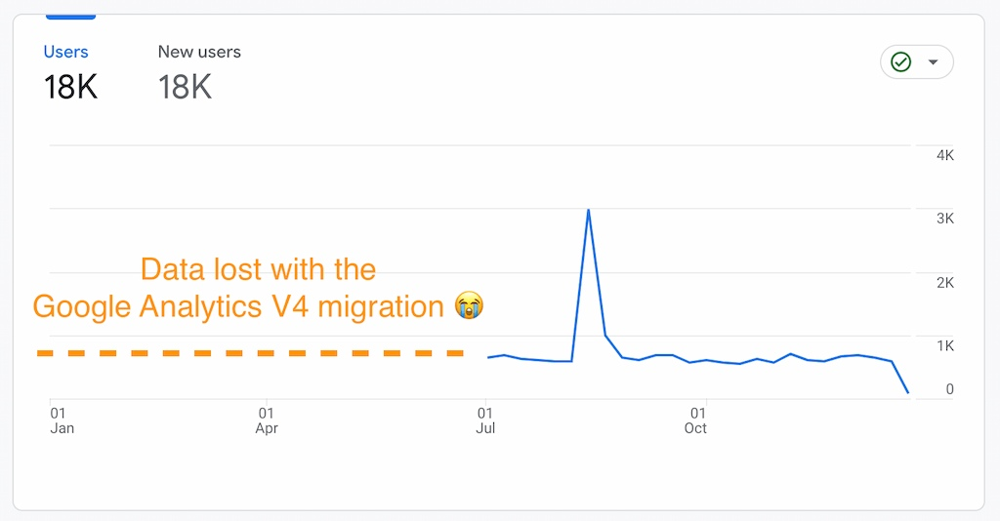

> Blogging is to writing what extreme sports are to athletics: more free-form, more accident-prone, less formal, more alive. It is, in many ways, writing out loud.
>
> — Andrew Sullivan

## Open Source

I always like to do some open source whenever I have the chance. I like to contribute to projects I use (even in small ways) and I like to share almost everything I do in an open-source fashion. No surprise that I kept my commit race going in 2023! 🎉

Here's a list of my most meaningful contributions of 2023:

- Various contributions to [`lmammino/jwt-cracker`](https://github.com/lmammino/jwt-cracker) (mostly merging PRs and general cleanups and improvements). Also, this is the first project where I introduced [Biome](https://biomejs.dev/) a new Rust-powered JavaScript/TypeScript formatter and linter which is quite promising!
- Continued working on some Advent of Code challenges in Rust (mostly during December 2023). All my solutions are in [`lmammino/rust-advent`](https://github.com/lmammino/rust-advent).
- [`lmammino/lexicoid`](https://github.com/lmammino/lexicoid): a simple Rust crate implementing short & stable IDs based on timestamps. Based on a Go library ([`brandur/sorg`](https://github.com/brandur/sorg)).
- [`eslint-community/eslint-plugin-security`](https://github.com/eslint-community/eslint-plugin-security/) [my PR](https://github.com/eslint-community/eslint-plugin-security/pull/95) co-authored together with [Simone Sanfratello](https://github.com/simone-sanfratello) was merged making ESLint able to spot some possible security issues in copy-pasted code.
- Some small contributions to an [awesome Rust workshop by @jfacchini](https://github.com/codurance/rust-nation-intermediate-workshop) that I had the fortune to partecipate to during Rust Nation UK 2023.
- [`lmammino/lastfm`](https://github.com/lmammino/lastfm): An async Rust client to fetch your Last.fm listening history or the track you are currently playing.
- [`lmammino/image-overlay-example`](https://github.com/lmammino/image-overlay-example): A very simple rust script showcasing how to create an image by overlaying two existing images.
- [`lmammino/unzip-and-resize-images`](https://github.com/lmammino/unzip-and-resize-images): A simple rust-based CLI that can read images from a zip file, resize them and save the resulting images in a local folder.
- [`lmammino/aws-application-composer-demo`](https://github.com/lmammino/aws-application-composer-demo): An AWS Application Composer project created during a LIVE demo at the AWS User Group Roma.
- [`lmammino/earthquake-notifier`](https://github.com/lmammino/earthquake-notifier): Lambda in Rust to monitor for earthquakes and generate EventBridge events.
- [`lmammino/mvp-contributions`](https://github.com/lmammino/mvp-contributions): a CLI tool to review and submit your Microsoft MVP contributions using a YAML file. I was very proud of this one because it saved me so much time when I had to submit my MVP contributions. For better or worse, Microsoft has recently updated the MVP program website and this tool no longer works. I'll need to find some time to update it to use the new APIs.
- [`lmammino/solidjs-template`](https://github.com/lmammino/solidjs-template): A dead simple Solid.js starter template (using npm, ESLint, StandardJS, and TypeScript).
- [`lmammino/zig-python-experiment`](https://github.com/lmammino/zig-python-experiment): A simple Python module written in Zig (mostly work done by [Roberto Gambuzzi](https://twitter.com/gbinside)).
- Fixed a small typo in [`rafaelcaricio/backie`](https://github.com/rafaelcaricio/backie/pull/3/files), a library to do background task processing for Rust applications with Tokio, Diesel, and PostgreSQL.
- [`lmammino/pyo3-experiment`](https://github.com/lmammino/pyo3-experiment): an example project where we used PyO3 to run Rust code from a Python module.
- [`lmammino/http-check`](https://github.com/lmammino/http-check): A dead-simple Lambda to demonstrate some best practices for Node.js Lambdas like logging, custom metrics, testing, etc.
- [`lmammino/playing-with-neon`](https://github.com/lmammino/playing-with-neon): Some simple experiment with Neon bindings: generating Node.js libraries with Rust
- [`lmammino/js-iter-examples`](https://github.com/lmammino/js-iter-examples): Code examples from my talk "JavaScript iteration protocols"
- [`FullStackBulletin/tech-quotes`](https://github.com/FullStackBulletin/tech-quotes): An API to get interesting tech-related quotes (powered by GitHub pages).
- Various improvements to [`lmammino/jwtinfo`](https://github.com/lmammino/jwtinfo): A command-line tool (written in Rust) to get information about JWTs (Json Web Tokens).
- [`lmammino/tapo-l920-on-off`](https://github.com/lmammino/tapo-l920-on-off): A very simple Rust binary that can turn on/off a TP-Link L920 led light strip in your local network.
- [`lmammino/twitch-chat-bot`](https://github.com/lmammino/twitch-chat-bot): An (incomplete and experimental) Twitch Chat bot written in Rust.
- [Contribution](https://github.com/Il-Libro-Open-Source/book/pull/182) to [Il-Libro-Open-Source/book](https://github.com/Il-Libro-Open-Source/book): an Italian open-source project that aims to become an open book about best practices and suggestions on how to become a good software developer. I contributed by writing an entire chapter about the skills that are needed to be considered a great Senior software developer.
- [`lmammino/oidc-authorizer`](https://github.com/lmammino/oidc-authorizer): A high-performance Lambda authorizer for API Gateway that can validate OIDC tokens (written in Rust).
- [Small contribution](https://github.com/aws-samples/serverless-patterns/pull/1910) to [`aws-samples/serverless-patterns`](https://github.com/aws-samples/serverless-patterns) making Node.js imports consistent.
- [`lmammino/whisper-rs-example`](https://github.com/lmammino/whisper-rs-example): An example of how to use Whisper.cpp bindings for Rust to perform speech-to-text on WAV audio files.
- A [minor contribution](https://github.com/aws/aws-cdk/pull/28414) [`aws/aws-cdk`](https://github.com/aws/aws-cdk) making sure that a specific edge case would provide good logging. I had quite some fun working on this one together with my colleague [Conor Maher](https://twitter.com/conzy_m) and I am very proud of this contribution since we use CDK quite a lot at fourTheorem.

To close this section here's my ritual GitHub yearly contribution graph! I know it's just vanity, but it's fun! 😀

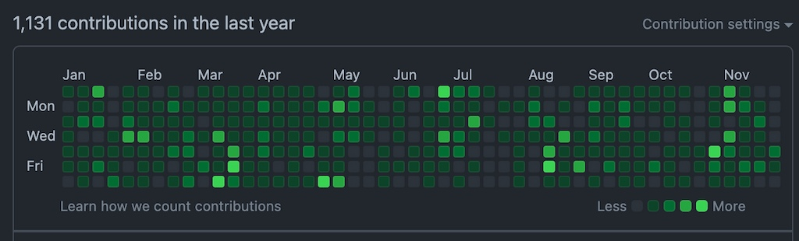

> I often compare open source to science. Science took this whole notion of developing ideas in the open and improving on other peoples' ideas. It made science what it is today and made the incredible advances that we have had possible. And I compare that to witchcraft and alchemy, where openness was something you didn't do.
>
> — Linus Torvalds

## Other stuff

Some other quick professional news (even though they are not really news).

### Still an MVP

In 2023 I was **confirmed as a Microsoft Most Valuable Professional for Developer Technologies and Security**. This marks [3 years as an MVP](https://mvp.microsoft.com/it-IT/mvp/profile/e25db9eb-f3bd-eb11-bacc-0022481f2c24)! 🎉

Unfortunately, I cannot show you the [usual MVP tower trophy where I am adding another disc](/2022-a-year-in-review/#confirmed-as-mvp) because my parcel got lost in transit and I haven't been able to schedule another shipping with Microsoft 😢. BTW, if you work with Microsoft (or you know someone who can help), please let me know. I have sent countless emails and Teams messages already but it seems they are not reaching the right people... 🙁

### Still a Codemotion Ambdassador

In 2022 I became a Codemotion Ambassador.

Codemotion is the biggest tech conference (and tech community) in Italy and one of the biggest in Europe. I have been speaking at Codemotion conferences for many years now and I have always been a big fan of their events. I am very happy to be part of the Codemotion Ambassador team and even more to still be part of this group in 2023!

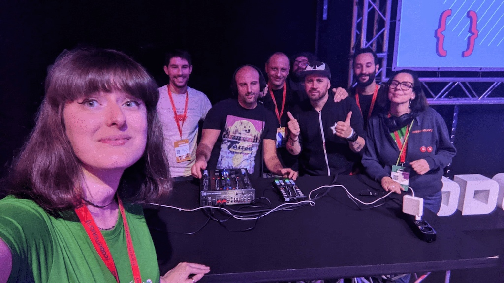

<small>In this picture some members of Codemotion and the Codemotion Ambassador team during the after-party at Codemotion Milan 2023. From left to Right: [Michela Bertaina](https://twitter.com/BertainaMichela), _a random guy_, [Mattia Tommasone](https://www.linkedin.com/in/raibaz/) _a.k.a. "Mr. DJ"_,  [Gabriele Santomaggio](https://twitter.com/GSantomaggio), [Francesco Sciuti](https://twitter.com/FrancescoSciuti) _a.k.a. "Batman"_, [Emanuele Bartolesi](https://twitter.com/kasuken) _a.k.a "The Machine"_, [César Alberca](https://twitter.com/cesalberca), [Mara Marzocchi](https://twitter.com/Maraexceptioon).</small>

Thanks for having me in this awesome community! I look forward to contributing more to it in 2024!

... Also, a tiny extra thank you to Emanuele Bartolesi for reminding me to write this post! 😝

> The future of every community lies in capturing the passion, imagination, and resources of its people.
>
> — Ernesto Sirolli

## Some random personal stuff

Now, onto some other more personal achievements of 2023 🦸🏻

- After 2 years pandemic hiatus from Brazilian Jiu Jitsu (BJJ), this year I finally restarted my training and towards the end of the year, I received the grade of **purple belt**! 🥋
- I took a wonderful road trip **visiting some of the most iconic national parks in California, Arizona, Utah and Nevada** with my wife and it was probably the best trip I (and we) ever had so far! ❤️
- Kept **running** (even though less regularly than I did in the last 2 years) totaling **~160Km in 27 runs**. 🏃

<small>One of my pictures from a visit to the Horseshoe Bend, a horseshoe-shaped incised meander of the Colorado River located near the town of Page, Arizona, United States</small>

> Enjoy the little things in life, for one day you may look back and realize they were the big things.
>
> — Robert Breault

## Wrapping up

That's all folks!

I am impressed to see that you got this far. Maybe it wasn't as boring as I had imagined 😇

It's great to reflect on everything that happened in 2023 and start to think about what to invest my time and energies in 2024. I am not sure what the future holds, but I am sure it will be fun and exciting!

What about you? What did you achieve in 2023 (or missed)? What's your masterplan (if any) for 2024? I hope I'll be reading about it in your own year in review post or in the comments below! 😉

Bye 👋