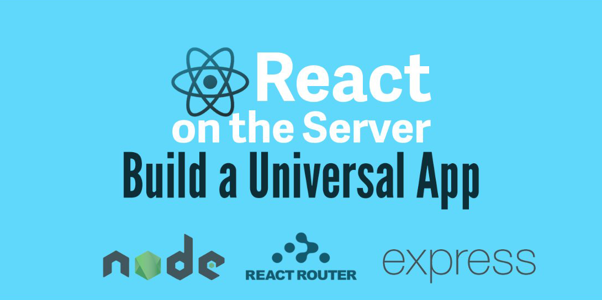

I recently wrote a new article in collaboration with one of my favourite web development websites: the amazing [Scotch.io](https://scotch.io/).

The article talk about using [React](/tag/react) both on client and on the server (with [Node.js](/tag/node-js)) in an attempt to build a simple "Universal JavaScript" (a.k.a "Isomorphic") application.

The application is called "Judo Heroes" ([did you even noticed recently that I'm kind of fond of Judo?](http://loige.co/extracting-data-from-wikipedia-using-curl-grep-cut-and-other-bash-commands/)) and it showcases some of the best Judo athletes for their number of medals won during the Olympic Games and in other important international tournaments.

If you are curious you can [check out the live demo](https://judo-heroes.herokuapp.com/) or [have a look at the source code on GitHub](https://github.com/lmammino/judo-heroes).

Then, if you want to follow the tutorial, you should definitely read the article on scotch:

[React on the Server for Beginners: Build a Universal React and Node App](https://scotch.io/tutorials/react-on-the-server-for-beginners-build-a-universal-react-and-node-app)

In this article we are going to learn how to build a simple "Universal JavaScript" application (a.k.a. "Isomorphic") using **React**, **React Router** and **Express**. We will also use some **Webpack** and **Babel** to leverage the latest **ES2015** Syntax.

Enjoy it and feel free to leave your comments here or on the original article.

Cheers!
