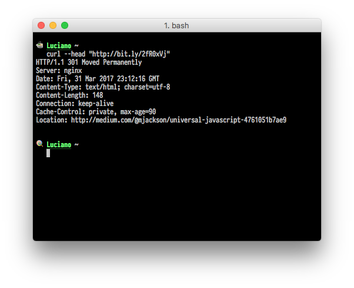

Short URLs have been an invaluable tool for social media marketing for so many years and we are now used to seeing them everywhere. Most of the credit probably goes to _URL shorteners_ services like [Bit.ly](https://bitly.com), [Goo.gl](https://goo.gl/), [YOURLS](https://yourls.org/) and [Rebrandly](https://www.rebrandly.com) that popularised the concept and made easy for everyone to start creating short URLs.

When working with URLs in some automation scenarios like analytics, information crawling, data retrieval, etc. it can be important to _resolve_ (or "_unshorten_" or "_expand_") short URLs, which means retrieving the original long URL.

In this article, we are going to see how short URLs work and how we can "expand" them into their original URL.

## How short URLs work

A short URLs is a regular URL that most of the time results very short by following a very simple format:

```plain
http://<domain>/<id>
```

The shorter the `domain` and the `id` (often called also `slashtag`), the shorter will, of course, be the URL (e.g. [`http://loige.link/b`](http://loige.link/b)).

What happens behind the scene of an URL shortener service is that there is a big database table that contains a map of all the existing short URLs and the related full-length URLs.

A URL shortener service lookup table might look like the following:

```plain
+------------+------------+---------------------------------------+
| domain     | id         | url                                   |
+------------+------------+---------------------------------------+
| loige.link | b          | https://www.nodejsdesignpatterns.com/ |
+------------+------------+---------------------------------------+
| loige.link | gh         | https://github.com/lmammino           |
+------------+------------+---------------------------------------+
| rebrand.ly | luciano-tw | https://twitter.com/loige             |
+------------+------------+---------------------------------------+
| ...        | ...        | ...                                   |
+------------+------------+---------------------------------------+
```

Note that in this example the table supports multiple domains and that the pair `domain`-`id` must be unique in the table.

URL shorteners have to expose a web server which will be reached through all the domains mapped (in fact, most of the URL shortener services — like Rebrandly — supports different domains or even the possibility to associate your own branded domain).

For every request that satisfies the short URL format, `domain` and `id` are extracted and a query is executed against the database to search for the corresponding long URL. Finally, if a match is found, the web server responds with a redirect message, sending the browser of the user to the corresponding long URL.

## Resolving short URLs

URL shorteners need to talk with browsers so they have to work as any other web server adopting the HTTP standard. The following diagram illustrates how the HTTP protocol is used when a user clicks a short URL:


1. A user clicks on a short URL and the browser issues a **GET** request to that URL.
2. The request hits the short URL service server which executes a look-up on its database to find the associated long URL. The long URL is returned as a redirect response to the user browser which means an `HTTP 301 Moved Permanently` response using the header `Location` to specify the new (long) URL.
3. The browser automatically follows the redirect response issuing a new **GET** request to the long URL displaying the content of that URL to the user.

This is what happens when a user through a browser deals with a short URL, everything happens behind the scenes and the user won't even notice that there was an exchange with a short URL server.

Simple enough, right?

## Resolving short URLs in Node.js

Now that we know how short URL services work, it shouldn't be hard to create a Node.js script that is capable of resolving any type of short URL.

```javascript
var request = require('request')

var uri = 'http://bit.ly/2fR0xVj'
request(
  {
    uri: uri,
    followRedirect: false,
  },
  function(err, httpResponse) {
    if (err) {
      return console.error(err)
    }
    console.log(httpResponse.headers.location || uri)
  }
)
```

For simplicity, in this script, we are using the [`request` module](https://www.npmjs.com/package/request) to perform the HTTP request. By default, this library follows redirects so we need to explicitly disable this behaviour by specifying the option `followRedirect: false`. By doing so we have an opportunity to catch a redirect response in our callback and so we can read its `Location` header which will represent the expanded URL.

In case we are not dealing with a short URL, this script will print back the original URL passed to the function.

## A Promise-based, dependency free, Node.js library for expanding short URLs

You can easily adapt the code above to work with your specific use case, but if you want a ready-made and easy to use URL-unshortener NPM library you can trust a library I recently published called [`tall`](https://www.npmjs.com/package/tall).

`tall` is a dependency-free, promise-based library that allows you to easily resolve a short URL and get its corresponding long URL.

To understand how easy to use `tall` is, just check out this ES2015 sample usage:

```javascript
import { tall } from 'tall'

tall('http://www.loige.link/codemotion-rome-2017')
  .then(unshortenedUrl => console.log('Tall url', unshortenedUrl))
  .catch(err => console.error('AAAW 👻', err))
```

More examples are available on [the official repository](https://github.com/lmammino/tall).

## Bonus: Resolving short URLs with CURL

Of course, you can also use the evergreen CURL to issue the HTTP request for a short URL and then read the `Location` header to retrieve the long URL:

```bash
curl --head "http://bit.ly/2fR0xVj"
```

This will output something like this:



As you can see the `Location` header reports our long URL.

If you are a `bash` and _Unix_ lover you are probably already thinking to pipe this output to `grep` and other unix command line tools to extract only the long URL out of the full output. If you are curious about this kind of approach you can read a similar article I previously wrote titled "[Extracting data from Wikipedia using curl, grep, cut and other shell commands](http://loige.co/extracting-data-from-wikipedia-using-curl-grep-cut-and-other-bash-commands/)".

## Recap

In this simple article, we learned how short URL services work and thus how we can use them in a programmatic way if we need to know the associated long URL.

I hope this was interesting for you and that you had fun reading the article and the code examples.

As usual, I'd love to have your opinion and know if you plan to use this knowledge or the `tall` library in one of your next projects. Feel more than welcome to let me know this in the comments!

See you next time!
