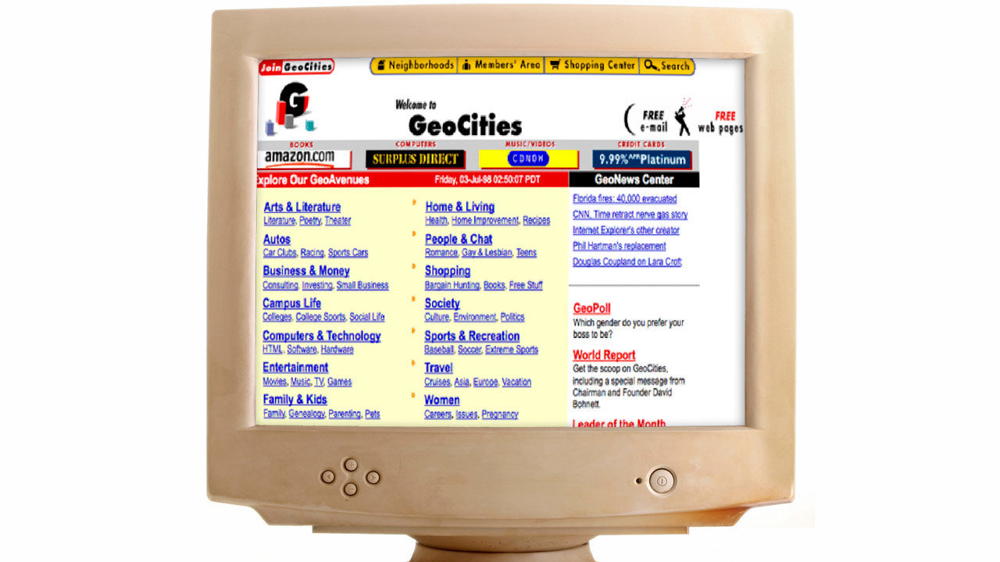
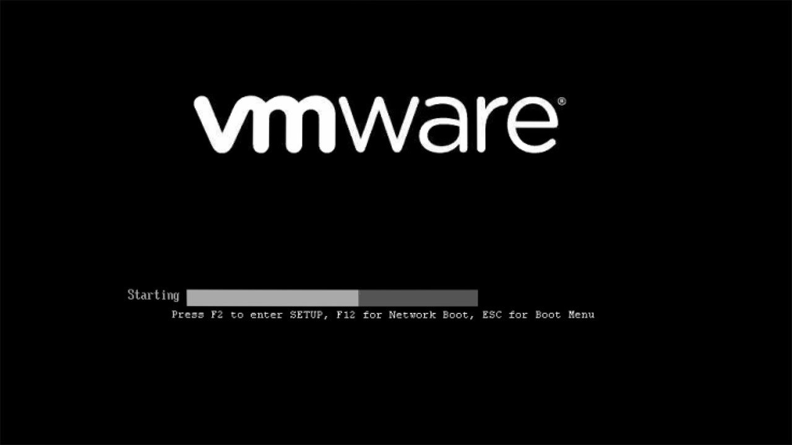
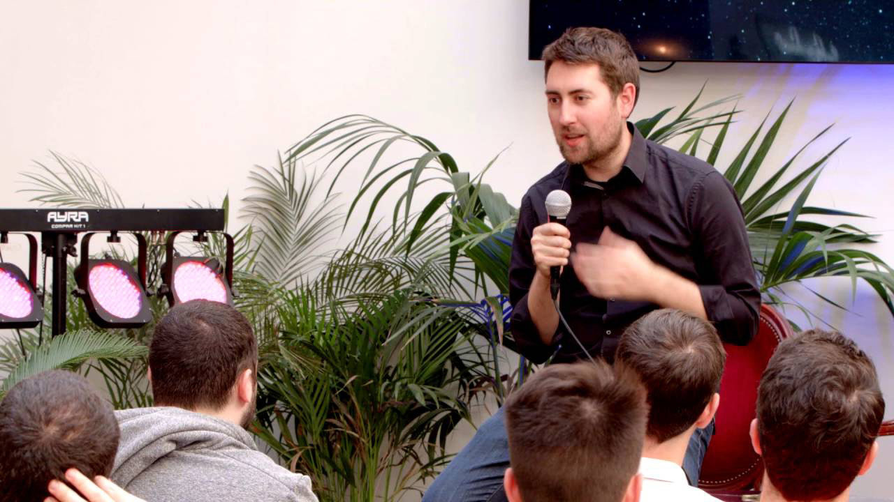
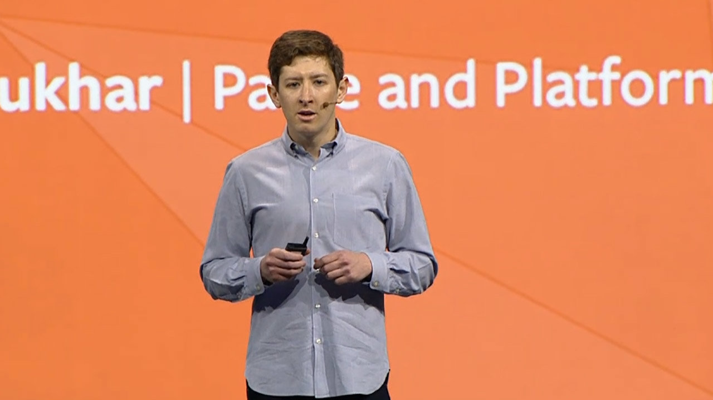
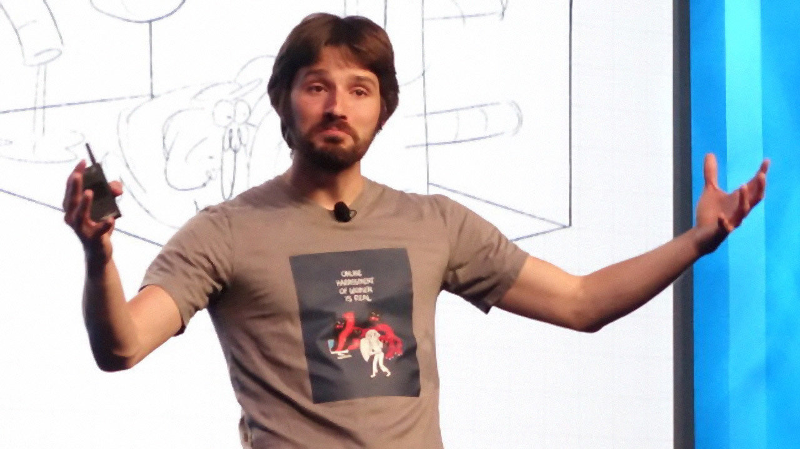
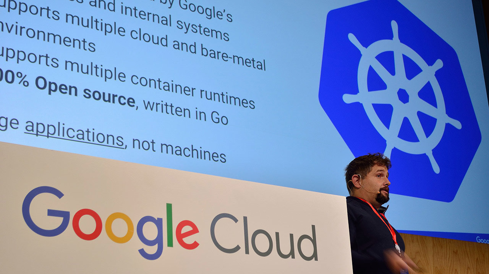
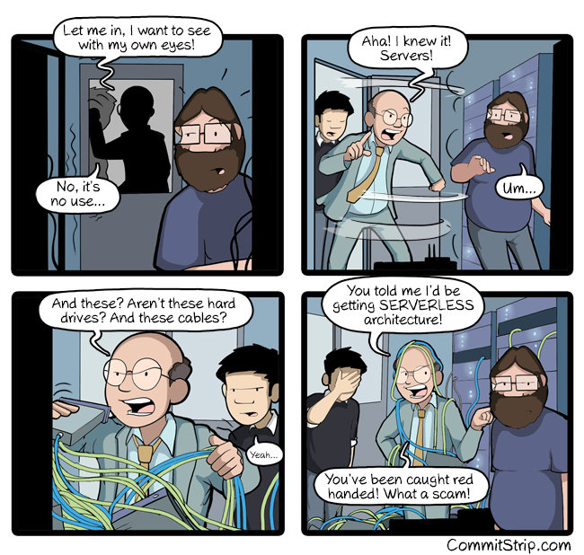

Lately, I tried to understand why modern cloud computing brought us to the idea (and growing adoption) of "Serverless".

In this article, I will illustrate the result of a small research I did about the history of Cloud computing from the age of _bare metal_ to _serverless_.

> "You have to know the past to understand the present.”  
> ― Carl Sagan

At the end of this article, I will also illustrate a definition of Serverless and what are its main characteristics.

## The invention of the web

This story starts with [Sir Tim Berners Lee](https://en.wikipedia.org/wiki/Tim_Berners-Lee), the guy who officially invented the World Wide Web in 1989.

At the beginning, the web was just a simple publishing platform for researchers to share information and publish papers. The first website was actually the CERN website, published in 1991.

The web quickly evolved and grew up out of the research space, to become one of the most mainstream and ubiquitous products of the last decades.

## The bare metal age

During the first years of the web, publishing a website wasn't very easy. We are talking about a period that goes roughly from 1991 to 1995.

At that time you literally had to buy your server machine, configure it, connect it to a stable electricity line and to an internet connection and then run a web server on it. You had to take care of every single aspect of making that server always available.

Can you imagine the effort required when you needed to scale your service and adopt many servers?

## The invention of web hosting

During 1995, the idea of the web hosting was popularised by platforms like [GeoCities](https://en.wikipedia.org/wiki/Yahoo!_GeoCities).

Web hosting allowed everybody to publish web pages directly on shared servers at a very low cost (sometimes even for free), removing from the publisher all the struggle and the costs needed with the bare metal approach.

Although web hosting was cheap and easy, most of the time it was very limited and it was possible to publish only static files (HTML, images, etc.) through FTP. Later on, web hosting improved supporting dynamic languages like Perl and PHP and databases like MySQL.

## Grid computing

Around 1997, thanks to the astonishing work of the University of Chicago and the Argonne National Laboratory, that together founded the [Globus Alliance](https://en.m.wikipedia.org/wiki/Globus_Alliance), the idea of _Grid computing_ was formalized.

In a paper titled _"Globus: A Metacomputing Infrastructure Toolkit"_ by Ian Foster (in the picture) and Carl Kesselman, a new idea of computing, defined _metacomputing_, was formalized and finally made famous:

> **Metacomputing**: a networked virtual supercomputer, constructed dynamically from geographically distributed resources linked by high-speed networks.

Metacomputing is the foundation for Grid Computing which is generally recognized as the collection of computer resources from multiple locations to reach a common goal. The grid can be thought of as a distributed system with non-interactive workloads that involve a large number of files and tasks.

Grid computing was important for the history of the cloud because it shifted the perception on the power of distributed computing. It was the demonstration that the world didn't need a single supercomputer in order to solve complex problems, because a well-knitted network of ordinary computers can be orchestrated to achieve complex goals or to sustain sophisticated services.

## Software as a Service (SaaS)

In 1999 the web was starting to evolve into something more complex, Amazon.com was already a thing and it was already possible to build complex interactions with the users through the browser.

Marc Benioff of Salesforce was one of the first public figures to strongly state the desktop software wasn't needed anymore and it could have been replaced by software written to work directly on the web through a web browser.

This principle, lead in the following years to the definition of _Software as a Service_ (SaaS) and it was probably the reason why the web started to play a bigger role, not only as a publishing platform but as a complete runtime to execute all sorts of applications and games.

## Server virtualization

In 2001, VMWare releases ESXi and server virtualization becomes a thing.

With server virtualization, it's possible to divide one physical server into multiple isolated virtual environments.

This way the provider can allocate a number of physical machines in advance in their server farms to create a virtual infrastructure in which a new virtual machine (with variable characteristics) can be initialized and provided as a service in a matter of minutes.

This approach is way more convenient and flexible than the bare metal one.

Interesting thing is that virtualization was a thing way back in the history of computing. For example, CP-40 was a research project back in 1964 that ran on the 360. IBM released a product from that called VM in 1972. This eventually turned into z/VM, which has a long line of products before it.

## Infrastructure as a service (IaaS)

From 2002 and 2006 Amazon Web Services, a company spawn up by the opportunity that Amazon saw with renting part of their massive compute power, undergo 3 different "official launch" events.

Only after the 3rd launch, AWS found the right proposition to developers and started to build up significant traction. This successful launch defined the term _Infrastructure as a Service_.

At the time AWS offer constituted by EC2 (Virtual Machine service), S3 (Scalable storage service) and SQS (message queuing system).

In the years to come, AWS and the competing IaaS platforms would have been associated with the idea of _"Cloud Computing"_.

## Platform as a Service (PaaS)

Heroku was developed by James Lindenbaum, Adam Wiggins (in the picture) and Orion Henry in 2009.

Heroku was originally born as an attempt to create an online editor for Ruby on Rails, but it quickly found it's _product-market fit_ as a complete platform to deploy and scale Ruby web applications. Support later increasingly extended to all the main languages and frameworks in the market.

Heroku defined the idea of _Platform as a Service_ (PaaS) and it was so successful that Salesforce acquired the company and hired Yukihiro Matsumoto, the inventor of Ruby, as Chief Architect a few years later.

## Database as a service

Firebase evolved from Envolve, a prior startup founded by James Tamplin (in the picture) and Andrew Lee in 2011.

The main idea of Firebase was to provide a real-time database as a service through a dedicated SDK that could be easily integrated with websites and mobile applications.

This was one of the first successful instances where a database could have been used with a pay-per-use model.

Firebase was so successful that a few years later it was acquired by Google and evolved again into a complete platform for supporting the development of mobile apps.

Little curiosity: for some reason nobody (as far as I am aware) tried to come up with a short name such as _DBaaS_ or _RTDBaaS_!

## Backend as a service (BaaS)

Parse was founded in 2011 by Tikhon Bernstam, Ilya Sukhar (in the picture), James Yu, and Kevin Lacker.

The firm produced a series of back-end tools for mobile developers to store data in the cloud, manage identity log-ins, handle push notifications and run custom code in the cloud. This kind of product was known at the time as _Backend as a Service_ (Baas).

The company was later on acquired by Facebook that kept it running for a while and then it shut it down. The product was consequently [released](http://parseplatform.org) with an open source license and can be installed on-premise.

## Containerization

Docker, launched in 2013 at pyCon by Solomon Hykes, provides an additional layer of abstraction and automation of operating-system-level virtualization on Windows and Linux.

Docker can be used as a way to package applications so that they can be easily executed on various servers without having to worry about the underlying infrastructure.

The funny story is that docker was originally created as a way to abstract the underlying infrastructure at dotCloud, a competitor of Heroku that a few years later bankrupted, while docker became a huge success and it is today adopted or supported by almost every cloud provider.

## Containers at scale

The launch of Docker was a blast and its potential was immense.

During the following years, a lot of companies (including Google and Hashicorp) started to invest a significant amount of money and energy to create solutions that leveraged docker to run containers on a large scale, like Kubernetes, Swarm, Nomad and CoreOs.

The idea was to use containers as an abstraction to run processes and applications over a cluster of virtual machines.

## Function as a Service (FaaS)

In 2014 AWS launched Lambda, a service that allowed to run "code", in the form of a function, directly in the cloud.

In Lambda the computation model is event based, which means that a function is executed only if a predefined event occurred.

This product popularised a new class of services called Function as a Service (FaaS).

With the advent of FaaS we started to hear the word "Serverless" for the first time.

## What is Serverless

Trying to define what Serverless actually means is always a bit tricky, so I prefer to give you two definitions by two acclaimed industry leaders in this field.

The first lengthy definition comes straight from Amazon Web Services:

> "Serverless most often refers to **serverless applications**. Serverless applications are ones that **don't require you to provision or manage any servers**. You can **focus on your core product and business logic** instead of responsibilities like operating system (OS) access control, OS patching, provisioning, right-sizing, scaling, and availability. By building your application on a serverless platform, the platform manages these responsibilities for you."
>
> — [Amazon Web Services](http://loige.link/serverless-apps-lambda)

A much more concise one (that I prefer) comes from Auth0:

> The essence of the serverless trend is the absence of the server concept during software development.
>
> — [Auth0](http://loige.link/what-is-serverless)

I hope you got the point. Serverless doesn't mean that there are no servers, of course, there's a server somewhere, but as a developer, you don't get to worry about it and you can focus as much as possible on the business logic of the application you are working on.

<small>Picture from [commitstrip.com](https://commitstrip.com)</small>

## Why Serverless?

The history we explored so far is telling that our industry has always been looking for next higher level of abstraction. Developers need as fewer concerns as possible to be able to quickly release features and deliver value to the customers.

<small>Picture from [fullstackpython.com](https://www.fullstackpython.com/serverless.html)</small>

In this picture, Matt Makai from _fullstackpython_, illustrates exactly how levels of abstraction and platforms were created to keep removing complexity and leave more time for the actual business value that the app has to provide.

Serverless today is the highest level of abstraction we have. It is not perfect and there are strong trade-offs that a developer has to embrace in order to adopt it, but it definitely removes tons of concerns on the infrastructure layer.

## The 4 pillars of Serverless

There are other characteristics that come with Serverless and that make it a valuable option. It's definitely not only about abstraction and the absence of servers...

- **No server management**: You don't know how many and how they are configured
- **Flexible scaling**: If you need more resources, they will be allocated for you
- **High availability**: Redundancy and fault tolerance are built in
- **Never pay for idle**: Unused resources cost $0

## Is it the right approach for the future?

My personal view, **probably yes**!

Like any other abstraction, Serverless comes with some strong trade-offs (vendor lock-in, steep learning curve, cold start problem, soft/hard limits, etc.), but it allows us, as developers, to focus more and more on building and releasing value as fast as possible.

We live in a time where the competition on the web is at its highest, there is practically no decent idea that somebody else is not already attempting to implement (or that have already successfully implemented!) and it is critical to be able to be on the market quickly and be able to iterate and improve a product efficiently.

Serverless can give you the needed agility to compete in this market for most of the cases, but you have to be willing to learn it and embrace its trade-offs.

It's probably not the ultimate solution and I believe there will be other abstraction layers and new platforms in the future, but agility and focus on business logic are definitely some things that we will always want in our future as developers.

## References

This article was possible only thanks to these amazing resources:

- [World Wide Web Foundation, history of the web](http://webfoundation.org/about/vision/history-of-the-web/)
- [Web hosting on Wikipedia](http://en.wikipedia.org/wiki/Web_hosting_service)
- [The history of web hosting: how things have changed since Tibus started in 1996](http://loige.link/web-hosting-history)
- [Grid computing on Wikipedia](https://en.m.wikipedia.org/wiki/Grid_computing)
- [Globus toolkit on Wikipedia](https://en.m.wikipedia.org/wiki/Globus_Toolkit)
- [Globus Alliance on Wikipedia](https://en.m.wikipedia.org/wiki/Globus_Alliance)
- [Globus: A Metacomputing Infrastructure Toolkit (slides)](http://ssltest.cs.umd.edu/class/spring2004/cmsc818s/Lectures/Globus.pdf)
- [The Anatomy of the Grid: Enabling Scalable Virtual Organizations (paper)](http://journals.sagepub.com/doi/abs/10.1177/109434200101500302)
- [Computer weekly, the history of Cloud Computing](http://computerweekly.com/feature/A-history-of-cloud-computing)
- [Brief history of Salesforce.com](http://salesforceben.com/brief-history-salesforce-com)
- [With long history of virtualization behind it, IBM looks to the future](https://www.networkworld.com/article/2254433/virtualization/with-long-history-of-virtualization-behind-it--ibm-looks-to-the-future.html)
- [About Amazon Web Services (official)](http://aws.amazon.com/about-aws)
- [Fullstack python: What is Serverless](http://fullstackpython.com/serverless.html)
- [Parse (platform) on Wikipedia](<http://en.wikipedia.org/wiki/Parse_(platform)>)
- [Firebase on Wikipedia](http://en.wikipedia.org/wiki/Firebase)
- [Kubernetes on Wikipedia](http://en.wikipedia.org/wiki/Kubernetes)
- [CoreOS on Wikipedia](http://en.wikipedia.org/wiki/Container_Linux_by_CoreOS)
- [AWS Lambda on Wikipedia](http://en.wikipedia.org/wiki/AWS_Lambda)
- [Serverless Computing on Wikipedia](http://en.wikipedia.org/wiki/Serverless_computing)
- ["AWS Serverless Applications Lens" white paper (pdf)](http://loige.link/aws-serverless-lens)
- ["Serverless Architectures with AWS Lambda" white paper (pdf)](http://loige.link/serverless-apps-lambda)
- [AWS Lambda VS the World](http://start.jcolemorrison.com/aws-lambda-vs-the-world)
- [Serverless: Looking Back to See Forward](http://m.subbu.org/serverless-looking-back-to-see-forward-74dd1a02cb62)
- [Awesome Serverless (GitHub repository)](http://github.com/anaibol/awesome-serverless)
- [Discussion about this article on Lobste.rs](https://lobste.rs/s/pehagh/from_bare_metal_serverless)

Also, I had the pleasure to discuss this topic in the recent [FrontConf 2017](https://frontconf.com) in Munich in a presentation titled "The future will be SERVERLESS". Feel free to check out [the slides deck](http://loige.link/serverless-future) and give me your precious feedback.
