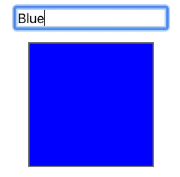

In this article I want to explore an interesting pattern that I am seeing more and more in JavaScript code which allows you to return multiple values from a function.

You probably know already that JavaScript does not support multiple return values natively, so this article will actually explore some ways to "simulate" this behavior.

One of the most famous usages of this pattern I have seen recently is within [React Hooks](https://reactjs.org/docs/hooks-overview.html), but before delving into that, let's see what I mean with "multiple return values" by exploring this concept in other languages.

## Multiple return values in other languages

Two languages that come to my mind which natively support multiple return values are Lua and Go. Let's implement a simple _integer division_ function that returns both the _quotient_ and the _remainder_.

### Lua

Let's start with a simple implementation in Lua. It's definitely worth mentioning that [Lua's official documentation](https://www.lua.org/pil/5.1.html) defines multiple return values as _"An unconventional, but quite convenient feature"_:

```lua
function intDiv (dividend, divisor)
  local quotient = math.floor(dividend / divisor)
  local remainder = dividend % divisor
  return quotient, remainder
end

print(intDiv(10,3)) -- 3	1
```

### Go

Here's some equivalent code in Go:

```go
package main

import "fmt"

func intDiv(dividend, divisor int) (int, int) {
  quotient := dividend / divisor
  remainder := dividend % divisor
  return quotient, remainder
}

func main() {
  fmt.Println(intDiv(10,3)) // 3 1
}
```

As you can see in these 2 code snippets, functions can return more than 1 value and this can be very convenient in cases where you logically have produce multiple outputs in a computation.

**Note**: a more realistic implementation in Go, would take into account errors (e.g. division by 0) and add an extra return value to propagate potential errors. We shouldn't worry too much about this for the sake of this article, but is definitely worth mentioning that multiple return values in Go shine when it comes to error propagation and error handling. We will touch a bit more on this later in this article, to see how this idea can be applied to JavaScript as well, especially in the context of Async/Await.

## Simulating multiple return values in JavaScript

So, as we said early on, JavaScript does not natively support a syntax to return more than one value from a function, so we need to workaround this limitation by using _composite values_ like arrays or objects.

### Multiple return values with arrays

Let's implement our `intDiv` in JavaScript by using arrays as return types:

```javascript
intDiv = (dividend, divisor) => {
  const quotient = Math.floor(dividend / divisor)
  const remainder = dividend % divisor
  return [quotient, remainder]
}

console.log(intDiv(10, 3)) // [ 3, 1 ]
```

Here we are just printing the result of a division, but let's assume we want to handle the two return values individually, how do we _reference_ those?

Well, the return value is an array so we can simply access the two elements in the array using the indices `0` and `1`:

```javascript
const result = intDiv(10, 3)
const quotient = result[0]
const remainder = result[1]
console.log(`Quotient = ${quotient}`) // Quotient = 3
console.log(`Remainder = ${remainder}`) // Remainder = 1
```

This syntax is arguably verbose and definitely not very elegant. Thankfully, [ES2015 array destructuring assignment](https://developer.mozilla.org/en-US/docs/Web/JavaScript/Reference/Operators/Destructuring_assignment) can help us here:

```javascript
const [quotient, remainder] = intDiv(10, 3)
console.log(`Quotient = ${quotient}`) // Quotient = 3
console.log(`Remainder = ${remainder}`) // Remainder = 1
```

This is much nicer to read and we also trimmed away 2 out 3 lines of code, big win!

As nice as it is, this implementation has an important shortcoming: return values are positional, so you need to be careful and respect the order while destructuring.

### Multiple return values with objects

An alternative implementation could use objects as return value, let's see how:

```javascript
intDiv = (dividend, divisor) => {
  const quotient = Math.floor(dividend / divisor)
  const remainder = dividend % divisor
  return { quotient, remainder }
}
```

Note that here we are using another syntactic sugar from ES2015 (Enhanced object literal syntax) that allows us to define objects very concisely. Prior to ES2015 we would have needed to change the return statement to `{quotient: quotient, remainder: remainder}`.

With this approach we will be able to use our `intDiv` function as follows:

```javascript
const result = intDiv(10, 3)
const quotient = result.quotient
const remainder = result.remainder
console.log(`Quotient = ${quotient}`) // Quotient = 3
console.log(`Remainder = ${remainder}`) // Remainder = 1
```

Again, this is a bit too verbose and ES2015 has another fantastic syntactic sugar to make this nicer:

```javascript
const { quotient, remainder } = intDiv(10, 3)
console.log(`Quotient = ${quotient}`) // Quotient = 3
console.log(`Remainder = ${remainder}`) // Remainder = 1
```

This syntactic sugar is called [Object Destructuring Assignment](https://developer.mozilla.org/en-US/docs/Web/JavaScript/Reference/Operators/Destructuring_assignment#Object_destructuring). With this approach we are now independent from the position of return values (we can swap the position of `quotient` and `remainder` without side effects). This syntax also lets you rename the destructured variables, which can very useful to avoid name collisions with other local variables, or just to make variable names shorter or more descriptive as we please. Let's see how this works:

```javascript
const { remainder: r, quotient: q } = intDiv(10, 3)
console.log(`Quotient = ${q}`) // Quotient = 3
console.log(`Remainder = ${r}`) // Remainder = 1
```

Ok, now you should have a good idea on how to simulate multiple return values in JavaScript. In the next section we will see some more realistic examples that take advantage of this pattern.

## Some more realistic use cases

As mentioned early on, this technique has been recently popularized by React hooks, so we are gonna explore this use case first. Later we will see other two cases related to Async/Await.

### React Hooks

React hooks are a [new feature proposal](https://reactjs.org/docs/hooks-overview.html) available from _React v16.7.0-alpha_ that lets you use state and other React features without having to write a class.

The first and most famous React hook present is called **State Hook**.

Let's see how it works with an example, let's build a CSS color viewer component.

Here's how our component is going to look like:



And here's the code used to implement this:

```javascript
import { useState } from 'react'

function CssColorViewer() {
  const [cssColor, setCssColor] = useState('Blue')
  //                          <-- multiple return values

  const onCssColorChange = e => {
    setCssColor(e.target.value)
  }

  return (
    <div>
      <input value={cssColor} onChange={onCssColorChange} />
      <div
        style={{
          width: 100,
          height: 100,
          background: cssColor,
        }}
      />
    </div>
  )
}
```

You can see this component in action and play with the code on [CodeSandbox](https://codesandbox.io/s/9lzyov54lr).

For the sake of this article, we are going to focus only on the `useState` call, but if you are curious to understand better how the hook itself works internally I really recommend you read the [official State Hook documentation](https://reactjs.org/docs/hooks-state.html). I was personally curious to understand how multiple `useState` calls could maintain the relationship with the specific state variable (since there's no explicit labelling or reference). If you are curious about that too, well you should read the [Hooks FAQ](https://reactjs.org/docs/hooks-faq.html#how-does-react-associate-hook-calls-with-components) and [Dan Abramov's recent article about Hooks](https://medium.com/@dan_abramov/making-sense-of-react-hooks-fdbde8803889).

Back to the `useState` call in our example, now!

The `useState` hook acts like a factory: given a default value for the state property (`'Blue'` in our case), it will need to instantiate for you 2 things:

- the current value for the specific state property (`cssColor` in our case)
- a function that allows you to alter the specific property (`setCssColor` in our case)

React developers decided to handle this requirement by simulating multiple return values with an array.

Combining this with array destructuring and proper variable naming, the result is an API that is very nice to read and to use.

This React feature is still very experimental and subject to change at the time of writing, but it already sounds like a big deal for the React community to make the code more expressive and enjoyable.

The point I want to make is that the multiple return values pattern here plays a big role for this goal.

### Converting callbacks API to Async/Await

...

### Async/Await alternative error handling

...

## Performance implications

https://docs.google.com/document/d/1hWb-lQW4NSG9yRpyyiAA_9Ktytd5lypLnVLhPX9vamE/edit

...

## Recap

...

https://rosettacode.org/wiki/Return_multiple_values
