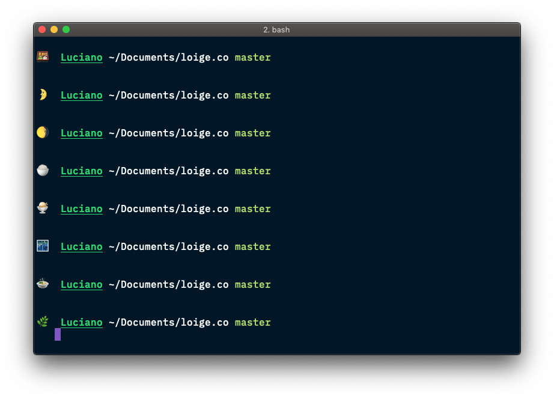

In this article, we will see how to customize our terminal prompt and add a random emoji in it.

This is my terminal prompt:

If I could have a penny every time somebody asked me how did I put a random emoji there, well... I wouldn't probably be a millionaire, but I would definitely be able to afford few more coffees every day!

In this article I'll explain how I achieved this and, since is very simple stuff, I'll try also to explore some few extra details on how to customize your bash prompt.

...
