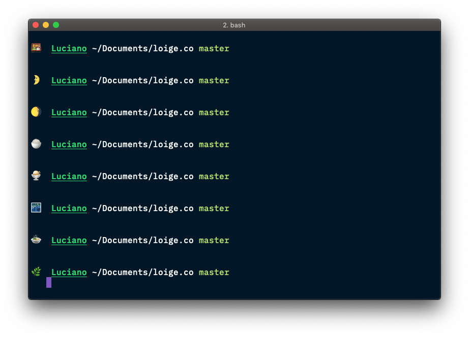
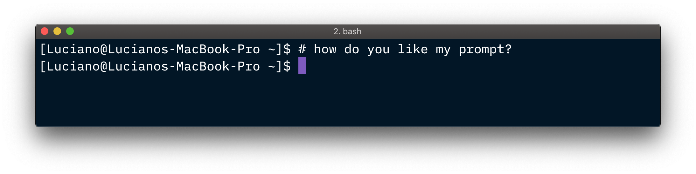
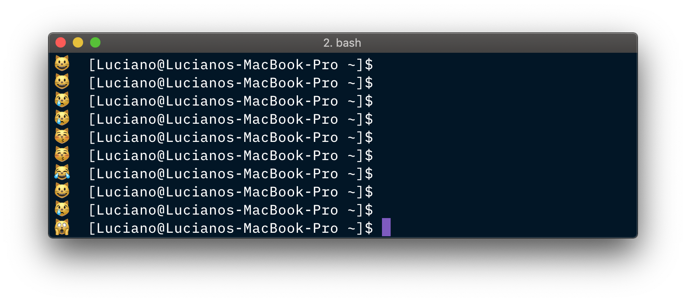
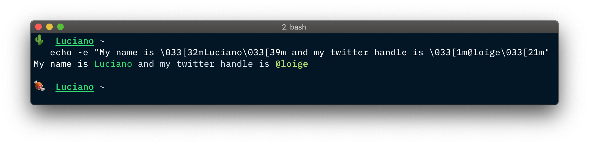

In this article, we will see how to customize our terminal prompt and add a random emoji in it.

This is my terminal prompt:



If I could have a penny every time somebody asked me how did I put a random emoji in there, well... I wouldn't probably be a millionaire, but I would definitely be able to afford few more coffees every day and be less sleepy 😴!

In this article I'll explain how I _emojified_ my terminal and, since it is very simple stuff, I'll also try to explore some extra details on how to customize your bash experience.

## Bash config

Bash customizations are generally made in a file saved in the user home directory. This file is generally called `.bashrc` (more common on Linux systems) or `.bash_profile` (more common on MacOS). This file is essentially a Bash script file that gets loaded every single time you open a terminal session.

Here's an example of a possible `.bashrc` file:

```bash
# Source global definitions
if [ -f /etc/bashrc ]; then
	. /etc/bashrc
fi

# various command shortcuts
alias og='ls -ogrt'
alias ll='ls -al'
alias lc='ls -C'
alias dir='ls -lrt' # in case you are a MS-DOS lover :P
alias h='history'
alias p='pwd -P'  # shows the "real" path in bash, not the path via symlinks
alias et='emacs-tty'
alias python=python2.7

# environment
export PS1='[\u@\h \W]$ ' # Set the command prompt!
export HOST=`uname -n`
export EDITOR=vim
export PATH=$HOME/bin/:$PATH
```

As you can see, this script has the only goal of setting up your bash environment. For instance, you can load other configuration files (here we load a global configuration if it is available). You can define shortcuts and aliases for common commands. Finally, you can export environment variables, for instance to define your default text editor or to modify/extend your `PATH` (a list of directories where to look for executable commands).

## The PS1 variable

We briefly touched on `PATH` and `EDITOR`. There are many other _special_ variables in Bash that can be used to customize the look and feel and the behavior of your terminal.

One of those variables (the most important in this article) is called `PS1`. If I were a betting man, I would bet that the name stands for `Prompt Style 1`, as it allows you to define the look and feel of the primary bash prompt format, but I am not actually sure what it stands for (if you know it, please let me know in the comments).

In the configuration example above we are defining the `PS1` variable as follows:

```bash
export PS1='[\u@\h \W]$ '
```

Which, in my personal laptop, renders like this:



At this point, you are probably already grasping how this works. The `PS1` variable acts as a template, where special _escape sequences_ like `\u` and `\h` can be used to indicate _"replace this with my actual username (and hostname)"_.

There are several sets of escape sequences that might be supported on different operative systems and different types of console, but here's a list of the most common and widely supported escape sequences:

- `\a`: an ASCII bell character (07)
- `\d` the date in "Weekday Month Date" format (e.g., "Tue May 26")
- `\h` the hostname up to the first `.'
- `\H` the full hostname
- `\n` newline
- `\s` the name of the shell, the basename of $0 (the portion following the final slash)
- `\t` the current time in 24-hour HH:MM:SS format
- `\T` the current time in 12-hour HH:MM:SS format
- `\@` the current time in 12-hour am/pm format
- `\u` the username of the current user
- `\w` the current working directory
- `\$` if the effective UID is 0, a #, otherwise a $ (used to distinguish whether you are root or not)
- `\\` a backslash
- `\[` begin a sequence of non-printing characters, which could be used to embed a terminal con­ trol sequence into the prompt
- `\]` end a sequence of non-printing characters

For more comprehensive lists checkout:

- [ANSI escape code](https://en.wikipedia.org/wiki/ANSI_escape_code)
- [Bash Prompt Escape Sequences](http://tldp.org/HOWTO/Bash-Prompt-HOWTO/bash-prompt-escape-sequences.html)

> 👌 **Pro tip**: There's also a `PS2` variable, which is the secondary prompt displayed when a command needs more input (e.g. a multi-line command). This is generally set as `PS2='> '`.  
> Also `PS3` and `PS4` exist. Funny enough this is not a pun to PlayStation players... If you are curious to know what they are used for, Archlinux has a great [section on terminal prompts](https://wiki.archlinux.org/index.php/Bash/Prompt_customization#Prompts).

## The RANDOM variable

For our purpose, another useful Bash _special_ variable is `RANDOM`. Its goal is very simple, as the name suggests, it always evaluate to a different random value.

Try to run the following command multiple times to have a feeling for it:

```bash
echo $RANDOM
```

I just ran this command 5 times and this is the list of outputs I got:

- `31434`
- `25704`
- `32466`
- `10374`
- `29063`

To be more accurate, when using `$RANDOM`, we are not referencing a constant value or a variable, but an internal Bash function that returns a _pseudorandom_ integer in the range `[0-32767)` (`0` included, `32767` excluded).

This primitive is generally good enough when you need to do something random, like extracting an arbitrary element from an array.

Be careful though because this technique is not strong enough for security sensitive situations like generating an encryption key.

There are slightly more advanced use cases, for instance you might need to extract a random number over a smaller positive range. In such case you can use the _modulo operator_ and do something like this:

```bash
SMALLER_RANDOM=expr $RANDOM % 22
echo $SMALLER_RANDOM
```

This will print a number between `0` and `22` (excluded).

For other more advanced use cases check out the dedicated [$RANDOM section in the **Advanced Bash-Scripting Guide**](http://tldp.org/LDP/abs/html/randomvar.html).

## Bash arrays

In Bash, an array is a variable containing multiple values. Any variable may be used as an array and there is no maximum limit to the size of an array.

You can define an array in several different ways. You can assign the elements of an array one by one over different assignment statements:

```bash
A[0]=1
A[1]=2
A[2]=3
# ...
```

In a more generic fashion, you can assign a value in an given array index with the syntax `ARRAY[INDEX]=value`, where `INDEX` is an expression that is evaluated to a _non-negative integer_.

Of course there is a shorter version that allows you to initialize an array with multiple elements with a single assignment instructions:

```bash
A=(1 2 3)
```

When you want to read (_dereference_) a value out of an array you can do it this way:

```bash
echo ${A[2]} # 3
```

This will print `3` as Bash arrays are _zero-indexed_.

If you want to reference all the elements in the array you can do it as follows:

```bash
echo ${A[*]} # 1 2 3
```

or

```bash
echo ${A[@]} # 1 2 3
```

The elements in an array can be also strings and you don't need to wrap them in quotes (unless a string includes a space in it). For instance you can create the following array:

```bash
SPORTS=(Judo Jiu-jitsu 'Sicilian stick fighting')
```

To loop over the elements of an array:

```bash
for SPORT in "${SPORTS[@]}"
do
  echo $SPORT
done

# prints:
#
# Judo
# Jiu-jitsu
# Sicilian stick fighting
```

Finally, to get the length of an array you can use the following syntax:

```bash
echo ${#SPORTS[@]} # 3 (notice the "#" before the variable name)
```

There is a lot more you can do with arrays. This is enough for what we want to achieve in this article, but if you are curious you can checkout the [array section in the **Bash Beginners Guide**](http://tldp.org/LDP/Bash-Beginners-Guide/html/sect_10_02.html).

## Putting it all together

Ok, now that we know about Bash config, Bash `PS1` variable, Bash `RANDOM` and Bash arrays, we have enough knowledge to be able to render a random emoji in our terminal prompt.

Let's try to write a simple `.bashrc` file that can do that:

```bash
# .bashrc (or .bash_profile)

# declares an array with the emojis we want to support
EMOJIS=(😺 😸 😹 😻 😼 😽 🙀 😿 😾)

# selects a random element from the EMOJIS set
RANDOM_EMOJI () { 
  echo ${EMOJIS[$RANDOM % ${#EMOJIS[@]}]};
}

# declare the terminal prompt format
export PS1='$(RANDOM_EMOJI)  [\u@\h \W]$ '
```

This will look as follows in my machine:



Mission complete!

But wait, not so quick! Let's go over all the code once again to make sure we understand what's going on behind the scenes.

`EMOJIS` is just a simple array of strings, where every string is made up by just an emoji.

`SELECTED_EMOJI` is a dynamic value that gets initialized to a random emoji from the set of supported emojis (`EMOJIS`). This is the complicated part as it's a _one-liner_ made up by different expressions on the right-hand side of the assignment. Let's break it down:

- `${#EMOJIS[@]}` will be evaluated to the length of the `EMOJIS` array
- `$RANDOM % ${#EMOJIS[@]}` will calculate a random integer and normalize it to the number of elements in the `EMOJIS` array using the _modulo operator_, so this is essentially extracting a random index for the `EMOJIS` array.
- Finally we use the result of this expression to dereference a random element from the array and we assign it to `SELECTED_EMOJI`.

One last thing to notice is that in our `PS1` prompt formatting string we are referencing the `RANDOM_EMOJI` variable with the following syntax: `$(RANDOM_EMOJI)`.

Pretty neat, right?

## Bonus: bash formatting

You probably noticed that my prompt (as well as most people prompt) comes with some fancy colors and other formatting wonders like bold and underlined text.

Most terminals support different formatting options: bold, dim, underlined, blink, hidden, inverted and a number of different colors (for both background and foreground!).

This is done by prefixing the text with some special escape sequences.

To give you an example, let's have a look at this code:

```bash
echo -e "My name is \033[32mLuciano\033[39m and my twitter handle is \033[1m@loige\033[21m"
```

This will render as follows:



The way this works is by using a _special_ escape sequence, the `\033[` prefix sequence. This sequence can be parameterized to indicate the start or the end of different formatting options. The generic syntax is `\033[_FormatCode_m`, where `_FormatCode_` will be replaced with some value to indicate different formatting options.

In my previous example:

- `\033[32m` stands for "start color green"
- `\033[39m` stands for "start default color (color reset)"
- `\033[1m` stands for "start emphasis (or bold)"
- `\033[21m` stands for "reset emphasis (or end bold)"

Here is a table with different `_FormatCode_` values and their effect.

| `_FormatCode_` | Description      |
| -------------: | ---------------- |
|              1 | Bold             |
|              2 | Dim              |
|              4 | Underline        |
|              5 | Blink            |
|              8 | Hidden           |
|              0 | Reset all        |
|             21 | Reset bold       |
|             22 | Reset dim        |
|             24 | Reset underline  |
|             25 | Reset blink      |
|             28 | Reset hidden     |
|             39 | Default color    |
|             30 | Black            |
|             31 | Red              |
|             32 | Green            |
|             33 | Yellow           |
|             34 | Blue             |
|             35 | Magenta          |
|             36 | Cyan             |
|             97 | White            |
|             49 | Default bg color |
|             40 | Black bg         |
|             41 | Red bg           |
|             42 | Green bg         |
|             43 | Yellow bg        |
|             44 | Blue bg          |
|             45 | Magenta bg       |
|             46 | Cyan bg          |
|            107 | White bg         |

For more information about additional formatting options checkout [Bash tips: Colors and formatting](https://misc.flogisoft.com/bash/tip_colors_and_formatting).

Other ways to achieve similar formatting are [tput](http://unixhelp.ed.ac.uk/CGI/man-cgi?tput+1) and [terminfo](http://www.manpagez.com/man/5/terminfo/).

## Bonus 2: my actual PS1!

I keep [my `.bash_profile`](https://github.com/lmammino/dotfiles/blob/master/.bash_profile) public on GitHub (not because it's cool, but because this way I can easily clone it into different machines).

If you are curious you can see how my _bash-emojification_ is actually done or what else I put in my `PS1` variable or even some aliases I use.

Feel free to tell me what you think or ask questions about it in the comment box in this article.

## Bonus 3: A bash prompt generator

Of course there had to be a service online to help you with this stuff! It turns out there are many!
If you want to build your fancy Bash prompt in a _drag-and-dropppy_ or _clicky-clicky_ way, checkout these links:

- [.bashrc PS1 generator by Julien Ricard](http://bashrcgenerator.com/)
- [Easy Bash PS1 Generator by Josh Matthews](http://ezprompt.net/)

At this point, you should know enough to be able to build your own PS1 generator website! Maybe that's an idea for you next _hack-weekend_!

## Why all of this?!

In the title of this article I said "how and why", but if you have been careful you probably noticed I never really explained why you might want to go through all of this stuff!

Well, the real reason why you should care about this is because "why not?!"

Seriously, there isn't a very strong reason why this stuff is important, it is definitely fun and interesting but you might be a fantastic developer even without having all this knowledge (and without emojis in your terminal)!

Anyway, if this answer is not convincing you, I can actually prove that emojis in your terminal will make you more productive. Try to put a toilet (🚽) or a poop (💩) emoji in your list of supported emojis. Next time you'll mistype a command and you'll randomly see a poop emoji, I can assure you that you'll have a bit of fun, your morale will stay up and you'll hopefully keep pounding your way on the keyboard enjoying your work 😎.

Whether you believe me or not on this, I hope I'll see you soon in the next article 😜

Byez!
