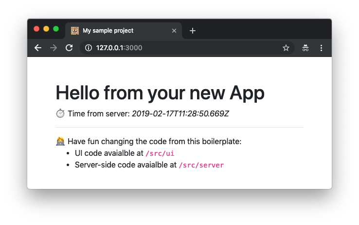

In this article I will show my setup to build and share web apps prototypes using **Fastify** and **Preact**, two technologies that I love.

I will also use **htm**, a library that can be easily integrated with Preact to be able to define DOM elements in a very expressive and react-like way (like _JSX_), without having to use _transpilers_ like Babel. Finally we will see how to _dockerize_ a sample app built with this setup. This will make the app easily to share with co-workers and friends.

I came up with this stack, few weeks ago when I had to build a very simple prototype web applications to test some product assumptions with some co-workers.

My experiment was quite successful. I was able to build my prototype quickly and it was super easy for my colleagues to play with it and give me feedback, even if they didn't have Node.js and NPM installed on their machines.

For these reasons, I think this approach is probably worth sharing and I look forward to receiving your feedback in case you decide to give this tech stack a try.

## TLDR;

If you know already **Fastify** and **Preact** and you are just looking for a quick way to get started with a stack based on these 2 technologies... well you just have to run the following commands:

```bash
git clone https://github.com/lmammino/fastify-preact-htm-boilerplate.git my-new-project
cd my-new-project
rm -rf .git
npm install
```

Of course, you can replace `my-new-project` with the actual name of your project.

Now enjoy editing the sample code in src:

- `src/ui`: is for your frontend (Preact + htm)
- `src/server`: is for your backend (Fastify)

Then run your project with:

```bash
npm start
```

And finally test it on `localhost:3000`.

Oh, yeah... most importantly, don't forget to [give me a ⭐️ on GitHub](https://github.com/lmammino/fastify-preact-htm-boilerplate)!

## Fastify

If you never heard of **Fastify**, it is a fast and low overhead web framework for Node.js.

Fastify is quite similar to **Express** or **Hapi**, but with more focus on performance, developer experience and composability. Fastify was initially created by [Tomas Della Vedova](https://github.com/delvedor) and [Matteo Collina](https://github.com/mcollina), but today it counts a core team of 10 people and more than 130 contributors on GitHub.

_Full disclosure_: I am a member of the core team and I mostly contribute with building and maintaining the Fastify website and its documentation.

## Preact

If you never heard of **Preact**, it is a UI library for the web, initially created as a lighter and faster drop-in alternative to React by [Jason Miller](https://github.com/developit).

The project has been quite successful and it's now co-maintained by [Marvin Hagemeister](https://github.com/marvinhagemeister) with more than 20.000 GitHub stars and 160 contributors.

One of the reasons why I like Preact, is that it has a pluggable view definition layer. Normally you would use it with **JSX** in combination with **Babel** for transpilation, but if you don't want to setup Babel and have a build process, you can use Preact in combination with [**htm**](https://github.com/developit/htm), which uses template literals and doesn't require any transpilation on modern browsers.

We are going to use htm in this article, so hold your horses... you'll see some examples soon!

## Project overview

So, you want to follow along and build this stack from scratch, very well!

Our goal will be to build a simple web app that displays the server time at startup.

Just to give you a more concrete idea, this is more or less how it is going to look when completed:



This is a Single Page Application (SPA) where Preact and htm are used to build the fronted App, while Fastify is used to build the _server time API_.

By the way, I am sure you noticed that lovely favicon in the screenshot above... Here's a zoomed-in version, just for your personal enjoyment!


## Backend setup

...

```bash
npm init -y
npm i --save fastify@next fastify-static@next fastify-cli
```

...

## Frontend setup

...

## Dockerize all the things

...

## What is missing

...

## Conclusion

...
