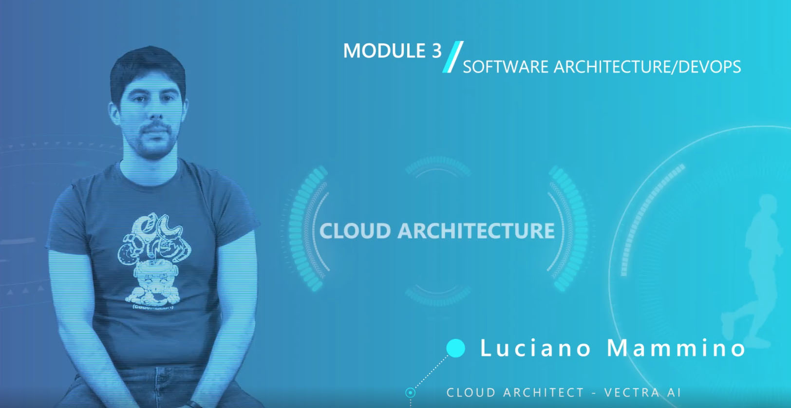
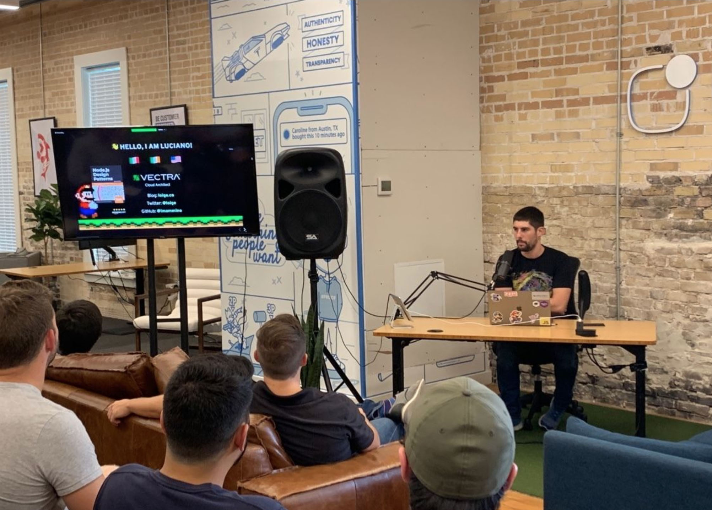

A little bit later than I expected over the new year, but here we are again, with my usual introspective post to figure out how the hell did the last year went and how to make the best out of the new year.

This is going to be boring (again I do this kind of posts selfishly only for myself), so brace yourself if you really want to keep going on this!

## Tech Leadership Training

Possibly the biggest achievement of last year was my contribution as a teacher to the [Tech Leadership Training - Taking you from Developer to CTO](https://www.codemotion.com/learning/tp/tech-leadership-training-program-26) organised by Codemotion and Facebook Developer Circles.

The course is designed to help developers in their journey to become CTO of startups, combining strong interpersonal and influential skills along with an empathic ear.

The course was made of 3 modules:

  - Module 1: Defining the CTO Role
  - Module 2: AI/Machine Learning
  - Module 3: Software Architecture/DevOps

I presented Module 3, where I essentially covered what happens when a startup scales from 1000 users to, 1000 10 million users, highlighting that only a correct and solid software architecture can keep the business safe.

## Conference talks

I invested a decent amout of time delivering conference talks and I accrued a total of 13 talks and workshops in 6 different countries.

Here's the full list of talks for 2019, you can find more details in the usual [speaking section](https://loige.co/speaking/) with links to slides and videos when available:

- "_Processing TeraBytes of data every day and sleeping at night_", AWS Usergroup Dublin (February)
- "_Processing TeraBytes of data every day and sleeping at night_", AWS Usergroup Belfast (February)
- "_It’s about time to embrace Streams_", DublinJS (March)
- "_It’s about time to embrace Streams_", Codemotion Rome (March)
- "_It’s about time to embrace Streams_", CityJS Conf London (May)
- "_It’s about time to embrace Streams_", Node Ukraine (May)
- "_It’s about time to embrace Streams (workshop)_", DevIT Thessaloniki (June)
- "_Unbundling the JavaScript module bundler_", DevIT Thessaloniki (June)
- "_Processing TeraBytes of data every day and sleeping at night_", InfiniteConf London (July)
- "_It’s about time to embrace Streams_", Austin Node.js Meetup (August)
- "_Serverless, the Middy way (workshop)_", AWS Community Day Dublin (October)
- "_SERVERLESS Panel – Serverless Insights – Taking Serverless to the next level_", AWS Community Day Dublin (October)
- "_It’s about time to embrace Streams_", MachJS Meetup Manchester (October)

Compared to 2018, when I presented 8 talks/workshops, this is a 62.5% "growth" rate. 👍

Not sure how much do I want to commit for this year. I am not actively applying for conference, so probably I will limit my participation to events where I get a direct invitation. Also I will have to start developing some new talks!

## Career

From a career perspective I spent another year at Vectra. As usual it was an intense and engaging year, full of learnings. Probably most learnings were not as technical as I hoped, but still, I am sure that developing soft skills and business skills is always a precious addition to any technical career.

Surprise now! Next week is going to be my last week at Vectra. I decided to move on and search for new opportunities starting from February 2020.

[Hit me up on Twitter](https://twitter.com/loige) if you think I could be a good fit in your company/project and let's have a chat!

## Side projects

Nothing new in terms of side projects, but I am still running and contributing to my usual side projects: [FullStack Bulletin](https://fullstackbulletin.com), [Serverless Lab](https://serverlesslab.com) and [Middy](https://middy.js.org).

The work on middy has been a little bit stagnating over the year. Not being able to work on a lot of serverless projects on my day to day made me lost a bit of focus and perspective.

Thankfully the community around middy has been particularly active and involved and a lot of people helped me driving the project towards the long awaited 1.0.0 beta. This year we will make 1.0.0 stable and start to make plans for the future of the framework for the next big release.

A great shout out to [Will Farrell](https://github.com/willfarrell) and [Sebastian Domagała](https://github.com/sdomagala) for their great contributions and the constant support.

One interesting thing is that, towards the end of the year I started working on a (currently secret) side project, that should be released this year around May or June. Stay tuned 😇

## Blog posts

In 2019 I wasn't a very active author... It was actually pretty bad with only 3 blog posts published:

- [JavaScript iterator patterns](https://loige.co/javascript-iterator-patterns) (~14.600 views)
- [Fastify and Preact for quick web app prototyping](https://loige.co/fastify-and-preact-for-quick-web-app-prototyping) (~4.300 views)
- [Lean NPM packages](https://loige.co/lean-npm-packages) (~4.300 views)

It's interesting to see that my 2 top posts of last year where articles written during the previous year:

- [Emerging JavaScript pattern: multiple return values](https://loige.co/emerging-javascript-pattern-multiple-return-values) (~26.100 views)
- [AWS Solution Architect Associate exam, my notes and tips
](https://loige.co/aws-solution-architect-associate-exam-notes-tips) (~16.900 views)

The total number of page views amounted to about 120.000 views, which compared to the previous year total of 65.000 views is a great 85% increase.

I should dig in to find out the reason for the increase. I don't feel like I did anything speacial (or planned) to drive such improvement.

For this year, I am not sure I am ready to make any commitment. I want to try and find one or two topics that I am really passionate about and that I can be able to write interesting posts about. Let's see how it goes.

## External posts

In 2019, I have been writing 3 posts for a new website that is yet to be published. I will disclose the links in the [about section](https://loige.co/about) when they are available!

## Open Sourcing

In 2019, I did not stop doing my small part to contribute to open source. Here's a quick list of my main GitHub contributions:

 - [callstack/linaria](https://github.com/callstack/linaria): Zero-runtime CSS in JS library (contribution).
 - [lmammino/fastify-preact-htm-boilerplate](https://github.com/lmammino/fastify-preact-htm-boilerplate): Quickly bootstrap your next web app with Fastify, Preact and htm.
 - [lmammino/s3-list-bucket-stream](https://github.com/lmammino/s3-list-bucket-stream): Node.js stream library that allows you to stream a list of objects from an S3 bucket.
 - [lmammino/s3-object-content-stream](https://github.com/lmammino/s3-object-content-stream): A Node.js transform stream that gets S3 object keys and emits their actual content.
 - [lorenzofox3/for-await](https://github.com/lorenzofox3/for-await): operators and stream semantic for asyncIterators (contribution).
 - [lmammino/streams-examples](https://github.com/lmammino/streams-examples): A bunch of examples on how to use Node.js streams.
 - [olivere/elastic](https://github.com/olivere/elastic): Elasticsearch client for Go (contribution).
 - [lmammino/lambda-image-colors](https://github.com/lmammino/lambda-image-colors): An example AWS Lambda written in GoLang to tag a picture with its prominent colors.
 - [lmammino/s3st](https://github.com/lmammino/s3st): A command line utility that allows you to stream data from multiple S3 objects directly into your terminal.
 - [lmammino/rustlings](https://github.com/lmammino/rustlings): random exercises to learn rust (mostly to entertain myself on long plane flights ✈️).
- [lmammino/streams-workshop](https://github.com/lmammino/streams-workshop): A workshop on Node.js Streams.
- [svgdotjs/svgdotjs.github.io](https://github.com/svgdotjs/svgdotjs.github.io): Documentation and website for SVG.js (contribution).
- [theKashey/rewiremock](https://github.com/theKashey/rewiremock): The right way to mock dependencies in Node.js or webpack environment (contribution).
- [goldbergyoni/nodebestpractices](https://github.com/goldbergyoni/nodebestpractices): The largest Node.js best practices list (contribution).
- [Jason3S/xxhash](https://github.com/Jason3S/xxhash): Pure JS Implementation of xxhash (contribution).
- [fastify/fastify-etag](https://github.com/fastify/fastify-etag): Automatically generate etags for HTTP responses, for Fastify (contribution).
- [fastify/releasify](https://github.com/fastify/releasify): A tool to release in a simpler way your module (contribution).
- [fastify/fastify-oauth2](https://github.com/fastify/fastify-oauth2): Enable to perform login using oauth2 protocol (contribution).
- [lmammino/public-transport-ireland](https://github.com/lmammino/public-transport-ireland): Node.js module with utility functions to get real time data for Irish public transport (Irish Rail, Luas, Dublin Bus).
- [lmammino/md-article-template](https://github.com/lmammino/md-article-template): A ready-made setup to write articles in Markdown and be able to see live preview and export the article in HTML.
- [lmammino/realtime-transport-dashboards](https://github.com/lmammino/realtime-transport-dashboards): Serverless APIs for AWS to build and display public transports real time data (Serverless application example).
- [fourTheorem/slic-starter](https://github.com/fourTheorem/slic-starter): A complete, serverless starter project (contribution).
- [lmammino/netcore-node-azure-func-container](https://github.com/lmammino/netcore-node-azure-func-container): a repository for Debian 9 containers including net core sdk, node.js and azure functions CLI.
- [nodejs/node](https://github.com/nodejs/node): yes, that's the Node.js repository! I did a small contribution, but still cool to have one there.

👍 Comparing last year (19) to this year (22) I had a +15.79% repo contributions increase. Another pretty good vanity metric!

## Previous years goals

Now it's time to check whether I met [the goals I set last year](https://loige.co/2017-a-year-in-review#expectations-for-next-year):

- ✅ **MOAR conference talks/workshops (at least 8)**.
- 😭 **Write at least 8 quality blog posts (excluding this one!)**: did only 5!
- 😐 **Learn a lot about Security, Machine Learning and networking**: I guess I learned a bit, but probably not as much as I was expecting last year.
- 😐 **Keep contributing to Fastify**: didn't do a lot.
- 😐 **Keep working on Middy**: Initially well, lately not so much...
- ✅ **Move my blog to a static publishing engine and (possibly) use a serverless hosting approach**.
- 😐 **Learn enough about Rust and build something with it**: studied for a while, but didn't really build anything. I feel I kind of dropped it in favor of GoLang.
- ✅ **Learn enough about Elastic Search and build something with it**.
- 😐 **Learn enough about Kubernetes and build something with it**: Again, studied a bit but didn't really do much with it.
- ✅ **Do stuff with CSS Grids and Flexbox**.
- ✅ **Keep learning AWS and serverless**.
- 😐 **More serious and constant BJJ training**: kept training, but I should probably be more serious about it!

## Expectations for next year

Ok, it's finally time to move to the good intentions for the next year! I have been very long already so I'll just sort this part out with a simple unordered checklist, I am already looking forward to seeing, in one year time, how many items will be crossed:

- Keep doing conference talks/workshops (at least 8)
- Write at least 8 quality blog posts (excluding this one!)
- Keep learning about Security, Machine Learning and networking
- Release Middy v1.0
- Publish a new book (or a new edition ✌️)
- Get proficient in GoLang
- Learn a bit about Social Media and digital marketing
- Keep learning AWS and serverless
- Get an advanced AWS certification
- Play with new database technologies (e.g. CockroachDB & Clickhouse)
- Improve FullStack bulletin
- More serious and constant BJJ training!

That's all... If you are still reading, either you are a bot 🤖 or you are my new hero 💪!

In the latter case, I'd really love you to leave a comment here and let me know something about your 2018 and what you envision for your 2019.

See you in the next post, CIAO!
