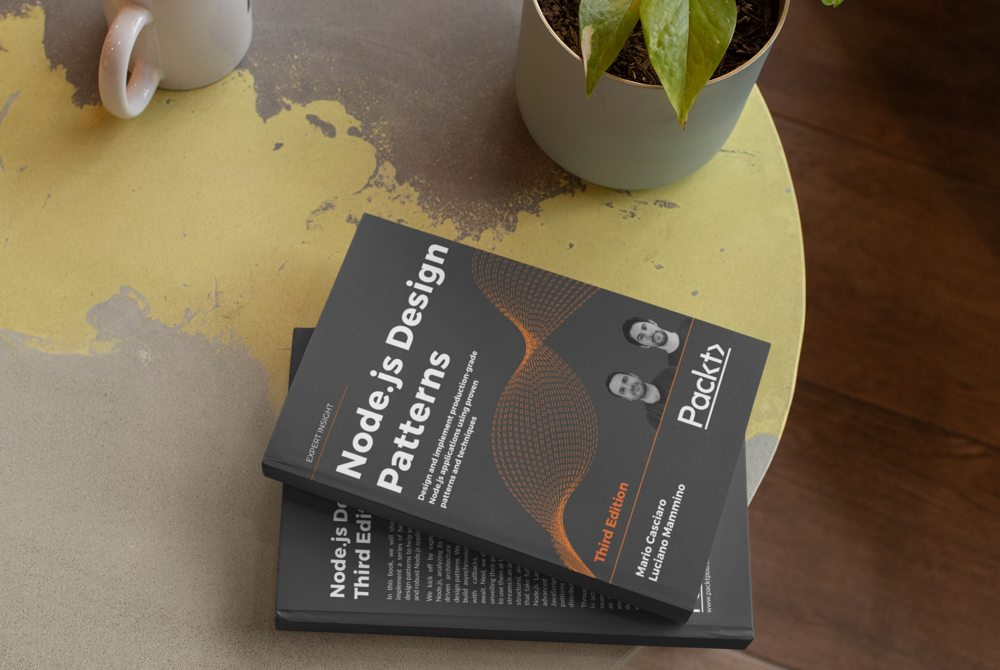
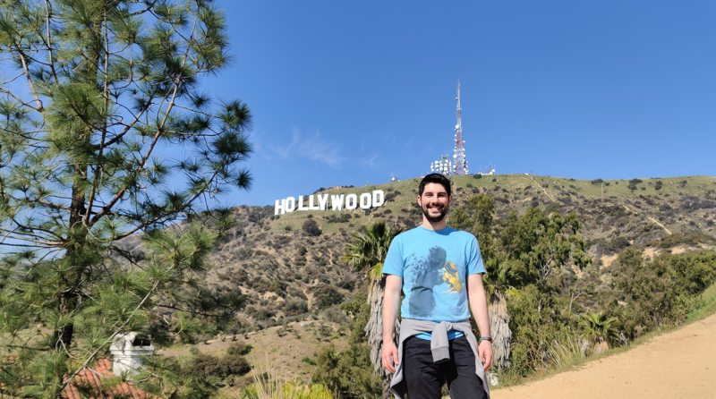
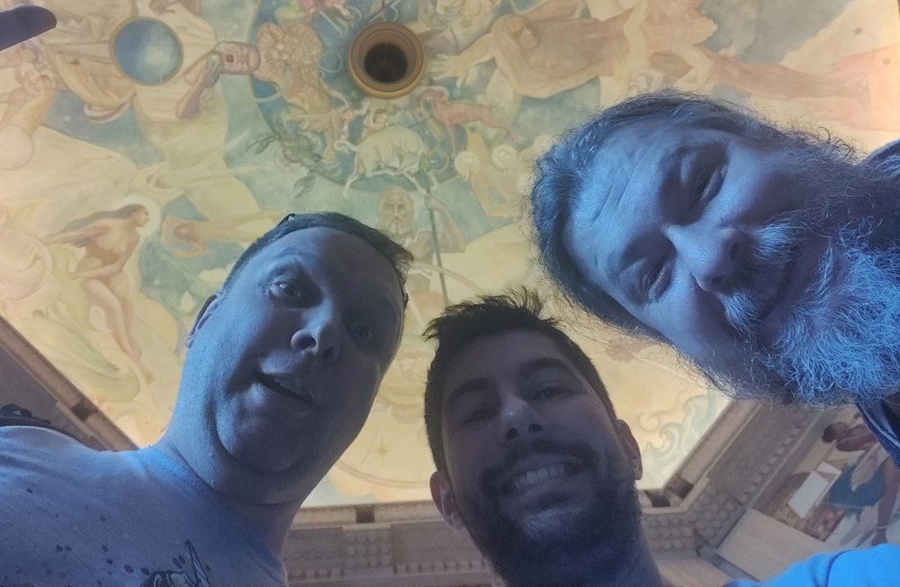

As we transition into 2021 and we leave this crazy 2020 behind, it is a great time for me to reflect on my what happened in 2020 from a career perspective and make some plans for the year to come.

Usual **spoiler alert**: this is the fifth year in a row for me writing this kind of post. This is going to be a super boring one that I write mostly for myself to reflect on where my career is going and what I am learning every year.

I hope I am setting the right expectation here, if you decide to go ahead and read this, get confortable and grab a coffee, because it's going to get quite *BOOORING*.

Yeah, this is a boring GIF. A silly attempt to warn you and (hopefully) to make things slightly less boring! 😜

## A important reflection

Before getting started, I want to make a small but important reflection about this crazy 2020, signed by a worldwide pandemic and a global crisis.

This is something that no one could have predicted and I think it should rightfully shift our perspective towards society and ourself as individuals.

Of course, I am not going to tell you how you should reconsider your life, but I want to share how I am reconsidering some small elements in mine.

In the last few years I have been quite eager to grow as a professional and I tried to accomplish more and more every year, sometimes at the expense of time spent with the people that are dear to me. In retrospective, I recognize that sometimes I might have been a bit selfish, and I should try hard to change that...

I consider myself quite lucky this year, because even in these strange times, I have been one of the privileged ones: I work in an industry that it is still thriving (now more than ever) and I didn't lose my job, nor did I have to take a paycut. I somehow managed to stay healthy throughout the year and so did most of the people dear to me.

I hope that most of the people reading this could say the same, but we all can't ignore the fact that most other people out there are struggling and suffering.

I don't think, as an indivudual, that I can have any significant impact to make things better on a large scale, but I think I can have an impact on my local community and with the people I care about.

I am not planning anything big here. I want to try to be more aware and careful with the people around. I think, a phone call or just asking _"how are you today?"_, _"what are you doing?"_, _"I was thinking about you..."_ or _"can I help you with anything?"_ could be small gestures but they might mean a lot for the people you care about, even at distance.

I have tried to do these things a little bit this year, but I'll try to it more next year. I want to encourage you to do the same.

> Together we can face any challenge as deep as the ocean and as high as the sky.  
> — Sonia Gandhi

## Node.js Design Patterns - Third edition

[Mario Casciaro](https://twitter.com/mariocasciaro) and I have been working on a third edition of [Node.js Desing Patterns (the book)](https://www.nodejsdesignpatterns.com/) since September 2019. This new edition finally came out this year at the end of July 2020.

We have been spending countless hours working in tandem on this new edition, which practically resulted in a full rewrite of the previous edition and a lot of additional new content.

A lot has changed in the Node.js landscape since 2016 (when we published the second edition) and in this book we tried to take full advantage of new interesting capabilities like `async/await` and `ESM`. I feel like we have also grown a lot as engineers in the last 4 years and this helped us to put things on a different perspective and improve the overall quality of the book compared to the previous editions.

I am quite proud of the final result and I consider this book one of the greatest achievements of my career so far.

But this result is not something that can only be attributed to our hard work as authors. It is important to shine a light on all the people that contributed immensely and helped us to make this new edition a reality.

First and foremost, **all our readers** from the previous editions. In the last few years we have collected tons of feedback and ideas on what could have been improved and how. I want to dedicate this new edition to all of them and I hope this book will bring value to the Node.js community as a whole.

Our publisher, **Packt**, has been helping us immensely, making sure that this new edition would result in a higher quality product compared to the 2 previous editions.

Last but not least, the incredible team of **technical reviewers** made up by some of the most talented engineers I had the pleasure to engage with in my career. This has been the tip of the spear for us and probably the element that contributed the most to the final quality of the book. I want to thank the reviewers one by one (in random order): [Romina Miraballes](https://twitter.com/romMiraballes), [Roberto Gambuzzi](https://twitter.com/gbinside), [Kyriakos Markakis](https://twitter.com/marquicodes), [Liran Tal](https://twitter.com/liran_tal), [Tomas Della Vedova](https://twitter.com/delvedor), [Peter Poliwoda](https://twitter.com/peterpoliwoda), and [Minwoo Jung](https://twitter.com/jmwsoft). If you are reading this, make sure to follow all of them... Trust me, you won't regret it. 😇

If you are interested in finding out more about Node.js Design Patterns, make sure to check out [the official website](https://www.nodejsdesignpatterns.com/). Also, we recently launched a [blog](https://www.nodejsdesignpatterns.com/blog/) section that you might want to check out as well!

> These are not books, lumps of lifeless paper, but minds alive on the shelves.  
> — Gilbert Highet

## Conference Talks

After a few years involving travelling a lot to speak at many different confereces around the World and with all the effort I put on the third edition of Node.js Design Patterns, I didn't feel like I wanted to do any talk this year. So, I did not apply for any conference or meetup.

With that being said, I still ended up delivering 13 different talks, which put me exactly on par with what I did last year! 

I was extremely surprised and flattered to have received a lot of invitations to talk at several events. Of course most of them were remote.

What made me particularly happy is that some of these talks are not regular tech talks, but interviews about my career. I am quite happy that I had the opportunity to tell my story and, hopefully, through my failures and successes, to have an opportunity to inspire other people to try their best every day.

Thanks to [Francesco Sciuti](https://www.youtube.com/channel/UCMudbsRDgdkDe3hXD2qsTUg), [Simone Torrisi](https://www.youtube.com/channel/UCckCYs-msiC4Vs_nyg218Hw), [Rafael Del Nero](https://www.youtube.com/c/JavaChallengers/), [Francesco Ciulla](https://www.youtube.com/channel/UCBRxDSTfr2aJVODDh4WG_7g) for interviewing me and everyone else that invited me to speak at their own meetups and conferences! THANK YOU!

This is the full list of talks for my 2020. You can find more details and links in the [speaking section of this blog](/speaking):

  - _"Middy.js: a powerful middleware framework for your Node.js lambdas"_, Dublin GCS Connect Serverless (Dublin, Ireland)
  - _"Writing a tech book: it's doable! (Interview — in Italian)"_, Acadevmy - Uno di frontend (remote)
  - _"Is the pot full of gold really in Ireland? (Interview — in Italian)"_, Acadevmy - Chiacchiere per DEVulgare (remote)
  - _"An overview of JavaScript and Node.js"_, Liferay Universities Series (remote)
  - _"Node.js scalability tips"_, Shift conference (remote)
  - _"Unbundling the JavaScript module bundler"_, Road to Coderful (remote)
  - _"Node.js scalability tips"_, CityJS 2020 (remote)
  - _"Tomorrowdevs interview (#storiedidevelopers)"_, Tomorrowdevs (remote)
  - _"An Intro to Eleventy: Static Site Generation Made Fun Again"_, CorkDev (remote)
  - _"The path to become a Principal Engineer - interview with Java Challengers"_, Java Challengers (remote)
  - _"Node.js scalability tips"_, Codemotion online 2020 (remote)
  - _"An Intro to Eleventy: Static Site Generation Made Fun Again"_, MancJS (remote)
  - _"The process of writing a successful programming book"_, Francesco Ciulla's Channel (remote)

After having delivered a total of 54 talks / workshops in the last few years, I have to admit I am running out of things to say... Maybe it's just my imposter syndrome talking, but I am not sure I want to commit to do any talk for next year. So, I will probably keep this open ended. If some good opportunity presents itself, I'll take it...

> I believe in the power of ideas. I believe in the power of sharing knowledge.  
> — Ory Okolloh

## Career

In 2020 I joined [Fabfitfun](http://fabfitfun.com) as a **Principal Software Engineer**.

Fabfitfun is a very interesting company with a lot of technical challenges, mostly regarding very spicky traffic (serving millions of users on a regular basis) and an evolving architecture where we are transitioning from a legacy monolith to a set of decoupled microservices.

The main head quarter is in Los Angeles, but I joined a new team based in Dublin, which was formed only this year.

I am currently spending a lot of time wearing many different hats and trying to help on different areas. From building new services (mostly using Python and [`fastapi`](https://fastapi.tiangolo.com/)), building new **integrations** and **automation** around our corporate Slack, optimizing existing solutions around **scalability**, **security** and **authentication** and helping decoupling the legacy monolith into new services deployed on **Kubernetes**. In the last few months, I have also been organising an internal monthly meetup to help differnt teams located world wide to have a place where they can share their passion for technology.

I admit it has been a bit of a bumpy ride at times, mostly because of this crazy unpredictable year and a lot of work from home, but I feel blessed to be working with a world-class team of professionals and to be able to share my expertise.

Most importantly, I feel quite lucky I had the chance to visit the head quarter in Los Angeles, just before the whole pandemic exploded.

Let me prove that to you with a couple of pictures:

This is me at the Hollywood sign!

From the left to the right, this is [Padraig O'Brien](https://twitter.com/PadraigOBrien), me and [Roberto Gambuzzi](https://twitter.com/gbinside) at the Griffith Observatory (yes the one from La La Land).

And yes... in case you are wondering, we also did a lot of useful work while we were in LA! 😇

> All things are difficult before they are easy.  
> — Thomas Fuller

## Side projects

FullStack Bulletin, Middy, Linkerflix, Node.js Design Patterns...

TODO: ...

## Blog posts

TODO: ...

## External blog posts

- [Generate a sitemap for your Eleventy website](https://dev.to/loige/create-a-sitemap-for-your-eleventy-website-25h)
- [Add a generator meta tag to your Eleventy website](https://dev.to/loige/add-a-generator-meta-tag-to-your-eleventy-website-48f1)
- [What is a JWT token](https://dev.to/loige/what-is-a-jwt-token-302k)
- [Determine prominent colors in a picture, your first AWS Lambda in Go](https://buddy.works/tutorials/determine-prominent-colors-in-a-picture-your-first-aws-lambda-in-go)
- [Getting started with Eleventy in 11 minutes](https://dev.to/loige/getting-started-with-eleventy-in-11-minutes-496j)
- [Integration testing for AWS Lambda in Go with Docker-compose](https://buddy.works/tutorials/integration-testing-for-aws-lambda-in-go-with-docker-compose)
- [5 Ways to install Node.js](https://www.nodejsdesignpatterns.com/blog/5-ways-to-install-node-js/)

TODO: ...

## Open Source

TODO: ...

Mention fastify website and more effort required

list contributions

## Previous year goals

TODO: ...

## Expectations for next year

TODO: ...
