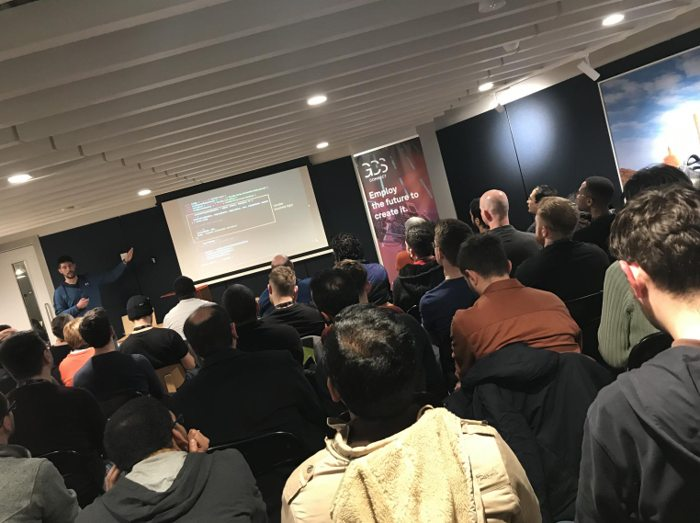

As we transition into 2021 and we leave this crazy 2020 behind, it is a great time for me to reflect on my what happened in 2020 from a career perspective and make some plans for the year to come.

Usual **spoiler alert**: this is the fifth year in a row for me writing this kind of post. This is going to be a super boring one that I write mostly for myself to reflect on where my career is going and what I am learning every year.

I hope I am setting the right expectation here, if you decide to go ahead and read this, get confortable and grab a coffee, because it's going to get quite *BOOORING*.

Yeah, this is a boring GIF. A silly attempt to warn you and (hopefully) to make things slightly less boring! 😜

## A important reflection

Before getting started, I want to make a small but important reflection about this crazy 2020, signed by a worldwide pandemic and a global crisis. And, by the way, I dare to remind you that none of this will be magically over just because we are in a new year now... 😟

This is something that no one could have predicted and I think it should rightfully shift our perspective towards society and ourself as individuals.

Of course, I am not going to tell you how you should reconsider your life, but I want to share how I am reconsidering some small elements in mine.

In the last few years I have been quite eager to grow as a professional and I tried to accomplish more and more every year, sometimes at the expense of time spent with the people that are dear to me. In retrospective, I recognize that sometimes I might have been a bit too selfish, and I should try hard to change that...

I consider I have been quite lucky in 2020, because even in these strange times, I have been one of the privileged ones. I work in an industry that it is still thriving (now more than ever) and I didn't lose my job, nor did I have to take a paycut. I somehow managed to stay healthy throughout last year and so did most of the people dear to me.

I hope that most of the people reading this could say the same, but we all can't ignore the fact that most other people out there are struggling and suffering.

I don't think, as an indivudual, that I can have any significant impact to make things better on a large scale, but I think I can have an impact on my local community and with the people I care about.

I am not planning anything big here. I want to try to be more aware and careful with the people around. I think, a phone call or just asking _"how are you today?"_, _"what are you doing?"_, _"I was thinking about you..."_ or _"can I help you with anything?"_ could be small gestures but they might mean a lot for the people you care about, even at distance.

I have tried to do these things a little bit this year, but I'll try to it more next year. I want to encourage you to do the same.

In short, I am wishing for a 2021 where individuals can be more compassionate and support each other more.

> Together we can face any challenge as deep as the ocean and as high as the sky.  
> — Sonia Gandhi

## Node.js Design Patterns - Third edition

[Mario Casciaro](https://twitter.com/mariocasciaro) and I have been working on a third edition of [Node.js Desing Patterns (the book)](https://www.nodejsdesignpatterns.com/) since September 2019. This new edition finally came out this year at the end of July 2020.

We have been spending countless hours working in tandem on this new edition, which practically resulted in a full rewrite of the previous edition and a lot of additional new content. The print edition turned out to be quite massive counting more than 660 pages!

A lot has changed in the Node.js landscape since 2016 (when we published the second edition) and in this book we tried to take full advantage of new interesting capabilities like `async/await` and `ESM`. I feel like we have also grown a lot as engineers in the last 4 years and this helped us to put things on a different perspective and improve the overall quality of the book compared to the previous editions.

We also re-imagined the book as a learning pat and we decided to add exercises at the end of the every chapter to allow readers to test their understanding of the main concepts. In this perspective we also created a [wiki](https://github.com/PacktPublishing/Node.js-Design-Patterns-Third-Edition/wiki/Node.js-Design-Patterns-Third-Edition---Exercise-Solutions) and a [discussion board](https://github.com/PacktPublishing/Node.js-Design-Patterns-Third-Edition/discussions) for people to exchange opinions and collaborate towards writing their own solutions.

I am quite proud of the final result and I consider this book one of the greatest achievements of my career so far. A mandatory "thank you" goes to Mario for involving me in this awesome project!

But this result is not something that can only be attributed to our hard work as authors. It is important to shine a light on all the people that contributed immensely and helped us to make this new edition a reality.

First and foremost, **all our readers** from the previous editions. In the last few years we have collected tons of feedback and ideas on what could have been improved and how. I want to dedicate this new edition to all of them and I hope this book will bring value to the Node.js community as a whole.

Our publisher, **Packt**, has been helping us a lot, making sure that this new edition would result in a higher quality product compared to the 2 previous editions.

Last but not least, the incredible team of **technical reviewers** made up by some of the most talented engineers I had the pleasure to engage with in my career. This has been the tip of the spear for us and probably the element that contributed the most to the final quality of the book. I want to thank the reviewers one by one (in random order): [Romina Miraballes](https://twitter.com/romMiraballes), [Roberto Gambuzzi](https://twitter.com/gbinside), [Kyriakos Markakis](https://twitter.com/marquicodes), [Liran Tal](https://twitter.com/liran_tal), [Tomas Della Vedova](https://twitter.com/delvedor), [Peter Poliwoda](https://twitter.com/peterpoliwoda), and [Minwoo Jung](https://twitter.com/jmwsoft). If you are reading this, make sure to follow all of them on Twitter... Trust me, you won't regret it. 😇

Unfortunately, I can't disclose any data, but this new edition has been doing quite well so far. We got some good recognition (if you need a proof of that, you could check out the reviews on Amazon) and it has been ranking quite high on Amazon in several categories (including _JavaScript_).

Thanks a lot to [Goran Jawdat](https://twitter.com/goranjawdat) for sending us this amazing screenshot!

If you are interested in finding out more about Node.js Design Patterns, make sure to check out [the official website](https://www.nodejsdesignpatterns.com/). Also, we recently launched a [blog](https://www.nodejsdesignpatterns.com/blog/) section that you might want to check out as well!

> These are not books, lumps of lifeless paper, but minds alive on the shelves.  
> — Gilbert Highet

## Conference Talks

After a few years involving travelling a lot to speak at many different confereces around the World and with all the effort I put on the third edition of Node.js Design Patterns, I didn't feel like I wanted to do any talk this year. So, I did not apply for any conference or meetup.

With that being said, I still ended up delivering 13 different talks, which put me exactly on par with what I did last year! 

I was extremely surprised and flattered to have received a lot of invitations to talk at several events. And, yes... when you get an invitation, it's very hard to say _NO_... Needless to say that, in 2020, most of these conference were remote.

What made me particularly happy is that some of these talks are not regular tech talks, but interviews about my career path. I am quite happy that I had the opportunity to tell my story and, hopefully, through my failures and successes, to have an opportunity to inspire other people to try their best every day.

Thanks to [Francesco Sciuti](https://www.youtube.com/channel/UCMudbsRDgdkDe3hXD2qsTUg), [Simone Torrisi](https://www.youtube.com/channel/UCckCYs-msiC4Vs_nyg218Hw), [Rafael Del Nero](https://www.youtube.com/c/JavaChallengers/), [Francesco Ciulla](https://www.youtube.com/channel/UCBRxDSTfr2aJVODDh4WG_7g) for interviewing me and everyone else that invited me to speak at their own meetups and conferences! Seriously, _THANK YOU_!

This is the full list of talks for my 2020. You can find more details and links in the [speaking section of this blog](/speaking):

  - _"Middy.js: a powerful middleware framework for your Node.js lambdas"_, Dublin GCS Connect Serverless (Dublin, Ireland)
  - _"Writing a tech book: it's doable! (Interview — in Italian)"_, Acadevmy - Uno di frontend (remote)
  - _"Is the pot full of gold really in Ireland? (Interview — in Italian)"_, Acadevmy - Chiacchiere per DEVulgare (remote)
  - _"An overview of JavaScript and Node.js"_, Liferay Universities Series (remote)
  - _"Node.js scalability tips"_, Shift conference (remote)
  - _"Unbundling the JavaScript module bundler"_, Road to Coderful (remote)
  - _"Node.js scalability tips"_, CityJS 2020 (remote)
  - _"Tomorrowdevs interview (#storiedidevelopers)"_, Tomorrowdevs (remote)
  - _"An Intro to Eleventy: Static Site Generation Made Fun Again"_, CorkDev (remote)
  - _"The path to become a Principal Engineer - interview with Java Challengers"_, Java Challengers (remote)
  - _"Node.js scalability tips"_, Codemotion online 2020 (remote)
  - _"An Intro to Eleventy: Static Site Generation Made Fun Again"_, MancJS (remote)
  - _"The process of writing a successful programming book"_, Francesco Ciulla's Channel (remote)

After having delivered a total of 54 talks and workshops in the last few years, I have to admit I feel like I am running out of things to say... Maybe it's just my imposter syndrome talking, but I am not sure I want to commit to do any talk for next year. So, I will probably keep this open ended. If some good opportunity presents itself, I'll take it...

> I believe in the power of ideas. I believe in the power of sharing knowledge.  
> — Ory Okolloh

## Career

In 2020 I joined [Fabfitfun](http://fabfitfun.com) as a **Principal Software Engineer**.

Fabfitfun is a very interesting company with a lot of technical challenges, mostly regarding very spicky traffic (serving millions of users on a regular basis) and an evolving architecture where we are transitioning from a legacy monolith to a set of decoupled microservices.

The main head quarter is in Los Angeles, but I joined a new team based in Dublin, which was formed only this year.

Even if I have been at Fabfitfun for less than a year I feel like I had several opportunities to have an impact.

I am currently spending a lot of time wearing many different hats and trying to help on different areas. From building new services (mostly using Python and the excellent [`fastapi`](https://fastapi.tiangolo.com/) framework), building new **integrations** and **automation** around our corporate Slack, optimizing existing solutions around **scalability**, **security** and **authentication** and helping decoupling the legacy monolith into new services deployed on **Kubernetes**. In the last few months, I have also been organising an internal monthly meetup to help different teams located world wide to have a place where they can share their passion for technology.

I admit it has been a bit of a bumpy ride at times. I suppose that starting a new remote office in a this crazy unpredictable year has been the main reason for some hiccups, but I feel things are getting better as we integrate more with the rest of the company and I am definitely blessed to be working with a world-class team of professionals and to be able to share my expertise every day.

Most importantly, I feel quite lucky I had the chance to visit the head quarter in Los Angeles, just before the whole pandemic exploded.

Let me prove that to you with a couple of pictures:

This is me at the Hollywood sign!

From the left to the right, this is [Padraig O'Brien](https://twitter.com/PadraigOBrien), me and [Roberto Gambuzzi](https://twitter.com/gbinside) at the Griffith Observatory (yes the one from La La Land).

And yes... in case you are wondering, we also did a lot of useful work while we were in LA! 😇

> All things are difficult before they are easy.  
> — Thomas Fuller

## Side projects

In terms of side projects 2020 has been an interesting year. I already spoke at length about Node.js Design Patterns, so now let's discuss **Middy**, **FullStack Bulletin** and new project: **Linkerflix**.

### Middy

[Middy](https://middy.js.org/) is a Node.js middleware framework for AWS Lambda. I have been working on this project since the early days of Lambda (even though the first public commit was made the 3rd of August 2017).

In April 2020 we finally [launched Middy 1.0.0](/middy-1-is-here)! After few years of development and contributions from many awesome engineers, this was a pretty big milestone and I am quite proud of it!

What's even better is that throughout the year I found out that several interesting big companies are actually using Middy on a daily basis. Unfortunately, I don't have an official list, but I will try to get some approval to mention some names! 😇

Interesting enough, I think I reached this milestone a bit burned out regarding the whole project. I haven't been working a lot with Lambda and serverless in the last couple of years (definitely not as much as I used to do before), so I felt like I was dragging my heels to keep the project alive while I wanted to focus my attention somewhere else.

Because of this, I think my release post on this blog turned out to be a little bit of a cry for help to keep the project alive.

Thankfully the community around the project has been very patient and supporting. In particular [Will Farrel](https://github.com/willfarrell) stepped up and offered to become the lead maintainer of the project. Since then, he has been doing an incredible amount of work releasing other 5 minor versions of the framework and [he is already working on a new major release](https://github.com/middyjs/middy/pull/587)!

If you have been using Middy, please consider joining the community and giving back to the project! You can also [sponsor Will](https://github.com/sponsors/willfarrell) to support the time he is investing in the project!

Thanks a lot Will! 🙌

One final observation about Middy is that the project has kept growing steadily throughout 2020, surpassing the astonishing number of more than 1 million dowloads for the [`@middy/core` package](https://www.npmjs.com/package/@middy/core) only.

### FullStack Bulletin

[FullStack bulletin](https://fullstackbulletin.com/) is a free weekly newsletter about full stack web development. I have been running this project with my dear friend [Andrea Mangano](https://twitter.com/andreaman87) for the last 3 years. The project is totally [open source](https://github.com/FullStackBulletin) and uses tons of automation to minimise the amount of manual work.

In 2020 we didn't change anything big in the format but the audience kept growing steadily:

One interesting thing, is that toward the end of the year we surpassed some of the threshold around free plans for some of the services we use, so we decided to start asking our subscribers for help.

If you are interested in supporting FullStack Bulletin, you can do so by [donating on Patreon](https://patreon.com/lucianomammino) or [sponsoring](https://fstack.link/sponsor) one of the next issues.

There are probably many ways we can improve FullStack Bulletin, so if you have any suggestion, please do let us know!

### Linkerflix

In 2020 I decided to start a new small side project: [Linkerflix](https://app.linkerflix.com/).

Linkerflix is an idea that was born from the frustration I had while trying to create links to allow readers to buy the book from Amazon. I wanted to have a system that, by using only one link, would automatically redirect the user to the closest Amazon shop. For instance, a user clicking from Italy should be redirected to the book page on Amazon.it while someone in Ireland would go to Amazon.co.uk (we will see if this changes with Brexit, but that's an entire other topic 😅).

I have been researching a solution for this for a while until I found out that there's an official solution from Amazon called [OneLink](https://affiliate-program.amazon.com/onelink).

Unfortunately I did't have a great experience while trying to setup OneLink for my account and in the end I did realize that OneLink only works on a pre-determined website that you have to pre-configure with Amazon (e.g. this blog). Since you have the prove that you own every website you link, you cannot use OneLink on social media channels like Twitter or Youtube... such a bummer!

To overcome this limitations, in August 2020 I created 2 small alternative open source solutions: [`not-one-link`](https://github.com/lmammino/not-one-link) and [`not-one-link-lambda`](https://github.com/lmammino/not-one-link-lambda). Yes, the name is a pun! Sorry Amazon... 😇

Later in the year, as I noticed many content creators suffered the same struggle I faced with sharing links to products on Amazon, I tought it might be a cool idea to try to build a small SaaS service to make it easier to adopt the solutions I already created with `not-one-link`. So I took one week off of work and I tried to build a super quick MVP. I documented the entire week on Twitter. If you are curious to see which technologies I used, how I structured the work and what kind of challenges I faced, you can read all the tweets on Threader:

  - [Day 1](https://threader.app/thread/1315716999738265600)
  - [Day 2](https://threader.app/thread/1316088991016509442)
  - [Day 3](https://threader.app/thread/1316429789906055168)
  - [Day 4](https://threader.app/thread/1316806016726642691)
  - [Day 5](https://threader.app/thread/1317168317069742081)
  - [Day 6 & 7](https://threader.app/thread/1317868855767818241)

The next big piece of work in line is more product facing. Now that I have an MVP I have to engage with potential user and try to get their feedback. Hopefully at the end of this process I will have found some degree of product market fit... or some new ideas for a pivot!

I want to dedicate some of my free times in 2021 to focus on this. Wish me luck!

> Your first projects aren't the greatest things in the world, and they may have no money value, they may go nowhere, but that is how you learn - you put so much effort into making something right if it is for yourself.  
> — Steve Wozniak

## Blog

If I have to be honest, I feel like I have been failing this blog a little in 2020. The main reason why I think that is because I have published only 3 new articles:

  - [Middy 1.0.0 is here](/middy-1-is-here)
  - [What's in a JWT (Json Web Token)?](/whats-in-a-jwt)
  - [Learning Rust through open source and live code reviews](/learning-rust-through-open-source-and-live-code-reviews)

Well, it's easy to say I wasn't a very profilic author... But let's see some numbers to check the impact on the blog.

As you can see from this graph, I got a total of **77.886 pageviews** (72.043 unique). Compared to last year, where I had almost 120.000 views, it is a significant drop (~35% decrease).

It is also interesting to see that what's driving most of the traffic is old articles:

And, also that visitors are coming mostly through organic search:

I am not a consistent author and I have been struggling for years to come up with a backlog of article ideas to pursue. I am not sure I want to make a promise to change this in 2021. Maybe I should just accept that I will keep blogging randomly and that this is not an area where I need to be consistent.

## External blog posts

While I haven't wrote a lot of new blog posts on this blog, I actually ended up publishing a decent number of articles on other sites. **7 new posts** to be precise:

- [Generate a sitemap for your Eleventy website](https://dev.to/loige/create-a-sitemap-for-your-eleventy-website-25h)
- [Add a generator meta tag to your Eleventy website](https://dev.to/loige/add-a-generator-meta-tag-to-your-eleventy-website-48f1)
- [What is a JWT token](https://dev.to/loige/what-is-a-jwt-token-302k)
- [Determine prominent colors in a picture, your first AWS Lambda in Go](https://buddy.works/tutorials/determine-prominent-colors-in-a-picture-your-first-aws-lambda-in-go)
- [Getting started with Eleventy in 11 minutes](https://dev.to/loige/getting-started-with-eleventy-in-11-minutes-496j)
- [Integration testing for AWS Lambda in Go with Docker-compose](https://buddy.works/tutorials/integration-testing-for-aws-lambda-in-go-with-docker-compose)
- [5 Ways to install Node.js](https://www.nodejsdesignpatterns.com/blog/5-ways-to-install-node-js/)

I am actually lying a little bit here... The two articles about AWS Lambda and Go are something I wrote during 2019 and they just got published this year... So, in reality, I have been publishing only 5 new posts.

Still, I don't feel like this is to bad and I don't want to commit to do more for next year. At this point I think I should embrace the fact that I will write blog posts only when there is something cool that I want to share.

There is maybe one exception I will try to make about this. I have been reading a bit about SEO during 2020 and I started the [blog section on Node.js Design Patterns website](https://www.nodejsdesignpatterns.com/blog/) to experiment with some of the ideas I had while learning more about SEO.

If I have to be serious about this I will have to publish few more articles. At least one every month for the next 12 months. I already came up with a list of potential articles, so I am already laying the groundwork here...

I suppose, at the end of the year we should be able to review my commitment and see if I managed to stay consistent here! 🤞

## Building a Twitter audience

Another area that kept me busy in 2020 is trying to build an audience. This is nothing new for me. I think I have been trying to do this for years since I started this blog and joined Twitter.

What's changed this year is that I have been trying to take a slightly more conscious and structured approach.

How am I structuring things?

Well, before getting into that, let me give some credit to [Daniel Vassallo](https://twitter.com/dvassallo) and his great [Everyone Can Build a Twitter Audience](https://gumroad.com/l/twitter-audience) course. I watched his course this year and it helped me realise I did not have any plan or strategy.

In fairness, I don't think I have come up with a particularly sophisticated plan now, but I have definitely identified some mistakes I was doing and I have tried to correct them. Let me list some of them.

**I was tweeting a lot links to articles** (like a lot!). This is mainly because of the automations I set up for FullStack bulletin. Whenever I found an interesting article related to full stack web development I was tweeting it to add it to the list of selected articles for the next issue of FullStack bulletin. I don't think tweeting articles is necessarily a bad thing, but it does not help me to express my personal opinion about things or to add colour to interesting tech topics or projects. Since I realised this I moved all these tweets to [FullStack Bulletin's Twitter account](https://twitter.com/fstackbulletin). Now, whenever there is something article I feel like I want to tweet I ask myself "can I add any valuable comment to this tweet?". If the answer is yes, then I do share the article with some additional comment, otherwise I just share it throught the FullStack Bulletin profile. I am extending this logic to any retweet. I have stopped almost all retweets, unless I feel like I can add some colour to the original tweet.

**I was not giving enough**. Building an audience is mostly about _giving_ and very little about _taking_. What I mean by this is that revisiting some of my previous tweets I realised I was not giving my audience many reasons to follow me. Since I realised this mistake I am actually tweeting less, but when I do try to post something meanigful and useful. It can be a quick tip about something I just learned and that might be useful to other engineers. It might be an opinion about a new technology I have been playing with... I think this also helps to show interest and expertise on a given area and this should encourage people with similar interests to engage more.

And this brings me to another important mistake: **I was not engaging enough** with people with similar interests. This is an easy one to fix in principle, but it is one that takes a lot of time. It means you have to spend a lot more time on Twitter **listening** rather than just **talking**.

To be fair, this one last point was a bit illuminating to me. When I realised this mistake I felt like I have been using Twitter in the wrong way for so long... In fact, I have been using Twitter more as a news broadcasting channel rather than a place for conversations.

Realising all these mistakes made me change the way I used Twitter and I have a feeling that now I can use it to have better conversations and engage more with people and learn from them.

But let's have a look at the numbers to see if all of this had an effect on my followers base.

## Open Source

TODO: ...

Mention fastify website and more effort required

list contributions

## Previous year goals

TODO: ...

## Expectations for next year

TODO: ...
