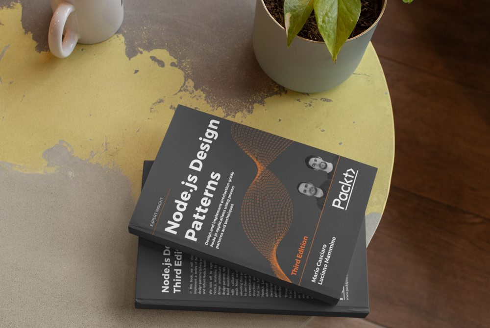
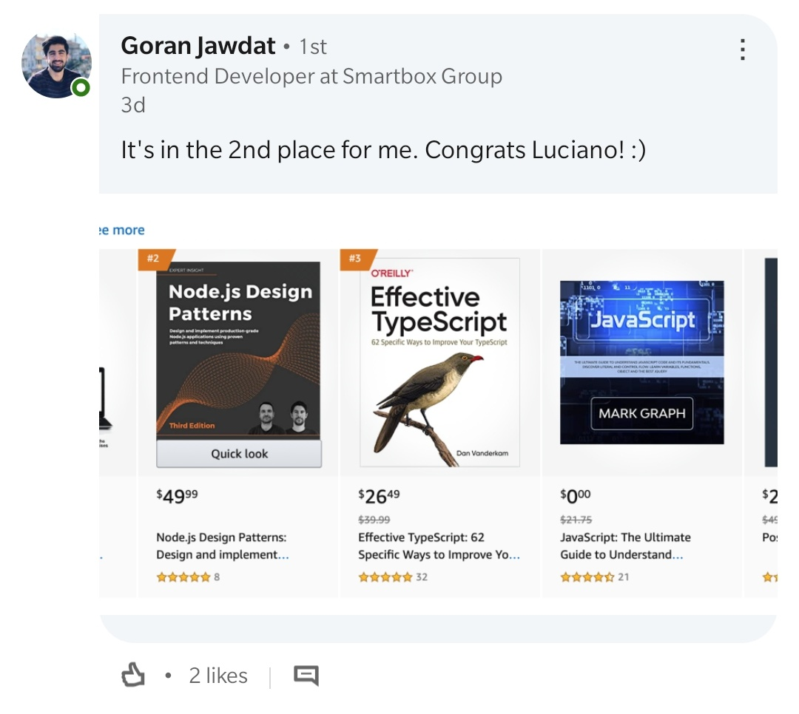
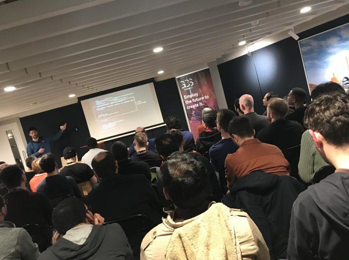
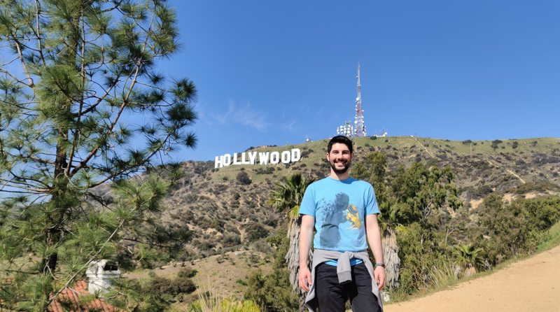
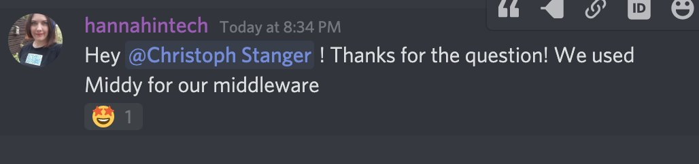
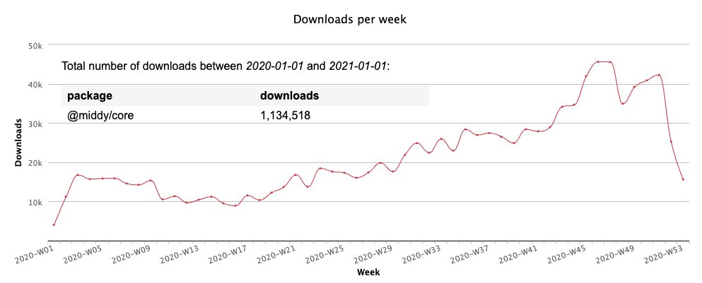
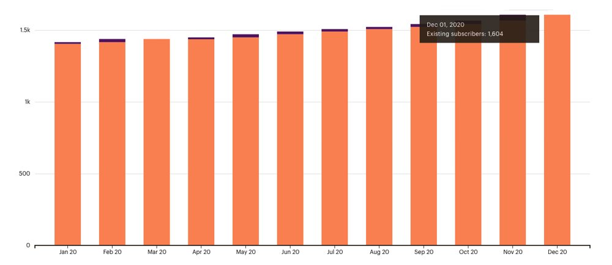
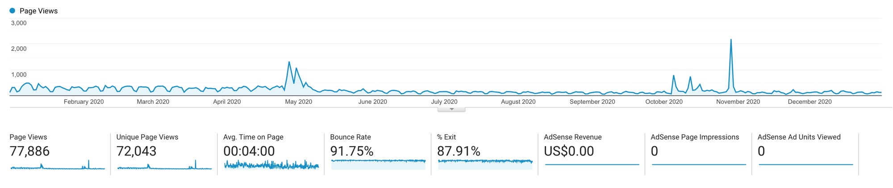
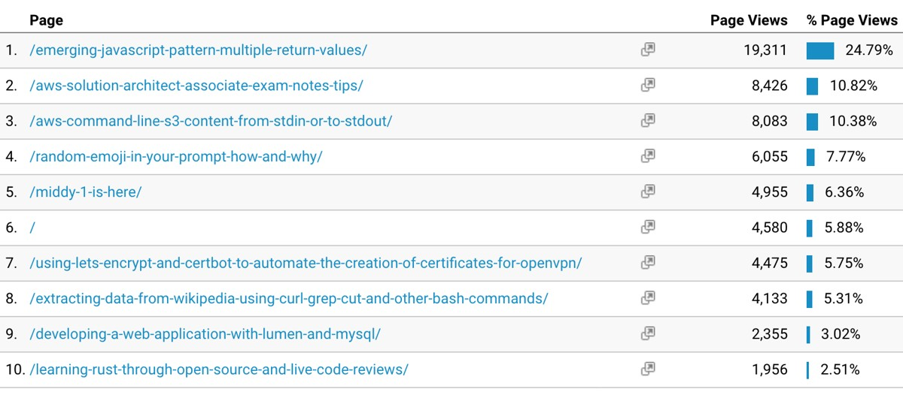
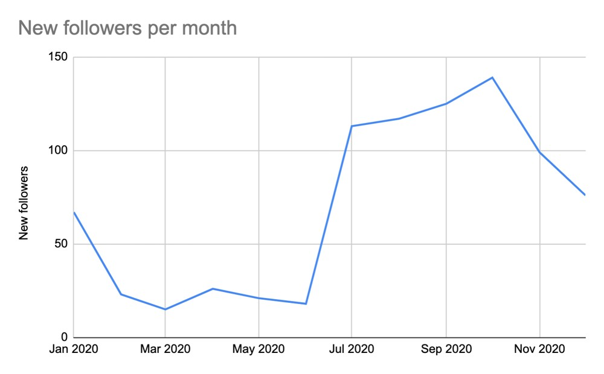

As we transition into 2021 and we leave this crazy 2020 behind, it is a great time for me to reflect on my what happened in 2020 from a career perspective and make some plans for the year to come.

Usual **spoiler alert**: this is the fifth year in a row for me writing this kind of post. This is going to be a super boring one that I write for myself to reflect on where my career is going and what I am learning every year.

I hope I am setting the right expectation here. If you decide to go ahead and read this, get comfortable and grab a coffee because it's going to get quite *BOOORING*.

Yeah, this is a boring GIF. A silly attempt to warn you and (hopefully) to make things slightly less boring! 😜

## An important reflection

Before getting started, I want to make a small but important reflection about this crazy 2020, signed by a worldwide pandemic and a global crisis. And, by the way, I dare to remind you that none of this will be magically over just because we are in a new year now... 😟

This is something that no one could have predicted and it should rightfully shift our perspective towards society and ourself as individuals.

Of course, I am not going to tell you how you should reconsider your life, but I want to share how I am reconsidering some small elements in mine.

In the last few years, I have been quite eager to grow as a professional and I tried to accomplish more and more every year, sometimes at the expense of time spent with the people that are dear to me. In retrospective, I recognize that sometimes I might have been a bit too selfish, and I should try hard to change that...

I have been quite lucky in 2020 because even in these strange times, I have been one of the privileged ones. I work in an industry that it is still thriving (now more than ever) and I didn't lose my job, nor did I have to take a pay cut. I somehow managed to stay healthy throughout last year and so did most of the people dear to me.

I hope that most of the people reading this could say the same, but we all can't ignore the fact that the majority of people out there are struggling and suffering.

I don't think, as an individual, that I can have any significant impact to make things better on a large scale, but I can have an impact on my local community and with the people I care about.

I am not planning anything big here. I want to try to be more aware and careful with the people around. A phone call or just asking _"how are you today?"_, _"what are you doing?"_, _"I was thinking about you..."_ or _"can I help you with anything?"_ could be small gestures but they might mean a lot for the people you care about, even at distance.

I have tried to do these things a little bit this year, but I'll try to it more next year. I want to encourage you to do the same.

In short, I am wishing for 2021 that we can be more compassionate and support each other more.

> Together we can face any challenge as deep as the ocean and as high as the sky.  
> — Sonia Gandhi

## Node.js Design Patterns - Third edition

[Mario Casciaro](https://twitter.com/mariocasciaro) and I have been working on the third edition of [Node.js Desing Patterns (the book)](https://www.nodejsdesignpatterns.com/) since September 2019. This new edition finally came out this year at the end of July 2020.

We have been spending countless hours working in tandem on this new edition, which resulted in a full rewrite of the previous edition and a lot of additional new content. The print edition turned out to be massive counting more than 660 pages!

A lot has changed in the Node.js landscape since 2016 (when we published the second edition) and in this book, we tried to take full advantage of new interesting capabilities like `async/await` and `ESM`. We have also grown a lot as engineers in the last 4 years and this helped us to put things on a different perspective and improve the overall quality of the book compared to the previous editions.

We re-imagined the book as a learning path and we decided to add exercises at the end of every chapter. This allows readers to test their understanding of the main concepts. In this perspective, we also created a [wiki](https://github.com/PacktPublishing/Node.js-Design-Patterns-Third-Edition/wiki/Node.js-Design-Patterns-Third-Edition---Exercise-Solutions) and a [discussion board](https://github.com/PacktPublishing/Node.js-Design-Patterns-Third-Edition/discussions) for readers to exchange opinions and collaborate towards writing their own solutions.

I am quite proud of the final result and I consider this book one of the greatest achievements of my career so far. A mandatory "thank you" goes to Mario for involving me in this awesome project!

But this result is not something that can only be attributed to our hard work as authors. It is important to shine a light on all the people that contributed and helped us to make this new edition a reality.

First and foremost, **all our readers** from the previous editions. In the last few years, we have collected tons of feedback and ideas on what could have been improved and how. I want to dedicate this new edition to all of them and I hope this book will bring value to the Node.js community as a whole.

Our publisher, **Packt**, has been helping us a lot. Packt made sure that this new edition would result in a higher quality product compared to the 2 previous editions.

Last but not least, the incredible team of **technical reviewers** made up by some of the most talented engineers I had the pleasure to engage with in my career. This has been the tip of the spear for us and the element that contributed the most to the final quality of the book. I want to thank the reviewers one by one (in random order): [Romina Miraballes](https://twitter.com/romMiraballes), [Roberto Gambuzzi](https://twitter.com/gbinside), [Kyriakos Markakis](https://twitter.com/marquicodes), [Liran Tal](https://twitter.com/liran_tal), [Tomas Della Vedova](https://twitter.com/delvedor), [Peter Poliwoda](https://twitter.com/peterpoliwoda), and [Minwoo Jung](https://twitter.com/jmwsoft). If you are reading this, make sure to follow all of them on Twitter... Trust me, you won't regret it. 😇

Unfortunately, I can't disclose any data, but this new edition has been doing quite well so far. We got some good recognition (if you need a proof of that, you could check out the reviews on Amazon) and it has been ranking quite high on Amazon in several categories (including _JavaScript_).

Thanks a lot to [Goran Jawdat](https://twitter.com/goranjawdat) for sending us this amazing screenshot!

If you are interested in finding out more about Node.js Design Patterns, make sure to check out [the official website](https://www.nodejsdesignpatterns.com/). Also, we recently launched a [blog](https://www.nodejsdesignpatterns.com/blog/) section that you might want to check out as well!

> These are not books, lumps of lifeless paper, but minds alive on the shelves.  
> — Gilbert Highet

## Conference Talks

After a few years involving travelling a lot to speak at many different conferences around the World and with all the effort I put on the third edition of Node.js Design Patterns, I didn't feel like I wanted to do any talk this year. So, I did not apply for any conference or meetup.

With that being said, I still ended up delivering 13 different talks, which put me exactly on par with what I did last year! 

I was extremely surprised and flattered to have received a lot of invitations to talk at several events. And, yes... when you get an invitation, it's very hard to say _NO_... Needless to say that, in 2020, most of these conferences were remote.

What made me particularly happy is that some of these talks are not regular tech talks, but interviews about my career path. I am quite happy that I had the opportunity to tell my story and, through my failures and successes, to have an opportunity to inspire other people to try their best every day.

Thanks to [Francesco Sciuti](https://www.youtube.com/channel/UCMudbsRDgdkDe3hXD2qsTUg), [Simone Torrisi](https://www.youtube.com/channel/UCckCYs-msiC4Vs_nyg218Hw), [Rafael Del Nero](https://www.youtube.com/c/JavaChallengers/), [Francesco Ciulla](https://www.youtube.com/channel/UCBRxDSTfr2aJVODDh4WG_7g) for interviewing me and everyone else that invited me to speak at their own meetups and conferences! Seriously, _THANK YOU_!

This is the full list of talks for my 2020. You can find more details and links in the [speaking section of this blog](/speaking):

  - _"Middy.js: a powerful middleware framework for your Node.js lambdas"_, Dublin GCS Connect Serverless (Dublin, Ireland)
  - _"Writing a tech book: it's doable! (Interview — in Italian)"_, Acadevmy - Uno di frontend (remote)
  - _"Is the pot full of gold really in Ireland? (Interview — in Italian)"_, Acadevmy - Chiacchiere per DEVulgare (remote)
  - _"An overview of JavaScript and Node.js"_, Liferay Universities Series (remote)
  - _"Node.js scalability tips"_, Shift conference (remote)
  - _"Unbundling the JavaScript module bundler"_, Road to Coderful (remote)
  - _"Node.js scalability tips"_, CityJS 2020 (remote)
  - _"Tomorrowdevs interview (#storiedidevelopers)"_, Tomorrowdevs (remote)
  - _"An Intro to Eleventy: Static Site Generation Made Fun Again"_, CorkDev (remote)
  - _"The path to become a Principal Engineer - interview with Java Challengers"_, Java Challengers (remote)
  - _"Node.js scalability tips"_, Codemotion online 2020 (remote)
  - _"An Intro to Eleventy: Static Site Generation Made Fun Again"_, MancJS (remote)
  - _"The process of writing a successful programming book"_, Francesco Ciulla's Channel (remote)

After having delivered a total of 54 talks and workshops in the last few years, I have to admit I feel like I am running out of things to say... Maybe it's just my imposter syndrome talking, but I am not sure I want to commit to doing any talk for next year. So, I will probably keep this open-ended. If some good opportunity presents itself, I'll take it...

> I believe in the power of ideas. I believe in the power of sharing knowledge.  
> — Ory Okolloh

## Career

In 2020 I joined [Fabfitfun](http://fabfitfun.com) as a **Principal Software Engineer**.

Fabfitfun is a very interesting company with a lot of technical challenges, regarding very spiky traffic (serving millions of users on a regular basis) and an evolving architecture where we are transitioning from a legacy monolith to a set of decoupled microservices.

The main headquarter is in Los Angeles, but I joined a new team based in Dublin, which was formed only at the beginning of 2020.

Even if I have been at Fabfitfun for less than a year I feel like I had several opportunities to have an impact.

I am currently spending a lot of time wearing many different hats and trying to help in different areas. From building new services (mostly using Python and the excellent [`fastapi`](https://fastapi.tiangolo.com/) framework), building new **integrations** and **automation** around our corporate Slack, optimizing existing solutions around **scalability**, **security** and **authentication** and helping to decouple the legacy monolith into new services deployed on **Kubernetes**. In the last few months, I have also been organising an internal monthly meetup to help different teams located worldwide to have a place where they can share their passion for technology.

I admit it has been a bit of a bumpy ride at times. I suppose that starting a new remote office in a crazy unpredictable year like 2020 has been the main reason for some hiccups, but things are getting better as we integrate more with the rest of the company and I am definitely blessed to be working with a world-class team of professionals and to be able to share my expertise every day.

On top of this, I have been quite lucky I had the chance to visit the headquarter in Los Angeles, just before the whole pandemic exploded.

Let me prove that to you with a couple of pictures:

This is me at the Hollywood sign!

From the left to the right: this is [Padraig O'Brien](https://twitter.com/PadraigOBrien), me and [Roberto Gambuzzi](https://twitter.com/gbinside) at the Griffith Observatory (yes the one from La La Land).

And yes... in case you are wondering, we also did a lot of useful work while we were in LA! 😇

> All things are difficult before they are easy.  
> — Thomas Fuller

## Side projects

In terms of side projects, 2020 has been an interesting year. I already spoke at length about Node.js Design Patterns, so now let's discuss **Middy**, **FullStack Bulletin** and new project: **Linkerflix**.

### Middy

[Middy](https://middy.js.org/) is a Node.js middleware framework for AWS Lambda. I have been working on this project since the early days of Lambda (even though the first public commit was made the 3rd of August 2017).

In April 2020 we finally [launched Middy 1.0.0](/middy-1-is-here)! After a few years of development and contributions from many awesome engineers, this was a pretty big milestone and I am quite proud of it!

What's even better is that throughout the year I found out that several interesting big companies are actually using Middy on a daily basis. Unfortunately, I don't have an official list, but here I have some proof that the LEGO Group does use Middy!

This is [Hannah Tucker McLellan (@hannahintech)](https://twitter.com/hannahintech) on the [ServerlessDays Virtual October 2020](https://virtual.serverlessdays.io/) Discord channel. Thanks to [@eoins](https://twitter.com/eoins) for sending me this amazing screenshot and, of course, to Hannah for disclosing this info!

Interesting enough, I think I reached this milestone a bit burned out regarding the whole project. I haven't been working a lot with Lambda and serverless in the last couple of years (definitely not as much as I used to do before), so I felt like I was dragging my heels to keep the project alive while I wanted to focus my attention somewhere else.

Because of this, my release post on this blog turned out to be a little bit of a cry for help to keep the project alive.

Thankfully the community around the project has been very patient and supporting. In particular, [Will Farrel](https://github.com/willfarrell) stepped up and offered to become the lead maintainer of the project. Since then, he has been doing an incredible amount of work releasing other 5 minor versions of the framework and [he is already working on a new major release](https://github.com/middyjs/middy/pull/587)!

If you have been using Middy, please consider joining the community and giving back to the project! You can also [sponsor Will](https://github.com/sponsors/willfarrell) to support the time he is investing in the project!

Thanks a lot, Will! 🙌

One final observation about Middy is that the project has kept growing steadily throughout 2020, surpassing the astonishing number of more than 1 million downloads for the [`@middy/core` package](https://www.npmjs.com/package/@middy/core) only.

These are not crazy big numbers in open source, but they are not small either. Especially if we consider that serverless is still new and there is a lot of potential for growth. If nothing else, these numbers make me proud to have started a project that is giving value to development teams.

**UPDATE**: If you want to learn more about what happened for Middy in 2020, Will has done [a great recap on GitHub](https://github.com/middyjs/middy/issues/590).

### FullStack Bulletin

[FullStack bulletin](https://fullstackbulletin.com/) is a free weekly newsletter about full stack web development. I have been running this project with my dear friend [Andrea Mangano](https://twitter.com/andreaman87) for the last 3 years. The project is totally [open source](https://github.com/FullStackBulletin) and uses tons of automation to minimise the amount of manual work.

In 2020 we didn't change anything big in the format but the audience kept growing steadily:

One interesting thing is that toward the end of the year we surpassed some of the thresholds around free plans for some of the services we use, so we decided to start asking our subscribers for help.

If you are interested in supporting FullStack Bulletin, you can do so by [donating on Patreon](https://patreon.com/lucianomammino) or [sponsoring](https://fstack.link/sponsor) one of the next issues.

There are probably many ways we can improve FullStack Bulletin, so if you have any suggestion, please do let us know!

### Linkerflix

In 2020 I decided to start a new small side project: [Linkerflix](https://app.linkerflix.com/).

Linkerflix is an idea that was born from the frustration I had while trying to create links to allow readers to buy the book from Amazon. I wanted to have a system that, by using only one link, would automatically redirect the user to the closest Amazon shop. For instance, a user clicking from Italy should be redirected to the book page on Amazon.it while someone in Ireland would go to Amazon.co.uk (we will see if this changes with Brexit, but that's another topic 😅).

I have been researching a solution for this for a while until I found out that there's an official solution from Amazon called [OneLink](https://affiliate-program.amazon.com/onelink).

Unfortunately, I didn't have a great experience while trying to setup OneLink for my account and in the end, I did realize that OneLink only works on a pre-determined website that you have to pre-configure with Amazon (e.g. this blog). Since you have to prove that you own every website you link, you cannot use OneLink on social media channels like Twitter or Youtube... such a bummer!

To overcome these limitations, in August 2020 I created 2 small alternative open source solutions: [`not-one-link`](https://github.com/lmammino/not-one-link) and [`not-one-link-lambda`](https://github.com/lmammino/not-one-link-lambda). Yes, the name is a pun! Sorry Amazon... 😇

Later in the year, as I noticed many content creators suffered the same struggle I faced with sharing links to products on Amazon, I thought it might be a cool idea to try to build a small SaaS service to make it easier to adopt the solutions I already created with `not-one-link`. So I took one week off of work and I tried to build a super quick MVP. I documented the entire week on Twitter. If you are curious to see which technologies I used, how I structured the work and what kind of challenges I faced, you can read all the tweets on Threader:

  - [Day 1](https://threader.app/thread/1315716999738265600)
  - [Day 2](https://threader.app/thread/1316088991016509442)
  - [Day 3](https://threader.app/thread/1316429789906055168)
  - [Day 4](https://threader.app/thread/1316806016726642691)
  - [Day 5](https://threader.app/thread/1317168317069742081)
  - [Day 6 & 7](https://threader.app/thread/1317868855767818241)

The next big piece of work in line is more product facing. Now that I have an MVP I have to engage with potential users and try to get their feedback. Hopefully, at the end of this process, I will have found some degree of product market fit... or some new ideas for a pivot!

I want to dedicate some of my free times in 2021 to focus on this. Wish me luck!

> Your first projects aren't the greatest things in the world, and they may have no money value, they may go nowhere, but that is how you learn - you put so much effort into making something right if it is for yourself.  
> — Steve Wozniak

## Blog

If I have to be honest, I feel like I have been failing this blog a little in 2020. The main reason why I think that is because I have published only 3 new articles:

  - [Middy 1.0.0 is here](/middy-1-is-here)
  - [What's in a JWT (Json Web Token)?](/whats-in-a-jwt)
  - [Learning Rust through open source and live code reviews](/learning-rust-through-open-source-and-live-code-reviews)

Well, it's easy to say I wasn't a very prolific author... But let's see some numbers to check the impact on the blog.

As you can see from this graph, I got a total of **77.886 pageviews** (72.043 unique). Compared to last year, where I had almost 120.000 views, it is a significant drop (~35% decrease).

It is also interesting to see that what's driving most of the traffic is old articles:

And, also that visitors are coming mostly through organic search:

I am not a consistent author and I have been struggling for years to come up with a backlog of article ideas to pursue. I am not sure I want to make a promise to change this in 2021. Maybe I should just accept that I will keep blogging randomly and that this is not an area where I need to be consistent.

> I've never managed to keep a journal longer than two weeks.  
> — J. K. Rowling

## External blog posts

While I haven't written a lot of new blog posts on this blog, I actually ended up publishing a decent number of articles on other sites. **7 new posts** to be precise:

- [Generate a sitemap for your Eleventy website](https://dev.to/loige/create-a-sitemap-for-your-eleventy-website-25h)
- [Add a generator meta tag to your Eleventy website](https://dev.to/loige/add-a-generator-meta-tag-to-your-eleventy-website-48f1)
- [What is a JWT token](https://dev.to/loige/what-is-a-jwt-token-302k)
- [Determine prominent colors in a picture, your first AWS Lambda in Go](https://buddy.works/tutorials/determine-prominent-colors-in-a-picture-your-first-aws-lambda-in-go)
- [Getting started with Eleventy in 11 minutes](https://dev.to/loige/getting-started-with-eleventy-in-11-minutes-496j)
- [Integration testing for AWS Lambda in Go with Docker-compose](https://buddy.works/tutorials/integration-testing-for-aws-lambda-in-go-with-docker-compose)
- [5 Ways to install Node.js](https://www.nodejsdesignpatterns.com/blog/5-ways-to-install-node-js/)

I am actually lying a little bit here... The two articles about AWS Lambda and Go are something I wrote during 2019 and they just got published this year... So, in reality, I have been publishing only 5 new posts.

Still, I don't feel like this is to bad and I don't want to commit to doing more for next year. At this point, I should embrace the fact that I will write blog posts only when there is something cool that I want to share.

There is maybe one exception I will try to make about this. I have been reading a bit about SEO during 2020 and I started the [blog section on Node.js Design Patterns website](https://www.nodejsdesignpatterns.com/blog/) to experiment with some of the ideas I had while learning more about SEO.

If I have to be serious about this I will have to publish a few more articles. At least one every month for the next 12 months. I already came up with a list of potential articles, so I am already laying the groundwork here...

I suppose, at the end of the year, we should be able to review my commitment and see if I managed to stay consistent here! 🤞

> I don't journal to 'be productive.' I don't do it to find great ideas or to put down prose I can later publish. The pages aren't intended for anyone but me. It's the most cost-effective therapy I've ever found.  
> — Tim Ferriss

## Building a Twitter audience

Another area that kept me busy in the second half of 2020 was working on building a Twitter audience. This is nothing new for me. I have been trying to do this for years since I started this blog and joined Twitter.

What's changed this year is that I have been trying to take a slightly more conscious and structured approach.

How am I structuring things?

Well, before getting into that, let me give some credit to [Daniel Vassallo](https://twitter.com/dvassallo) and his great [Everyone Can Build a Twitter Audience](https://gumroad.com/l/twitter-audience) course. I watched his course this year and it helped me realise I did not have any plan or strategy.

In fairness, I don't think I have come up with a particularly sophisticated plan now, but I have definitely identified some mistakes I was doing and I have tried to correct them. Let me list some of them.

**I was tweeting a lot of links to articles** (like a lot!). This is mainly because of the automation I set up for FullStack bulletin. Whenever I found an interesting article related to full stack web development I was tweeting it to add it to the list of selected articles for the next issue of FullStack bulletin. I don't think tweeting articles is necessarily a bad thing, but it does not help me to express my personal opinion about things or to add colour to interesting tech topics or projects. Since I realised this I moved all these tweets to [FullStack Bulletin's Twitter account](https://twitter.com/fstackbulletin). Now, whenever there is something article I feel like I want to tweet I ask myself "can I add any valuable comment to this tweet?". If the answer is yes, then I do share the article with some additional comment, otherwise, I just share it through the FullStack Bulletin profile. I am extending this logic to any retweet. I have stopped almost all retweets unless I feel like I can add some colour to the original tweet.

**I was not giving enough**. Building an audience is mostly about _giving_ and very little about _taking_. What I mean by this is that revisiting some of my previous tweets I realised I was not giving my audience many reasons to follow me. Since I realised this mistake I am actually tweeting less, but when I do try to post something meaningful and useful. It can be a quick tip about something I just learned and that might be useful to other engineers. It might be an opinion about a new technology I have been playing with... This also helps to show interest and expertise on a given area and this should encourage people with similar interests to engage more.

And this brings me to another important mistake: **I was not engaging enough** with people with similar interests. This is an easy one to fix in principle, but it is one that takes a lot of time. It means you have to spend a lot more time on Twitter **listening** rather than just **talking**.

To be fair, this one last point was a bit illuminating to me. When I realised this mistake I felt like I have been using Twitter in the wrong way for so long... In fact, I have been using Twitter more as a news broadcasting channel rather than a place for conversations.

Realising all these mistakes made me change the way I used Twitter and I have a feeling that now I can use it to have better conversations and engage more with people and learn from them.

But let's have a look at the numbers to see if all of this had an effect on my followers base:

This graph represents the number of new followers month by month. I started changing my behaviours around the end of July 2020 and you can see there is a visible inflexion point there.

I know that this is not a sophisticated analysis, but I would like to think that I am onto something here. I'll keep collecting raw data and eventually do a better analysis to try to find some interesting correlation between actions and the number of new followers per month.

Meanwhile, if you are curious, you can have a look at my [raw data](https://docs.google.com/spreadsheets/d/17s0nxnu3o-JVOE13CouB7m9bpXHVPOGs-MwCE-vWCmc/edit?usp=sharing).

> If you think you're boring your audience, go slower not faster.  
> — Gustav Mahler

## Open Source

In 2020, I did not stop doing my small part to contribute to open source. Here’s a quick list of my contributions on different projects on GitHub:

 - [Middy](https://github.com/middyjs/middy): Node.js middleware framework for AWS Lambda.
 - [Fastify website](https://github.com/fastify/website): Fastify's website.
 - [jwtinfo](https://github.com/lmammino/jwtinfo): A command-line tool to get information about JWTs (Json Web Tokens) - my first open source Rust project!
 - [PacktPublishing/Node.js-Design-Patterns-Third-Edition](https://github.com/PacktPublishing/Node.js-Design-Patterns-Third-Edition): Repository with all the code examples from the third edition of Node.js Design Patterns.
 - [minikube-helm-init-container](https://github.com/lmammino/minikube-helm-init-container): Sample helm based web application using an init container.
 - [univ](https://github.com/lmammino/univ): Universal JavaScript application example without server side transpilation (React + Fastify).
 - [unsplash/comment-on-pr](https://github.com/unsplash/comment-on-pr): A GitHub Action to comment on the relevant open PR when a commit is pushed (contribution).
 - [luciopaiva/heapify](https://github.com/luciopaiva/heapify): The fastest JavaScript priority queue out there. Zero dependencies (contribution).
 - [Kevinrob/guzzle-cache-middleware](https://github.com/Kevinrob/guzzle-cache-middleware): A HTTP Cache for Guzzle 6. It's a simple Middleware to be added in the HandlerStack (contribution).
 - [guzzle-fs-cache-middleware](https://github.com/lmammino/guzzle-fs-cache-middleware): A simple FS backed guzzle cache file middleware compatible with php 5.6.
 - [fastify-preact-htm-boilerplate](https://github.com/lmammino/fastify-preact-htm-boilerplate): Quickly bootstrap your next web app with Fastify, Preact and htm.
 - [streams-examples](https://github.com/lmammino/streams-examples): A bunch of examples on how to use Node.js streams.
 - [guzzle-apcu-fs-cache](https://github.com/lmammino/guzzle-apcu-fs-cache): A zero config cache storage for guzzle-cache-middleware that tries to cache on Apcu and fallbacks to filesystem.
 - [algorust](https://github.com/lmammino/algorust): Randomly playing with algorithms and Rust.
 - [DataDog/java-dogstatsd-client](https://github.com/DataDog/java-dogstatsd-client): a java statsd client library by Datadog (contribution).
 - [nodejs/undici](https://github.com/nodejs/undici): An HTTP/1.1 client, written from scratch for Node.js (contribution).
 - [jsmrcaga/action-netlify-deploy](https://github.com/jsmrcaga/action-netlify-deploy): a GitHub Action step to easily deploy on Netlify (contribution).
 - [financial](https://github.com/lmammino/financial): A Zero-dependency TypeScript/JavaScript financial library (based on numpy-financial) for Node.js, Deno and the browser.
 - [nim-node-hello-world-http-bench](https://github.com/lmammino/nim-node-hello-world-http-bench): A super simple benchmark to compare Nim raw http performance against Node.js.
 - [denoland/deno_website2](https://github.com/denoland/deno_website2): deno.land website (contribution).
 - [react-sca](https://github.com/lmammino/react-sca): A super simple scaffold for React projects for those who believe CreateReactApp is bloated.
 - [11ty/eleventy-img](https://github.com/11ty/eleventy-img): Utility to perform build-time image transformations in Eleventy (contribution).
 - [not-one-link](https://github.com/lmammino/not-one-link): A simple Node.js library that allows you to re-map Amazon links from one country to another (Like Amazon OneLink™️ but simpler to use).
 - [not-one-link-lambda](https://github.com/lmammino/not-one-link-lambda): An AWS lambda that allows you to host your own alternative of Amazon OneLink™️ to rewrite Amazon URLs.
 - [kryz81/awesome-nodejs-learning](https://github.com/kryz81/awesome-nodejs-learning): About
A list limited to the best Node.js Learning Resources (contribution).
 - [mre/idiomatic-rust](https://github.com/mre/idiomatic-rust): A peer-reviewed collection of articles/talks/repos which teach concise, idiomatic Rust (contribution).
 - [11ty-sample-project](https://github.com/lmammino/11ty-sample-project): An example project to illustrate the main features of Eleventy.
 - [mattermost/mattermost-webapp](https://github.com/mattermost/mattermost-webapp): Webapp of Mattermost server (contribution).
 - [xdesro/personalsit.es](https://github.com/xdesro/personalsit.es): A little directory of people's personal sites (contribution).
 - [next-sample-file-upload-app](https://github.com/lmammino/next-sample-file-upload-app): Playing with Next.js and building a sample file upload app for educational purposes.

This is a total of 30 projects I have been involved with in 2020. I used to compare this metric year by year, but I am finally realising that it might not make a lot of sense to do so. Some of these contributions are quite small (e.g. a README fix) while others required me a significant investment of multiple hours, days or even weeks.

I don't know if there is any decent way to compare my involvement in Open Source between years, but from now on I will be happy as long as I can write something in this section.

One project that is definitely worth discussing though is [Fastify website](https://www.fastify.io/). This year I didn't have a lot of time to invest in it and I realised that I have become a blocker for the project. This probably shows that I haven't structured and documented the project well enough to allow other people to contribute. Of course, this is bad, so definitely an area to improve on for 2021.

> Each of us is a unique strand in the intricate web of life and here to make a contribution.  
> — Deepak Chopra

## Previous year goals

Now it’s finally time to check how I performed against my [previous year goals](https://loige.co/2019-a-year-in-review#expectations-for-next-year):

  - ✅  **Get a new job**
  - ✅  **Do only a few (invitation-based) conferences (3 or 4)**: I smashed this one (unexpectedly)!
  - 😐  **Write some good quality blog posts (at least 4)**: I think I failed at this, unless we want to cumulative count all the blog posts, even outside this blog...
  - ✅  **Release Middy v1.0 stable and have a plan for the future of the framework together with the community around it**.
  - ✅  **Publish a new book (or a new edition!)**
  - ✅  **Learn more about Rust**: I still feel like I am only at the early days, but 2020 was definitely the year were I felt Rust started to click for me!
  - ✅  **Learn more about Kubernetes**: I definitely did learn a ton about Kubernetes in 10 months at Fabfitfun.
  - 😐  **Keep learning AWS and serverless**: I definetely didn't do much around this area except maybe trying to read some relevant news and articles.
  - 😭  **Get an advanced AWS certification**: Definitely failed at this one. I did renew my subscription for A Cloud Guru but then I did not spend enough time to be able to try to get an AWS Solution Architect professional certification...
  - 😐  **Improve FullStack bulletin**: FullStack Bulletin definitely kept growing steadily but I feel I didn't invest any time trying to figure out what could have been improved.
  - 😭  **More serious and constant BJJ training**: well... I did stop this one entirely and you can all imagine why in 2020... I compensated it a bit by going for running and a great thank you goes to my dear friend [Luca (@lucamarchesotti)](https://twitter.com/lucamarchesotti) for motivating me!

Looking back, I think I have actually achieved more than ever this year. I am not going to lie, this comes a bit unexpected...

One thing is certain though. I should try to re-asses these goals on a more regular basis, rather than just doing it at the end of the year. I think doing it maybe on a quarterly basis can help me to see if I am on track or not and where it makes sense to spend most of my time.

> Exercise to stimulate, not to annihilate. The world wasn't formed in a day, and neither were we. Set small goals and build upon them.  
> — Lee Haney

## Expectations for 2021

Getting close to the end of the year I have been spending a lot of time trying to think where I want my career to go and which areas I might want to invest my time.

Before giving you my conclusion, let me thank [Padraig O'Brien](https://twitter.com/PadraigOBrien) for spending a lot of time mentoring me on this and for triggering some great reflections.

What I realised is that I want to grow in 3 different directions:

  - Become a better **Software Engineer**: learn new technologies, step out of my comfort zone of FullStack wen development.
  - Become a better **Cloud Architect**: I think I am currently junior/mid-ish when it comes to cloud architectures. But this is an area where I enjoy a lot spending my time and one where there is an increasing number of opportunities.
  - Become a more serious **Indie Maker** and **startupper**: I have launched (and failed!) startups before. I have also launched several products. This is not a new one for me, but this year I have been realising that I have always approached this topic mostly from a technology perspective. For this reason, I think I have always delivered well on the tech side, but quite poorly on the product, marketing and overall strategy. I definitely want to have excuses to explore these areas more and become a more complete individual when it comes to build and launch a product.

So, based on these 3 broad topics, this year, I want to try to organise some more practical goals in categories:

### Get better at Software Engineering

  - **Continue to get better at Rust**: I think the language it's just a tool, but it can definitely help to step outside the comfort zone of higher-level interpreted languages and learn a lot more about lower-level concepts like memory management.
  - **Improve Fastify website**: make sure that it is easy for other people to join the project and contribute.

### Become a better Cloud Architect

  - **Keep learning about AWS and cloud deployments**
  - **Get a new certification**
  - **Keep learning about Kubernetes**

### Become a more serious Indie Maker

  - **Complete the research around Linkerflix**
  - **Launch a new product (either Linkerflix or something else)**
  - **Keep building an audience**
  - **Publish 12 articles on Node.js Design patterns blog**

> In between goals is a thing called life, that has to be lived and enjoyed.  
> — Sid Caesar

## Conclusions

Woah! Have you really been reading all this stuff?! At this point, you probably know me better than my mom! 🤣

Well, what can I say? I am flattered, but also curious to know what you think about all that I have been blurting here... 

Definitely do leave a comment and let me know, but also please share what will be your career goals for 2021... I am really curious to find out what you have in mind for yourself!

Ciao! 👋
