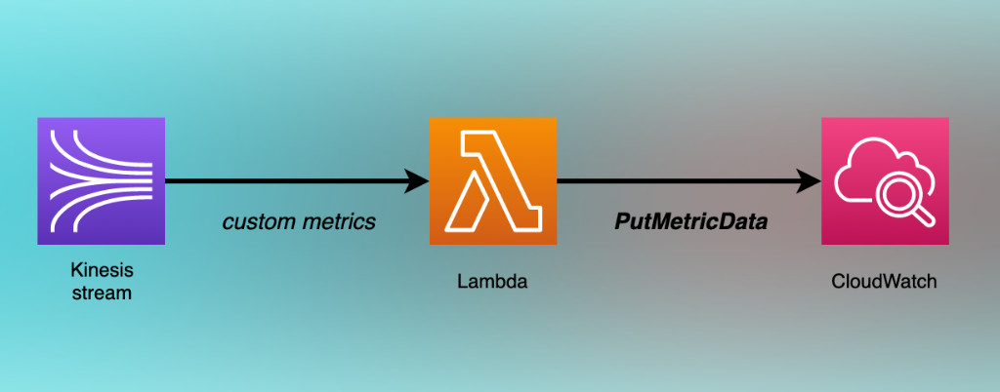
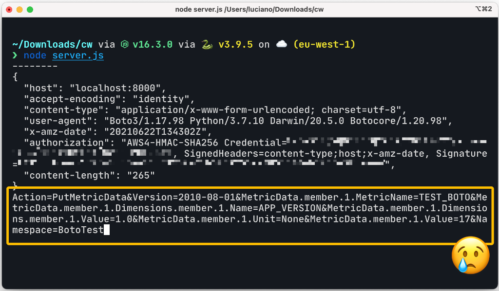
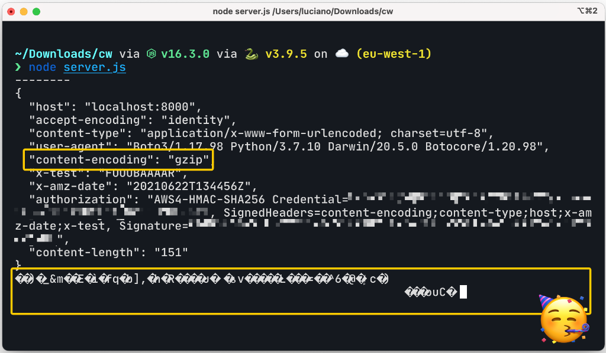
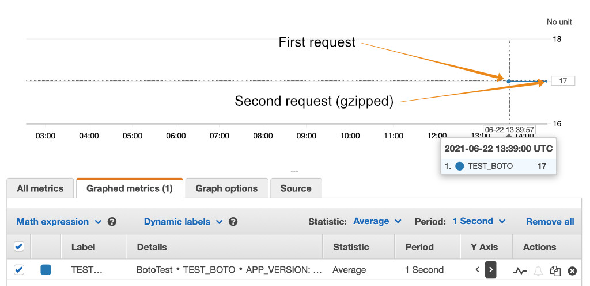

I recently needed to send a big payload to CloudWatch and I managed to increase my chances of staying within the AWS payload size limit by using gzip encoding on the request body with `boto3`.

Unfortunately, with `boto3`, gzip encoding is not enabled by default and it can't be turned on with some simple boolean flag. To make things worse, as of today, there isn't a great body of documentation or examples available on how to achieve this. Or maybe I am just terrible at _googling_...

I had to go down the rabbit hole to figure out how to support this use case and, in this article, I want to share what I learned with you.


## Send gzipped metrics to CloudWatch using boto3 

Ok, this is the TLDR; a little gift for the ones in a rush that are looking for a quick _copy-pastable_ solution.

Be aware that the various AWS SDKs are just a convenience layer in front of the AWS HTTP API. Python and `boto3` are no exception. Every time you are calling a method on a `boto3` client, you are just sending HTTP requests to AWS behind the scenes...

This is how you can intercept and modify such HTTP requests before they are sent to AWS:

  1. `boto3` has a built-in event system that, among other things, allows you to intercept (and even modify) HTTP requests that are ready to be forwarded to AWS.
  2. By using this event system, you can implement an event handler that takes the payload of an outgoing request and gzips it. The same handler can also alter the set of outgoing HTTP headers so that it can indicate the request is gzipped by adding the header `Content-Encoding: gzip`.

Here is a code example that uses a CloudWatch client, intercepts calls to the `PutMetricData` API, and gzips the request payload:


```python
import boto3
import gzip

# Create a CloudWatch client
cw_client = boto3.client('cloudwatch')

# Get a reference to the event system for that client
event_system = cw_client.meta.events

# Event handler that takes an arbitrary request and gzips its body
def gzip_request_body(request, **kwargs):
    gzipped_body = gzip.compress(request.body)
    request.headers.add_header('Content-Encoding', 'gzip')
    request.data = gzipped_body

# Register the event handler (only for CloudWatch PutMetricData!)
event_system.register('before-sign.cloudwatch.PutMetricData', gzip_request_body)

# Sends a request
cw_client.put_metric_data(
    MetricData = [
        {
            'MetricName': 'KPIs',
            'Dimensions': [
                {
                    'Name': 'PURCHASES_SERVICE',
                    'Value': 'CoolService'
                },
                {
                    'Name': 'APP_VERSION',
                    'Value': '1.0'
                },
            ],
            'Unit': 'None',
            'Value': 217
        },
    ],
    Namespace='CoolApp'
)
```

You are welcome! 😜

Now, if you are curious to know more about my use case and how the `boto3` events system works you are more than welcome to keep reading the rest of the article.


## The use case: sending custom metrics to CloudWatch

Last week, during my work at [fourTheorem](https://www.fourtheorem.com/), we started to get intermittent alarms for a Lambda in our stack that was failing because of requests to CloudWatch being occasionally throttled.

Once we looked at the error, the problem was actually quite obvious, but let me give you a simplified overview of what we are doing with this Lambda.

This Lambda is triggered by a Kinesis stream in which we publish custom metric data from all the other components of our application. The Lambda reads these metrics and publishes them to CloudWatch using the [`PutMetricData` API](https://docs.aws.amazon.com/AmazonCloudWatch/latest/APIReference/API_PutMetricData.html).



<small>Note that this idea is coming from [Lumigo's SAR async Lambda metrics](https://github.com/lumigo-io/SAR-async-lambda-metrics).</small>

The issue is that in our original implementation we took the naive approach of submitting 1 data point at a time. Therefore, under load, we would be sending a large number of HTTP requests per second to AWS and we might end up being throttled.

The solution to the problem is actually quite simple: we can reduce the total number of HTTP requests by sending the data in batches containing multiple data points, rather than sending data points one by one.

This is actually possible by using the same `PutMetricData` API from CloudWatch.


## CloudWatch `PutMetricData` limits

So apparently the solution is simple: we just need to send multiple data points for every single `PutMetricData` call. But how many?

A call to this API accepts an array of metrics that looks like this:

```python
[
    {
        'MetricName': 'SomeMetric1',
        'Dimensions': [
            {
                'Name': 'Dimension1Name',
                'Value': 'Dimension1Value'
            },
            # Up to other 9 dimensions here ...
        ],
        'Unit': 'Count',
        'Values': [217, 220, 221], # Up to 150 items here ...
        'Timestamp': 1624290910000
    },
    # Up to other 19 metric items here ...
]
```

More details can be found in the documentation for the [`MetricDatum` type](https://docs.aws.amazon.com/AmazonCloudWatch/latest/APIReference/API_MetricDatum.html).

As you can tell from the comments in the snippet above, the API has some interesting limits to be considered:

  - Up to **20** different metrics
  - Up to **10** dimensions per metric
  - Up to **150 values** per metric
  - Up to **40 KB** in size for HTTP POST requests

So, the best case scenario to reduce the number of `PutMetricData` requests is to have batches of 20 metrics, but we need to make sure that all this data, once encoded, fits in 40 KB.

Splitting the metrics in chunks of 20 entries per request is not a big deal. But how do we make sure all the other constraints are respected. Especially the payload size one.

The `PutMetricData` documentation page adds an interesting bit of information:

> You can send a payload compressed by gzip.

It would be convenient to use gzip compression to increase our chances to stay within boundaries.

At this point, I thought _"Ok, probably `boto3` is automatically doing the compression for us, because why shouldn't it?"_

But if you have used AWS for long enough, you learn not to give too many things for granted, so... Let's test this assumption, first!


## Testing `boto3` default behavior

So, how can we see if the by default `boto3` is already gzipping our requests?
Requests are going to AWS and I could think of 3 different ways to inspect how the final HTTP request actually looks when sent to AWS:

 1. Use a debugger and step through the execution in the deep corners of the `boto3` code.
 2. Use an HTTP proxy like [Burp Suite](https://portswigger.net/burp/communitydownload) to intercept all the outgoing traffic and have a chance to inspect what's being sent to AWS.
 3. Use the [`endpoint_url` parameter](https://boto3.amazonaws.com/v1/documentation/api/latest/reference/core/session.html#boto3.session.Session.client) to configure the `boto3` client to send requests somewhere else.

I opted for option 3, just because I thought it would be the quickest and easiest for me. I quickly wrote a very simple [HTTP debugging server in Node.js](https://gist.github.com/lmammino/34373d61ff28ba34c9c26eb1edad5684) and let it listen for requests at `locahost:8000`.

At this point I could simply run the following Python code to see how `boto3` would send a `PutMetricData` request to AWS:

```python
import boto3
import gzip

endpoint_url = "http://localhost:8000/"

cw_client = boto3.client('cloudwatch', endpoint_url=endpoint_url, use_ssl=False)

cw_client.put_metric_data(
    MetricData = [
        {
            'MetricName': 'TEST_BOTO',
            'Dimensions': [
                {
                    'Name': 'APP_VERSION',
                    'Value': '1.0'
                },
            ],
            'Unit': 'None',
            'Value': 17
        },
    ],
    Namespace='BotoTest'
)
```

Note that I am also using `use_ssl=False` because my local endpoint supports only plain HTTP.

Ok at this point I used all my confidence in AWS and run this script... This is what I got in my debug web server:



As you can see from the picture above, `boto3` does not use gzip compression by default.

Sad me... 😢 Time to roll up the sleeves and figure out how to gzip the request body manually!


## The `boto3` events system

After some research, I discovered that `boto3` has a [built-in event system](https://boto3.amazonaws.com/v1/documentation/api/latest/guide/events.html).

This event system allows you to intercept requests being sent to AWS and alter them before they are sent. You can also intercept responses coming from AWS.

This is not a very well known feature of `boto3`, but I can see it being useful in a couple of circumstances:

 - Log all outgoing requests and incoming responses (for debugging)
 - Alter HTTP requests or HTTP responses to and from AWS to implement custom behaviors (gzipping the payload of outgoing requests is a great example).

If you want to look at a quick example of how to use this feature, here is one: we want to add an `x-trace-id` header when we invoke a lambda using `boto3`:

```python
import boto3

lambda_client = boto3.client('lambda')

# our event handler
def add_xtrace_header(request, **kwargs):
    request.headers.add_header('x-trace-id', 'trace-trace')

# get the event system for the lambda_client
event_system = lambda_client.meta.events

# attach an event handler to the client for 
event_system.register('before-sign.lambda.Invoke', add_xtrace_header)

# invoke a lambda function
lambda_client.invoke(FunctionName='my-function')
```

The example should be pretty straightforward, but let's zoom on some interesting details.

  - An event handler is just a function that receives a number of arguments that depend on the type of event.
  - Every `boto3` client exposes the event system as `client.meta.events`.
  - We can register an event handler by using the `register` function on the event system of a given client and pass the event name and the handler to it.

The event name is interesting because it follows this specification:

```text
<event-type>.<service-name>.<operation-name>
```

  - `event-type` is used to indicate the type of event. This is generally representing a phase of the lifecycle of a request. Some examples are `provide-client-params`, `request-created`, `before-sign`, `before-send`, and `response-received`.
  - `service-name` is the name of the service used. For instance: `s3` or `cloudwatch`.
  - `operation-name` indicates the type of operation the client is trying to perform (the method). For instance: `PutMetricData` or `Invoke`.

Not all these parts are mandatory and you can create event listeners for multiple events. Let's look at some examples:

  - `*` will listen to every event
  - `after-call.lambda.*` (or `after-call.lambda`) will listen to all `after-call` type events for lambda and intercept all methods.

The `botocore` documentation isn't very clear on how these events work, but after some digging, I managed to find the slides of a very interesting talk by [Kyle Knapp](https://twitter.com/thekyleknapp) called [Deep Dive on AWS SDK for Python (Boto3)](https://pages.awscloud.com/rs/112-TZM-766/images/B-4.pdf). This one was a real lifesaver for me to understand how all of this works! Thank you, Kyle!


## A `boto3` event handler for gzipping requests

At this point, we know enough to understand how we can add the gzip behavior to our CloudWatch `PutMetricData` requests.

Let's update our test example and add a custom event listener:

```python
import boto3
import gzip

endpoint_url = "http://localhost:8000/"

cw_client = boto3.client('cloudwatch',  endpoint_url=endpoint_url, use_ssl=False)
event_system = cw_client.meta.events

# Gzip handler
def gzip_request_body(request, **kwargs):
    gzipped_body = gzip.compress(request.body)
    request.headers.add_header('Content-Encoding', 'gzip')
    request.data = gzipped_body

# registers the custom handler
event_system.register('before-sign.cloudwatch.PutMetricData', gzip_request_body)

response = cw_client.put_metric_data(
    MetricData = [
        {
            'MetricName': 'TEST_BOTO',
            'Dimensions': [
                {
                    'Name': 'APP_VERSION',
                    'Value': '1.0'
                },
            ],
            'Unit': 'None',
            'Value': 17
        },
    ],
    Namespace='BotoTest'
)

print(response)
```

Note that we are using the `before-sign` event type because we want to alter the request before the signature is applied to the request.

If we run this code and check our debug web server we will see something like this:



Now the requests are compressed! We are sending exactly the same request as before and now it's sending only **151 bytes** as opposed to **265 bytes** from the original request!

That's some pretty good compression!

Of course, your mileage might vary depending on the shape of your custom metrics. Figuring out how much data can you actually pack in 40 KB might take a little bit of research. Keep in mind you are still limited to 20 metrics per request and 10 dimensions per metric. Gzipping is only increasing your chances to stay within boundaries if you really have to use a lot of dimensions (maybe with long names) or if you have a lot of values per metric.

Now, if we remove the configuration for `endpoint_url` and send the request to AWS, we can see that everything still works and that the compressed request is processed correctly:



Success!


## A few ideas for more defensive solutions

Compressing the payload for `PutMetricData` requests is not an absolute guarantee that we won't be exceeding the 40 KB payload limit. Gzip certainly helps, but you might still bump into the limit and have failures in your application.

If you want to be _failure-proof_ ™️, here are some ideas that we explored with our colleagues:

  - Optimistic solution: Try the request and catch potential exceptions. If you see the `PutMetricData` failed because the payload is too large, just split all the data into 2 requests.
  - Pessimistic solution: pre-compute the gzipped payload before sending the request and if that's bigger than 40 KB, then split the request into 2 parts.

The pessimistic solution has the disadvantage that you will be gzipping the payload twice (before you create the request to make sure it's within boundaries and then in your event handler), but it will avoid sending invalid requests upfront.

Right now, we haven't implemented any of these strategies. In our case, these metrics are not business-critical and we can afford some sparse failure, so we preferred to keep the code as simple as possible.

If, later on, we will observe production errors, then it might be worth applying one of these strategies. I am more in favor of the optimistic approach because I expect it will be pretty rare to bump into this limit.

What do you think, which strategy would you apply? Do you have other ideas? let me know that in the comments box below! 😁


## Extensibility in the AWS SDK

**UPDATE**: It turns out that also with other languages like PHP, Go and JavaScript, the AWS SDK offers some degree of extensibility that should allow you to accomplish something similar to what was discussed in this post.

If you are using any of these other languages you can consult the following resources:

  - [Customizing the AWS SDK for Go V2 Client Requests](https://aws.github.io/aws-sdk-go-v2/docs/middleware/)
  - [Introducing Middleware Stack in Modular AWS SDK for JavaScript](https://aws.amazon.com/blogs/developer/middleware-stack-modular-aws-sdk-js/)
  - [Handlers and Middleware in the AWS SDK for PHP Version 3](https://docs.aws.amazon.com/sdk-for-php/v3/developer-guide/guide_handlers-and-middleware.html)

Thanks a lot to the following (amazing) people at AWS for helping me to find out this information in the huge haystack that is the AWS documentation: [Danilo Poccia](https://twitter.com/danilop), [Heitor Lessa](https://twitter.com/heitor_lessa), and [Trivikram](https://twitter.com/trivikram). You rock! 🤘


## Conclusion

The event system in `boto3` is pretty powerful and it allows you to customize the default behavior of how clients will send HTTP requests to AWS.

In this article, we saw how that can be useful for inspecting how AWS APIs are actually used or to add additional functionality that isn't supported out of the box (e.g. gzipping the HTTP payload of outgoing requests).

If you found this article useful [consider following me on Twitter](https://twitter.com/loige) and feel more than welcome to leave a comment below. I'd be really curious to find out what was your use case and if this article helped you out.

A huge "thank you" goes to my colleague [Martin](https://twitter.com/martinbpeters) for involving me in this piece of work (and indirectly for dragging me into this rabbit hole 🐇)! Also thanks to [Eoin Shanaghy](https://twitter.com/eoins) for kindly reviewing this article! Finally thanks to [Ben Bridts](https://twitter.com/benbridts) for reporting an error in one of the examples! 🙏

See you soon! 👋


### About fourTheorem

If you want to know more about [fourTheorem](https://www.fourtheorem.com/), we are a team of business-focused technologists that deliver. We have been helping a dozen companies to get the best out of AWS and we had a lot of fun while doing that. If you are curious to know more about what we do you can check out some of our [case studies](https://www.fourtheorem.com/case-studies) and our [customer success stories](https://www.fourtheorem.com/customers).

If you would like to work with us, don't be shy, [we'd love to get in touch with you](https://www.fourtheorem.com/contact)! 🙂
