A post where I reflect on my professional life in 2021 as a look ahead for what to expect in 2022.

As usual, let me tell you that I write this kind of posts for myself and I don't expect other people to be able to read this and be engaged. So, if you really feel like you want to venture forward and have a peek on my 2021, well, I am flattered... but make sure to grab a coffee, because this might get a little (just a little...) boring!

Yes, this GIF is probably the least boring element of the whole article! 😍

## Joining fourTheorem

The biggest highlight of my 2021 is that in February I joined [fourTheorem](https://www.fourtheorem.com/) as a **Senior Architect**.

[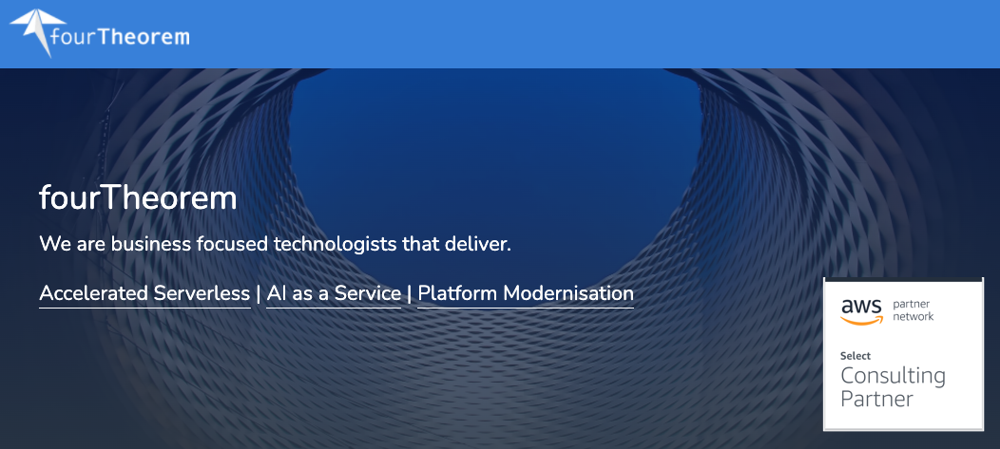](https://www.fourtheorem.com/)

If you never heard about fourTheorem, here's what you need to know. It's a great service company founded by [Peter Elger](https://www.linkedin.com/in/peterelger), [Fiona McKenna](https://www.linkedin.com/in/fiona-mc-kenna-174172a2) and [Eoin Shanaghy](https://www.linkedin.com/in/eoins).

The company, while still relatively new and small, has a large amount of expertise in [serverless](/tag/serverless), **platform modernisation** and [AI as a service](https://www.manning.com/books/ai-as-a-service). Most importantly, fourTheorem has a huge amount of experience with [AWS](/tag/aws). We are **AWS Consulting Partners** and we have been helping small and big customers to transition to the cloud and get the best out of it!

I have to admit I was initially skeptical about being able to work with a company that is not focused on delivering one single product but that is mainly helping many other companies to do that. In the past I rarely had a great experience when being on the other side and dealing with other service companies.

But I was immediately reassured by the fact that Eoin and Peter are not just two amazingly good technical founders, but they also have an impressive track record working with companies of all sizes: from small startups to big corporations. Together with Fiona, the founding trio has a very inspiring vision for what they want the company to become.

I immediately had the feeling that they wanted to build something very different from the other service companies out there. This feeling became apparent pretty quickly just after the first week, when I saw how they managed to embed their team into the customer's team and work together in all the phases of the product. FourTheorem can literally be an extension of a team, bringing not just people and technology skills, but also a very practical and agile approach to software delivery.

And after almost a year, I cannot hide the fact that I have never been happier in a technical position. I can work in an environment with fantastic colleagues, an amazing culture, in a very supportive environment where I am learning a ton. Most importantly, I feel like there is a lot of potential and that I can have an impact.

Finally I get a significant amount of "work time" to invest in content creation, open source and to study (new tech, certifications, etc.). This is something that I consider integral part of my professional career path and it's great to see that it is valued and supported!

Mandatory disclaimer: we are always hiring, so if you are interested feel free to reach out to me on [Twitter](https://twitter.com/loige) or [LinkedIn](https://www.linkedin.com/in/lucianomammino/).

Also... if you are looking for help for your cloud migration or to improve your AWS deployments, don't be shy, [let's have a coffee-chat](https://www.fourtheorem.com/contact)! 😉

> Be not afraid of discomfort. If you can't put yourself in a situation where you are uncomfortable, then you will never grow. You will never change. You'll never learn.
> 
> — Jason Reynolds

## Becoming an MVP

In 2021 I was awarded the title of **Most Valuable Professional** ([MVP](https://mvp.microsoft.com/en-us/)) for **Developer Technologies** by **Microsoft**:

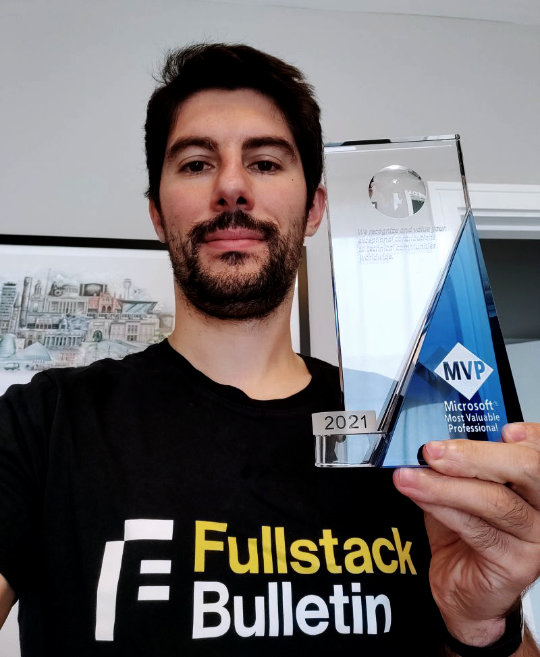

The MVP program awards _exceptional community leadership_ across the world of tech.

Apparently, to become an MVP, you need to do the following 4 things:

  - Demonstrate community leadership and influence
  - Be a technical expert
  - Be a great advocate for the community
  - Contribute to the success of our products

If nothing else, this makes me think that the community is getting some value from the work I am doing and this can only push me to do more!

I am really glad that the amazing [Francesco Sciuti](https://www.linkedin.com/in/francescosciuti) (who nominated me) thinks that I have done such a good job to deserve the award and thanks Microsoft for agreeing with him! ❤️

One funny thing is that, during the due diligence phase, Microsoft makes you fill a big form to list all the things you think had the most impact on the community. Having written posts like this in the last few years helped me a lot to come up with a consistent list. Maybe it wasn't such a bad idea to write these posts after all...

If you are curious, you can also [check out my profile](https://mvp.microsoft.com/en-us/PublicProfile/5004232?fullName=Luciano%20Mammino) on the MVP network.

> It's not like after winning an award, your job is done and you can relax. You still have to work hard.
> 
> — Diljit Dosanjh

## Public speaking

In 2021 I had the pleasure (and the immense luck) to be able to do quite a lot of publick speaking.

It's hard to pick a favourite but, being such a fan of Node.js, there's one that I am particularly proud about: [NodeConf Remote](https://www.nodeconfremote.com/)!

[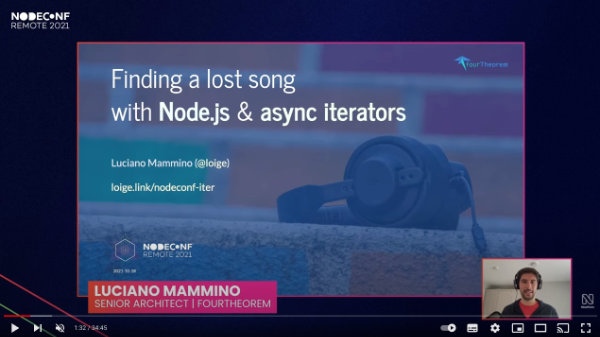](https://www.youtube.com/watch?v=uTzBHPpMEhA)

Here's the full list of talks, workshops and interviews that I delievered in 2021:

  - An opinionated intro to Node.js - Devrupt Hospitality Hackaton ([Slides](https://loige.link/devrupt-node))
  - From Node.js to Design Patterns - Codemotion DevCast ([Slides](https://loige.link/devrupt-node))
  - Let's play with Node.js streams (workshop) - CityJS ([Slides](https://loige.link/streams-city))
  - Let's play with Node.js streams (workshop) - Codemotion ([Slides](https://loige.link/streams-cm))
  - A podcast about Node.js with Vishwas Narayan ([Slides](https://www.youtube.com/watch?v=Wmu53Xos7Ug))
  - My first Rust crate: jwtinfo (lightning talk) - Rust Dublin Meetup ([Slides](https://loige.link/rust-jwt), [Video](https://youtu.be/FuqLMqGcEE4))
  - Chats and career advice with Superheroes Valley
  - Live stream with Fabio Biondi - Node.js Streams ([Video](https://www.youtube.com/watch?v=hOHTQgOtg3w))
  - Finding a lost song with Node.js & async iterators - Node.js Dublin meetup ([Slides](https://loige.link/async-it))
  - Interview with Gitbar podcast ([Podcast Episode](https://www.gitbar.it/episodes/ep-73-js-con-luciano-mammino_2))
  - Javascript: repetita iuvant - Codemotion DevCast ([Slides](https://loige.link/devcast2))
  - Teach Kelvin Your Thing: JavaScript Async iterators ([Video](https://www.youtube.com/watch?v=l2CA9FtW1Pw))
  - An intro to the JAMStack & Eleventy - Codemotion ([Slides](https://loige.link/11ty-jam), [Video](https://talks.codemotion.com/an-intro-to-the-jamstack--eleventy))
  - Reiterating JavaScript and Node.js iterators - RomaJS ([Slides](https://loige.link/iter), [Video](https://www.youtube.com/watch?v=2jzN7Ns5jeQ))
  - A chat with Luca Brunello ([Video](https://www.youtube.com/watch?v=-M6zWYVwuz4))
  - AWS Observability without the pain ([Slides](https://fth.link/o11y-no-pain))
  - Finding a lost song with Node.js & async iterators - Sailsconf ([Slides](https://loige.link/iter-sails), [Video](https://www.youtube.com/watch?v=yott9nYsEZ8))
  - How to send gzipped requests with boto3 ([Slides](https://loige.link/gzip-boto3))
  - Quality questions with the NoobDev podcast ([Podcast Episode](https://anchor.fm/noobdevtalks/episodes/Episode-11---Quality-Questions-with-Luciano-M-e1817pb/a-a6jrkh1))
  - Finding a lost song with Node.js & async iterators - EnterJS ([Slides](https://loige.link/enter-iterators))
  - How to Train a Computer Vision Model - Sparkd.ai on Twitch ([Slides](https://docs.google.com/presentation/d/151ts-Rw_EG0-4zBk-kGRniX2ImoCga8y28Qtayj78YI/edit?usp=sharing), [Video](https://youtu.be/urCY_2-n2r0))
  - Finding a lost song with Node.js & async iterators - NodeConf Remote ([Slides](https://loige.link/nodeconf-iter), [Video](https://youtu.be/uTzBHPpMEhA))
  - Semplificare l'observability per progetti Serverless su AWS - Cloud Day conference ([Slides](https://loige.link/simple-obs))
  - AWS Observability made simple - AWS Community Day Ireland ([Slides](https://fth.link/o11y-simple))
  - Authors and Architects (Panel) - AWS Community Day Ireland
  - Serverless, Devops & Developer Tools (Panel) - AWS Community Day Ireland
  - Node.js, Rust & Cloud Architectures (interview) - Inference Podcast ([Video](https://www.youtube.com/watch?v=oCjps_uv7P4))
  - A look inside the European Covid Green Pass - Codemotion ([Slides](https://loige.link/green), [Video](https://talks.codemotion.com/a-look-inside-the-european-covid-green-p?playlist=online-tech-conference-2021---english-ed))
  - Node.js scalability tips - Azure Developer Community Meetup ([Slides](https://loige.link/node-adc))

I am stopping counting them (more on this later), but just looking at the length of the list this year feels like a personal record from this the public speaking angle.

If you are curious to see all my talks, I keep collecting them in the [speaking section](/speaking) of this blog.

After 2 years of remote speaking I have to admit that, even if I like to be able to speak to people all around the world with just a click, I do miss meeting people face to face. It feels like I haven't been able to form the same level of relationship I had the fortune to form in the previous years where I was able to meet attendees, organisers and other speakers in person.

Hopefully this year it will be safe to do a few events in person again. 🤞

> Sharing is good, and with digital technology, sharing is easy.
> 
> — Richard Stallman

## AWS Bites

A new activity I started this year is [AWS Bites podcast](https://awsbites.com). AWS Bites was born from an idea of [Eoin Shanaghy](https://twitter.com/eoins). It's essentially a podcast series where, in every episode, we try to answer an interesting questions about AWS.

If you want to have a feeling for it, this one is probably one of my favourite episodes so far:

<iframe style="position: absolute; top:0; left: 0; width: 100%; height: 100%;" src="https://www.youtube.com/embed/qf0CuUOtPEI" frameborder="0" allowfullscreen></iframe>

Some other episodes I am really proud about:

  - [19. Is the serverless DX still immature?](https://www.youtube.com/watch?v=WF701W3akKw&list=PLAWXFhe0N1vKrKPvgO30WJxhXoYO0-Aaq&index=19)
  - [16. What are the pros and cons of CDK?](https://www.youtube.com/watch?v=jjyNTNQdW2s&list=PLAWXFhe0N1vKrKPvgO30WJxhXoYO0-Aaq&index=16)
  - [10. Lambda or Fargate for containers?](https://www.youtube.com/watch?v=a57pXpcA_Bs&list=PLAWXFhe0N1vKrKPvgO30WJxhXoYO0-Aaq&index=10)
  - [01. When should I use serverless?](https://www.youtube.com/watch?v=UiXAKbPSVsE&list=PLAWXFhe0N1vKrKPvgO30WJxhXoYO0-Aaq&index=1&t=1s)

The goal for this podcast is to be able to share our AWS expertise in a simple and easy to digest format.

Even if we have recorded more than 20 episode it still feels like we are at the beginning of the journey and we are often trying to revisit and refine the format and the delivery. So, if you have any suggestion please let us know!

Also, if you like the format don't forget to subscribe [AWS Bites YouTube channel](https://www.youtube.com/AWSBites). 🙏

If you prefer the audio-only version, you can check out [AWS Bites podcast on Anchor.fm](https://anchor.fm/aws-bites), which also makes it available on [Spotify](https://open.spotify.com/show/3Lh7PzqBFV6yt5WsTAmO5q), [Apple Podcasts](https://podcasts.apple.com/us/podcast/aws-bites/id1585489017), [Google Podcasts](https://www.google.com/podcasts?feed=aHR0cHM6Ly9hbmNob3IuZm0vcy82YTMzMTJhMC9wb2RjYXN0L3Jzcw==) and others!

> The art and science of asking questions is the source of all knowledge.
> 
> — Thomas Berger

## Advent of Code in Rust (Twitch live streams)

On my personal quest to learn [Rust](/tag/rust), I decided to start a [Twitch channel](https://www.twitch.tv/loige) where I could live-stream my efforts. And the best thing ever is that I haven't been alone in this effort because I have been joined by my good friends [Roberto](https://twitter.com/gbinside) and [Eugen](https://twitter.com/88_eugen)!

Together we have been live-streaming our attempts at cracking [Advent of Code](https://adventofcode.com/) using Rust. It has been a great challenge and a very good way to consistently have something to hack in Rust.

We are posting all the recordings on [YouTube](https://www.youtube.com/channel/UCL0w2IAjTBx3NNka-l7InPw), so if you are really curious to see us stumbling against the Rust borrow checker or scratching our head with some interesting algorithm you can do that (even at 2x speed).

<iframe style="position: absolute; top:0; left: 0; width: 100%; height: 100%;" src="https://www.youtube.com/embed/A10n3rO9ems" frameborder="0" allowfullscreen></iframe>

Last year we managed to complete all the exercises from year 2020 of Advent of Code. This year we are continuing our efforts at cracking the 2021 edition. We have already [solved most of them](https://github.com/lmammino/rust-advent), so we might decide soon to start streaming other types of Rust adventures... Maybe some serverless AWS with Rust or building a game with Bevy... who knows!

We live-stream every Monday at 6PM Dublin time.

Make sure to subscribe the [YouTube channel](https://www.youtube.com/channel/UCL0w2IAjTBx3NNka-l7InPw) or [Twitch](https://www.twitch.tv/loige) if you want to learn Rust with us!

> Try to learn something about everything and everything about something.
> 
> — Thomas Huxley

## Node.js Design Patterns

The main thing to report about [Node.js Design Patterns](https://www.nodejsdesignpatterns.com/) is that the book kept getting some good amount of organic love.

I have been seeing [many](https://www.youtube.com/watch?v=AWISf1mNcso) [mentions](https://www.linkedin.com/feed/update/urn:li:activity:6860969046414897152?commentUrn=urn%3Ali%3Acomment%3A%28activity%3A6860969046414897152%2C6860982414454476800%29) [online](https://twitter.com/enriquezrene_ap/status/1481261086875783172) and even jokes!

[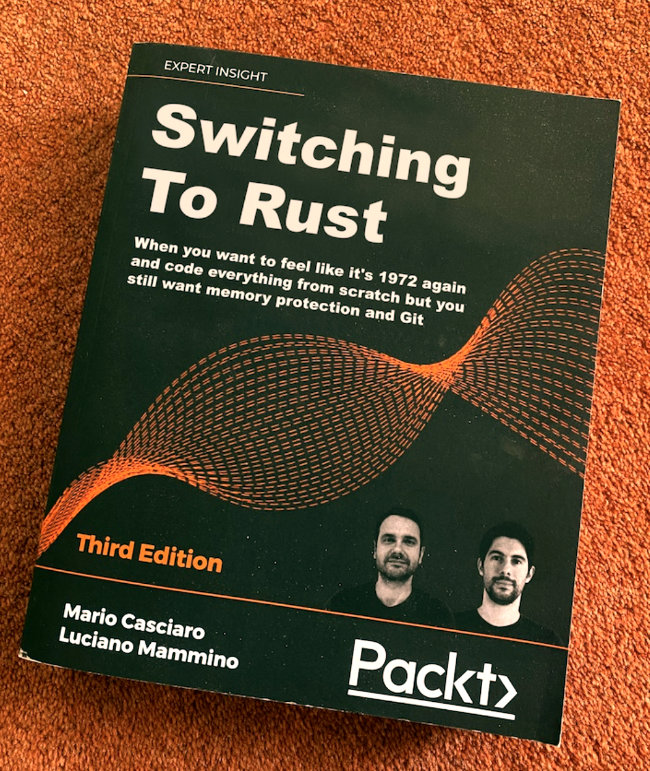](https://twitter.com/kevteljeur/status/1460563229487288322?t=PiphPnvZTXuZS7WVLC4-xA&s=19)

Thanks [Kevin](https://twitter.com/kevteljeur) for this brilliant mockup (Kevin has even created a [PHP version](https://twitter.com/kevteljeur/status/1465265876161159178/photo/2))!

⚠️ For the records, **this is a joke**, we are not writing a book about [Rust](/tag/rust) or [PHP](/tag/php)! 😅

What's amazing is that Node.js Design Patterns has recently surpassed [100 reviews on Amazon](https://nodejsdp.link/buy) and it's still rocking positively at an average of **4.6 stars**! This fills me with joy! ❤️

[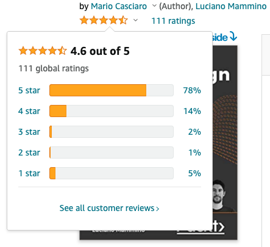](https://www.amazon.com/dp/1839214112?tag=loige09-21#customerReviews)

If you haven't left a review for Node.js Design Patterns yet, please [consider doing so](https://www.amazon.com/dp/1839214112?tag=loige09-21#customerReviews). This is one of the most effective actions you could do to help us promoting the book and tell us what we can do to make it better! 🙏

A final note is that, throughout last year, we published 3 new blog articles on the blog section of the book website:

 - [Node.js race conditions](https://www.nodejsdesignpatterns.com/blog/node-js-race-conditions/)
 - [Node.js development with Docker and Docker Compose](https://www.nodejsdesignpatterns.com/blog/node-js-development-with-docker-and-docker-compose/) (huge thanks to [Giuseppe Morelli](https://www.giuseppemorelli.net/) for authoring this one!)
 - [JavaScript async iterators](https://www.nodejsdesignpatterns.com/blog/javascript-async-iterators/)

Go check them out if you find them interesting!

> You cannot open a book without learning something.
> 
> — Confucius

## FullStack Bulletin

[FullStack bulletin](https://fullstackbulletin.com/) is a free weekly newsletter about full stack web development. I have been running this project with my dear friend [Andrea Mangano](https://twitter.com/andreaman87) for the last 4 years counting [**258 issues**](https://us15.campaign-archive.com/home/?u=b015626aa6028495fe77c75ea&id=55ace33899) today!

The project is totally [open source](https://github.com/FullStackBulletin) and uses tons of automation to minimise the amount of manual work.

Although we had some plans for a redesign, we didn't manage to find the time to ship any significant change In 2021, but the newsletter kept growing organically nonetheless.

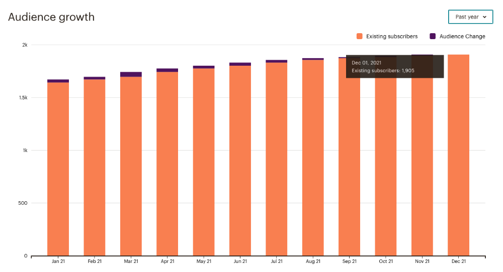

One cool thing worth mentioning is that we started to get some interest in sponsorship campaign and we managed to get 5 amazing companies to sponsor several editions of FullStack Bulletin:

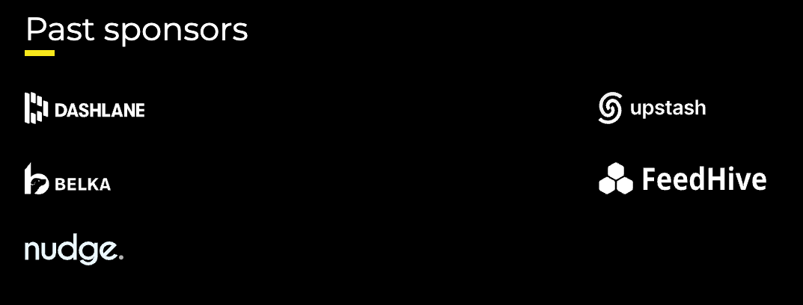

Sponsorships help us cover the costs associated with running the newsletter (Mailchimp, domains, hosting, etc.).

If you would like to support FullStack Bulletin and you have a product or an idea that you would like to expose to an audience of ~2.000 amazing full stack developers, consider [sponsoring](https://fstack.link/sponsor) one of the next issues.

Finally, there are certainly many ways we can improve FullStack Bulletin, so if you have any suggestion, please do let us know!

> More than kisses, letters mingle souls.
> 
> — John Donne

## Middy

[Middy](https://middy.js.org/) is a Node.js middleware framework for AWS Lambda. I have been working on this project since the early days of Lambda (even though the first public commit was made the 3rd of August 2017).

With that being said, I can't really claim anything for the success of the framework during the last couple of years. Insted all the credit goes to [Will Farrell](https://github.com/willfarrell), who has been relentlessy maintaining the framework, and to the amazing community behind Middy!

The reason why I wanted to mention Middy here is because last year Middy started to get a lot more traction.

First of all Middy reached **2700 GitHub stars** (not a crazy impressive number, but still something I can feel proud about):

Yeah, if you haven't given your star to the project, what are you waiting for? 😛

But let's be fair, stars are just a bit of a vanity metric! What is cooler is that Middy is currently trending at about **160.000 downloads/day**:

[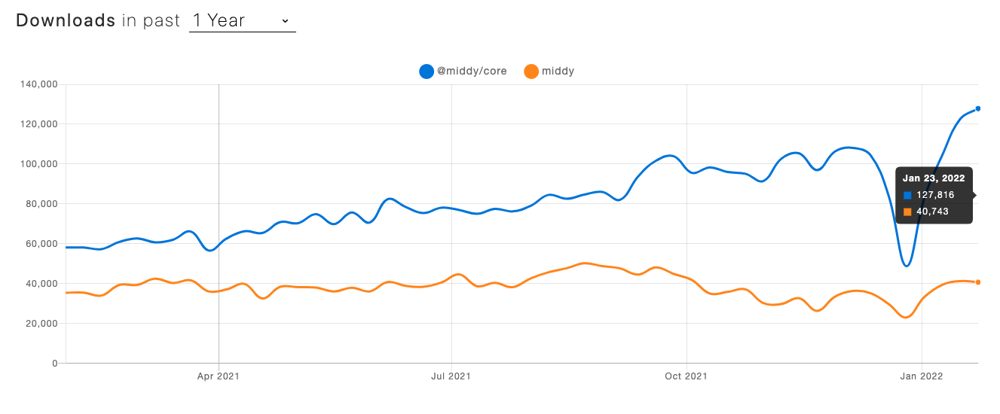](https://www.npmtrends.com/middy-vs-@middy/core)

If we look at the total number of downloads per year things seems even more impressive:

[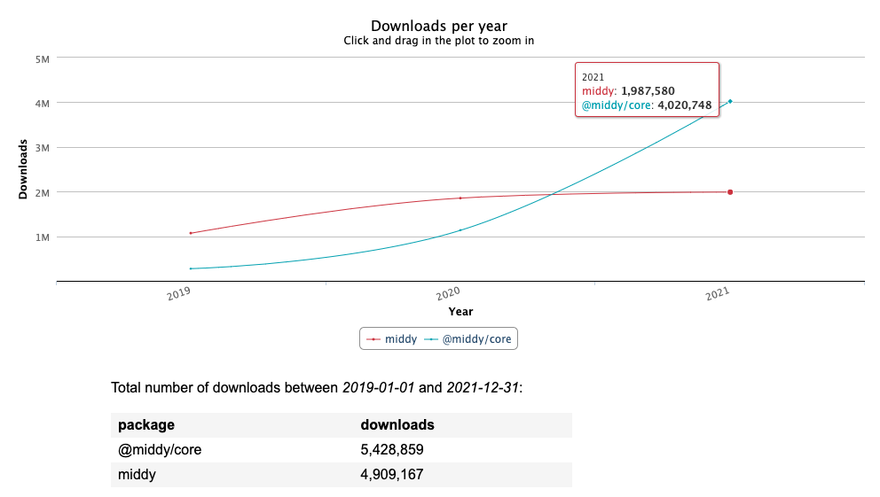](https://npm-stat.com/charts.html?package=%40middy%2Fcore&package=middy&from=2019-01-01&to=2021-12-31)

In this chart you can see that `@middy/core` + `middy` (legacy 0.x package) reached together about **6 million downloads** in 2021!

And, just to put the cherry on top of the cake, what made me really happy is that Middy started to get some interesting coverage:

 - Lambda PowerTools for TypeScript by AWS works seamlessy with Middy and [it the integration has even been showcased live by some AWS engineers](https://youtu.be/tr7DZxn3qag?t=1596)
 - Middy is helping with delivering Tacos 🌮🌮. No kidding, there's [a re:Invent 2021 talk by Taco Bells](https://www.youtube.com/watch?v=U5GZNt0iMZY&t=2974s) mentioning Middy
 - Serverless Stack (framework) has an entire documentation page showing [how to use Middy validator with Serverless Stack](https://serverless-stack.com/examples/how-to-use-middy-to-validate-your-serverless-api-requests.html)
 - Redwoodjs is [considering integrating with Middy](https://github.com/redwoodjs/redwood/issues/398)
 - Middy is also helping with [testing formula-one style electric cars](https://github.com/search?q=org%3ANortheastern-Electric-Racing+middy&type=code)... Those must definitely be faster than a scooter!

While all this success fills me with happyness, I expect even greater results for this year as [version 3](https://github.com/middyjs/middy/issues/626) is shaping up really nicely and should come out soon!

PS: Last year, Will and I were interviewed about Middy by the folks at Cooper Press: [A Chat with Will Farrell & Luciano Mammino of Middy](https://superhighway.dev/middy-node-interview).

> I bought an electric scooter in sixth grade. Bankrupted me.
> 
> — Zac Efron

## Pro-bono mentorship

In 2021, I invested some of my spare time to help engineers landing their first job. Together with my good friend [Padraig O'Brien](https://padraigobrien.com/), we helped 3 engineers to fine-tune their CV, understand how to present themselves and get ready for some coding interview.

I mostly helped around preparing for the coding interview. Altough it was a lot of fun to meet eager engineer and do some pair programming with them, the most rewarding part was to actually see that they were actually able to land their first job and that this is having a very positive impact in their lives.

Out of the 3 engineers I had the pleasure to mentor, 2 of them got a permanent role and 1 is working off a few interesting contract roles. Let me know if you are thinking about hiring full-time an amazing React/JavaScript developer and I'll put you in touch with them!

I'd love to keep investing 1 or 2 hours of my free time every month to continue this effort. It feels great to give something back to the community. I have learned from so many people during this year and it's good to finally being able to carry the torch for a bit!

If you are looking to land your first job in tech and you feel like you can use some help for the coding interview, give me a shout!

If you are keen to getting your CV reviewed and understand how you can better present yourself, make sure to reach out to [Podge](https://twitter.com/PadraigOBrien).

PS: you can also check out this article I wrote last year: [10 tips to smash the code interview](https://loige.hashnode.dev/10-tips-to-smash-the-code-interview).

> Don't judge each day by the harvest you reap but by the seeds that you plant.
> 
> — Robert Louis Stevenson

## SLIC Watch - Easy AWS o11y

Last year I had the fortune and the pleasure to use some of my fourTheorem time to contribute to a very cool open source project: [SLIC Watch](https://github.com/fourTheorem/slic-watch).

SLIC Watch is a Serverless Framework plugin that generates for you CloudWatch dashboards and alarms for:

 - AWS Lambda
 - API Gateway
 - DynamoDB
 - Kinesis Data Streams
 - SQS Queues
 - Step Functions

The idea behind this project is that very often we don't invest in providing all these observability tools just because it's hard and time consuming to get them right.

SLIC Watch tries to solve this problem by looking at all the resources in your stack and it automatically adds relevant dashboards and alarms based on common industry best practices.

This way you can get a good degree of "observability coverage" with very minimal effort (and time).

Of course, SLIC Watch cannot replace bespoke and fine tuned dashboards and alarms, but it's still good in the sense that it can give you a good base that should cover 80% of your needs. This way you can focus on the 20% that matters more and that is very bespoke for your business.

Just to give you a more practical example, if you defined a Lambda function in your application stack, SLIC Watch will automatically provision the following alarms for you:

 1. Errors
 2. Throttles, as a percentage of the number of invocations
 3. Duration, as a percentage of the function's configured timeout
 4. Invocations, disabled by default
 5. IteratorAge, for function's triggered by an Event Source Mapping

SLIC Watch also generates relevant dashboards for you:

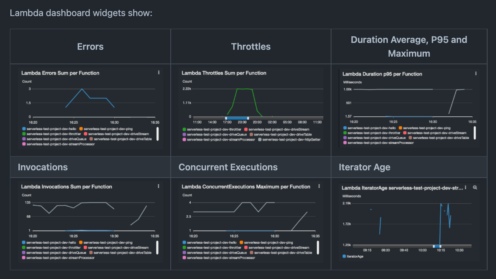

If you find this interesting, make sure to [check out the official repository](https://github.com/fourTheorem/slic-watch) (and while you are at it, give it a star 😛).

You can also check out these slides where we present the context for SLIC Watch in a more detailed way:

<iframe style="position: absolute; top:0; left: 0; width: 100%; height: 100%;" src="https://docs.google.com/presentation/d/e/2PACX-1vRZHtwsIAx9Bkae3Fp-IBvJjavIYBDy0ToJHi83upsLoCZHXWWA4aeImt5NovW8i500k52nVGU6SI_q/embed?start=false&loop=false&delayms=30000" frameborder="0" allowfullscreen="true" mozallowfullscreen="true" webkitallowfullscreen="true"></iframe>

> To acquire knowledge, one must study; but to acquire wisdom, one must observe.
> 
> — Marilyn vos Savant

## Digital Green Certificate, Covid Library (Rust)

In June last year I got curious about the QRCodes used as part of the [Digital Green Certificate program](https://github.com/ehn-dcc-development) (a.k.a. *DGC* or *DCC*).

The specification allows to encapsulate certified proof of Covid vaccination, Covid test or Covid recovery within a QRCode.

I have been thinkering with the idea of using QRCodes with a digital signature in the retail world (tickets, certified coupon codes, etc.) so I was extremely curious to learn more about this project and see how they implemented the certification.

As part of this research I ended up creating a [*decoder* library](https://github.com/rust-italia/dgc) in [Rust](/tag/rust).

  

This library allows you to be able to read all the information encoded within the QRCode and to verify the autenticity of the certificate by checking its digital signature.

It was an extremely interesting project where I got to learn a bunch of new things:

  - [Base45 encoding](https://datatracker.ietf.org/doc/draft-faltstrom-base45/)
  - [CBOR encoding](https://datatracker.ietf.org/doc/html/rfc7049)
  - [COSE](https://datatracker.ietf.org/doc/html/rfc8152) and [CWT](https://datatracker.ietf.org/doc/html/rfc8392)

...and I also reinforced a bit my understanding of cryptography and compression.

The best part is that this project somehow got the attention of the (very active) [Rust Italia](https://github.com/rust-italia) group, which helped me a lot to refine the library and to build new features.

This was amazing because it has been a great opportunity to learn from more experienced Rust developers and learn how to make a "production-ready" library. Thank you Rust Italia! ❤️

I had condensed my learning in a Codemotion talk: [A look inside the
European Covid Green Certificate](https://slides.com/lucianomammino/a-look-inside-the-european-covid-green-pass):

<iframe style="position: absolute; top:0; left: 0; width: 100%; height: 100%;" src="https://slides.com/lucianomammino/a-look-inside-the-european-covid-green-pass/embed" title="A look inside the European Covid Green Certificate" scrolling="no" frameborder="0" webkitallowfullscreen mozallowfullscreen allowfullscreen></iframe>

If this topic is something that interests you, I will be delivering the same talk again at [Rust Dublin Meetup](https://www.meetup.com/Rust-Dublin/events/283613610/), this month!

> When solving problems, dig at the roots instead of just hacking at the leaves.
> 
> — Anthony J. D'Angelo

## Articles

In addition to the articles already mentioned for the Node.js Design Patterns blog, I managed to write a few more articles during 2021.

Here's the full (boring) list of the ones published in this blog:

  - [Where to go to learn Rust in 2021](/where-to-go-to-learn-rust-in-2021)
  - [Rust shenanigans: return type polymorphism](/rust-shenanigans-return-type-polymorphism)
  - [How to to_string in Rust](/how-to-to-string-in-rust)
  - [How to send gzipped requests with boto3](/how-to-send-gzipped-requests-with-boto3)
  - [Provision an Ubuntu-based EC2 instance with CDK](/provision-ubuntu-ec2-with-cdk)
  - [Create resources conditionally with CDK](https://loige.co/create-resources-conditionally-with-cdk)

In retrospective, it's interesting to see a good mix of [Rust](/tag/rust) and [AWS](/tag/aws) articles. I think this reflects well where my learnings have been focused throughout the year.

I also ended up publishing a few articles outside this blog:

 - [AWS Lambda CI with Buddy](https://buddy.works/tutorials/aws-lambda-ci-with-buddy)
 - [Configure ESlint and StandardJS](https://loige.hashnode.dev/configure-eslint-and-standardjs)
 - [Easy Serverless observability on AWS with SLIC Watch](https://www.linkedin.com/pulse/easy-serverless-observability-aws-slic-watch-luciano-mammino/)
 - [10 tips to smash the code interview](https://loige.hashnode.dev/10-tips-to-smash-the-code-interview)
 - [Your Lambdas are failing and you don't even know!](https://loige.hashnode.dev/your-lambdas-are-failing-and-you-dont-even-know)

Let's have a quick look at some stats for this blog:

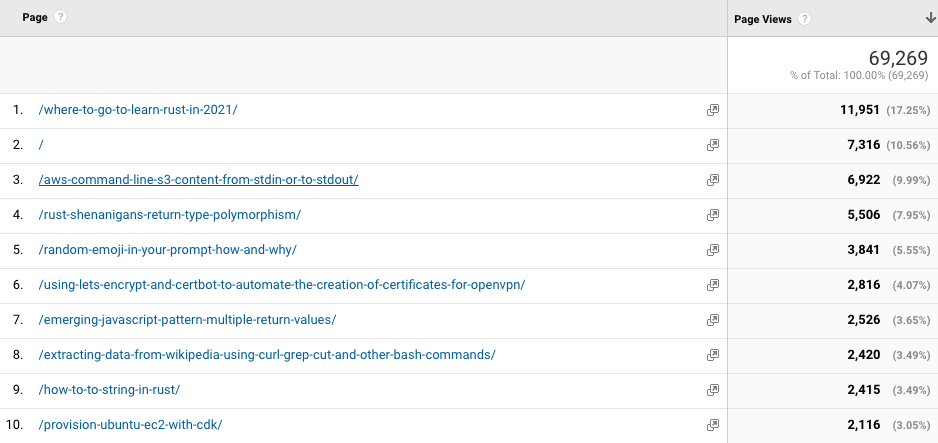

It's interesting to see a mix of new and old articles, But other than that the figures in terms of total number of page views are not to far off from last year (about 70k pageviews).

If we look at acquisition channels, the figure does not change too much from last year:

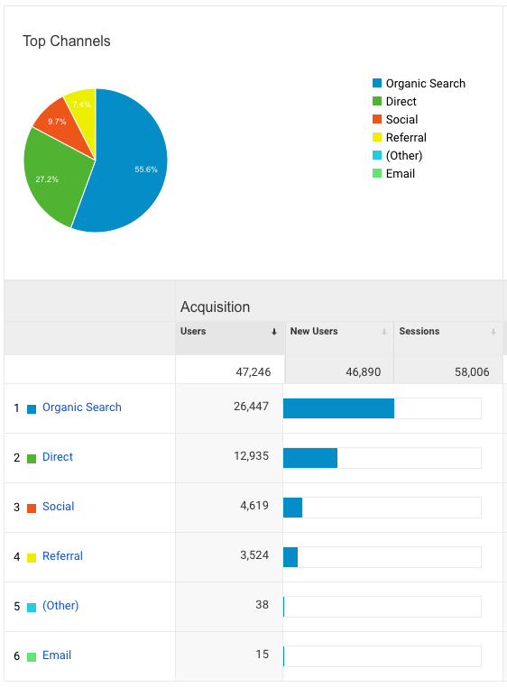

The majority (more than half) of the readers came from organic search. This is probably because I have a large chunk of articles in the long time still driving a lot of traffic and hopefully because of some SEO.

But, if I have to be honest, I am not particularly interested in doing an in-depth analysis and trying to figure out how to squeeze more traffic from search engines.

I should probably focus more on figuring out what topics are the most interesting for my audience and make sure I have a steady line of content to target those.

> Whether you're keeping a journal or writing as a meditation, it's the same thing. What's important is you're having a relationship with your mind.
> 
> — Natalie Goldberg

## Open Source

Every year I reported here a list with every single repo I contributed to. It's honestly a waste of time (I am finally admitting that), so let me just summarise the ones that I think are more meaningful:

  - [`scrobbles`](https://github.com/lmammino/scrobbles) is a [Node.js](/tag/node-js) library that allows you to fetch your "scrobbles" (songs you have been listening to) from Last.fm.
  - I have created a [Node.js](/tag/node-js) Streams workshop that you can avail for free: [`lmammino/streams-workshop`](https://github.com/lmammino/streams-workshop).
  - I created the repo [`lmammino/async-iteration-http-requests`](https://github.com/lmammino/async-iteration-http-requests), where i thinker with the idea of using async iterators to handle incoming requests in a [Node.js](/tag/node-js) web server. This is something that Deno suggests as standard way build web servers. This experiment sparked a bunch of interesting conversations and I ultimately think this might be a dangerous practice.
  - I created a repo with all my examples from the talk "Finding a lost song with [Node.js](/tag/node-js) and async iterators": [`lmammino/node-async-iterators-talk-examples`](https://github.com/lmammino/node-async-iterators-talk-examples)
  - I created the repo [`lmammino/javascript-iteration-protocols`](https://github.com/lmammino/javascript-iteration-protocols) to show many different ways that you can use to do iteration in JavaScript and [Node.js](/tag/node-js).
  - As part of my research for DGC, I ended playing with several [Rust](/tag/rust) libraries for handling CBOR and eventually I contribured to my favourite one: [`enarx/ciborium`](https://github.com/enarx/ciborium). In this case I added a bunch of helper functions to simplify deserialization.
  - I contributed to [`udondan/cdk-ec2-key-pair`](https://github.com/udondan/cdk-ec2-key-pair), a [CDK](/tag/cdk) construct that allows you to generate key pairs for [AWS](/tag/aws) EC2 instances. Small contribution to the docs, mostly redacting some examples that were a bit out of date.
  - I started [`gmaps-static`](https://github.com/lmammino/gmaps-static), a [Rust](/tag/rust) crate that allows you to build URLs for [Google Maps static pictures](https://developers.google.com/maps/documentation/maps-static/overview). I even [recorded a live video](https://youtu.be/d_RfLXdSBl4) while coding this together with [Tommaso Allevi](https://twitter.com/AlleviTommaso). It is still not fully complete but it was a great experiment to learn a bunch of new interesting Rust concepts. Thank you, Tommaso! 🙌
  - I consider playing the best way to learn something. If you can make it fun, you won't even notice you are learning. For this reason I started [`lmammino/awesome-learn-by-playing`](https://github.com/lmammino/awesome-learn-by-playing), a repository where I tried to collect all the resources that can teach you about coding and electronics by playing games. This project gathered a bunch of contributors and many stars (thanks everyone), so it seems many people like to learn by playing. 😊
  - [`allwords`](https://github.com/lmammino/allwords) is another [Rust](/tag/rust) crate that allows you to sequentially generate all the possible combinations of words over a set of characters. Could be useful for brute force attacks or fuzzy testing.
  - [`rollz`](https://github.com/lmammino/rollz) is a very simple [Rust](/tag/rust) crate that allows you to... roll dice! Nothing special except it was a great way to experiment with return type polymorphism and generics in Rust.
  - I have been a pedantic nerd by [sending a PR to CircleCI](https://github.com/CircleCI-Public/node-orb/pull/79/files) where I renamed all their references to "NodeJS" to "[Node.js](/tag/node-js)"! 😅
  - [`Microfeat`](https://github.com/lmammino/microfeat) is a super-simple and incomplete feature flag server written in [Rust](/tag/rust). I wrote this during an hackaton with [Roberto Gambuzzi](https://twitter.com/gbinside) and it was a lot of fun to learn how to deal with http servers and websockets in Rust.
  - I contributed to [`node-formidable/formidable`](https://github.com/node-formidable/formidable/) a nice [Node.js](/tag/node-js) library that allows you to easily process multipart form data in streaming mode. Quite good to handle file uploads on a web server.

GitHub is something that is integral part of my daily routine. If I have an idea, 9 times out of 10, I start a repo on GitHub! If I use a library and I see something that I think can be improved I submit a PR.

So I think it will come natural for me to just keep doing more open source throughout the year!

> If a person has a contribution to make, they must make it in public. If learning is not made public, it is a waste.
>
> — Chaim Potok

## Moar stuff

Let's finish this post with some random stuff I did that didn't deserve it's own section.

 - I started using **Polywork**, a new interesting professional social media platform focused on achievements and content creation. If you want to connect, make sure to [check out my PolyWork profile](https://www.polywork.com/loige).
 - [I started using Obsidian](https://twitter.com/loige/status/1486352295445123090) to take notes and organise my thoughts and learnings. I expect it might help me a lot for content creation, but I guess we'll revisit this guess next year!
 - I have been attempting to learn how to type better using the touch type technique. This came from a realization that I am not comfortable with the Vim shortcuts because of the way I put my hands on the keyboard... I have been practing for a while with some online softwares, but I eventually gave up... I might try this again at some point this year!
 - Speaking of keyboards, [I got a Keychron K3](https://twitter.com/loige/status/1442466235111940101) and i am loving it. One *moar* reason to get better at typing!
 - I haven't restarted practicing BJJ (damn Covid!), but I have been keeping a decent running routine! Last year I run a total of **415 km**. Thanks to my friend [Luca Marchesotti](https://twitter.com/lucamarchesotti) for holding me accountable and for often being a running partner!
 - While running, I have been listening to audio books. I listened to a bit of everthing between educational (tech/finance) and novels. Probably my favoutire e-book of 2021 has been [To Sleep in a Sea of Stars by Christopher Paolini](https://www.goodreads.com/book/show/48829708-to-sleep-in-a-sea-of-stars). Thanks to [Rafael Del Nero](https://twitter.com/RafaDelNero) for suggesting me to start listening to audio books while running. 🏃‍♂️💨

## Expectations for 2022

In this section I generally used to list goals and compare with the previous years goals to see what I had achieved and what I failed at.

From this year I want to try something different. Rather than thinking in terms of goals I want to establish systems that allow me to have routine where I can do things that will eventually lead me to results.

I have already some routines with the Rust streams and AWS Bites podcast that help me to get better at some of the things I care about: learning Rust and getting better at AWS and cloud architectures.

One single goal that I want to achieve this year is to get a new AWS certification. I am proactively studying for that, so stay tuned because I will be sharing my notes!

## Wrapping up

In conclusion, 2021 was a crazy busy year! I did not even realise how much stuff did happen until writing this post!

I feel really lucky and I can't wait to see what I will be able to write at the end of this year... 😊

Whait, WHAT? Are you still with me?

That's crazy, at this point even my mom would have closed the tab!

(Mom, if you are reading this, don't worry, I love you anyway!)

What can I say? Thanks for reading all this stuff! You are my hero, so leave me a comment and let's connect! 🥰 

I would love to know what were your achievements last year and what are you planning to do this year!

Chat soon! 👋
