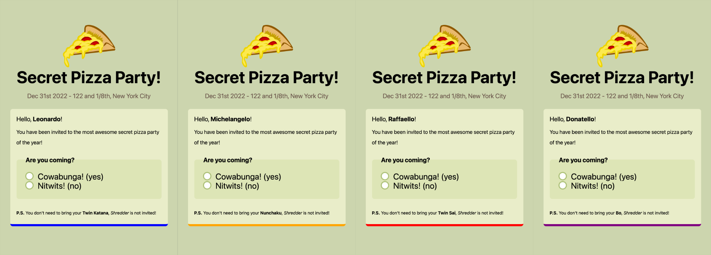
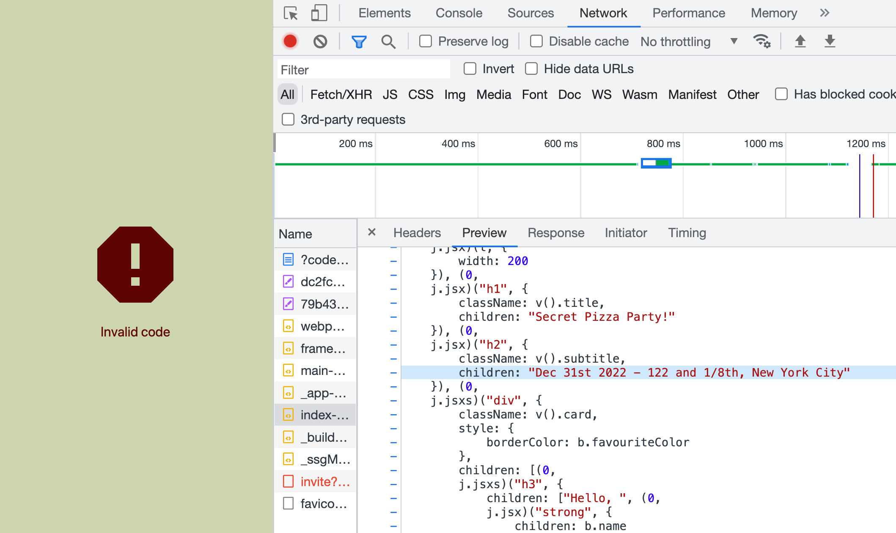
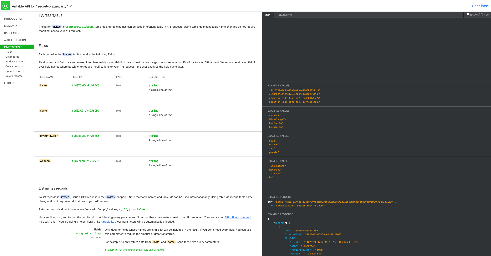

I recently needed to create an invite-only Next.js-powered microsite (for my wedding 🌸) and in this article I'm going to show you how I went about creating invite codes and how I implemented code validation in the app, using Next.js API endpoints and [AirTable](https://airtable.com/invite/r/fQpMoVmw) as a lightweight backend.


## The use case and the tech stack

24 June 2022 was the best day of my life.

Seriously, I got married with the human being I love the most and everything was just perfect.

But we are not here to talk about my wedding, right?

Well, we kinda are, but in a nerdy kind of way that only software engineers can (hopefully) appreciate. OK, don't tell my wife I said that... 🤫

Specifically, we will discuss how to implement an invite-only microsite to share information with all the people invited to a private event.

Just to put things in context, let's wear the PM hat for a second, and let's discuss what kind of requirements did I impose on myself while building my wedding website:

 - I wanted to be able to iterate quickly, mostly focusing on content and design, not much on infrastructure.
 - I wanted to build a simple solution that would be easy to host, maintain and update.
 - I wanted to have a very lightweight backend, possibly something managed.
 - Even better if I could give access to the data storage to someone else (my wife) so that we could collaborate on managing the data about the guests.
 - If I could host everything very cheaply (if not even freely), that would be great.

 For all the reasons above I settled for adopting the following pieces of tech:

 - **Next.js** for building a statically rendered frontend and the backend APIs
 - A private **GitHub** repository for managing the code of the Next.js app
 - **Vercel** for hosting the project
 - **AirTable** to store and manage all the data (invite codes, guests, rsvp, etc.)

Keep in mind that Next.js is free and open source, GitHub can be used for free (even if you want to keep your repo private), and Vercel and AirTable have both generous free plans that are more than enough for this kind of use case.

With the stack above I ended up spending 0 money and I was able to complete the project in a couple of weekends! 🤑👌


## Making a Next.js site private

On top of the requirements discussed above, my wedding website had 2 additional constraints:

  - Every different guest should see something different (the website would look like a custom invite letter for them).
  - People without an invite code should not be able to access any content on the website.

The following illustration shows how I went about making that happen in the context of a React SPA (Single Page Application):


Please boost my ego for a second, isn't this a beautiful illustration? 😜

OK, let's be serious:

  1. The user loads the application by visiting the website with a personal invite code (passed as a query string parameter). When the page is loaded the React application starts on the client side. The app displays only a loading spinner at this stage.
  2. The first thing that the application does is to read the invite code from the URL. At this point, it can call the backend (a Next.js API endpoint running on Vercel) to get the invite code validated. In turn, the backend requests the data storage (an AirTable spreadsheet) to check if the code exists (in which case it's valid). If the code exists, the backend also returns the custom information associated with that invite code. For instance, the name of the invited person.
  3. If the code is valid, the application has all the information to render the private website.
  4. If it is not valid, an error message is displayed instead.


## Let's build an invite-only website!

No, I am not going to show you my private wedding website (sorry, not sorry)!

Instead, we are going to build a more fictional example in this article: an invite-only website for a **secret pizza party**.
Here's what different invites will look like:



As you can see from the picture, every guest (with a valid invite code) will get a custom invite page with their name, favorite color, etc.

If you want to see a preview, check out the following links:

  - [Leonardo's invite](https://secret-pizza-party.vercel.app/?code=14b25700-fe5b-45e8-a9be-4863b6239fcf)
  - [Michelangelo's invite](https://secret-pizza-party.vercel.app/?code=ce7d5886-2166-4aee-8038-548f68b9739d)
  - [Raffaello's invite](https://secret-pizza-party.vercel.app/?code=ef7ab7b7-33d5-43b9-ad73-e73bb8fd8e77)
  - [Donatello's invite](https://secret-pizza-party.vercel.app/?code=b0cbb4a4-8a31-4bc1-bee9-d6fe39c1a6b3)

Of course, if the invite code is missing or if it's not valid, an [error page](https://secret-pizza-party.vercel.app/?invite=invalid) is displayed.

If you are curious to take a look at the code, it's all [public and hosted on GitHub](https://github.com/lmammino/secret-pizza-party) (did you give it a star already?)...


### Handling sensitive data in a Single Page Application

Sorry, I have to pause here for a second because before we get our hands dirty, we need to talk about... **Security**! Security always comes first! 👷‍♀️

It's important to keep in mind that, with this particular design, all the UI logic and the content are already available in the JavaScript bundle representing the Single Page Application.

On top of that, the website is hosted on Vercel, so it's publicly available on the internet.

Even if we end up displaying the "invalid invite" message to the user, a crafty user could still download all the frontend JavaScript code for our application and understand what should have been visualized with a valid invite.

Let me show you what I mean with a picture:



In a dummy version of this website, I was keeping all the sensitive data (for instance here, the date and place of the event) hardcoded in my JSX code. This means that an experienced user, even if they don't have a valid invite code, could technically have a peek at the JavaScript bundle and extrapolate a lot of sensitive information.

For this reason, it's important to keep any sensitive information outside the frontend code. In the case of a wedding website, you probably wouldn't want to disclose to the entire world things like the event date, the location, emergency phone numbers, etc.

All the data that we need to keep private (only available to someone with a valid invite code) must be fetched doing an API call to the backend.

In a way, we can imagine the invite code as an API key that gives people access not just to the website, but also to all the sensitive data that the website will display.

Of course, make sure to keep your repository private, otherwise, that might become another way to access sensitive information embedded in your API code...

Finally, it's also important that your user understand that they shouldn't be sharing their unique URL with other people. So make sure to warn them when you send them the invite URL.


In summary, here are some good security rules we will abide by:

  1. The website is public
  2. We are enforcing access control from the client side
  3. The client-side cannot be trusted (all its code is publicly accessible)
  4. A backend needs to be used to validate the code and return any sensitive information that needs to be accessible only with a valid invite code.
  5. For extra security, keep your repo private and make sure your user won't share their invite URL with other people!


## How to generate invite codes

We said we are going to be using [AirTable](https://airtable.com/invite/r/fQpMoVmw) as storage for invite code and related information.

AirTable is a SaaS that allows you to easily manage different kinds of datasets. You can do a lot through its web interface, but you can also use the data programmatically, turning it into a convenience database for simple types of applications.

For this particular use case, Airtable offers a [public REST API](https://support.airtable.com/hc/en-us/articles/203313985-Public-REST-API) and SDKs in various programming languages, including [JavaScript](https://github.com/airtable/airtable.js).

We can start by creating a new *base* (which is kinda a workspace in AirTable lingo) and create a grid data view into it.

This first data table will contain all our invite codes, so let's call it **invites**:


As displayed in the picture above we are adding a few fields there:

  - `invite`: a UUID that represents the invite code
  - `name`: the name of the invited guest
  - `favouriteColor`the favorite color of the guest
  - `weapon`the weapons of the guest (small note: in real life I am not pro weapons, but if you haven't got it yet, we are talking about Mutant Ninja Turtles™️ here... 😝)

This makes sense for our fictional example. In a more generic use case, you'll be adding here all the pieces of information that are unique for every single guest.
Note that on this website we also have a mini RSVP form. This means that we will be able to collect some data from the users. This is also something that we will be storing in AirTable.


## Reading invite codes using the AirTable SDK

> **Note**: from this point I will assume that you have already scaffolded your Next.js application. If you need help doing that you can check out [The official Next.js docs](https://nextjs.org/learn/basics/create-nextjs-app) or just run the following command:
>
> ```bash
> npx create-next-app@latest --typescript --use-npm
> ```
>
> Also note that, at the time of writing, I am using **Next.js version 12.2**. If you are reading this in a distant future, you might have to change something in the following code examples!

Because we are using TypeScript, the first thing that we want to do is spend a few minutes to think how to represent our invites.

The easiest thing I could come up with was to create a file called `types/invite.ts` with the following definition:

```typescript
export interface Invite {
  code: string,
  name: string,
  favouriteColor: string,
  weapon: string,
  coming?: boolean,
}
```

This should probably be enough for our use case.

Now is the time to start writing some code to interact with the data on our AirTable _base_.

To do that, the first thing we need to install the `airtable` package:

```bash
npm i --save airtable
```

We will also need to grab our Airtable API KEY from the [AirTable account page](https://airtable.com/account) and the _base ID_ from the [API page](https://airtable.com/api) (select your workspace and the API docs should show you the _base ID_ in the introduction section).

For development convenience we are going to store these two variables as environment variables:

```bash
export AIRTABLE_API_KEY="put your api key here"
export AIRTABLE_BASE_ID="put your base id here"
```

If you go back to the API docs, you might appreciate that the docs are automatically generated for your workspace. You should see a section called "invites table" describing all the fields available in our grid!



Isn't this an awesome way to provide documentation?!

You can also see a bunch of `curl` and JavaScript code examples.

What we want to do right now is to be able to retrieve a record by invite code. One way to do that is to list all the records and use a filter to try to match based on our invite code field. We can visit the section _List records_ to have a feeling for how we could do that. If we switch to the JavaScript code example we will see something like this:

```javascript
var Airtable = require('airtable');
var base = new Airtable({apiKey: 'YOUR_API_KEY'}).base('YOUR_BASE_ID');

base('invites').select({
    // Selecting the first 3 records in Grid view:
    maxRecords: 3,
    view: "Grid view"
}).eachPage(function page(records, fetchNextPage) {
    // This function (`page`) will get called for each page of records.

    records.forEach(function(record) {
        console.log('Retrieved', record.get('invite'));
    });

    // To fetch the next page of records, call `fetchNextPage`.
    // If there are more records, `page` will get called again.
    // If there are no more records, `done` will get called.
    fetchNextPage();

}, function done(err) {
    if (err) { console.error(err); return; }
});
```

OK Airtable, you did such a great job with the auto-generated docs, but come on! What kind of JavaScript is this?! Still using `var`, _CommonJS_, and _callbacks_? 😢

Well, I guess we will need to roll up our sleeves and do a bit of extra work to make this nice and modern...

Let's start by creating a new file called `utils/airtable.ts` and let's create a helper function there to get an invite by id:

```typescript
import Airtable from 'airtable'
import { Invite } from '../types/invite'

// make sure all the necessary env vars are set
if (!process.env.AIRTABLE_API_KEY) {
  throw new Error('AIRTABLE_API_KEY is not set')
}
if (!process.env.AIRTABLE_BASE_ID) {
  throw new Error('AIRTABLE_BASE_ID is not set')
}

// create a new Airtable client and gets a reference to the
// airtable base containing our invites
const airtable = new Airtable({ apiKey: process.env.AIRTABLE_API_KEY })
const base = airtable.base(process.env.AIRTABLE_BASE_ID)

// get an invite by invite code (promisified)
export function getInvite (inviteCode: string): Promise<Invite> {
  return new Promise((resolve, reject) => {
    base('invites')
      // runs a query on the `invites` table
      .select({
        filterByFormula: `{invite} = ${escape(inviteCode)}`,
        maxRecords: 1
      })
      // reads the first page of results
      .firstPage((err, records) => {
        if (err) {
          // propagate errors
          console.error(err)
          return reject(err)
        }

        // if the record could not be found
        // we consider it an error
        if (!records || records.length === 0) {
          return reject(new Error('Invite not found'))
        }

        // otherwise we create an invite object from the first record
        // (there should be only one with the give code) and return it
        const result = {
          code: String(records[0].fields.invite),
          name: String(records[0].fields.name),
          favouriteColor: String(records[0].fields.favouriteColor),
          weapon: String(records[0].fields.weapon)
        }

        resolve(result)
      })
  })
}
```

I left enough comments in the code, that an additional explanation should not be necessary!
We are essentially using the `airtable` SDK and building a nicer promise-based interface to get an invite by invite code.

Ok, for the eagle-eyed ones, you are probably wondering where the heck is that `escape` function coming from?! I elided it from the code to keep things simple. The TLDR; is that it makes things more secure.

<details style="margin-top: 1em">
  <summary>But "the how" needs a bit of a long-ish explanation (expand at your own risk)</summary>

  <div style="background: #eee; margin-top: 1em; padding: 1em; border: 2px dotted #ccc; border-radius: 10px;">
  
  Every time you use user input to construct some kind of query, your spider senses should be immediately triggered! 🕷

  The invite code is, in fact, user-controlled. It's part of the query string in the URL. A user can decide to change that and try to see what happens with different values.

  If the user inputs `?code=abcd` as invite code, with a naïve string interpolation, we would be producing the following Airtable formula:

  ```plain
  {invite} = 'abcd'
  ```

  But what if a very evil user tries something like `?code=%27%20>%3D%200%20%26%20%27` (`?code=' >= 0 & '` unencoded)?!

  In this case, we end up constructing the following Airtable formula:

  ```plain
  {invite} = '' >= 0 & ''
  ```

  Which always evaluates to `1` (`true`) in Airtable! So this very evil user is now accessing your private website without having to know a valid code. They will just get the code of the first record that Airtable matches in the table!

  This is like [SQL injections](https://owasp.org/www-community/attacks/SQL_Injection) but for Airtable formulas! 😱

  The `escape` function, allows us to try to sanitize user input and escape dangerous characters like `'` and `"`. In other words, it tries to protect our website from this kind of injection attack.

  If you are curious this is my basic implementation of the `escape` function (the one I used in this project), but I have to say I am quite disappointed that Airtable does not provide a built-in utility for this in their SDK... 🙁

  ```ts
  function escape (value: string): string {
    if (value === null || typeof value === 'undefined') {
      return 'BLANK()'
    }

    if (typeof value === 'string') {
      const escapedString = value
        .replace(/"/g, '\\"')
        .replace(/\r/g, '')
        .replace(/\\/g, '\\\\')
        .replace(/\n/g, '\\n')
        .replace(/\t/g, '\\t')
      return `"${escapedString}"`
    }

    if (typeof value === 'number') {
      return String(value)
    }

    if (typeof value === 'boolean') {
      return value ? '1' : '0'
    }

    throw Error('Invalid value received')
  }
  ```

  PS: I nudged Airtable [on Twitter](https://twitter.com/loige/status/1555622372085997569) and [their community forum](https://community.airtable.com/t/standard-way-to-prevent-formula-injections-when-using-airtable-as-a-backend-through-sdk/50283) but, unfortunately, they didn't get back to me yet...

  </div>

</details>

TODO: continue from here!

...


## Next.js invite endpoint

...


## Handling sensitive information

...


## Invite validation in React

...


## Collecting user data


...


## An idea for a backend-less alternative

...