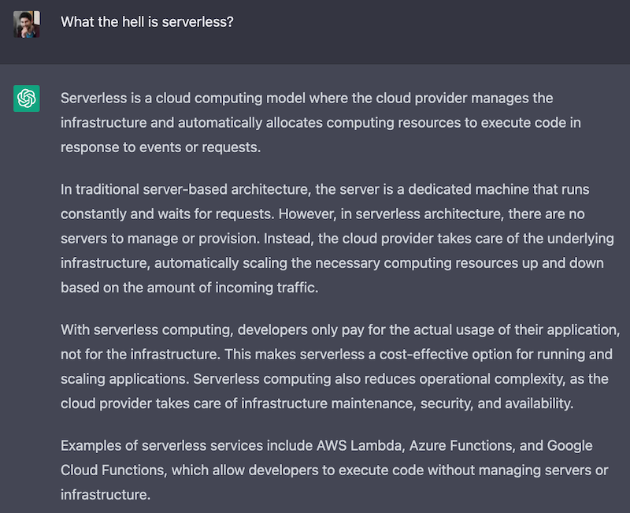

Rust is an awesome language. Maybe it has a bit of a learning curve, but the reward is immense. As a serverless and AWS aficionado, I have been exploring a bit what it takes to build AWS Lambda functions in Rust and whether it was worth the effort.

The TLDR; (as you might have guessed from the title) is that it is definitely worth it. But let's explore a bit more in detail why I think so.

## What is serverless and why do I like it

Let's start with a bit of a generic intro. If you are already familiar with [serverless](/tags/serverless), feel free to skip this section.

How do we learn anything these days? We ask ChatGPT, of course! So let's see what it thinks about serverless.

What the hell is serverless?

Serverless is a cloud computing model where the cloud provider manages the infrastructure and automatically allocates computing resources to execute code in response to events or requests.

In traditional server-based architecture, the server is a dedicated machine that runs constantly and waits for requests. However, in serverless architecture, there are no servers to manage or provision. Instead, the cloud provider takes care of the underlying infrastructure, automatically scaling the necessary computing resources up and down based on the amount of incoming traffic.

With serverless computing, developers only pay for the actual usage of their application, not for the infrastructure. This makes serverless a cost-effective option for running and scaling applications. Serverless computing also reduces operational complexity, as the cloud provider takes care of infrastructure maintenance, security, and availability.

Examples of serverless services include AWS Lambda, Azure Functions, and Google Cloud Functions, which allow developers to execute code without managing servers or infrastructure.

In summary:

- Serverless, is a way of running applications in the cloud.
- Of course, there are servers somewhere, we just don't have to manage them.
- We pay (only) for what we use.
- We code in small units of compute (functions), which are triggered by events.

Now, why is this cool?

In my experience, I found that serverless helps you to **focus a lot more on business logic** and less on other concerns such as infrastructure, scalability, etc. Of course, there's still a learning curve and there are tradeoffs. We are not going to get into the details in this article, so, for now, take this at face value: serverless gives you more time to focus on what matters for your business, your differentiated value.

Serverless can also **increase team agility**. By virtue of forcing you to think in terms of small, event-driven functions, you are forced to think about keeping the code-base modular. This can help the team in many ways. For instance, it can be easier to distribute and parallelise the work. Also, if at some point you realise you want to rewrite or re-engineer part of the software since the various units are generally more decoupled, it should be easier to do that. You might have seen this coming, but if you want to rewrite an entire piece of functionality in Rust, you can do that without having to rewrite the entire code base. You can change things incrementally, one function at a time!

Serverless gives you some degree of **automatic scalability**. Lambdas will be spawned up and down depending on the number of events happening. If you have a sudden surge of user activity, the system is generally able to provide the necessary amount of computing power to handle that. This is not an absolute. In reality, it is important to understand how different providers achieve auto-scalability. The way they do it is not always effective enough, but in practice, it's something that can help a lot and that works well for most common use cases.

So yes, serverless is great, but it's important to say that **it is not a silver bullet**. Certain scenarios are still better implemented with bare metal virtual machines, where you have to do all the hard work of managing servers.

## AWS Lambda

Another bit of context here. Feel free to skip it if you are already familiar with what AWS Lambda is.

[AWS Lambda](https://aws.amazon.com/lambda/) is the FaaS (Function as a Service) offering from AWS.

Lambda allows you to write your business logic as functions that are automatically triggered when certain events happen.

Just to give you some examples, such events could be:

- An HTTP request is made against an API Gateway
- A new file was created in an S3 bucket
- A new job was published in a Job queue
- A scheduled event
- A manual invocation
- An invocation orchestrated by a workflow (e.g. a Step Function)

And to make things a bit more concrete, here are some realistic examples of what you can do with this idea:

- Build an HTTP API that implements a payment gateway using API Gateway and Lambda.
- Automatically generate thumbnails for new videos uploaded to an S3 bucket.
- Synchronise data from an FTP drive on a schedule
- Scrape data from a website
- Send welcome emails when a new user signs up (using an SQS queue or an Event Bridge event)
- Analyse system and application logs and generate alarms for suspicious activities
- Rotate secrets and restart the necessary applications

And so much more...

Lambda is pretty cool (you know I love it!), but it comes with some important limitations.

As of today, a Lambda execution **cannot last more than 15 minutes**. Also, **the payload size is limited** (both request and response payloads are constrained). And finally, **you cannot have a lambda with a GPU**.

So, you can probably think about some use cases where Lambda wouldn't be a great fit. Therefore, don't try to do everything with Lambda. It's not another silver bullet (nothing really is)!

## AWS Lambda pricing model

One of the reasons why I think Rust is a promising solution for writing Lambda functions is because of pricing implications, therefore it is important to understand Lambda's pricing model.

...