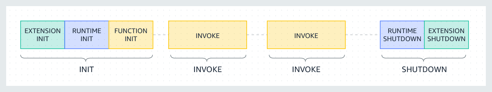

Rust is such a cool language, even though it might take a bit to get the hang of it. But trust me, the payoff is huge. As someone who's all into serverless stuff and loves playing around with AWS, I've been digging into how to write AWS Lambda functions in Rust and whether it's worth the sweat.

MEGA-Spoiler: Yep, you guessed it from the title - it's totally worth it. And in this article, you're gonna find out why, so stick around!

Okay, so there's this pic in the article of Morpheus holding a Lambda in one hand and Ferry, the Rust mascot, in the other. But guess what? You don't have to pick just one. It's not a do-or-die choice. You can have both cakes and eat them too!

## What is serverless and why do I like it

Let's start with a bit of a generic intro. If you are already familiar with [serverless](/tags/serverless), feel free to skip this section.

How do we learn anything these days? We ask ChatGPT, of course! So let's see what it thinks about serverless.

<strong>Dear ChatGPT, what the hell is serverless?</strong>

<em>Serverless is a cloud computing model where the cloud provider manages the infrastructure and automatically allocates computing resources to execute code in response to events or requests.

In traditional server-based architecture, the server is a dedicated machine that runs constantly and waits for requests. However, in serverless architecture, there are no servers to manage or provision. Instead, the cloud provider takes care of the underlying infrastructure, automatically scaling the necessary computing resources up and down based on the amount of incoming traffic.

With serverless computing, developers only pay for the actual usage of their application, not for the infrastructure. This makes serverless a cost-effective option for running and scaling applications. Serverless computing also reduces operational complexity, as the cloud provider takes care of infrastructure maintenance, security, and availability.

Examples of serverless services include AWS Lambda, Azure Functions, and Google Cloud Functions, which allow developers to execute code without managing servers or infrastructure.</em>

Pretty good definition for generative AI, but let me give you my (shorter) summary:

- Serverless, is a way of running applications in the cloud.
- Of course, there are servers somewhere, we just don't have to manage them.
- We pay (only) for what we use.
- We code in small units of compute (functions), which are triggered by events.

Now, why is all of this very cool?

In my experience, serverless helps with **focusing a lot more on business logic** and less on other concerns such as infrastructure, scalability, etc. Of course, there's still a learning curve and there are tradeoffs. We are not going to get into the details in this article, so, for now, take this at face value: serverless gives us more time to focus on what matters for the business: providing value to the customers.

Serverless can also **increase team agility**. By virtue of forcing us to think in terms of small, event-driven functions, we are forced to think about keeping the code-base modular. This can help the team in many ways. For instance, it can be easier to distribute and parallelise the work. Also, if at some point we realise we want to rewrite or re-engineer part of the software since the various units are generally more decoupled, it should be easier to do that. You might have seen this one coming, but if we want to rewrite an entire piece of functionality in Rust, we can do that without having to rewrite the entire code base. We can change things incrementally, one function at a time! I am actually in the process of rewriting a serverless project in Rust and I am doing it [live on Twitch](https://twitch.tv/loige) ([recordings here](https://www.youtube.com/playlist?list=PLbNOKnE-Oyr1tsUft4j0QZDyk5iFcVVy_)), just in case you are curious to see some examples...

Serverless gives us some degree of **automatic scalability**. Lambdas will be spawned up and down depending on the number of events happening. If we have a sudden surge of user activity, the system is generally able to provide the necessary amount of computing power to handle that. This is not an absolute. In reality, it is important to understand how cloud providers achieve this level of auto-scalability. The way they do it is not always effective for all use cases, but in practice, it's something that can help a lot and that works well for the most common cases.

So yes, serverless is great, but it's important to say that **it is not a silver bullet**. Certain scenarios are still better implemented with bare metal virtual machines, where you have to do all the hard work of managing servers... Or with long-running containers deployed on some container orchestration platform, where you have less infrastructure to manage, but still significantly more than what you get with serverless functions.

## AWS Lambda

Let's add another bit of context here. Feel free to skip it if you are already familiar with what AWS Lambda is.

[AWS Lambda](https://aws.amazon.com/lambda/) is the FaaS (Function as a Service) offering from AWS.

Lambda allows us to write your business logic as functions that are automatically triggered when certain events happen.

Just to give you some examples, such events could be:

- An HTTP request is made against an API Gateway
- A new file was created in an S3 bucket
- A new job was published in a Job queue
- A scheduled event
- A manual invocation
- An invocation orchestrated by a workflow (e.g. a Step Function)

And to make things a bit more concrete, here are some realistic examples of what we can do with this idea:

- Build an HTTP API that implements a payment gateway using API Gateway and Lambda.
- Automatically generate thumbnails for new videos uploaded to an S3 bucket.
- Synchronise data from an FTP drive on a schedule
- Scrape data from a website
- Send welcome emails when a new user signs up (using an SQS queue or an Event Bridge event)
- Analyse system and application logs and generate alarms for suspicious activities
- Rotate secrets and restart the necessary applications

And so much more...

Lambda is pretty cool (you know I love it!), but it comes with some important limitations.

As of today, a Lambda execution **cannot last more than 15 minutes**. Also, **the payload size is limited** (both request and response payloads are constrained). And finally, **you cannot have a lambda with a GPU**.

There are other subtleties, but these limitations alone should make you think about some use cases where Lambda wouldn't be a great fit. Therefore, don't try to do everything with Lambda. It's not another silver bullet (in tech, nothing is, really)!

If everything you have is a ~~Lambda~~ hammer...😏

## AWS Lambda pricing model

One of the reasons why I think Rust is a promising solution for writing Lambda functions is because of potential pricing implications, therefore it is important to understand Lambda's pricing model.

The [pricing model for AWS Lambda](https://aws.amazon.com/lambda/pricing/) is (relatively) simple and it's based on the idea that _we should pay only for what we use_. The actual formula is:

> Cost = Allocated Memory ✖️ Execution Time

To better understand what this means in practice, let's discuss an example.

Let's say we create a new Lambda function and assign `512 MB` of RAM to it. At the time of writing in the `eu-west-1` region (Ireland) the cost per millisecond for this configuration is `$ 0.000_000_008_300`. How many zeroes is that?! Anyway, let's say we run this function for the maximum time available: 15 minutes, ergo `900_000 ms`, this is what we end up with:

> $ 0.000_000_008_300 * 900_000 ms = 0.<em>007</em> $

Yes, _007_ ... I know this was a bad joke, but let's pretend you liked it and let's move on... 😅

The real question is: is _.007 $_ a lot? Or is it very cheap? Well, I guess _it depends_ (of course it does!).

If we are running this Lambda function once a week, it's basically for free... If we are running it a thousand times per minute, we end up paying about _300.00 $_ per month, which isn't my definition of cheap! And imagine what happens if we have thousands of requests per second!

But this should give you an idea of the pricing model and how it scales.

In general, for unpredictable usage patterns (sporadic or very spiky invocations), Lambda tends to be a cheap solution, but when you have a consistently high rate of invocations, it might get quite expensive and there could be significantly cheaper alternatives.

When it comes to serverless, it's also important to consider the **TCO (Total Cost of Ownership)** which should also include the cost of maintaining the infrastructure (provisioning, patching, security, etc.). This tends to be very low with serverless, while it gets more expensive with more traditional approaches.

So, yeah, cost is always a complex matter, but if you want to deep dive into better understanding how the price equation might influence your choice of computing technology, I'd recommend reading this excellent article: ["Why AWS Lambda Pricing Has to Change for the Enterprise
"](https://www.infoq.com/articles/aws-lambda-price-change/) by [Eoin Shanaghy](https://twitter.com/eoins).

## Lambda functions and CPU allocation

Now, you might be wondering, how come CPU doesn't come into play in the pricing model? What if we need to run a very CPU-intensive task and we would like to have multiple cores to distribute the load and speed up the computation?

Well, the catch is that we don't _explicitly_ get to configure the number of vCPUs, we automatically get a certain amount of vCPUs proportionally to how much memory we are configuring for our Lambda.

The number of vCPUs that we will get can be seen in the following table:

| Memory         | vCPUs |
|----------------|-------|
| 128 - 3008 MB  | 2     |
| 3009 - 5307 MB | 3     |
| 5308 - 7076 MB | 4     |
| 7077 - 8845 MB | 5     |
| 8846+ MB       | 6     |

Note that this is not an _official table_ but the result of an independent [study by SentiaTech](https://stackoverflow.com/a/66523153/495177).

The takeaway here is that, if we need more CPU, we are forced to provision more memory, even if we don't need all of that memory... and yes, increasing the memory will increase the price per millisecond of execution. But that doesn't necessarily mean that the executions will be more expensive because with more CPU we might be able to finish the task much faster, therefore we are billed for a smaller amount of milliseconds. I know, it's tricky to find the sweet spot between memory, CPU and price. If you are looking for a tool to help you out, check out the excellent [Lambda Power Tuning](https://docs.aws.amazon.com/lambda/latest/operatorguide/profile-functions.html).

Anyway, even though it sucks not to be able to specify exactly how much CPU we need, this model keeps things simple for most use cases... Having to think about only 2 dimensions (time and memory) keeps pricing and configuration rather straightforward.

... and most likely it also helps the Lambda team to allocate our Lambdas efficiently in their compute clusters.

## The execution model of a Lambda function

We have seen that the whole promise of Lambda, being a _serverless_ service, is that we only pay for what we use.

For this pricing model to work, the Lambda team has to be very savvy with the allocated resources, ideally provisioning them only when they are needed and de-provisioning them as soon as they are not needed anymore.

How does this happen? Without getting too technical, this is a high-level overview:

- When we deploy a Lambda function, we are shipping its code into an S3 bucket. So, in a way, we are _just saving files in the cloud_.
- Lambda functions are event-based. So this means that when an _event trigger_ happens, AWS should be able to execute the code we provisioned.
- To execute the code, AWS needs to allocate some computing resources. In the case of Lambda, this means spawning a [Firecracker](https://firecracker-microvm.github.io/) micro-VM somewhere and initializing it with the code from our S3 bucket.
- This operation might take some time. After all, we need to think that behind the scenes, AWS is downloading the code from S3 and spinning up a VM. They surely have very efficient ways of doing that, but it can still result in noticeable delays in the order of hundreds of milliseconds. When this happens it is called a **cold start**.
- Once the VM is up and running, the Lambda execution environment can _invoke_ our lambda and pass the event data.
- Once the execution is completed, the runtime doesn't immediately destroy the instance. If the same type of event happens in a short amount of time, the instance is _re-used_, which means that the new event will be passed into it. This saves us from having to endure another cold start. This might happen multiple times, especially if we have events being generated at a consistent rate.
- But let's assume that at some point we stop receiving events for a few minutes. At this point, the Lambda runtime might decide to reclaim the resources allocated for our Lambda instance and then it shuts it down and de-provisions it.
- If a new event will come in at some point in the future, the whole lifecycle will start again.

If you want to go more in detail, I recommend reading about the [Lambda execution environment](https://docs.aws.amazon.com/lambda/latest/dg/lambda-runtime-environment.html).

## Why Rust + Lambda = ❤️?

Ok, we are finally here! Now that we have covered enough background knowledge, we should be able to make the point that Rust is an ideal language to write Lambda functions with.

### Cost saving

The first reason why Rust is so cool for Lambda functions is that Rust is a typed and compiled language which produces very efficient binaries. If well written, Rust code can be on par in terms of speed with equivalent C or C++ code. Other than being very performant, these binaries are generally very memory efficient and very small in size.

All these characteristics are perfectly aligned with all the billing dimensions we have with Lambda, so **Lambda function written in Rust can be much cheaper than most alternative languages**.

To summarise this point:

- The performance will likely reduce the number of ms needed to complete the execution.
- The memory efficiency might allow us to keep the allocated memory low.
- The small binary size might reduce the duration of cold starts (less time needed to fetch the code from S3).

Regarding cold starts, there is [a fantastic benchmark by Maxime David](https://maxday.github.io/lambda-perf/), and guess what? Rust is the fastest runtime in terms of cold start! And by far!

If you have a very hot Lambda that you are running thousands of times per day and you used Java, Python or Node.js, and you are looking for opportunities to reduce your AWS billing, consider rewriting this one Lambda in Rust.

After all, that's the beauty of Lambda-based architectures: Lambda functions are generally very small and decoupled, so it should be possible to rewrite one of them without having to touch the rest of your infrastructure.

Thank you, dear Rust, for helping us to save some sweet money. Cheers to you!

Now, I know what you are thinking...

> "But having to learn Rust, will cost me sweet money and time too!"

_Tru dat!_ 🤷‍♂️

Of course, you need to evaluate whether the juice is worth the squeeze case by case, but what I would say in response to that is _"Well, yes. But consider it as an investment!"_

### Memory safety

This is one of the main propositions of Rust. Rust was created with the intent of eliminating an entire class of memory and threading bugs. These kinds of bugs have been one of the main sources of security issues for a few decades! Even Microsoft believes that [if they had written Windows in a language with the guarantees of Rust they would have avoided 70% of their security issues](https://msrc.microsoft.com/blog/2019/07/a-proactive-approach-to-more-secure-code/)!

But, in practice, what does this mean for Lambda?

The way I see it is that most developers (or maybe it's just me) are scared about writing multi-threaded code and therefore we end up trying to avoid doing that. Which means we might be losing precious opportunities to optimize our algorithms.

In the context of Lambda, this means potentially longer execution times, which again might be another reason for an unnecessarily large bill.

Since Rust can give you the confidence that your multi-threaded code is safe (if it compiles it is safe), this might encourage scared developers like me to try to leverage more opportunities to write multi-threaded code.

Isn't that a nice proposition?

### Fewer bugs

Ok, this is probably the most opinionated point I have about Rust. But having written enough Rust in the last 4 years, I came to the realisation that when I write code in Rust, it generally just works. Or to put it more sincerely, it's generally less buggy than it would be compared to using other languages such as JavaScript, Python, or Java.

This is not because Rust is magic or because you become some kind of super programmer with it. I honestly think that it's just due to some clever language design decisions that force you to think more about the cases when things can go wrong.

In particular, I am referring to the fact the the language has no `null` types. If something may or may not exist, the language forces you to handle that explicitly using the [`Option` type](https://doc.rust-lang.org/std/option/enum.Option.html).

Also, the language doesn't have a concept of exceptions. You can't just throw stuff wherever you want. When something can fail, you also need to explicitly use the [`Result` type](https://doc.rust-lang.org/std/result/).

I have been loving using these constructs and, in retrospect, I wish that languages like Python and JavaScript had something like that. They just make it so much more obvious when something can go wrong in your business logic and force you to think about a way to handle these edge cases.

Now, just to be clear, I am not promising Rust will magically solve all your bugs 🐞. You'll still write buggy code (that's probably inevitable), but I am sure your code will be much more well thought out and that you'll be automatically handling many more error cases compared to using other languages where you can just assign stuff to `null` or throw random exceptions here and there without thinking too much about the possible consequences of these decisions...

## Where do we start?

Ok, did I convince you to entertain the idea of writing Lambda functions in Rust?

Yes? Great!

So, now you are wondering where to start...

This is probably a topic for a series of more hands-on articles, so stay tuned for more.

But if you really can't wait, I will be hosting a talk titled ["Rust, Serverless and AWS
" at the next Rust Dublin Meetup](https://www.meetup.com/rust-dublin/events/294587280/) on Tuesday, August 22nd, 2023.

In this talk, I will show many practical code examples and use cases and some of the tooling you can use today to bootstrap, test and deploy Lambda functions written in Rust.

If you are not in Dublin, you can join the event anyway. There will be a live stream as well 🙂

Finally, if you think your organisation needs help with Serverless or with reducing your AWS bills, consider [reaching out to fourTheorem](https://fourtheorem.com/contact-us/?utm_source=loige_co&utm_medium=article&utm_campaign=loige_co_rust_lambda_article&utm_id=loige_co_rust_lambda_article&utm_term=rust+lambda+serverless&utm_content=writing+lambdas+in+rust). We are a consulting company specialised in serverless and all things AWS, and I like to think we are lovely to work with. 😊

## Conclusion

Rust is a really cool programming language and it's something we should consider using for writing Lambda functions.

Due to its characteristics and design choices, Rust might help us to save money on our lambda function and to write more correct (read "less buggy") Lambda code.

So, here's a choice. **Do you pick Lambda or do you pick Rust? Why don't you pick both?**

👋