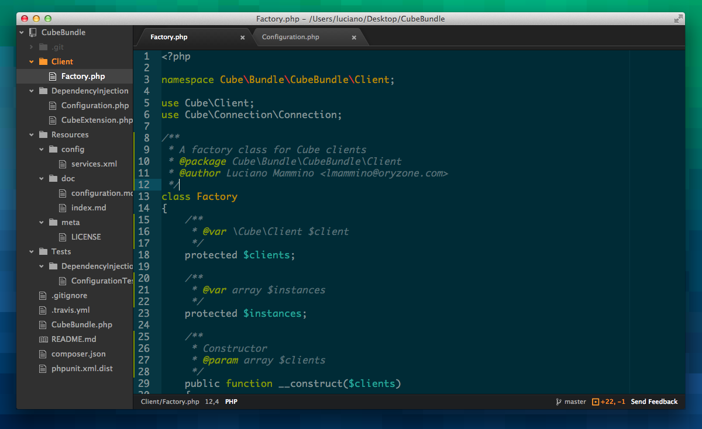

I have finally got my invitation to try the new text editor [Atom.io](https://atom.io). Atom is built with web technologies (node.js in it's core) by the folks at GitHub and it's somewhat very similar to the famous [SublimeText](http://www.sublimetext.com/).
In my opinion it seems very promising (even if it's significantly slower than SublimeText), anyway I have to try it a lot more before shaping a serious opinion about it.

The point of this topic is that Atom.io is currently in closed beta and I have received 3 invitations to share with whom is willing to try it.

I would be glad to **share the invitations** with the first 3 readers who would **follow me** on [GitHub](https://github.com/lmammino) or [Twitter](https://twitter.com/loige) **and write a comment** on this post.

PS: You would probably need a GitHub account!

**UPDATE**, April 12:
Sorry guys, my invitations have gone for now.
Anyway it seems that GitHub distributes other invitations sometime. So if you haven't been in time you can still write a comment and if I ever manage to have other invites i will follow the order of the order to share them with you.

Hope you will enjoy it.
