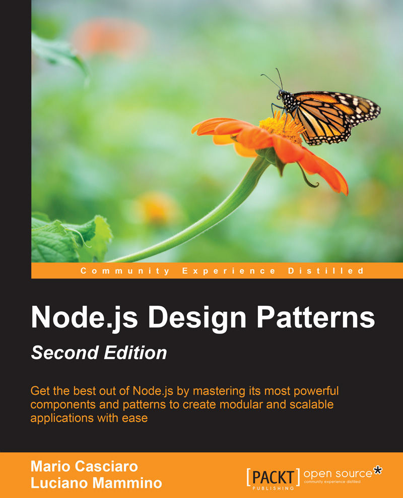

In this post I am going to introduce my last side-project: "Node.js design patterns — second edition", a technical book about Node.js and design patterns published by Packt.

This blog has been a very quite place in the last 8-9 months, this is because almost all my free time has been absorbed by one of my most ambitious side projects: co-writing a book about [Node.js](/tag/node-js) and [design patterns](/tag/design-patterns)!

I am finally happy to announce that "Node.js design patterns — second edition" has been published.

You can keep reading this post to find out more or have a look at the [official website](https://www.nodejsdesignpatterns.com). If all of this is convincing enough you can even decide to buy the paperback or the e-book on [Packt](https://www.packtpub.com/web-development/nodejs-design-patterns-second-edition), [Amazon](http://amzn.to/2a418Q2) or [O'Reilly](http://shop.oreilly.com/product/9781785885587.do) :P

## The making of

As you might have noticed, this book is the second edition of an [existing book on the topic](http://amzn.to/2a9FgDP) — I dare to say _one of the best_ books on the topic — that [Mario Casciaro](http://www.mariocasciaro.me) put together a couple of years ago.

I was contacted by Mario in November last year because he was looking for somebody willing to help him in creating a new edition of the book. I don't know yet why he thought I might have been the right person (and I am still flattered about this) but, being his book one of my favourites, I almost immediately decided to accept the challenge and work with him and Packt on this new edition.

It took almost 9 months from the first idea to having the printed book on my desk. I have to admit it was an incredibly interesting experience for me. I learned a lot and I definitely feel I strengthened my knowledge of Node.js and design patterns, I worked with super skilled technical reviewers like [Joel Purra](http://joelpurra.com) and [Tane Piper](https://twitter.com/tanepiper) and with the amazing team at Packt. I also had chance to experiment with some new cool technologies like [React](/tag/react-js) and new ways of building websites like [Universal JavaScript](/tag/universal-javascript).

## Content of the book

The book has been heavily updated: more than the 50% of the original content from the first edition was changed. These changes were mostly about updating all the code examples to **Node v6** and **EcmaScript 2015**, upgrading all the obsolete content, introducing some new interesting examples and design patterns and a new entire chapter dedicated to **Universal Javascript**.

The final result counts **11 chapters**, more than **500 pages** and more than **100 code examples**.

The first two chapters provide basic informations about the Node.js platform and the new features introduced with EcmaScript 2015.

Chapter 3 and 4 go deep into the topic of asynchronous programming exploring different approaches (callbacks, promises, events, async/await) and design patterns to exploit all the most common scenarios.

Chapter 5 discusses one of the most important patterns in Node.js: streams. It shows you how to process data with transform streams and how to combine them into different layouts.

Chapter 6 is probably the core of this book diving deep into the most popular conventional design patterns and showing how unconventional they might look in Node.js. It also introduces the reader to some emerging design patterns that are used only with JavaScript and Node.js.

Chapter 7 analyses the different solutions for linking the modules of an application together investigating design patterns such as Dependency Injection and the service locator pattern.

Chapter 8 is an entire new chapter that explores one of the most interesting capabilities of modern JavaScript web applications: being able to share application code between the frontend and the backend. Across this chapter we learn the basic principles of Universal (a.k.a. Isomorphic) JavaScript by building a simple web application with React, Webpack, and Babel.

Chapters 9, 10 and 11 go into more advanced and enterprise topics like "Advanced Asynchronous Recipes", "Scalability and Architectural Patterns" and finally "Messaging and Integration Patterns".

You can read [a sample of the book](https://www.nodejsdesignpatterns.com/files/nodejs_design_patterns_preview_chapter1.pdf) containing the full table of contents and the first chapter for FREE on the [official website](https://www.nodejsdesignpatterns.com), don't miss it!

## Acknowledgements

Apart from Mario, Joel and Tane, which I already mentioned previously, I have to spend a special word of thank you for my dear friends [Anton Whalley](https://twitter.com/dhigit9), [Alessandro Cinelli](https://twitter.com/cirpo), [Andrea Giuliano](https://twitter.com/bit_shark) and [Andrea Mangano](https://twitter.com/andreaman87). They are amazing guys and they have been precious supporters during the creation of this new book with words of encouragement and incredibly meaningful technical advices.

Thank you once again guys :)

## What's next

Well, I don't plan to start writing a new book anytime soon in case you are wondering... :D But I surely will keep improving my knowledge and experience with Node.js and maybe I will also start to explore some new field in the amazing world of programming. I guess I will also be able to keep posting articles here more often :)

So stay tuned for the next post :)

I will go now to take a pint to celebrate the release... Cheers 🍻
