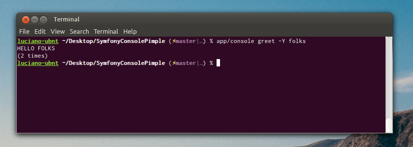

In this article I will show you how to set up a stand alone command line application by using the [Symfony Console component](https://github.com/symfony/console) and [Pimple](http://pimple.sensiolabs.org/).



Writing console commands for Symfony (full stack framework) is easy and enjoyable. It helps a lot when you need to handle particular collateral tasks that are needed, in a way or another, to make your website running (processing and crunching data, make async requests, create reports, etc.).

Anyway I discovered that writing stand alone command line applications using only the [Symfony/Console](https://github.com/symfony/console) component is a lot more easy and enjoyable and that a lot of famous command line applications uses it ([Composer](https://getcomposer.org/) and [Laravel/Artisan](http://laravel.com/docs/commands) just to name a few). Furthermore by using Symfony I became a great fan of the *Dependency Injection* and *Inversion of Control (IoC)* [design pattern](http://martinfowler.com/articles/injection.html) and, as my dependencies started to grow, I wanted to put some sort of *container* in my command line apps. I decided to go with [Pimple](http://pimple.sensiolabs.org/): a really simple dependency injection container written by [Fabien Potencier](http://fabien.potencier.org/), the notorious head behind the Symfony framework and Sensio.

###Let's start
I will demonstrate my approach by creating a simple "hello *$name*" command line application that will be able to count how many times you greet someone. You can find the whole code in a dedicated [GitHub repository](https://github.com/lmammino/SymfonyConsolePimple).

So we will be able to run

```bash
app/console greet Alice
```

and it will print out 

```bash
Hello Alice
(First time!)
```

Yes, intentionally simple! ;)

Let's start by creating our *composer.json* file. We will need the Symfony console and the Pimple packages. We also include the Symfony Yaml component as we will store data in a yaml file (obviously we could have been using json but I believe yaml is cooler :P).

```json
{
    "name": "lmammino/symfony-console-pimple",
    "description": "A sample Symfony Console app using Pimple",
    "require": {
        "symfony/console": "dev-master",
        "pimple/pimple": "dev-master",
        "symfony/yaml": "dev-master"
    },
    "license": "MIT",
    "authors": [
        {
            "name": "Luciano Mammino",
            "email": "lmammino@oryzone.com"
        }
    ],
    "autoload": {
        "psr-4": {
            "LMammino\\ConsoleApp\\": "src/"
        }
    }
}
```

Yes, let's run `composer update` to download all the libraries.

### Folder structure

Let's structure our code. We want to separate application and configuration code from the main source code. So we will end up with the following folder structure:

- app
- src
- vendors

The **app** folder will contain our console executable file, a bootstrap file and a config folder. We will get into the details in a while.

### The Greeter service

Let's just define our core service by Writing the `Greeter` class. This class defines the business logic of our greeting application.

```php
<?php

namespace LMammino\ConsoleApp;

use Symfony\Component\Yaml\Yaml;

class Greeter
{
    /**
     * @var string $file
     */
    protected $file;

    /**
     * @var array $greetings
     */
    protected $greetings;

    /**
     * Constructor
     *
     * @param string $file
     */
    public function __construct($file)
    {
        $this->file = $file;
        if (file_exists($file)) {
            $this->greetings = Yaml::parse(file_get_contents($file));
        } else {
            $this->greetings = array();
        }
    }

    /**
     * Destructor
     */
    public function __destruct()
    {
        file_put_contents($this->file, Yaml::dump($this->greetings));
    }

    /**
     * Builds the greeting for someone (you can yell on it if you want!)
     *
     * @param  string $name
     * @param  bool   $yell wanna yell?
     * @return string
     */
    public function greet($name, $yell = false)
    {
        $output = sprintf('Hello %s', $name);
        if ($yell) {
            $output = strtoupper($output);
        }

        $name = strtolower($name);
        if (!isset($this->greetings[$name])) {
            $this->greetings[$name] = 1;
        } else {
            $this->greetings[$name]++;
        }

        return $output;
    }

    /**
     * Will tell you how many times you greet someone
     *
     * @param  string $name
     * @return int
     */
    public function countGreetings($name)
    {
        $name = strtolower($name);
        if (!isset($this->greetings[$name])) {
            return 0;
        }

        return $this->greetings[$name];
    }
}
```

The class is really simple. The main methods are `greet` and `countGreetings` that allows you to build the greet string for someone and to count how many times you have greet someone.

Note that this class needs to know on costruction which file to use to read and store the greetings count. This will be something we will configure through Pimple as a container parameter.

### The GreetCommand

Now we have a service with the main business logic, let's just write a Symfony command to run it:

```php
<?php

namespace LMammino\ConsoleApp\Command;

use LMammino\ConsoleApp\Greeter;
use Symfony\Component\Console\Command\Command;
use Symfony\Component\Console\Input\InputArgument;
use Symfony\Component\Console\Input\InputInterface;
use Symfony\Component\Console\Input\InputOption;
use Symfony\Component\Console\Output\OutputInterface;

class GreetCommand extends Command
{
    /**
     * @var \LMammino\ConsoleApp\Greeter $greeter
     */
    protected $greeter;

    /**
     * Constructor
     *
     * @param Greeter $greeter
     */
    public function __construct(Greeter $greeter)
    {
        parent::__construct();
        $this->greeter = $greeter;
    }

    /**
     * {@inheritDoc}
     */
    protected function configure()
    {
        $this->setName('greet')
            ->setDescription('Greet someone')
            ->addArgument('name', InputArgument::OPTIONAL, 'The name of the one you want to greet', 'World')
            ->addOption('yell', 'Y', InputOption::VALUE_NONE, 'If set will scream out the greeting. Use with caution!');
    }

    /**
     * {@inheritDoc}
     */
    protected function execute(InputInterface $input, OutputInterface $output)
    {
        $name = $input->getArgument('name');
        $yell = $input->getOption('yell');

        $output->writeln($this->greeter->greet($name, $yell));
        if (1 === ($count = $this->greeter->countGreetings($name))) {
            $output->writeln('(First time!)');
        } else {
            $output->writeln(sprintf('(%d times)', $count));
        }
    }
}
```

The command is totally self explainatory! It just defines the *greet* command offering a *name* argument and a *yell* option (both optional). The point here is that our command has a dependency on the `Greeter` class we wrote before. So we need to pass it on construction (or we need to configure our Pimple container to do so).

### Ladies and gents, the Pimple container!

Finally it's time to write our Pimple container. Before getting to the code let's recap things a bit.
We have a parameter (the name of the greetings count file) and two services (the `Greeter` service and the `GreetCommand`).
We will create a `app/config/container.php` file to define our parameters and services with Pimple:

```php
<?php

$c = new Pimple();

$c['parameters'] = array(
    'greetings.file' => 'greetings.yaml'
);

$c['greeter'] = function($c) {
    return new \LMammino\ConsoleApp\Greeter($c['parameters']['greetings.file']);
};

$c['command.greet'] = function($c) {
    return new \LMammino\ConsoleApp\Command\GreetCommand($c['greeter']);
};

$c['commands'] = function($c) {
    return array(
        $c['command.greet']
    );
};

$c['application'] = function($c) {
    $application = new \Symfony\Component\Console\Application();
    $application->addCommands($c['commands']);
    return $application;
};

return $c;
```

If you were not familiar with Pimple you should have noticed the simple syntax of this container. We just need to create a Pimple instance and it acts like an array. In this "array" we put parameters as simple data (scalar or array values) and service definitions as functions that return instantiated services.
Let's check our definitions one by one:

- `$c['parameters']` contains the applications parameters (in a more complex application with a lot of parameters you can load the values from an external configuration file)
- `$c['greeter']` defines the construction of our `Greeter` service
- `$c['command.greet']` defines the construction of our *greet* command
- `$c['commands']` is an helper definition that returns an array with all the commands that we want to add in our application
- `$c['application']` defines the creation of our command line application

Ok, we are almost done. We just need to write our bootstrap file and our console executable file.

### The bootstrap file

The file `app/bootstrap.php` is used to load the composer autoloader class and our container:

```php
<?php

set_time_limit(0);

require __DIR__ . '/../vendor/autoload.php';

$container = require(__DIR__ . '/config/container.php');
```

`set_time_limit(0)` ensures that our script will not be killed after a certain amount of seconds (if your *php.ini* wants so). It's almost useless in this particular case (our command will run in a few milliseconds) but adding it in Php command line applications is a good practice (especially when you have to deal with long running tasks).

### The executable console file

The last step needed to make our application executable is to write the `app/console` file. This is a php file that can be executed from the command line (you need to `chmod +x` it).

```php
#!/usr/bin/env php
<?php

require __DIR__ . '/bootstrap.php';

$application = $container['application'];
$application->run();
```

By using a container it just need to load our "application" service and call `run()` on it.

Note that the first "[shebang](http://en.wikipedia.org/wiki/Shebang_%28Unix%29)" line (`#!/usr/bin/env php`) allows us to run this file by calling `app/console` (so that you can avoid to call the php interpreter explicitly).

### Conclusions

This app is very simple and it will be easy to build even without adopting a container. Anyway I think this approach guarantees a good organization for your code and will became really useful when your command line application start to grow in terms of complexity.
I recently had to build a command line app that uses Doctrine and JMS/Serializer (plus several other dependecies). I can say that adopting a container like Pimple helped me a lot to keep things organized and services decoupled.

Just to make a final recap I think this approach guarantees several benefits:

- Write **"container agnostic" commands** (they does not know the container, but have only the required dependencies injected)
- **Attach new commands from configuration**: you just need to add them to the `$container['commands']` array
- Help you a lot to write **thin commands** (yes, I think commands acts like controllers and they should be "thin" too), because you have a simple way to declare services and their dependencies and you are able to inject only the needed ones in every command
- Allow you to have **parameters and configuration** (useful when you have to enstablish a connection with a database or use external resources that needs configuration such as an external API)

That should be all. Feel free to comment this post or to contribute to the [sample app repository](https://github.com/lmammino/SymfonyConsolePimple) if you feel that this approach can be tweaked.

**UPDATE** (March 16, 2014):  
[Javier Egiluz](https://twitter.com/javiereguiluz), great Symfony evangelist, pointed out that one of his command line applications, [easybook](http://easybook-project.org/), uses the Symfony Console component in conjunction with Pimple. So if you want to have a look to a more complete and realistic (and complex :P) use case I really suggest you to have a look at the [easybook code base](https://github.com/javiereguiluz/easybook).

Have a nice weekend!
