Yup, 2022 flew and it's that time of the year again. I want to write that boring post that I am the only one to look forward to writing and I don't expect anyone to read.

Well, if you are brave enough to go ahead and read it, let me say thank you and then, to follow the tradition, let me greet you with a _boring_ GIF:

## Becoming an AWS Serverless Hero

Let's start by addressing the elephant in the room, the biggest (and most unexpected) achievement of the year: **being awarded the title of [AWS Serverless Hero](https://aws.amazon.com/developer/community/heroes/luciano-mammino/) by AWS**! 🦸‍♂️

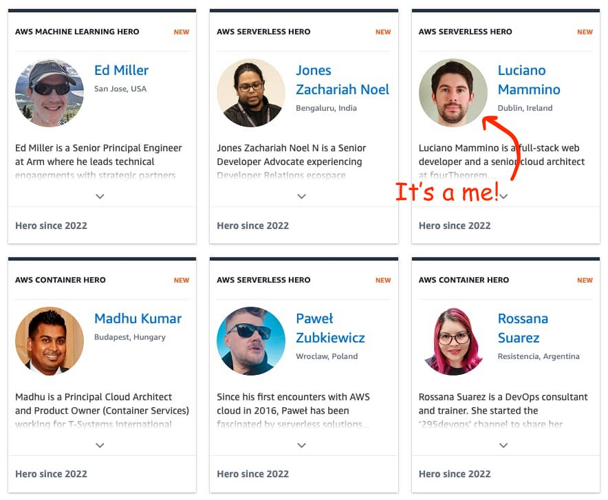

Now, why is it a big deal to me? Let me quote AWS:

> The AWS Heroes program recognizes a vibrant, worldwide group of AWS experts whose enthusiasm for knowledge-sharing has a real impact within the community. Heroes go above and beyond to share knowledge in a variety of ways including online via social media, blog posts, open source projects, videos, and forums; or in person at conferences, workshops, and user group events.

I have surely done a good amount of work in this sense and I am really happy to get the recognition, but this one is very hard to get and I did not expect it at all.

In addition to that, it's not a program you can simply _apply_ to. AWS has obscure ways to discover and select potential heroes every year, and [there aren't that many worldwide](https://aws.amazon.com/developer/community/heroes).

Heroes are divided into areas of expertise (Community, Container, Data, DevTools, Machine Learning, Serverless). I was awarded the Serverless hero title, which makes a lot of sense, since most of my AWS efforts have been around serverless in the last ~5 years.

What I believe has been the most important thing that I have done in the realm of serverless is [middy](https://middy.js.org), a Node.js middleware engine for AWS Lambda which allows you to organize your Lambda code, remove code duplication and focus more on business logic.

And this brings me to the part where I have to say thank you to other people because without them I probably wouldn't have gotten this recognition:

  - [Will Farrell](https://twitter.com/willfarrell), maintainer of Middy. Will has done incredible work in the last 3 years taking Middy above and beyond. I wouldn't have been able to keep the project going without Will's hard work, so I am incredibly grateful for continuing from where I mostly left off. Thanks, Will!
  - The amazing team at [fourTheorem](https://fourtheorem.com), because I feel like I am learning and growing a lot by working with such a talented and enthusiastic team of professionals.
  - [Eoin Shanaghy](https://twitter.com/eoins) for sharing his endless knowledge with me and for being such a fantastic co-host for [AWS Bites Podcast](https://awsbites.com/).
  - Tons of folks who have been inspirational in my AWS serverless journey: [Yan Cui](https://twitter.com/theburningmonk), [Heitor Lessa](https://twitter.com/heitor_lessa), [Sara Gerion](https://twitter.com/Sarutule), [Matt Meckes](https://twitter.com/mmeckes), [Andrea Amorosi](https://twitter.com/dreamorosi), [Alex DeBrie](https://twitter.com/alexbdebrie), and many more that I am sure I am forgetting (sorry).
  - All the other other heroes, for being such an incredible source of inspiration.
  - All the AWS folks who decided to pick my name for the award!

What happens next? Well, for starting I got some cool swag. Thanks, AWS much appreciated.

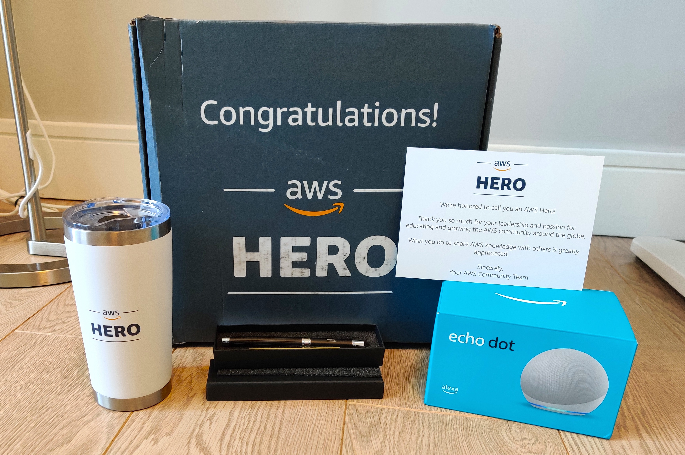

Yeah, my box probably got a few kicks on the way...

Other than that, you'll probably see me posting more AWS and serverless-related content and most likely I will attend the re:Invent in 2023!

Also, I want to take this opportunity to give a big thank you to the AWS Heroes team: [Farrah](https://twitter.com/FarrahC32), [Taylor](https://twitter.com/taylorjacobsen), and Albert.

> "With great power comes great responsibility"
>
> — Uncle Ben

## Confirmed as MVP

In July I got a nice _azure_ postcard from Microsoft telling me that I got re-confirmed as MVP (Most Valuable Professional) for Developer Technologies for the years 2022 and 2023!

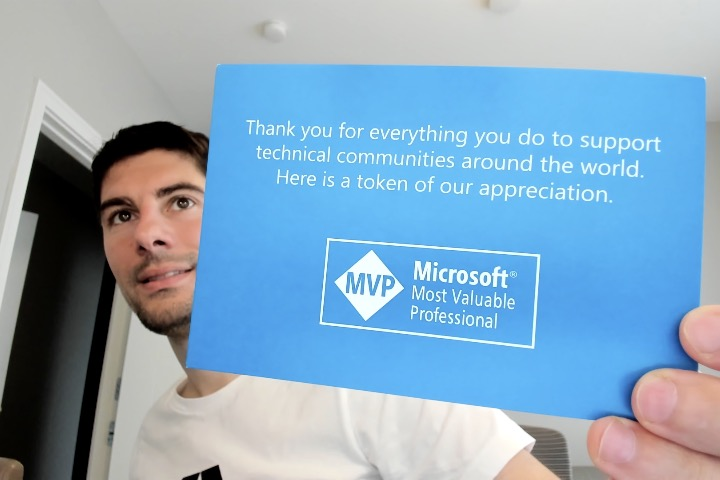

The [Microsoft MVP program](https://mvp.microsoft.com/) is somewhat similar to the AWS Hero program, meaning that it aims to reward people who contribute heavily to the tech industry by sharing their knowledge, creating content and practicing public speaking. The main difference from the Hero program is that the MVP program is much more generic, it does not necessarily focus on Microsoft technologies.

It makes me incredibly proud to be recognized as such by Microsoft, especially considering that I am not a big user (nor promoter) of Microsoft products and languages.

One cool thing about the MVP program is that they give you a little totem the first year and every year you get a new token that can be added to the stack!

I should put it on a shelf at some point!

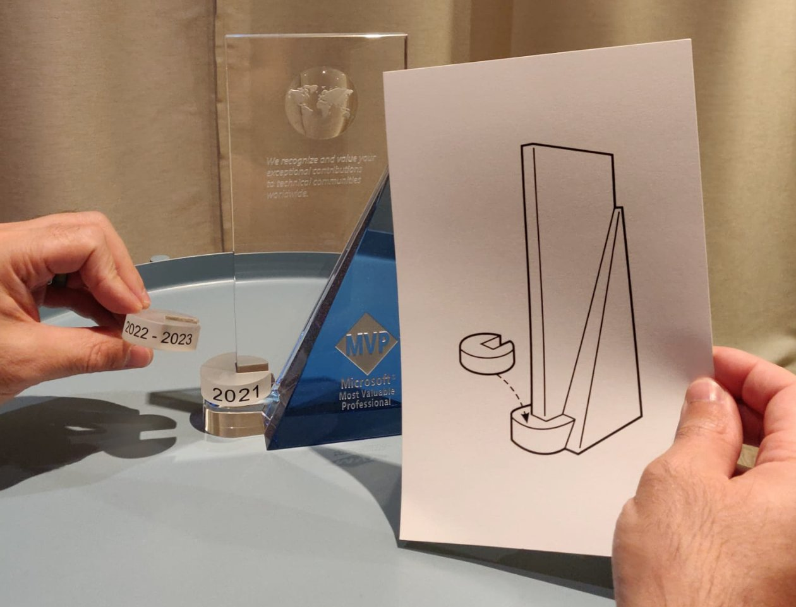

You can also check out my [MVP profile](https://mvp.microsoft.com/en-us/PublicProfile/5004232) to make sure I am not lying to you. 😜

> "Sharing is good, and with digital technology, sharing is easy"
>
> — Richard Stallman

## Codemotion Ambassador

In 2022 I got nominated Codemotion Ambassador!

Codemotion is the biggest tech community in Italy and one of the biggest in Europe. They also organize some of the best tech conferences that I had the pleasure to attend.

[Codemotion ambassador program](https://www.codemotion.com/magazine/dev-life/meet-the-codemotion-ambassadors/) aims to create a structured Codemotion supporters network. Ambassadors are supported to share their software development knowledge, grow their professional skills, and provide value to the global tech community.

Since I have been eagerly contributing to Codemotion during the last 8 years, it makes me really happy to be part of this group of people who can evangelize this community and make a bigger impact together on the overall tech community.

I am particularly proud of one of the many initiatives I have been involved with as an ambassador: the _Wannabe speaker_ program, in which, every ambassador got the chance to help a first-time speaker to deliver a kick-ass presentation.

I had the pleasure to work with **Danilo Spinella** who presented a talk called [Beautiful CLI Applications in Rust](https://danyspin97.org/talks/beautiful_cli_apps_in_rust/). You can [watch the recordings](https://talks.codemotion.com/wannabe-speaker-1) if you are curious (and you should).

To be fair, Danilo did not need a lot of support and he was able to deliver an excellent and enjoyable presentation like a true veteran speaker!

Also, I want to take this opportunity to thank [Francesco Sciuti](https://twitter.com/FrancescoSciuti), [Mara Marzocchi](https://www.linkedin.com/in/maraexception/), and the rest of the Codemotion team for adding me to this fantastic group of professionals. Ok, we are not always that _professionals_ but we definitely know how to have some fun!

>"You cannot teach a man anything. You can only help him discover it within himself"
>
> — Galileo Galilei

## Public Speaking

I did not stop doing public speaking in 2022, so let's have a look at a picture and then some stats.

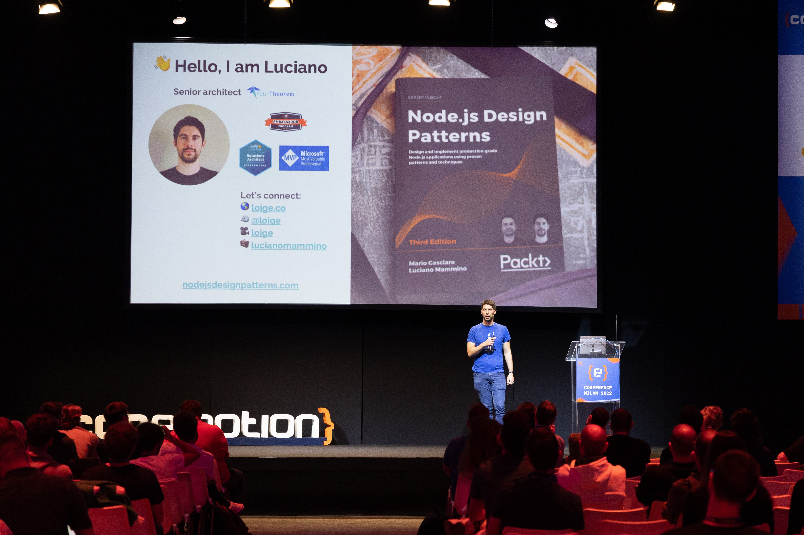

This picture is from my talk at Codemotion Milan in October where I presented a talk called: ["Serverless for High Performance Computing"](https://talks.codemotion.com/serverless-for-hpc).

In 2022, I spoke at **25** different events and surpassed more than **100** speaking engagements in total! Yeah, vanity metrics feel good sometimes! 😛

Here's the full list for 2022:

- _Migrate the monolith to the cloud_ on Fabio Biondi's Twitch Channel (in Italian) ([Slides](https://loige.link/mono-cloud))
- _A look inside the European Covid Green Pass_ at Rust Dublin Meetup ([Slides](https://loige.link/rust-green), [Video](https://www.youtube.com/watch?v=2dFJkYH_Cc0))
- _Dal monolite al cloud: no stress!_ at Codemotion DevCast (in Italian) ([Slides](https://loige.link/mono-lit), [Video](https://talks.codemotion.com/dal-monolite-al-cloud-no-stress))
- _The senior dev_ at Private event ([Slides](https://loige.link/senior))
- _Happy days with Node.js streams_ workshop at CityJS London ([Repository](https://github.com/lmammino/streams-workshop))
- _Finding a lost song with Node.js & async iterators_ at private event ([Slides](https://loige.link/song-iter))
- _AMA: Node.js design patterns, AWS e altre cose fantastiche_ live interview with Emanuele Bartolesi for UGIdotNET (in Italian) ([Video](https://www.ugidotnet.org/tv/episodio/2950/Ask-Me-Anything/Node-js-design-patterns-AWS-e-altre-cose-fantastiche))
- _Teach Kelvin Your Thing: Node.js streams_ with Kelvin Omereshone ([Video](https://www.youtube.com/watch?v=ldcfYB_mo6Q))
- _Finding a lost song with Node.js & async iterators_ at Node.js Global Summit ([Slides](https://loige.link/async-iter-song), [Video](https://youtu.be/cTD4KWSTEd8))
- _Javascript iteration protocols_ workshop at Codemotion Workshop Fest ([Slides](https://github.com/lmammino/iteration-protocols-workshop))
- _Let's build a Serverless e-commerce from scratch_ workshop at CityJS Athens ([Slides](https://fth.link/sec))
- _Finding a lost song with Node.js & async iterators_ at CityJS Athens ([Slides](https://slides.com/lucianomammino/finding-a-lost-song-with-node-js-and-async-iterators-cityjs))
- _Serverless for HPC_ at AWS Dublin Meetup ([Slides](https://slides.com/lucianomammino/serverless-for-hpc))
- _Async JavaScript and Node.js Design Patterns_ at Sailsconf ([Slides](https://slides.com/lucianomammino/async-javascript-and-nodejs-design-patterns), [Video](https://www.youtube.com/watch?v=lxi8W7Z07To))
- _Interview with Reconfigured podcast_ ([Video](https://www.youtube.com/watch?v=23bKVdY0gp8))
- _Building an invite-only microsite with Next.js & Airtable_ at React Dublin Meetup ([Slides](https://loige.link/microsite))
- _JavaScript Iteration Protocols_ workshop at NodeConfEU ([Slides](https://loige.link/lets-iter), [Repository](https://github.com/lmammino/iteration-protocols-workshop))
- _Serverless for High Performance Computing_ at Codemotion Milan ([Slides](https://fth.link/cm22), [Video](https://talks.codemotion.com/serverless-for-hpc))
- _Serverless for High Performance Computing_ at Cloud Day ([Slides](https://fth.link/cd22))
- _Come sviluppare una carriera in tech_ inteview with NonCompila on Twitch (in Italian) ([Video](https://www.twitch.tv/videos/1647170014))
- _Full Stack Developer Creating Content_ interview with Zak Aghbal for the Content Creator Life Podcast ([Video](https://www.youtube.com/watch?v=9C-akUL8Dw4))
- _Let's build a 0-cost invite-only website with Next.js and Airtable_ at Conf42 JavaScript ([Slides](https://loige.link/micro42), [Video](https://www.youtube.com/watch?v=2Spu3SQSMjQ&t=703s))
- _Everything I know about S3 pre-signed URLs_ at AWS User Group Dublin Meetup ([Slides](https://fth.link/presign))
- _From Node.js To Design Patterns_ at BuildPiper Meetup ([Slides](https://loige.link/node2dp), [Video](https://www.youtube.com/watch?v=GVe9Ih47pm4))
- _Building an invite-only microsite with Next.js & Airtable_ at React Milano (in Italian) ([Slides](https://loige.link/pizzaparty), [Video](https://www.youtube.com/watch?v=WFd_W_PxBOE))

If you are curious to see all my other speaking engagements, I keep the complete list in the [speaking section](/speaking).

If you are brave enough to withstand my accent, you can [invite me to speak at one of your events](http://loige.link/invite-me-to-a-conference). 

> "All life is problem solving"
>
> — Karl Popper

## AWS Bites

In 2022, Eoin Shanaghy and I produced **45 new episodes** of [AWS Bites](https://awsbites.com/), a weekly podcast where we discuss interesting AWS-related topics.

"[What can kitties teach us about AWS](https://awsbites.com/58-what-can-kitties-teach-us-about-aws/)" is probably my favorite episode so far:

<iframe style="position: absolute; top:0; left: 0; width: 100%; height: 100%;" src="https://www.youtube.com/embed/DYryFM1vTe0" frameborder="0" allowfullscreen></iframe>

I don't really know if it's the best episode to date, but certainly, it is the one with the best thumbnail! 😼

One cool thing we did for AWS Bites is that this year we tried to build an actual product from scratch in a series of live streams. We built a minimal but functional clone of Dropbox transfer or WeTransfer and we did that by using serverless technologies on AWS.

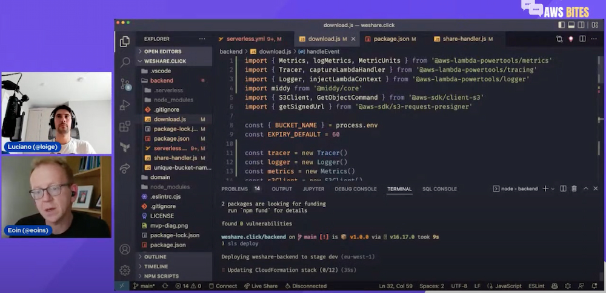

The playlist with the recording of the live streams is available on YouTube: [Live coding a serverless file transfer app on AWS](https://www.youtube.com/playlist?list=PLAWXFhe0N1vI1_z-06EzJ22pz95_gBrId).

Finally, it is worth mentioning that we surpassed **1000 subscribers** on Youtube and that we also got some awesome stats from [our Podcast on Spotify](https://open.spotify.com/show/3Lh7PzqBFV6yt5WsTAmO5q).

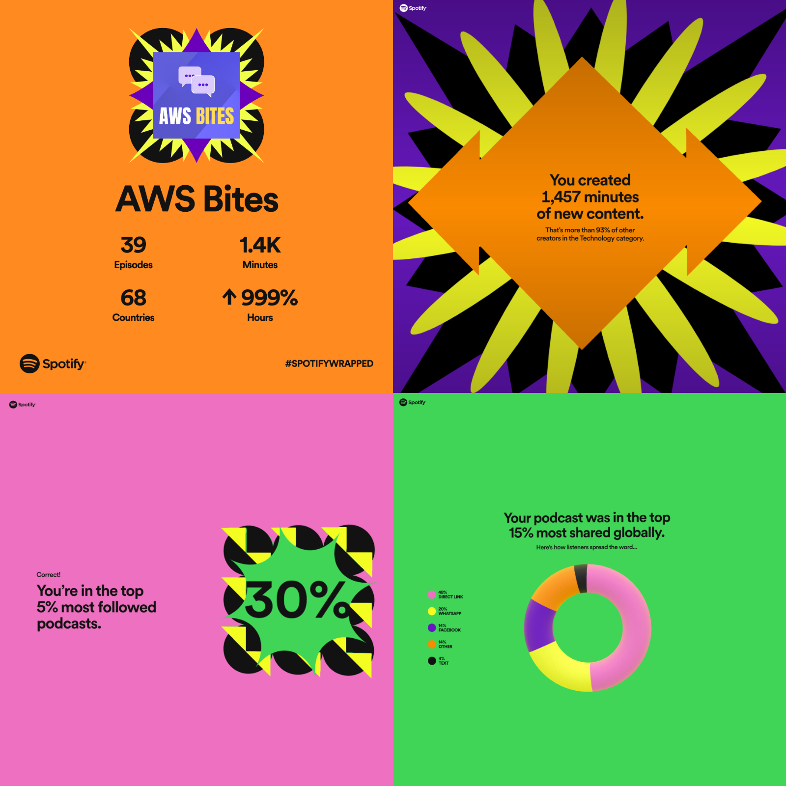

The episode count somehow does not match exactly what we have done, but all the other stats are more impressive than we expected. Let's assume these stats are somewhat accurate and let's celebrate... I guess. 🍻

> "Success is not final, failure is not fatal: It is the courage to continue that counts"
>
> – Winston Churchill

## Live coding on Twitch

Throughout 2022 I kept [streaming on Twitch](https://twitch.tv/loige) quite consistently. As I did last year, most of it was about solving Advent of Code challenges and learning Rust with my friends [Eugen](https://twitter.com/88_eugen) and [Roberto](https://twitter.com/gbinside) (thanks a lot for being there, having fun, and learning with me).

We streamed **36 times** in total (almost once every week). Here are some more nerdy stats:

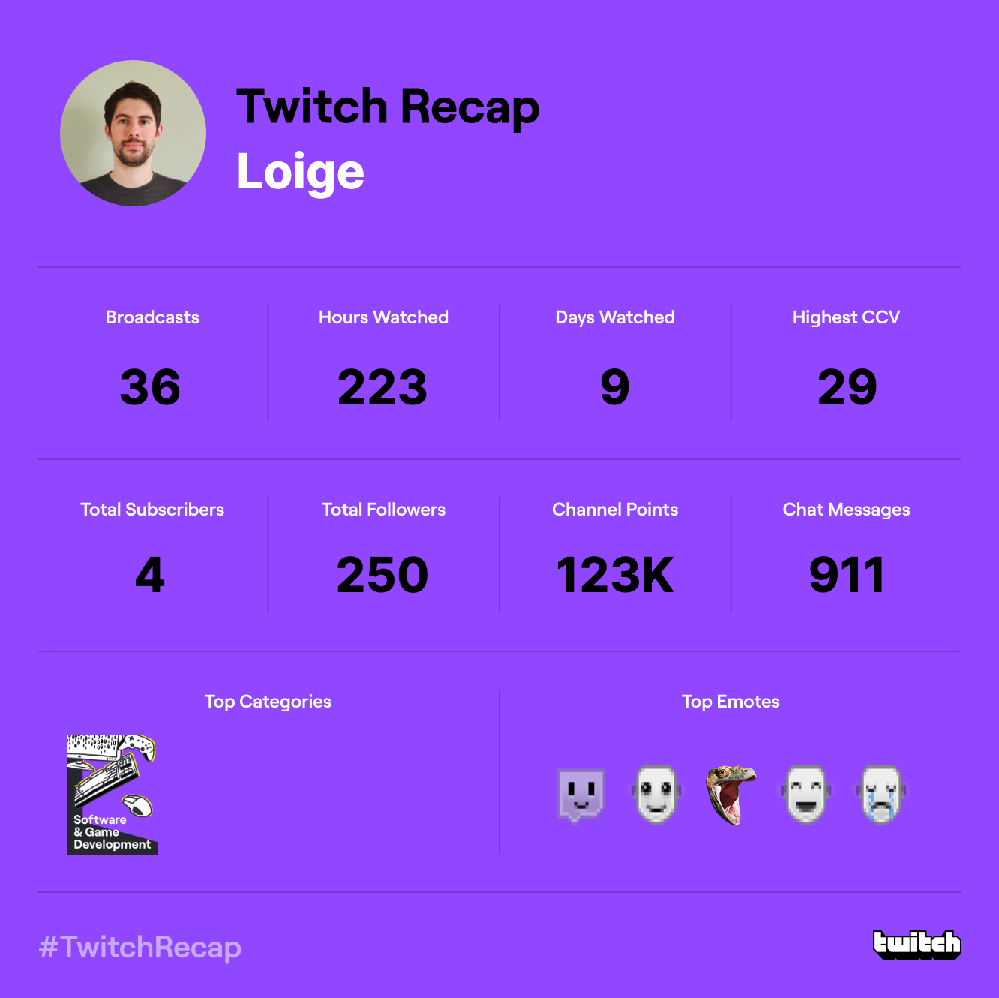

I am not at the levels of [ThePrimeagen](https://www.twitch.tv/theprimeagen), but hey we had a lot of fun and I certainly learned a lot!

Towards the end of the year, we also spent a bit of time learning [Bevy](https://bevyengine.org/), a game engine written in Rust and built some game prototypes with it.

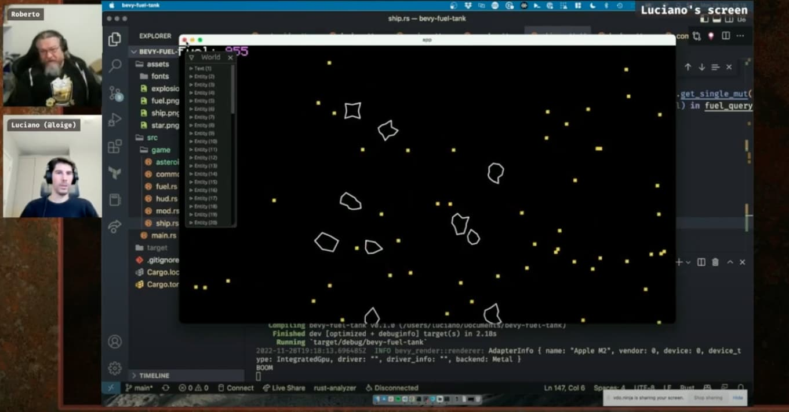

If you want to watch the recordings of these live experiments, here's a YouTube playlist: [Rust gamedev with Bevy](https://www.youtube.com/pla[label](https://nodejsdesignpatterns.com/)ylist?list=PLbNOKnE-Oyr3yVKPvMeX0tKaalvafYQ8P).

A big shout-out goes to [Tommaso Allevi](https://twitter.com/AlleviTommaso), for helping us kickstart this journey into Rust gamedev. I have to say I really like the ECS (Entity Component System) model of Bevy so far, so I look forward to _playing_ more with it!

Finally, I have been experimenting a bit with OBS and did a solo stream where I played a bit with [Solid.js](https://www.solidjs.com/) a frontend JavaScript framework that I am liking a lot and that I'd like to use more.

All the recordings of [my live streams are available on YouTube](https://youtube.com/loige), so make sure to give me a follow there!

> "Play is the work of the child"
>
> — Maria Montessori

## Node.js Design Patterns

[Node.js Design Patterns](https://nodejsdesignpatterns.com), the book I co-authored with [Mario Casciaro](https://twitter.com/mariocasciaro), is still trending quite well after 2.5 years since the third edition was published.

The thing that makes me really happy is that the book keeps receiving very positive reviews. We doubled them since last year while keeping an incredibly high average rating of **4.6**/5.

[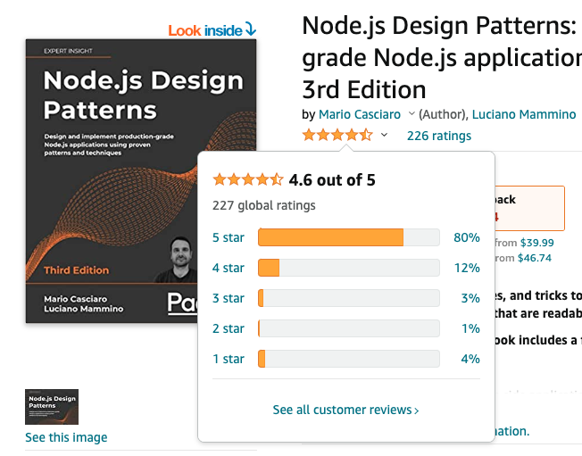](https://nodejsdesignpatterns.com)

At the time of writing the book is trending at:

- **#110,173 in the global list** of Amazon books
- **#11 in the Web Services** category
- **#22 in the JavaScript** category

We also keep receiving spontaneous comments and seeing [random Reddit comments](https://www.reddit.com/r/node/comments/yyu5xj/comment/iwx4o2n/?context=3) about how the book has been useful to readers.

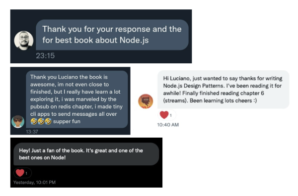

It seems like the book is even being used as teaching material in some universities... and someone even contacted us to say that they discovered this book in the library of a tech investment fund in San Francisco. 🤯

Node.js Design Patterns keeps feeling like one of my biggest achievements professionally and I am always grateful to Mario for involving me in this awesome project.

The book still feels quite relevant and up-to-date (updated to Node.js 14 and using ESM throughout), so I don't feel like it's time for a new edition just yet.

If you disagree, do let me know. I'd love to hear your opinion!

Finally a HUGE shout out to my dear friend [Kelvin Omereshone](https://twitter.com/Dominus_Kelvin) for gifting copies of the book to quite a few people! ❤️

> "A book is a garden, an orchard, a storehouse, a party, a company by the way, a counselor, a multitude of counselors"
> 
> — Charles Baudelaire

## FullStack Bulletin

[FullStack bulletin](https://fullstackbulletin.com/) is a free weekly newsletter about full stack web development. I have been running this project with my dear friend [Andrea Mangano](https://twitter.com/andreaman87) for the last 5 years.

The achievement of 2022 is that we surpassed **300 issues** and **2500 subscribers**!

FullStack bulletin is always looking for sponsors, so if you like this format and you would like to reach a vetted audience of full stack engineers please [consider sponsoring us](https://fstack.link/sponsor)!

> "The art of art, the glory of expression and the sunshine of the light of letters, is simplicity"
>
> — Walt Whitman

## Middy

[Middy](https://middy.js.org) is a Node.js middleware framework for AWS Lambda. I have been working on this project since the early days of Lambda (even though the first public commit was only made on the 3rd of August 2017).

With that being said, I can’t really claim anything for the success of the framework during the last three years. Insted all the credit goes to Will Farrell, who has been relentlessly maintaining the framework, and to the amazing community behind Middy!

The main news is that Middy v4 was published this year bringing significant innovation including:

- Support for Node.js 18
- Adoption of the new modular AWS SDK v3
- Better support for ESM
- Various performance improvements and bug fixes

[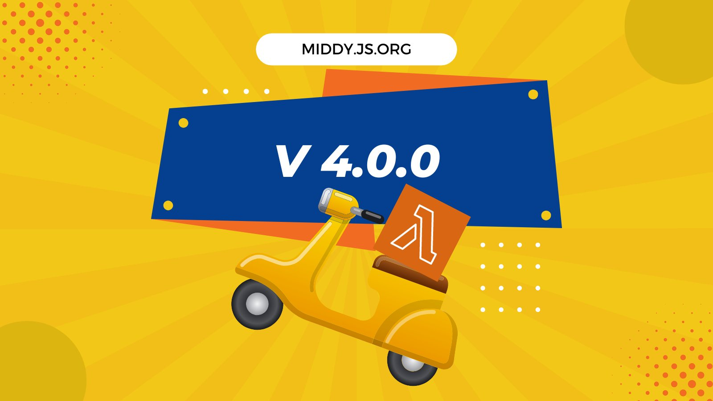](https://github.com/middyjs/middy/releases/tag/4.0.0)

Middy has been growing even more in 2022, here is a shiny graph to prove it:

This graph shows the number of weekly downloads and it clearly highlights that the amount is more than doubled from the previous year!

Note that `@middy/core` represents newer versions (from v1 to v4), while `middy` is the legacy 0.x package (surprisingly still being used a lot).

If we look at the total number of downloads throughout the year we surpassed **more than 8 million downloads**!

[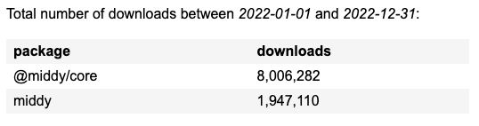](https://npm-stat.com/charts.html?package=%40middy%2Fcore&package=middy&from=2022-01-01&to=2022-12-31)

I look forward to checking these stats again next year!

Meanwhile, if you use Middy, make sure to [support Will Farrell for his awesome open-source work](https://github.com/sponsors/willfarrell) (yes, you should consider donating on GitHub)!

> "If you want to heal your soul, ride a Vespa instead of driving a car"
>
> — anonymous

## Articles

In 2022, I wasn't really a prolific author on this blog. I published only 2 articles:

- [Invite-only microsites with Next.js and AirTable](https://loige.co/invite-only-microsites-with-nextjs-and-airtable)
- [AWS Solution Architect Professional exam, my notes and tips](https://loige.co/aws-solution-architect-professional-exam-notes-tips)

On the other end, I think I was quite prolific in other media. Below there's a full list, but the most important ones in terms of authority are definitely **AWS** and **InfoQ**! Both feel like massive achievements on their own!

- [What do you need to know about SQS?](https://fourtheorem.com/what-do-you-need-to-know-about-sqs/)
- [Node.js stream consumer utilities](https://www.nodejsdesignpatterns.com/blog/node-js-stream-consumer/)
- [What can you do with EventBridge](https://fourtheorem.com/what-can-you-do-with-eventbridge/)
- [What do you need to know about SNS?](https://fourtheorem.com/what-do-you-need-to-know-about-sns/)
- [A Recipe to Migrate and Scale Monoliths in the Cloud](https://www.infoq.com/articles/cloud-migrate-scale/)
- [A serverless architecture for high performance financial modelling](https://aws.amazon.com/blogs/hpc/a-serverless-architecture-for-high-performance-financial-modelling/)
- [Quality code: Node.js design patterns and performance (interview with Sprkl part I)](https://sprkl.dev/quality-code-node-js-design-patterns-and-performance/)
- [Quality code: Node.js design patterns and dependency management (interview with Sprkl part II)](https://sprkl.dev/quality-code-node-js-design-patterns-and-dependency-management/)

> "Every secret of a writer’s soul, every experience of his life, every quality of his mind, is written large in his works"
> 
> — Virginia Woolf

## Open Source

In 2022 I continued steadily to do some degree of open source work by contributing to existing repositories and starting new ones.

[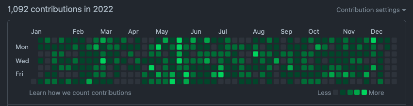](https://github.com/lmammino?tab=overview&from=2022-12-01&to=2022-12-19)

Here's a list of the most meaningful contributions:

- [`lmammino/tall`](https://github.com/lmammino/tall) - a Promise-based, No-dependency URL unshortner (expander) module for Node.js. I have been working with [Karl Horky](https://github.com/karlhorky) to make the library extensible and to add some advanced plugins.
- [`lmammino/rust-advent`](https://github.com/lmammino/rust-advent) - the repository where we publish all our Rust solutions for Advent of Code.
- I contributed to [`aws-samples/serverless-patterns`](https://github.com/aws-samples/serverless-patterns) with a [small fix](https://github.com/aws-samples/serverless-patterns/pull/449) that leverages the streaming capabilities of `sharp`.
- I created [a repository](https://github.com/lmammino/mega-match-vs-phf) to benchmark the performance of [`phf`](https://docs.rs/phf/latest/phf/), a Rust library using perfect hash functions to generate build-time hash tables, against a mega-match expression.
- I delivered a talk called "The Senior Dev" and since I decided to use [`slidev`](https://sli.dev/) to generate my slides, I hosted the [source code for the slides](https://github.com/lmammino/the-senior-dev) on GitHub.
- I created [`fourTheorem/api-gateway-sls-example`](https://github.com/fourTheorem/api-gateway-sls-example), an example of how to build a simple API with API Gateway, Lambda and the serverless framework.
- Thanks to my open source work on [lmammino/iteration-protocols-workshop](https://github.com/lmammino/iteration-protocols-workshop), I had the pleasure to be invited to [review a PR](https://github.com/mdn/content/pull/17529) that adds [Async generator documentation to MDN](https://developer.mozilla.org/en-US/docs/Web/JavaScript/Reference/Global_Objects/AsyncGenerator).
- I developed a repository called [`lmammino/secret-pizza-party`](https://github.com/lmammino/secret-pizza-party), a sample Next.js website to showcase how you can make invite-only SPAs with Next.js, AirTable & Vercel.
- I worked with the awesome [Theodore Vorillas](https://github.com/vorillaz) and submitted a couple of PRs to improve [`proximahq/clickhouse`](https://github.com/proximahq/clickhouse), a simple, plain, efficient Clickhouse client.
- I worked with Eoin Shanaghy on [`awsbites/weshare.click`](https://github.com/awsbites/weshare.click), an example personal file transfer app on AWS.
- During NodeConf EU I attended a fantastic workshop by [Patty O'Callaghan](https://twitter.com/pattyneta) about [tensorflow.js](https://www.tensorflow.org/js) and, as a result of what I learned, I developed a sample application that you can find in [`lmammino/crappy-object-recognition-web-app`](https://github.com/lmammino/crappy-object-recognition-web-app) (screenshot below).
- During NodeConf EU I also collected all my notes in a [repository](https://github.com/lmammino/nodeconfeu2022-notes).
- I created a [simple script that helps me with tracking my expenses for tax reasons](https://github.com/lmammino/expenses). I am not a tax expert, but you can take a look and adapt it to your particular use cases (while making sure to consult your accountant)!
- I have created several repositories with my Rust Bevy experiments: [`lmammino/bevy-wrapping-square`](https://github.com/lmammino/bevy-wrapping-square), [`lmammino/stranded-in-space`](https://github.com/lmammino/stranded-in-space), and [`lmammino/bevy-fuel-tank`](https://github.com/lmammino/bevy-fuel-tank).
- I also created [a Rust repository](https://github.com/lmammino/nannou-sand-simulation) with my experiments with [Nannou](https://nannou.cc/), an open-source creative-coding toolkit for Rust.
- I started solving Advent of Vue challenges but using Solid.js instead and I am keeping my code in this repository: [lmammino/advent-of-solidjs](https://github.com/lmammino/advent-of-solidjs).
- I created a [simple repository](https://github.com/lmammino/etna-facts) that can be used as a library and an API to get facts about Mount Etna (the volcano close to where I am from in Sicily).

[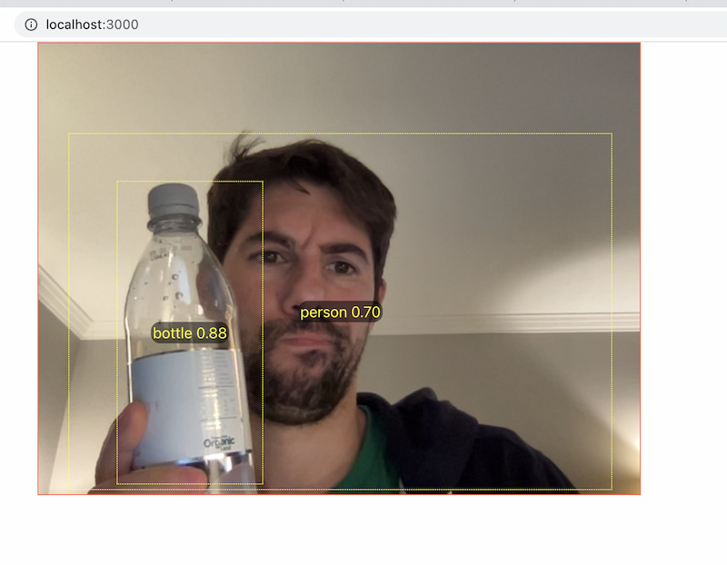](https://github.com/lmammino/crappy-object-recognition-web-app)

Above a screenshot of my [crappy object recognition application](https://github.com/lmammino/crappy-object-recognition-web-app) built with Tensorflow.js and Solid.js. I am also about _70% sure_ that I am a real person! 😆

 
A final mention is my [open PR](https://github.com/nodesecurity/eslint-plugin-security/pull/95) together with [Simone Sanfratello](https://twitter.com/simonesanfradev) where we are trying to bring the awesome [`anti-trojan-source`](https://github.com/lirantal/anti-trojan-source/) detector by [Liran Tal](https://twitter.com/liran_tal) directly into [`nodesecurity/eslint-plugin-security`](https://github.com/nodesecurity/eslint-plugin-security). I hope this will be merged before the end of 2022!

> "Perseverance is not a long race; it is many short races one after the other"
>
> — Walter Elliot

## Random stuff

And as we get ready to wrap things up, here are a few more random things:

- Last year, I became a **Certified AWS Solution Architect Professional**. If you are curious to know what was my experience and get some of my study notes, make sure to check out my article [AWS Solution Architect Professional exam, my notes and tips](https://loige.co/aws-solution-architect-professional-exam-notes-tips).
- I got married to the most wonderful person in the world (and this alone makes 2022 the best year ever)! 👰‍♀️❤️🤵‍♂️
- I Restarted BJJ training (and after almost 3 years it feels like I have to re-learn everything from scratch)!
- I kept running, running a total of **340 Km**... 🏃‍♂️ And once again big thanks to my friend [Luca Marchesotti](https://twitter.com/lucamarchesotti) for motivating me.
- I got covid... twice! 🤧

## Expectations for next year

OMG, are you still here?! I am seriously impressed. 🥸

At this point, you should go the extra mile and make sure to leave me a [comment](#comments)!

Ok, before we wrap things up, let me tell you what's my plan for 2023.

Well... there is no big plan, really!

My overall goal is to keep growing my expertise in **AWS** and **Serverless** and work on interesting projects. Luckily there is no shortage of opportunities when working with fourTheorem, so I feel this goal will be pretty much achievable organically by just keep doing what I do in my daily work.

I'd also love to have an opportunity to put all the **Rust** learnings of the last 4 years into something a bit more practical, or **production-ready** if you will! If a work project does not manifest itself I might try to get a bit more serious with my side projects and maybe try to build something more involved in Rust. I will most likely continue some game dev sessions in my streams, but I might also try to do something that combines Rust with AWS, possibly including Serverless. I have been experimenting with Rust lambdas and I have been blown away by the performance, so there's an opportunity there.

Finally, I have been quite excited by **Solid.js**, so I'll be seeking new opportunities to play with it!

Of course, I'll try my best to keep pushing things that I have been investing in the last few years: AWS Bites, FullStack bulletin and live coding on Twitch. I will try to find other opportunities for content creation, most likely publishing articles and delivering talks at conferences.

If you have any suggestions or comments on this _obviously perfect_ plan, I am all ears!

I'd also love to know what was your biggest achievement of 2022 and what you plan to accomplish in 2023, so don't be shy and leave a comment!

This is me, signing out and getting ready for 2023!

Until next time, peace! 👋
