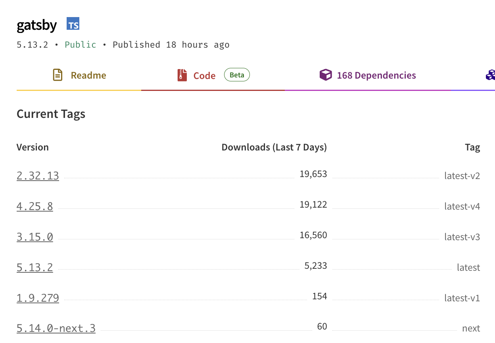

I recently migrated this blog from [Gatsby](https://www.gatsbyjs.com/) to [Astro](https://astro.build/). Finally, I have to say! I have been meaning to move away from Gatsby for a while, but I never really prioritised this activity until now and all my previous attempts had failed for one reason or another...

When I published this new version, quite a few people reach out to ask various questions related to this migration. So, in this article I will try to cover my motivations for migrating, the process I followed and some issues and unexpected things I learned along the way. The migration also included a complete redesign of the blog, so I will also touch on that aspect a little bit.

## The motivation(s)

I have been running this blog for 10 years now. I initially started with a simple **WordPress** deployment, which didn't tolerate for very long. So I quickly moved to **Ghost**, which I self-hosted on a Digital Ocean VM and ran for a few years. I was quite happy with it, except I wanted a more _serverless_ low-maintenance solution, so [I eventually managed to move this blog to Gatsby](/2018-a-year-in-review#static-blog-migration) and live happily with a fully static and effectively costless solution. This was in 2018, so I have been a Gatsby user for about 6 years!

So what's wrong with Gatsby and what was the motivation to move away from it?

Actually, Gatsby in itself is quite a good product. It has tons of features and plugins. If you like writing React and MDX and shipping your site as a SPA (Single Page Application) nicely cached as a PWA (Progressive Web Apps), Gatsby has it all! It's also very easy to get started with and it has a very active community publishing a plethora of plugins for the most disparate use cases.

OK, Luciano, so why the heck did you want to move away from it, then?!

Good question, I am glad you asked! I think it's hard to pinpoint one reason; it's most likely a combination of a few things (which are not always Gatsby's fault):

### Keeping up with the upgrades

The first releases of Gatsby moved quite quickly and they often required a significant amount of work in migrating to the next version. At some point, I stopped caring about upgrades and I eventually got stuck on an unsupported version. This eventually required me to build my blog with an old and unsupported version of Node.js and to have to rely on outdated and insecure dependencies. Sure, it's a static blog, so it's not like I am publishing an interactive application that might have tons of vulnerabilities, but, still, it's annoying to rely on an outdated build system and have to switch Node version every time I need to work on the blog.

Fun fact: by looking at the [number of weekly Gatsby downloads by version](https://www.npmjs.com/package/gatsby?activeTab=versions), it looks like I was not alone with this problem!

As you can see, at the time of writing this, Version 5 (the current major release) is way behind versions 2, 4, and 4 respectively... Funny to see that the majority of users are still running on version 2! I was stuck on version 3, so maybe I wasn't doing too bad after all!

### Complexity

This is probably a matter of personal preference, but I feel that Gatsby is a bit of a complex beast. If you need a good reason to justify this statement I actually have 2: **GraphQL** and **Client-side hydration**. Let me explain...

Let's start with GraphQL.

When you build static websites, you generally need to have some kind of way to load data from one or more sources. After all, the main task of a static site generator is to take data and templates as input and produce web assets (HTML, CSS, JavaScript, Images, etc) as output.

Gatsby abstracts the concept of data loading with GraphQL. This is a very powerful abstraction that allows you to fetch data with extreme precision. Many frontend developers have gotten accustomed to this way of retrieving data so it makes sense for Gatsby to adopt this abstraction.

On the other hand, it feels like an unnecessary complexity when dealing with static websites where most often you are loading data from relatively simple markdown, MDX or Yaml files. Most often you just want to load all the data (you'll need to generate all the pages anyway) and you still have to think in terms of GraphQL queries.

I did enjoy it at first (maybe because of the novelty of GraphQL), but I got eventually fed up with it!

What about Client-side hydration? Isn't that a good thing?!

Giving you an [overview of the Gatsby build process](https://www.gatsbyjs.com/docs/conceptual/overview-of-the-gatsby-build-process/) is a bit out of the scope of this article, so I am going to focus only on what the final output looks like.

Gatsby produces highly optimised static websites that are built as a Single Page React Application with Server Side rendering and Client Side hydration. This means that the initial page load is very fast and the subsequent navigation is also very fast because the pages are already rendered and only need to be hydrated with the data.

This is all very good and dandy! Many would argue that this is the state of the art of frontend development and I don't necessarily disagree with that. However, it's not a simple system and it comes with lots of complexity and sometimes can lead to very nasty and unexpected bugs that are very hard to understand and fix.

One particular bug that I had was on my [speaking page](/speaking) where I have a list of past and future talks. This list is populated from a folder containing files ordered by date. Very naively, I used to separate future and past talks by comparing the event date with the current date. The problem here is that the current date is not _always_ the same on the server and on the client! When you build a new version of the website everything looks fine: your build date and the client date will be aligned for the rest of the day... from the next day on, though, the dates will start to diverge.

In my case, this messed up the hydration phase, which couldn't perfectly reconcile 2 lists that could effectively be different between the statically rendered version page and the client-side rendered one. If you opened the page, everything looks good, but sometimes you would have links being mixed up and pointing to the wrong slide deck or video. Very nasty!

Of course there are solution to this problem and the bug is probably on me, but it took me a while to even discover and understand this issue. For this particular use case, I'd rather give up on some hardcore optimization and take a simpler system that is easier to work with and gives more predictable results.

### Shiny-object syndrome & Easter Eggs

The last reason for switching to something else is because in tech we are guilty of always chasing the last cool thing! Astro is all the rage right now and therefore I was really curious to try it and see what it would look like to re-develop my blog with it. Guilty as charged!

I will also include here the fact that I took this re-implementation opportunity also as an opportunity to re-design the aestetich of the blog.

I wanted to make the blog more personal for a while. I liked the previous look, but I felt I wanted something with more character that might convey a bit more my passion for tech and the fact that I don't like to take myself too seriously. Work can and should be fun, after all!

This is my new home page header. It has some scroll based animation, which is only one of the few easter eggs I put here and there to give more character to the website.

Can you find them all? I'll give you a hint, have you bumped into the [404 page](/404) already?

## Astro vs Eleventy

So now that you had an overview of my motivations, let's talk about what else I have considered for this migration during the last couple of years.

I am a big fan of [Eleventy](https://www.11ty.dev). I truly think [Zach](https://www.zachleat.com/) and the open-source community behind Eleventy have done a fastastic job at building something simple and yet extremely powerful. If you have never seen Eleventy in action, I candidly recommend you to check out my blog post called [Getting started with Eleventy in 11 minutes](https://dev.to/loige/getting-started-with-eleventy-in-11-minutes-496j) which, even though is not super up to date, it should still convey how easy it is to get started and be productive with Eleventy.

I built quite a few websites with Eleventy (e.g. [Node.js Design Pattens](https://www.nodejsdesignpatterns.com/) one and the [AWS Bites Podcast](https://awsbites.com/) one) and I am generally very happy with it! So why didn't I use it for this blog?

There are probably 2 main reasons. The first one is easy: I already mentioned the shiny-object syndrome... I simply wanted to play with something new and shiny!

The second one is a bit more subtle and specific to this use case.

Eleventy supports quite a [big variety of templating languages](https://www.11ty.dev/docs/languages/), which is fantastic. Unfortunately among all of these templates there isn't an option to have something very close to React/JSX. Coming from Gatsby, I had a lot of existing JSX code that I wanted to re-use and I didn't want to have to re-write it all in a different templating language. Even if I wanted to put the effort into migrating all my pre-existing templates to something like [Nunjucks](https://mozilla.github.io/nunjucks/), these _more traditional_ templating languages don't really follow a _"component-first"_ approach, which is something I really like about React.

Note that recent developments in Eleventy have brought [WebC](https://www.11ty.dev/docs/languages/webc/), which is basically a new templating language that supports both _component-first_ templating but also both server-side and client-side rendering. So this can be an ideal solution if you don't care much about JSX and are actually looking for something that is closer to web standards.
