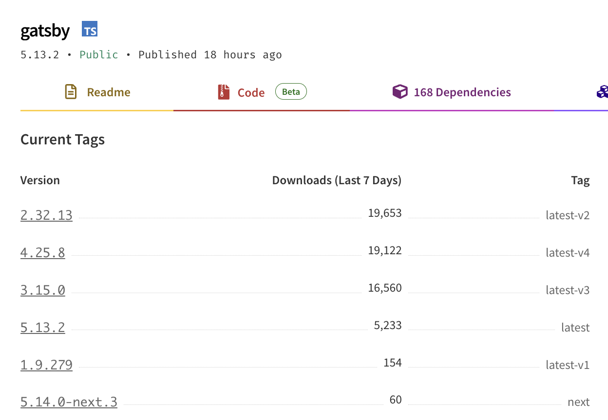
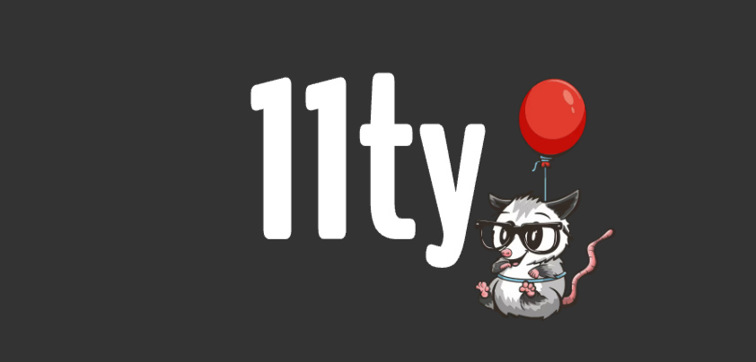
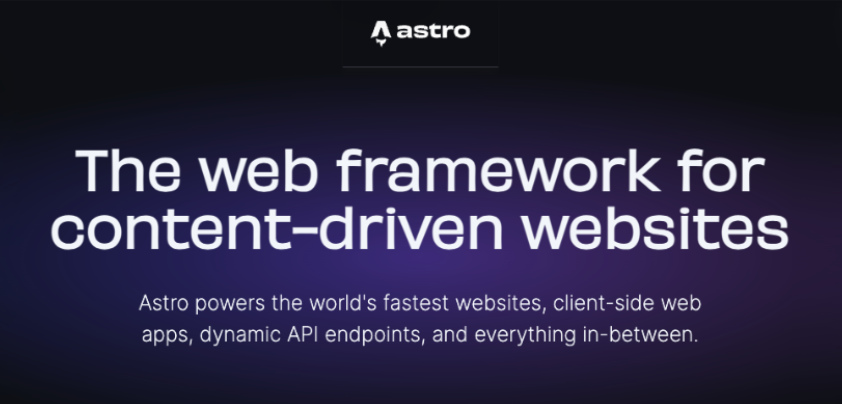
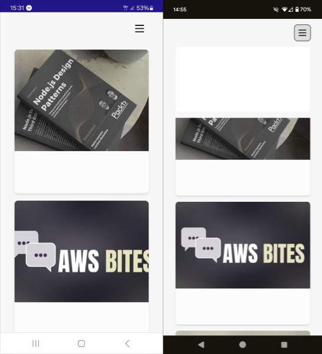
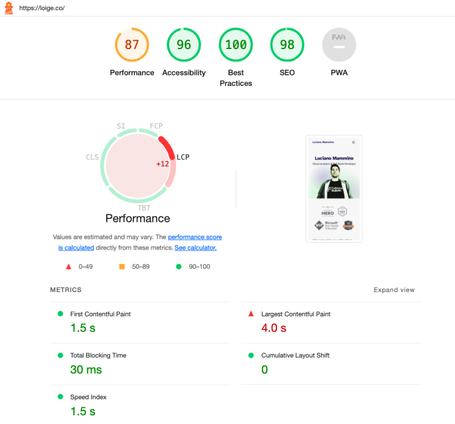
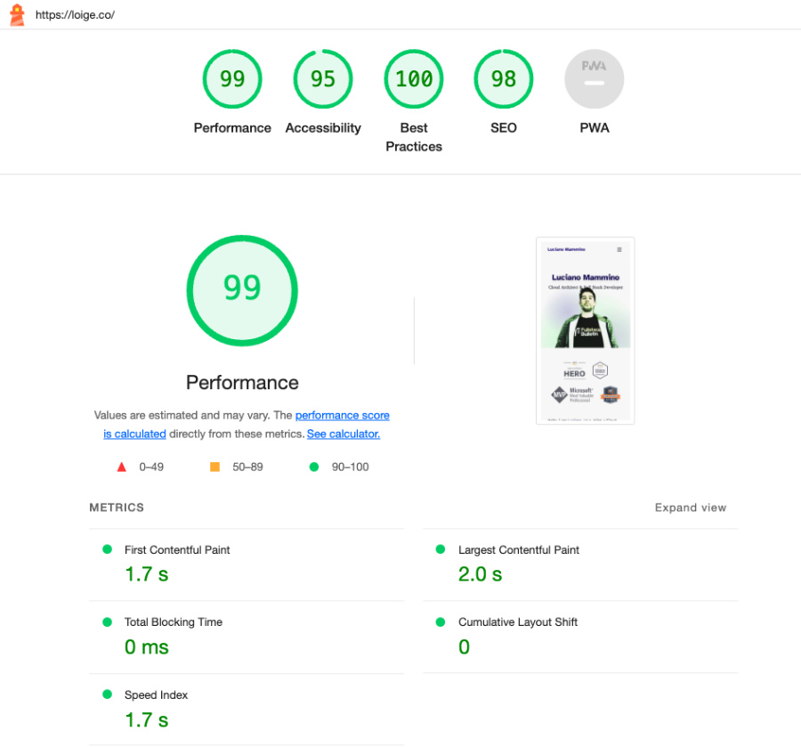

I recently migrated this blog from [Gatsby](https://www.gatsbyjs.com/) to [Astro](https://astro.build/). Finally, I have to say! I have been meaning to move away from Gatsby for a while, but I never really prioritised this activity until now and all my previous attempts had failed for one reason or another...

When I published this new version, quite a few people reached out to ask various questions related to this migration. So, in this article I will try to cover my motivations for migrating, the process I followed and some issues and unexpected things I learned along the way. The migration also included a complete redesign of the blog, so I will also touch on that aspect a little bit.

## The motivation(s)

I have been running this blog for 10 years now. I initially started with a simple **WordPress** deployment, which I didn't tolerate for very long. So I quickly moved to **Ghost**, which I self-hosted on a Digital Ocean VM and ran for a few years. I was quite happy with it, except I wanted a more _serverless_ low-maintenance solution, so [I eventually managed to move this blog to Gatsby](/2018-a-year-in-review#static-blog-migration) and live happily with a fully static and effectively costless solution. This was in 2018, so I have been a Gatsby user for about 6 years!

So what's wrong with Gatsby and what was the motivation to move away from it?

Actually, Gatsby in itself is quite a good product. It has tons of features and plugins. If you like writing React and [MDX](https://mdxjs.com/) and shipping your site as a SPA (Single Page Application) nicely cached with a built-in PWA (Progressive Web Apps), Gatsby has it all! It's also very easy to get started with and it has a very active community publishing a plethora of plugins for the most disparate use cases.

OK, Luciano, so why the heck did you want to move away from it, then?!

Good question, I am glad you asked! I think it's hard to pinpoint one reason; it's most likely a combination of a few things which are not always Gatsby's fault...

### Keeping up with the upgrades

The first releases of Gatsby moved quite quickly and they often required a significant amount of work in migrating to the next version. At some point, I stopped caring about upgrades and I eventually got stuck on an unsupported version. This eventually required me to build my blog with an old and unsupported version of Node.js and to have to rely on outdated and insecure dependencies. Sure, it's a static blog, so it's not like I am publishing an interactive application that might have tons of vulnerabilities, but, still, it's annoying to rely on an outdated build system and have to switch Node version every time I need to work on the blog.

Fun fact: by looking at the [number of weekly Gatsby downloads by version](https://www.npmjs.com/package/gatsby?activeTab=versions), it looks like I was not alone with this problem!



As you can see, at the time of writing this, Version 5 (the current major release) is way behind versions 2, 4, and 3 respectively in terms of weekly downloads... Funny to see that the majority of users are still running on version 2! I was stuck on version 3, so maybe I wasn't doing too bad after all! 🙈

### Complexity

This is probably a matter of personal preference, but I feel that Gatsby is a bit of a complex beast. If you need a good reason to justify this statement I actually have 2: **GraphQL** and **Client-side hydration**. Let me explain...

Let's start with GraphQL.

When you build static websites, you generally need to have some kind of way to load data from one or more sources. After all, the main task of a static site generator is to take data and templates as input and produce web assets (HTML, CSS, JavaScript, Images, etc) as output.

Gatsby abstracts the concept of data loading with GraphQL. This is a very powerful abstraction that allows you to fetch data with extreme precision. Many frontend developers have gotten accustomed to this way of retrieving data so it makes sense for Gatsby to adopt this abstraction.

On the other hand, it feels like an unnecessary complexity when dealing with static websites where most often you are loading data from relatively simple markdown, MDX or Yaml files. Most often you just want to load all the data (you'll need to generate all the pages anyway) and you still have to think in terms of GraphQL queries.

I did enjoy it at first (maybe because of the novelty of GraphQL), but I got eventually fed up with it!

What about Client-side hydration? Isn't that a good thing?!

Giving you an [overview of the Gatsby build process](https://www.gatsbyjs.com/docs/conceptual/overview-of-the-gatsby-build-process/) is a bit out of the scope of this article, so I am going to focus only on what the final output looks like.

Gatsby produces highly optimised static websites that are built as a Single Page React Application with Server Side rendering and Client Side hydration. This means that the initial page load is very fast and the subsequent navigation is also very fast because the pages are already rendered and only need to be hydrated with the data.

This is all very good and dandy! Many would argue that this is the state of the art of frontend development and I don't necessarily disagree with that. However, it's not a simple system and it comes with lots of complexity and sometimes can lead to very nasty and unexpected bugs that are very hard to understand and fix.

One particular bug that I had was on my [speaking page](/speaking) where I have a list of past and future talks. This list is populated from a folder containing files ordered by date. Very naively, I used to separate future and past talks by comparing the event date with the current date. The problem here is that the current date is not _always_ the same on the server and on the client! When you build a new version of the website everything looks fine: your build date and the client date will be aligned for the rest of the day... from the next day on, though, the dates will start to diverge.

In my case, this messed up the hydration phase, which couldn't perfectly reconcile 2 lists that could effectively be different between the statically rendered version page and the client-side rendered one. If you opened the page, everything looks good, but sometimes you would have links being mixed up and pointing to the wrong slide deck or video. Very nasty!

Of course there are solution to this problem and the bug is probably on me, but it took me a while to even discover and understand this issue. For this particular use case, I'd rather give up on some hardcore optimization and take a simpler system that is easier to work with and gives more predictable results.

### Shiny-object syndrome & Easter Eggs

The last reason for switching to something else is because in tech we are guilty of always chasing the last cool thing! Astro is all the rage right now and therefore I was really curious to try it and see what it would look like to re-develop my blog with it. Guilty as charged!

I will also include here the fact that I took this re-implementation opportunity also as an opportunity to re-design the aestetich of the blog.

I wanted to make the blog more personal for a while. I liked the previous look, but I felt I wanted something with more character that might convey a bit more of my passion for tech and the fact that I don't like to take myself too seriously. Work can and should be fun, after all!


This is my new home page header. It has some scroll-based animation, which is only one of the few easter eggs I put here and there to give more character to the website.

Can you find them all? I'll give you a hint, have you bumped into the [404 page](/404) already?

## Astro vs Eleventy

So now that you have an overview of my motivations, let's talk about what else I have considered for this migration during the last couple of years.

### Eleventy



I am a big fan of [Eleventy](https://www.11ty.dev). I truly think [Zach](https://www.zachleat.com/) and the open-source community behind Eleventy have done a fantastic job at building something simple and yet extremely powerful. If you have never seen Eleventy in action, I candidly recommend you to check out my blog post called [Getting started with Eleventy in 11 minutes](https://dev.to/loige/getting-started-with-eleventy-in-11-minutes-496j) which, even though is not super up-to-date, should still convey how easy it is to get started and be productive with Eleventy.

Another thing that I really like about Eleventy is that it tries to stay as close as possible to the web standards. It doesn't try to reinvent the wheel or do magic things for you. In a way, it's very bare-bone and truthful to the principles of static site generators: data and templates in, static assets out. Every page is a regular HTML page, there is no _auto-magic™️_ SPA and PWA generation. If you want these things, you can still have them, but you have to build them yourself or use optional third-party plugins.

I built quite a few websites with Eleventy (e.g. [Node.js Design Pattens](https://www.nodejsdesignpatterns.com/) one and the [AWS Bites Podcast](https://awsbites.com/) one) and I am generally very happy with it! So why didn't I use it for this blog?

There are probably 2 main reasons. The first one is easy: I already mentioned the shiny-object syndrome... I simply wanted to play with something new and shiny!

The second one is a bit more subtle and specific to this use case.

Eleventy supports quite a [wide variety of templating languages](https://www.11ty.dev/docs/languages/), which is fantastic. Unfortunately among all of these templates there isn't an option that offers something very close to React/JSX in terms of syntax and component-first mindset. Coming from Gatsby, I had a lot of existing JSX code that I wanted to re-use and I didn't want to have to re-write it all in a different templating language. Even if I wanted to put the effort into migrating all my pre-existing templates to something like [Nunjucks](https://mozilla.github.io/nunjucks/), these _more traditional_ templating languages don't follow a _"component-first"_ approach, which is something I like about React and that I wanted to keep for this blog.

Note that recent developments in Eleventy have brought [WebC](https://www.11ty.dev/docs/languages/webc/), which is a new templating language that supports both _component-first_ templating but also both server-side and client-side rendering. I haven't tried it yet, but this seems an ideal solution if you don't care much about JSX and are looking for something closer to web standards.

### Astro

Let's talk about Astro now!



When Astro came out about 3 years ago, it seemed like a very promising tool. The main proposition was to abandon the idea of SPAs and go back to a more traditional approach of building websites with HTML, CSS and JavaScript. But at the same time it didn't give up on the idea of using powerful client-side libraries such as React, Vue, or Svelte. You can even mix and match these libraries and use them together in the same project if you really want to...

This is achieved through a concept that Astro describes as [_The islands' architecture_](https://docs.astro.build/en/concepts/islands/). Note that this architecture was proposed before Astro, specifically by [Katie Sylor-Miller](https://front-end.social/@ksylor) and later by [Jason Miller](https://twitter.com/_developit) in a [detailed blog post](https://jasonformat.com/islands-architecture/).

The gist of it is very simple and, in a way, quite traditional: you ship HTML pages. Each page is a standalone HTML page that can contain "Interactive areas" (islands) that have client-side logic written in your framework of choice (or even vanilla JavaScript). Beautiful... Isn't that what the web was supposed to be in the first place?!

Another thing that, IMHO, Astro got right is the [Astro templating language](https://docs.astro.build/en/core-concepts/astro-syntax/). It's effectively a JSX syntax with a frontmatter and it allows you to write components in a very similar way to React. This was a big selling point for me, as I mentioned before.

Just to give you an idea, a simple Astro component might look like this:

```astro
---
// Hero.astro
import { DEFAULT_TITLE, DEFAULT_DESCRIPTION } from './defaults.ts'

type Props = {
  title?: string
  description?: string
  tags?: string[]
}

const props = Astro.props
---

<div>
  <h1>{props.title || DEFAULT_TILE}</h1>
  <p>{props.description || DEFAULT_DESCRIPTION}</p>
  {
    props.tags && (
      <ul>
        {props.tags.map((tag) => (
          <li>{tag}</li>
        ))}
      </ul>
    )
  }
</div>
```

We have 2 distinct parts here:

- **The frontmatter**: this is the part between the `---` barriers and it's used to define logic to load the data needed by the component and to describe the _props_ accepted by the component. It can contain regular JavaScript code or, as I am doing here, even TypeScript!
- **The template**: this is the part after the frontmatter and it's the actual template of the component. It's written in a JSX-like syntax and it's very similar to what you would write in React. The only difference is that this code is only going to run server-side at render time, so you don't have any lifetime hook, event-handling mechanisms or other client-side logic here.

Astro components are composable (just like React components) and you can use them to build pages. For example, a page could easily reuse the `Hero` component we defined before:

```astro
---
import Hero from './Hero.astro'
---

<html>
  <body>
    <Hero
      title="some title"
      description="some description"
      tags={['tag1', 'tag2', 'tag3']}
    />
  </body>
</html>
```

Very cool and just the kind of stuff I was looking for to make it easier to migrate parts of my React components from the Gatsby version.

## First impressions with Astro (pre 1.0.0)

The first time I attempted a migration of this blog to Astro was about 2 years ago (pre-Astro 1.0.0). I was very excited about the project and I wanted to give it a try. I was also very curious to see how it would feel to migrate my React components to Astro components.

The initial phases of starting the project and migrating a few components was quite smooth but then I started to stumble on a few limitations.

The first big limitation was the file-system-based routing mechanism. If you want to generate a file for the path `/a/b/c.html` you _must_ create a component with a very specific path in the project: `src/pages/a/b/c.astro`. This is very different from Gatsby and Eleventy, where you can define a custom path for each page. There were ways to work around this limitation, but they were not very elegant and I didn't want to have to deal with them. I also didn't want to change the URLs of my blog just to make Astro happy!

The second limitation I found was around referencing images from markdown content. In my Gatsby blog I structured my blog posts by creating a dedicated folder per blog post. Every folder would look more or less like this:

```plaintext
2024-01-24-article_title/
├── index.md
├── post-header-picture.jpg
├── pic1.jpg
├── pic2.gif
└── pic3.png
```

`index.md` is the actual article in markdown format. All the other files are images that I would reference from the markdown file using the following syntax:

```markdown

```

Which means "Include the image relative to the current `index.md` called `pic1.jpg`".

Well, this simply didn't work in Astro (pre-1.0.0). The way images were handled was very different and (by default) it was forcing you to put all your images in a _potentially messy_ shared folder. I tried to change this behaviour by creating custom plugins and I was partially successful at it, but, at the end of the day, it felt like a brittle hack than something that would have worked longer term.

Similarly, something I would do for every post is to have a representative image that I put at the top of the page and in the social previews. I referenced these images in the frontmatter of the markdown file like this:

```markdown
---
header_img: ./post-header-picture.jpg
---
```

In gatsby this syntax was supported out of the box and the build phase would automatically process the image and make sure it is somehow optimized and included in the final build.

Well, another thing that Astro didn't support out of the box...

And this was the last drop that led me to give up on my first attempt at migrating to Astro! 👎

I still saw potential in it, but it didn't feel like a mature enough solution for my needs... And that lead me to stop my attempts at moving away from Gatsby for a while...

## Second attempt (Astro 4)

During the first week of 2024, somehow my enthusiasm for revamping my blog was rekindled and, since I was hearing a lot of hype around Astro, I decided to give it another try. Funny to see there was already a version 4 (after slightly more than 1 year from v1.0.0). That gave a bit of hope that the project was now in a much more mature state.

I wasn't disappointed.

I was very happy to see that the project had evolved quite a bit since my first attempt. All the features I was missing were added and all the stumbling blocks I found were fixed. New exciting features were added (e.g. [Astro content collections](https://docs.astro.build/en/guides/content-collections/)).

The best thing ever was discovering a tiny easter egg. Now the default local URL when you run the development server would be:

```plaintext
http://localhost:4321
```

4... 3... 2... 1... GO 🚀

How appropriate for a product called _astro_! I can only say _well done_ to the team! 👏

I was confident I could do this migration successfully this time!

## Migration

Once I was able to render my blog posts smoothly without having to change much of the existing code, all the previous blockers were gone.

So the process for migration was methodical, but overall quite simple:

- I made a list of all the existing pages and components that I had in the old Gatsby version. Then I started to port them one by one to Astro.
- In the process of porting the various pages I also took the opportunity to re-design them. This meant that I also needed to invest a bit of time in coming up with a consistent theme, a colour palette and a few other things. I am not a designer, so this was probably the most time-consuming part of the migration, where I spent a lot of time looking at resources, ispirations and trying things out until I was happy with the result.
- I also needed to make sure to generate all the other _less visual_ kinds of files you need to have in a blog (or website in general): the RSS feed, the sitemap, the `robots.txt`, etc.
- By comparing the sitemaps I could make sure I was migrating all the existing pages without forgetting anything. I respected _almost_ all the URLs but I wanted to make a few small changes here and there and thankfully, Astro supports the generation of [Redirect Pages](https://docs.astro.build/en/core-concepts/routing/#redirects) with a very simple piece of configuration.
- I had to make sure I was also populating all the headers and SEO metatags correctly. Here, again, I went on comparing the old blog and making sure I was generating very similar markup for all the new pages.
- I had to generate the social preview images for every blog post. I ended up doing that using [Server-Side Generated Dynamic Routes (SSG)](https://docs.astro.build/en/core-concepts/routing/#static-routes) and [`node-canvas`](https://www.npmjs.com/package/canvas). This is something pretty cool that I might write about in a future article. Meanwhile, if you are curious, [you can check out the code](https://github.com/lmammino/loige.co/blob/bf134d555ff66301844e5a0f35e648b4f9154ba5/src/pages/og/%5B...slug%5D.png.ts).
- Finally, I had to update my GitHub Actions workflow to make sure I was building and deploying the new version of the blog correctly. Again, this is probably worth its own article. Meanwhile, [you can check out the code](https://github.com/lmammino/loige.co/blob/6b5d4de41979e5125e884a0e87442f7faeda2fe8/.github/workflows/deploy.yml).

All that work led to a [huge pull request](https://github.com/lmammino/loige.co/pull/142), but I was quite happy with the result and decided to ship it!


## Post-migration issues

And that's where the fun part begins!


**BUGS! BUGS EVERYWHERE!** 🐞🐝

### Missing text on Android

Very shortly after I posted on social media about the new blog, a couple of folks started to report that they couldn't see any text on the blog when they opened it on their Android phones. 🤯 SHOCKING!



I opened my mobile phone and saw the same problem. How I didn't notice that earlier?! I was also quite puzzled by this! There was an obvious issue with loading some custom font, but why didn't it fallback to a default system font (or to the next font in my font stack)?!

After some mad _googling_ I stumbled into this blog post: [Custom WOFF font not working on Android? Here’s why](https://aryan-mittal.medium.com/custom-woff-font-not-working-on-android-heres-why-cf6e81e14f4c).

I was using a **WOFF** file format for the custom font I decided to use: [Atkinson Hyperlegible](https://fonts.google.com/specimen/Atkinson+Hyperlegible). Switching the file format to **WOFF2** somehow seems to have solved the issues with all the platforms I could test with.

If you still see weird font issues, please let me know! Even though, if you have font issues, I am not sure how you'll be able to read this article... 🤔

### Poor LCP score on Lighthouse

This one was not really a bug, but more of a performance issue. When I ran a Lighthouse audit on the new blog, I was quite disappointed to see that the LCP ([Largest Contentful Paint](https://web.dev/articles/optimize-lcp)) score was quite low on mobile. This is the metric that measures how long it takes for the main content of the page to be rendered. It's a very important metric for SEO and it's also a good indicator of how fast your page is perceived by the user.



The reason why this was happening was... well my picture! The one I was using there wasn't particularly optimized and much bigger than it needed to be.

To fix this problem I did a few things.

- I used the Astro [`Picture` component](https://docs.astro.build/en/guides/images/#picture-) which performs build time optimization of the image producing multiple versions of the same image with different sizes and formats (including modern ones like _WEBP_ and _AVIF_).
- I also created a _pixelated_ placeholder that can be very small in file size and load very fast.
- I converted this pixelated image to _WEBP_ (~13kb once Base64 encoded) and _AVIF_ (~8kb once Base64 encoded). Since these files are so small, I can include them straight away in the generated HTML using the inline `data:image/<FORMAT>;base64,...`. This should reduce the number of network requests, because the image content is already available in the HTML page.
- Removed the `lazy` and `defer` attributes from the image tag. This was the most counter-intuitive change. I thought that using these attributes would have helped with the LCP score, but since the image is the main piece of content that users will see on the home page, you actually want to load it as soon as possible and not defer it!
- Added a tiny bit of JavaScript that will load the full image in the background and replace the placeholder image once it's loaded.


<small>Above you can see the pixelated placeholder image. I think I look cool in pixel art! 😎</small>

I am not a frontend performance expert, but after all these changes this is the new Lighthouse score and I am quite happy with it:



If you have any suggestions on how to improve this further, please let me know!

I haven't tested other pages other than the [home page](/) against Lighthouse, so this is something for my TODO list.

### Cached website on mobile due to old Gatsby PWA

When I checked the website on an old mobile phone, I was still getting the old website! 🤯 I tried a few refresh and I couldn't get the new website to show up! I did eventually open an incognito window and that showed the new website correctly. So, clearly a caching issue, but it took me a while to realise that it was the old Gatsby PWA application that was still running on my mobile and having a cached version of most pages on the website!

The new version of the website doesn't have PWA support, so the question was: _how do I get rid of the old PWA?_

After some research, I ended up finding a solution that works in 2 steps:

1. Have a script in the new Astro website that registers a new service worker (with the same URL as the old one).
2. The new service worker doesn't do anything useful other than forcing a refresh of all the open pages.

This is the code for step 1:

```javascript
if ('serviceWorker' in navigator) {
  navigator.serviceWorker
    .register('/sw.js')
    .then((reg) => {
      if (reg.active) {
        reg.update()
      }
    })
    .catch((_err) => {}) // ignore errors
}
```

And this is the dummy Service Worker for step 2:

```javascript
self.addEventListener('install', () => {
  // Skip over the "waiting" lifecycle state, to ensure that our
  // new service worker is activated immediately, even if there's
  // another tab open controlled by our older service worker code.
  self.skipWaiting()
})

self.addEventListener('activate', () => {
  // Optional: Get a list of all the current open windows/tabs under
  // our service worker's control, and force them to reload.
  // This can "unbreak" any open windows/tabs as soon as the new
  // service worker activates, rather than users having to manually reload.
  self.clients
    .matchAll({
      type: 'window',
    })
    .then((windowClients) => {
      for (const windowClient of windowClients) {
        windowClient.navigate(windowClient.url)
      }
    })
})
```

This seems to have been enough to invalidate the cache and show the new website from my old mobile, so the few people who had visited my website before should now be able to see the new version of it consistently... Or at least that's what I can tell based on my experiments. If you still see the old version, please let me know!

These were some of the useful sources I used to come up with this solution:

- [Self-destroying ServiceWorker](https://github.com/NekR/self-destroying-sw) (a 7-year-old repo with no updates!)
- [Service worker mindset](https://web.dev/articles/service-worker-mindset)
- [Removing buggy service workers](https://developer.chrome.com/docs/workbox/remove-buggy-service-workers/)

### `@keyframes` tree-shaking issues

Ok, To discuss this issue I need to give away one of my easter eggs... 🐣 so **SPOILERS AHEAD**!

Now, look at this bad boy:


You can find this one on the [about page](/about). Don't click it too much though!

What was the problem here?! Well, this beautiful animation was working locally, but it was not working in production, which made me very disappointed because I am very proud of this one! 🤨

When I was clicking Mario in production, I wouldn't see any squishy animation nor the floating bubbles with the messages...

This was another one that took me a while to understand enough so that I could try to fix it. There are at least 2 contributing factors here.

The first one is that I am implementing these animations using some custom CSS `@keyframes` rules. For example this is how the squishy animatin looks like:

```css
@keyframes squish {
  0% {
    transform: scaleY(1);
  }
  10% {
    transform: scaleY(0.75);
  }
  50% {
    transform: scaleY(1.25);
  }
  100% {
    transform: scaleY(1);
  }
}
```

This animation is then applied to Mario by dynamically adding (and removing) a class that looks like this from JavaScript:

```css
.squishy {
  animation: squish 0.5s ease-in-out;
}
```

The second contributing factor is that I am using some Astro plugins for applying some optimizations to the generated static assets. In particular, the ones that might have an effect here are:

- [`astro-compress`](https://npm.im/astro-compress) - Compresses and minifies various assets including CSS
- [`astro-critters`](https://npm.im/astro-critters) - Inlines critical CSS

I couldn't quite pinpoint which one of these plugins (and which one of their many optimizations) was the actual culprit here, but I was able to find out that these optimizations were ultimately removing the `@keyframes` rules from the final CSS file. This was probably happening because the `@keyframes` rules were not being used anywhere else in the CSS and therefore they were considered _dead code_ and removed.

I was able to work around the problem by defining these `@keyframes` rules directly in my [TailwindCSS](https://tailwindcss.com/) configuration file. This way they are always included in the final CSS file and the animations work as expected.

This one might deserve a deep dive, but for now, I am just happy the solution works.

## Conclusion

This brings us to the end of this long and weirdly mixed blog post. I hope it gives you an idea of what it takes to migrate a static blog from Gatsby to Astro, why I ended up picking Astro (even after a first failed attempt) and some of the weird challenges and bugs that I had to face along the way.

If you are really curious to deep dive into the code base, my blog is [fully open-source](https://github.com/lmammino/loige.co).

I also have [a list of issues of things that I wanted to do](https://github.com/lmammino/loige.co/issues), but they were essential for the first release of the redesign, so I can do them later.


Let me know what you think and leave me a comment if you found this article informative or if you have any questions or suggestions!

A big shout-out to all the folks who kindly provided feedback or reported bugs! Much love to you all! 😍 Special thanks to [Paul Treanor](https://twitter.com/paultreanordev) and [Will Farrell](https://twitter.com/willfarrell) for going the extra mile with that!
