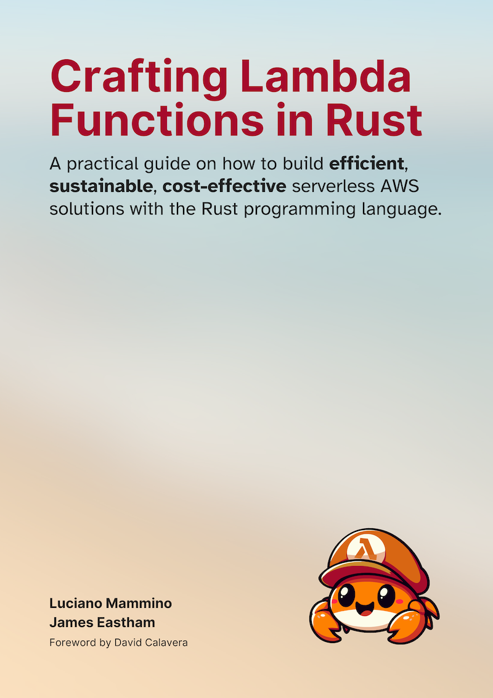

I’m beyond excited to share some big news with you: I’m co-authoring a new book
called _Crafting Lambda Functions in Rust_ together with the amazing
[James Eastham](https://jameseastham.co.uk/)! If you're as passionate about
[serverless](/tag/serverless) and [Rust](/tag/serverless) as I am, you’ll want
to check this out. We even have an official website for it, check out
[the book Crafting Lambda Functions in Rust](https://rust-lambda.com).

This book is your hands-on guide to building efficient, scalable, and
cost-effective serverless applications with AWS Lambda functions and using the
power of the Rust programming language.

---

## How it all started

The idea for this book didn’t happen overnight. It all began when I kept
crossing paths with James at conferences over the years. Every time we met, we’d
end up deep in conversation about two of our favorite topics: **serverless
computing** and **Rust**.

This year, at Rust Nation in London, the stars seemed to align. We realized that
we had both been toying with the idea of writing a book to share what we’d
learned about building AWS Lambda functions in Rust. We talked about how Rust is
not only incredibly powerful for Lambda but also surprisingly easy (perhaps
unexpectedly) to get started with. Rust has a reputation of being hard to grasp,
so it might come as a surprise to many to discover that building Lambda
functions with this language it's a very accessible endeavor. While we were
debating different approaches we had played with and discussing the current
tooling ecosystem, it became clear that a little evangelism could go a long way
in bringing this tech combo to a broader audience.

At that point, joining forces felt like the most natural thing to do. We agreed
to tackle this project together, and what started as an idea is now becoming a
reality. And while we’re still knee-deep in writing, we hope that someday we’ll
look back and say, “And the rest is history!” For now, though, there’s a huge
pile of work ahead, and we’re ready to take it on.

By the way, before you move on to find out more details about our motivations
and the book itself, I'd like to make it very clear that the book is already
available for purchase in early access. This means that you can start reading it
right now and help us shape the final version with your feedback. If you're
interested, head over to
[Crafting Lambda Functions in Rust's website](https://rust-lambda.com) to grab
your copy. And yes, at the time of writing it's heavily discounted, so I'd like
to think you get yourself a bit of a good deal...

Oh yeah, let me show you the book cover as well, so you can tell that this is
real!

---

## Why Rust and Lambda?

I have actually written an entire blog post on this last year:
[Why you should consider Rust for your Lambdas](/why-you-should-consider-rust-for-your-lambdas/).
But don't worry, if you are in a rush, I'll give you a quick summary here
anyway.

The combination of Rust and AWS Lambda is a game changer. Over the past few
years, I’ve been using Rust to build serverless applications, and I’ve seen
firsthand how well they complement each other. Here’s why:

- **Cost Savings**: Rust produces highly efficient binaries. The smaller and
  faster your functions, the less you pay for execution time and memory in
  Lambda.
- **Sustainability**: Rust’s efficiency reduces resource usage, which translates
  to a lower carbon footprint for your applications.
- **Developer Experience**: With Rust’s robust ecosystem, including tools like
  Cargo Lambda, building, testing, and deploying serverless apps is streamlined.
- **Reliability and Correctness**: Rust’s type system and strict compiler help
  catch bugs early, making your functions more reliable in production.

Serverless applications benefit greatly from Rust's performance and safety,
allowing you to focus on delivering value with confidence.

---

## Early Access: Read and Shape the Book!

The book is now in early access, meaning you can get started today! By
purchasing early access, you’ll:

- **Receive chapters as they’re written**: You’ll get new content and updates
  regularly.
- **Contribute to the book**: Share your feedback, and help shape the final
  version.
- **Enjoy a discounted price**: Early access comes at a reduced cost.

This approach lets us work collaboratively with readers to ensure the book is as
practical and comprehensive as possible.

---

## What’s in the Book?

Whether you’re just starting with Rust and Lambda or looking to level up your
skills, this book covers everything you need:

- **Getting Started**: Why Rust and Lambda are a perfect match and how to set up
  your development environment.
- **Building Your First Function**: Learn how to write, test, and deploy a
  Rust-based Lambda function.
- **Infrastructure Management**: Dive into AWS tools like the Serverless
  Application Model (SAM).
- **Interacting with AWS Services**: From DynamoDB integration to designing
  scalable serverless architectures.
- **Advanced Topics**: Explore middleware, Lambda extensions, and more advanced
  techniques to make your applications robust and maintainable.
- **Best Practices**: Discover strategies to write testable, production-ready
  code.

Each chapter is packed with practical examples and insights, making it easy to
follow along and apply what you learn.

---

## Ready to Start?

If this sounds like the kind of challenge you’re ready to take on, head over to
[rust-lambda.com](https://rust-lambda.com) to grab your copy. Let’s build
something amazing together!
