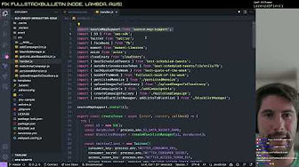
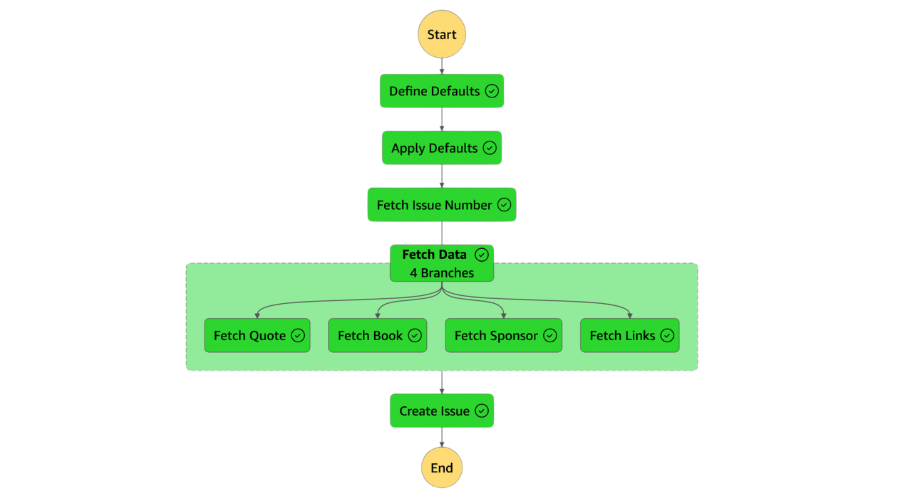

Eight years ago, I embarked on a journey to make sense of the fast-paced,
ever-evolving world of full-stack web development. The result was FullStack
Bulletin, a weekly newsletter designed to keep developers informed and inspired.
With each issue, I aim to share a curated selection of articles, a recommended
book, and a thought-provoking quote, all tailored for full-stack developers and
those aspiring to join the field.

In this article, to celebrate the milestone of reaching 404 published issues, I
decided to share the story behind FullStack Bulletin: why I created it, the
technical architecture that keeps it running, and my vision for the future.

If you’re not already a subscriber, you can sign up at
[FullStackBulletin.com](https://fullstackbulletin.com) and join our wonderful
community of 3,000+ full-stack web developers around the world.

## Why FullStack Bulletin?

I was lucky enough to start my coding journey at the age of 12, but initially it
was all fun and games playing with the qBasic interpreter. This passion for
coding started to seriously turn into a career when I started to make money
building websites for friends and local businesses. I was fascinated by the idea
of creating something out of nothing, and I loved to see the endless
possibilities that the web offered. But building websites was not a simple task
as much as it isn't today. The web is ever-evolving, and keeping up with the new
trends and technologies is a never-ending challenge.

The full-stack development world is among the fastest-moving industries of the
past decade. It’s not just about front-end and back-end anymore—it’s about
mastering UI/UX design, product architecture, databases, and everything else
that goes into building amazing web experiences. Keeping up with this breadth of
knowledge is daunting, to say the least. I have experience this firsthand, and
it's still something that, even with my current level of seniority, I still
struggle with.

And I am not alone in this. In fact, I started this project together with my
dear friend and ex-colleague [Andrea Mangano](https://andreamangano.com/). We
originally designed the format together and Andrea is responsible for the
awesome look and feel that still represents FullStack Bulletin today.

FullStack Bulletin is our way of making life a little easier for full-stack
developers and those aspiring to become one. Each week, we curate the most
interesting, valuable content we can find, delivering it directly to your inbox.
Since launching in March 2017, our mission has been to help developers stay
current and inspired.

In our minds, FullStack Bulletin is the newsletter we wish we had when we were
starting out in our full-stack development journey. It’s a way to share
knowledge, discover interesting nuggets of content, keep ourselves and others
inspired and spread our shared passion for web development.

## Behind the Scenes: Technical Implementation

Publishing a newsletter consistently every week is no small task. That’s why
I’ve leaned on automation wherever possible, making FullStack Bulletin a
semi-automated newsletter.

I know, some of my friends and colleagues make often fun of me for my attitude
of always trying to automate stuff, perhaps even too much... and they often
refer to me with this quote:

> Never spend 6 minutes doing something by hand when you can spend 6 hours
> failing to automate it

<small>(I am not sure who is the original author, let me know if you
know!)</small>

But I believe that automation is key to keep things running smoothly and to free
up time for more important tasks, especially when you are planning to keep doing
something for the long run (and in your spare time)!

But not everything is fully automated. After all who would like to read a
soul-less and aseptic fully automated newsletter?

The content selection is manual. I manually gather interesting articles
throughout the week, but automation steps in to scrape the links, fetch titles
and descriptions, then it ranks the content and creates a draft for the next
issue. This draft includes curated links, a rotating quote, and a recommended
book of the week. While automation does the heavy lifting, I still manually edit
the draft to ensure quality and add a personal touch with an editorial intro
before publishing.

All automation runs on AWS using a Step Function, and the code is open source on
[GitHub](https://github.com/FullStackBulletin/automation).

I have even done a series of live coding sessions on Twitch with my dear friend
[Roberto Gambuzzi](https://www.gambuzzi.it/) where we have split the original
monolithic Lambda function to a Step Function and rewrote some of the
single-purpose Lambda functions in Rust! If you are curious about the broader
topic of Writing [Lambda](/tag/lambda) Functions in [Rust](/tag/rust), you
should definitely check out my previous article:
[I am co-authoring a book about Rust and Lambda](/coauthoring-a-book-about-rust-and-lambda).

If you are curious to watch the live coding sessions, you can check out the
["Fullstack bulletin fixes / remake" playlist on YouTube](https://www.youtube.com/playlist?list=PLbNOKnE-Oyr1tsUft4j0QZDyk5iFcVVy_).

## Static APIs: Quotes and Books

One of the unique features of FullStack Bulletin is the inclusion of curated
recommendations for books and technical quotes that resonate with full-stack
developers. These aren't just randomly selected: they represent resources and
insights that I find meaningful and relevant for anyone navigating this
ever-evolving field. To streamline the process of integrating this content into
the newsletter, I created static lists for both recommended books and technical
quotes, which are publicly available on GitHub:
[tech-quotes](https://github.com/FullStackBulletin/tech-quotes) and
[fullstack-books](https://github.com/FullStackBulletin/fullstack-books).

These repositories serve as the foundation for an automated system. Each repo
contains the raw content files—simple text or data entries—that are processed by
GitHub Actions to generate a static JSON API. This automation takes care of
converting the raw data into a series of discrete JSON files. These files are
then hosted on a CDN through GitHub Pages, giving them predictable URLs that can
be easily accessed. Effectively a file-based API!

The newsletter's AWS Step Function (more on it later) make use of these static
APIs by fetching the "book of the week" and the "quote of the week" directly
from the CDN. This approach ensures that the content is dynamic and refreshes
seamlessly without requiring a database or a backend. It’s a lightweight yet
powerful way to include consistent, high-quality content in every issue.

And here’s where this part of the project gets even better: it’s open to
community contributions! If you know of a technical book that has helped you
grow as a full-stack web developer or a quote that has inspired you, you’re
welcome to contribute. Just head over to the GitHub repositories, add your
suggestion, and submit a pull request. This collaborative aspect not only keeps
the recommendations fresh but also makes FullStack Bulletin a more inclusive
resource for the community it serves.

PS: If you are curious to find out more about the topic of Static APIs, you
should be aware that I am delivering a talk about it at the next edition of
[Coderful Backend](https://www.coderful.io/) in January 2025 in the beautiful
Sicily (my homeland ❤️). If you can't make it, don't worry, I will make sure to
share the slides and the recording of the talk here on my blog!

## The Overall Architecture

Let's visualize the current architecture of the automation by looking at the
diagram of the step function:

So, here’s how it all comes together, step by step:

1. The first 2 steps (_Define Defaults_ and _Apply Defaults_) are responsible
   for setting up the default values for the automation, like fetching
   configuration.
2. The _Fetch Issue Number_ step is responsible for fetching the latest issue
   number. This is a bit of a hacky step, but it's still in the spirit of
   avoiding to have any _serverfull_ backend or a database. The idea is to crawl
   the
   [page with the latest published issues](https://us15.campaign-archive.com/home/?u=b015626aa6028495fe77c75ea&id=55ace33899)
   and extract the latest issue number from the list of issues. The next issue
   will be that number + 1, of course!
3. Now there's the content fetching part. Here we branch out and load data from
   4 different sources in parallel:
   - _Fetch Quote_: This step fetches a random quote from the static API with
     quotes.
   - _Fetch Book_: This step fetches a random book from the static API with
     books.
   - _Fetch Sponsors_: This step fetches the sponsors information for the
     current issue (more on this later). Behind the scenes it's using an
     _Airtable_ table as a backend. I admit I have been considering the idea of
     moving this to a DynamoDB table or to a Google Spreadsheet, but I Airtable
     keeps things simple, although I had
     [my fair share of issues with the Airtable APIs](/invite-only-microsites-with-nextjs-and-airtable/).
   - _Fetch Links_: This step fetches the content links from the
     [FullStack Bulletin Mastodon profile](https://mastodon.social/@fstackbulletin)
     (posts from the previous week that contain links) and ranks them based on
     the number of interactions. Fun fact: this used to be done on Twitter...
     until
     [_someone_](https://www.businessinsider.com/elon-musk-enters-twitter-headquarters-carrying-bathroom-sink-video-2022-10)
     decided to make accessing Twitter APIs significantly more difficult and
     (very) expensive.
4. The last step (_Create Issue_) is responsible for creating the draft of the
   email in Mailchimp. At this point I get a preview on my inbox and then I can
   log in and work on editing details and adding an intro before I can schedule
   it to be sent out to subscribers the following Monday.

This system ensures a balance of automation and manual editing, allowing me to
focus on delivering (hopefully) quality content, while significantly reducing
the time spent on less differentiated repeated tasks.

## The Economics of FullStack Bulletin

Running a newsletter like FullStack Bulletin comes with its costs.

At our current scale of around 3,000 subscribers, the Mailchimp subscription
alone costs about $80 per month. Thankfully, given the current design,
everything else comes for free (or very close to free like in the case of the
Step Function and Lambdas execution).

While this might seem manageable, the true cost becomes apparent when factoring
in the time required for content curation and editing. Spending 1–3 hours every
week on these tasks adds up, pushing the total estimated monthly cost closer to
$500 when considering the value of time and effort.

Since FullStack Bulletin was never intended as a for-profit venture, I initially
absorbed these costs. However, as the project grew, I decided to accept
sponsorships to help offset these expenses. This decision has been a
game-changer, allowing the newsletter to remain sustainable without compromising
on quality. The newsletter is not breaking even yet, but at least it's not a
significant loss on my side!

We've been fortunate to collaborate with incredible sponsors, including
_PostHog_, _Dashlane_, _Buttonize_, _Packt_, _Belka_, _MisterDA_, _ConfigCat_,
_FeedHive_, _Upstash_, and _Nudge_. Their support has played a vital role in
keeping this project alive, and I am immensely grateful for their partnership.

If you have a product or service that would resonate with our curated audience
of full-stack developers, sponsorship could be an excellent opportunity. Feel
free to reach out via [email](mailto:luciano@fullstackbulletin.com) or
[social channels](https://linktr.ee/loige). I’d be happy to share all the
details, including a slide deck outlining the sponsorship options. Together, we
can continue to bring value to the developer community.

## Looking Ahead

There have been moments when I’ve seriously considered shutting down FullStack
Bulletin. Running this newsletter takes a lot of effort, and doing something
consistently over such a long period isn’t easy, especially when balancing a
busy personal and professional schedule. I’ll be the first to admit that
consistency has never been my strongest suit, and keeping up with a weekly
cadence can feel overwhelming at times.

However, instead of stepping away, I’ve decided to give FullStack Bulletin one
more shot. I believe in its value and the role it plays in the full-stack
developer community. My goal for the coming year is to grow the number of
subscribers and secure more long-term sponsorships to make the project
sustainable. With a larger audience and reliable sponsorship, I could reduce the
financial strain and even consider bringing on someone to help with the
workload.

Delegating parts of the process—like content curation or editing—could open up
new possibilities, allowing me to focus on other aspects of the newsletter or
even explore ways to expand its reach and impact. This could mark a turning
point for FullStack Bulletin, transforming it into something more structured and
robust while retaining the personal touch that has always set it apart.

That said, I haven’t yet finalized any concrete plans. These ideas are still
very much in the brainstorming phase, and I’m open to feedback and suggestions.
If you have thoughts about how FullStack Bulletin could evolve, ways to improve
its content, or strategies for growing its audience, I’d love to hear from you.
Whether it’s a comment, an email, or a private message, your input could help
shape the next chapter of this project.

For now, I’m excited to see where this renewed commitment will take us and look
forward to continuing this journey with the incredible community of full-stack
developers who have supported FullStack Bulletin over the years.

## Closing Thoughts

FullStack Bulletin has been a labor of love for the past eight years. It’s been
an incredible journey, and I’m excited to see where it goes next. If you haven’t
already, [subscribe today](https://fullstackbulletin.com) and let me know what
you think.

Here’s to Issue 404... and beyond! 🍻
