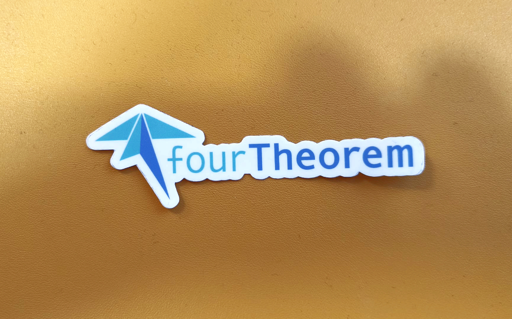

2024: Another Year Bites the Dust (in a Good Way!)

Another year has come and gone, leaving behind a trail of commits, conferences,
and hopefully, fewer bugs than it introduced! 🐞 I have been meaning to write
this review for the last 2 months, but it has been an intense last 2 months,
both personally and professionally! Finally, I am finding some time today, so I
am going to use it _wisely_ to do this boring task! Yes, the boring task is my
annual review of the things I’ve managed to accomplish (or at least attempt) in
2024, both professionally and personally.

As usual, a disclaimer: this post is primarily for my own record-keeping and
reflection. I don't expect anyone to actually _read_ it, but if you do, I hope
you're comfortable, have a beverage of choice, and find it mildly entertaining
enough to not induce instant sleep. Think of it as a digital lullaby for the
tech-minded.

## Launching "Crafting Lambda Functions in Rust" (e-book)

Okay, the title might be a tad misleading! This isn't a proper launch in the
traditional sense, since the book is very much still a work in progress. But
it's also not entirely inaccurate, because the book is already available online,
and you can start reading it right now. If you want to dive even deeper into how
this book came to be,
[I wrote a dedicated article about it on this blog](/coauthoring-a-book-about-rust-and-lambda/).

But let me tell you the story (or at least a condensed version)...

Back in March 2024, I bumped into the amazing James Eastham, again! This time it
was at Rust Nation in London. I've been following James's work for a while now,
because I love his content and because we both share a keen interest in
exploring the world of Rust, especially when applied to serverless
architectures.

As we were chatting at the conference, it became apparent that we were both
individually thinking about creating a more structured resource around this
topic. After comparing notes, we decided to join forces and build something
together! If you're as passionate about serverless and Rust as we are, you'll
want to check this out!

It didn't take long for us to decide to go with a self-published book. We
started drafting ideas for chapters and shaping the overall messaging of the
book. We picked a title, designed [a website](https://rust-lambda.com), created
a [store page on Gumroad](https://loige.gumroad.com/l/rust-lambda), and even
created a mascot, which you can appreciate in all its full glory on our book
cover. I'm sure you can spot the various bits of inspiration we drew from! Yes,
our mascot is a crab (a cRustacean, get it?) with a Lambda hat. If the hat
reminds you of _something_ that's a total coincidence... _Mamma mia_!

Now, let's talk a bit about the publishing model we've chosen. We could have
tried to find a traditional publisher, but our previous experiences tell us that
this isn't generally a viable way to make a project economically sustainable
(except for the publisher, of course… 🤫). Plus, we wanted total freedom over
the release schedule and how we interact with readers, offer discounts, and so
on. That's why we decided to go the self-publishing route. This gives us full
control over how we interact with the community!

Also, in order to keep ourselves committed and to have a steady stream of
feedback and reviews, we decided to make the book available as soon as we had
the draft of the first two chapters ready. We're embracing the "early access"
approach!

So you might be asking yourself... Why Rust and Lambda? Well, the combination of
Rust and AWS Lambda is a game changer. As a compiled language, Rust produces
highly efficient binaries that are compact and lightning-fast. This means your
Lambda functions run quicker, consume less memory, and ultimately cost less to
execute. You can potentially lower both execution cost and resource usage,
leading to a lower carbon footprint. You also get reliability and correctness as
Rust’s strict compiler and type system are like having an extra pair of eyes on
your code. Combine that with [Cargo Lambda](https://www.cargo-lambda.info/), a
fantastic tool that streamlines the developer experience by handling
scaffolding, testing, compilation, and deployment, and you have an incredible
tool chain!

As of today, we have six chapters available covering everything you need to know
to build and ship a fully functional URL shortener to AWS using Rust, Lambda,
and other serverless technologies (e.g., DynamoDB, API Gateway). In those 6
chapters you will learn everything from setting up your environment, creating
your first "Hello World" lambda and using SAM to manage your code, to testing
the lambda and making it interact with external systems.

There's still plenty of work to be done, but we plan to finish (or get close to
finishing) this book by the end of 2025. This book is your hands-on guide to
building efficient, scalable, and cost-effective serverless applications with
AWS Lambda functions and using the power of the Rust programming language. You
can even get involved by sharing your feedback, help shape the final version,
and, if you like, get your name on the book by purchasing the currently
available early release bundle!

If you want to find out more, [check out our website](https://rust-lambda.com/),
and if you want to stay up-to-date with the project, we also have
[a newsletter](https://news.rust-lambda.com/) and
[a Discord server](https://discord.gg/jXF5VSHMDW). We're excited to build
something amazing with you!

> Reading maketh a full man; conference a ready man; and writing an exact man.\
> — Francis Bacon

## Almost 4 Years of Cloud Adventures at fourTheorem

It's almost been four years since I joined
[fourTheorem](https://fourtheorem.com/) as a Senior Cloud Architect! In fact, as
I'm writing this, that "almost" is just a week away! 🎉 They say time flies when
you're having fun, and I can certainly say that time has been flying for me when
I think back on all we've accomplished at fourTheorem in these four years.

In 2024, I was fortunate enough to help several more enterprises achieve success
with AWS and Serverless, and I learned a ton in the process. I'm currently
working on a full-stack serverless project that has been incredibly rewarding to
build. It's led me to explore a lot of new things around
[serverless](/tag/serverless) architectures, [TypeScript](/tag/typescript),
OpenAPI, and more. I'm hoping to be able to share some of these learnings in a
public form soon! Stay tuned for that.

From a company perspective, fourTheorem is growing strong. So, if you're
passionate about the cloud and looking for a challenging and rewarding career,
check out the [fourTheorem careers page](https://fourtheorem.com/careers/) or
reach out to me directly. We're always looking for talented individuals to join
our team. Come join the fun!

2025 is already looking quite busy and I look forward to seeing what we will be
building with our clients and the team at fourTheorem!

> Try to be a rainbow in someone's cloud.\
> — Maya Angelou

## Public Speaking: Sharing, Learning, and Connecting at Conferences

This year, I've really enjoyed attending various conferences and delivering
talks. It's one of the things I love most about my job. It doesn't just give me
the opportunity to share what I've learned; more importantly, it gives me the
chance to meet likeminded people and learn from them. Building a network of
passionate software engineers is one of the most precious assets you can have in
this line of business.

So, I would encourage everyone to attend conferences. You don't necessarily have
to try to deliver a talk if that's not your thing, but attending should be an
absolute no-brainer! If you can take one thing away from this (admittedly
selfish) article, it's to plan a few conferences to attend this year. And if you
think conferences are too expensive or too much of a commitment, you can always
start with a local meetup... Thank me later! 😉

Here's a look back at the talks I delivered in 2024:

- 01-23: **Re:Invent recap (panel)**, BelfAWSt User Group, Belfast
- 01-30: **AWS re:Invent re:Cap (panel)**, AWS User Group Dublin
- 03-06: **An intro to nom, parsing made easy for Rustaceans**, Rust Dublin
  (Remote) ([Slides](https://loige.link/nom-rs),
  [Video](https://www.youtube.com/live/1atZzA3e3Kg?t=972))
- 03-19: **Serverless Rust su AWS Lambda "for fun and profit" (Workshop)**,
  Codemotion Workshop Fest (Remote) ([Slides](https://loige.link/cm2024-rust))
- 03-28: **Rust, Serverless, and AWS - Writing Lambdas in Rust**, Rust Nation
  UK, London ([Slides](https://loige.link/lambda-nation-24))
- 05-07: **Your Lambdas, In Rust!**, AWS Community Nordics, Copenhagen
  ([Slides](https://loige.link/l-rs),
  [Video](https://www.youtube.com/watch?v=npqrTU2vK9c))
- 05-23: **Building Secure and Efficient SaaS Platforms on AWS Serverless**,
  ServerlessDays Belfast ([Slides](https://fth.link/tenants),
  [Video](https://www.youtube.com/watch?v=JB7d0427HLE))
- 06-20: **Rust on AWS Lambda**, Rustship podcast (Remote)
  ([Video](https://www.youtube.com/live/Qx0XIP4LnYU))
- 08-14: **Rust with Lambda, easy-mode Rust & future of Middy**, Real World
  Serverless podcast (Remote)
  ([Video](https://www.youtube.com/watch?v=FVYub3dzrAY))
- 08-20: **Harder, better, faster, stronger Lambda functions with Rust**,
  Believe In Serverless (Remote) ([Slides](https://loige.link/hbfs),
  [Video](https://www.youtube.com/watch?v=eqUehphXNvs))
- 09-06: **Faster/Greener/Cheaper Serverless compute with Lambda & Rust**, AWS
  Community Day Belfast ([Slides](https://loige.link/be-a-crab))
- 09-16: **Rust and Serverless Computing**, Mainmatter podcast (Remote)
  ([Video](https://www.youtube.com/watch?v=U9JZD7d9OmA))
- 09-17: **Building Secure and Efficient SaaS Platforms on AWS Serverless**, AWS
  Community Day DACH ([Slides](https://fth.link/aws-saas))
- 09-27: **Managing AWS accounts like a PRO**, AWS Community Day Italy, Rome
  ([Slides](https://loige.link/accounts))
- 10-03: **Building Secure and Efficient SaaS Platforms on AWS Serverless**, AWS
  Community Day NL ([Slides](https://fth.link/saas-nl))
- 10-22: **Building Secure and Efficient SaaS Platforms on AWS Serverless**,
  Codemotion Milan ([Slides](https://fth.link/saas-mi))
- 10-23: **Unleashing Serverless Performance: Writing Optimized AWS Lambda
  Functions with Rust (Workshop)**, Codemotion Milan
  ([Slides](https://loige.link/rusty-sls))
- 11-26: **Faster/Greener/Cheaper Serverless compute with Lambda & Rust**, Porto
  Tech Hub ([Slides](https://loige.link/sls-w-rust))
- 12-12: **Optimized Lambda functions with Rust (Workshop)**, Serverless Days
  Rome ([Slides](https://loige.link/rust-lambda-ws))
- 12-13: The role of the serverless dev (Panel), Serverless Days Rome

This brings my total number of talks to **157** in 2024. Crazy to think I have
done so many!

If you are curious to see the full list and check out videos and slides, you can
find them all in the [speaking section](/speaking).

Also worth mentioning that I attended re:Invent again this year, and it was a
blast! I got to meet so many amazing people from the incredible AWS community
and learned a ton from them. Here's a randomly selected picture!

<small>From left to right:
[Anurag Kale](https://www.linkedin.com/in/anuragkale/),
[Ivan Casco Valero](https://www.linkedin.com/in/ivancasco/),
[Marcus Bladh](https://www.linkedin.com/in/marcus-bladh/), it's a me!</small>

In 2025, I think I will deliberately slow down a bit on the speaking front. I
want to reduce the amount of travel and focus more on other side projects, but I
will probably still be speaking at a few conferences. So if you want to invite
me to speak at your event (especially if it's a remote one), please
[reach out to me](http://loige.link/invite-me-to-a-conference).

> No grand idea was ever born in a conference, but a lot of foolish ideas have
> died there.\
> — F. Scott Fitzgerald

## Node.js Design Patterns: Still a Relevant Resource After All These Years

Even after four years on the shelves (and in online stores), the third edition
of [Node.js Design Patterns](https://www.nodejsdesignpatterns.com/) is still
going quite strong. We're still getting plenty of good reviews and hearing from
happy readers.

We are currently holding a solid 4.6 stars with over 300 reviews on Amazon! It's
incredibly rewarding to know that our work is still helping developers improve
their skills.

In 2024, we even had some great people in the JavaScript community talking about
the book, which gave it another boost in visibility. A huge thank you to
everyone who has recommended it to others!

<small>Matt Pocock (Total TypeScript) showcasing his copy of Node.js Design
Patterns on LinkedIn</small>

Because the book features Node.js 14, many people ask if it's still up-to-date
and relevant. My answer is absolutely yes! All the patterns we focus on are
pretty much timeless, and if you're just starting with Node.js and JavaScript
and want to ramp up your knowledge, there's still plenty to learn from it.

Of course, there have been some minor improvements in the Node.js and JavaScript
landscape since this edition was launched, so there might be a few opportunities
here and there to make the book even more relevant and up-to-date. I cannot
disclose anything specific right now, but I can only say: stay tuned! 😉

Meanwhile, if you've read the book and appreciated it, please leave us a review
on Amazon or Goodreads. This is the single best thing you can do to help us and
encourage us to invest more in this kind of activity. Your feedback means the
world to us!

> The future of publishing is about having connections to readers and the
> knowledge of what those readers want.\
> — Seth Godin

## AWS Bites: Still Serving Up Serverless Goodness (Now in Bi-Weekly Portions!)

AWS Bites, the weekly podcast that
[Eoin Shanagy](https://bsky.app/profile/eoin.sh) and I started in 2021, is now
in its fourth season, and we're still going quite strong! 💪

While we reduced our publishing frequency this year from weekly to bi-weekly, we
still managed to release 29 new episodes packed with AWS and serverless
insights.

Looking at the stats provided by Spotify, we reached **140k plays** with an
average of **775 listeners per episode**, which I think is quite rewarding.

On YouTube, we have **3800 subscribers** and almost **50k views** in 2024 alone!
Thank you to everyone who listens and watches! 🙏

The episodes that people seem to have enjoyed the most are:

- On YouTube:
  [Ep. 111 - How We Run a Cloud Consulting Business](https://awsbites.com/111-how-we-run-a-cloud-consulting-business/)
- On Spotify:
  [Ep. 120 - Lambda Best Practices](https://awsbites.com/120-lambda-best-practices/)

Another cool thing we did in 2024 was to bring in more people from fourTheorem.
We had the pleasure of having our CFO, **Fiona McKenna**, to discuss
[the financial
aspects of running a cloud consulting business](https://awsbites.com/133-building-businesses-in-the-cloud-with-fiona-mckenna).
We also had **Conor Maher** to talk about
[how to get rid of those annoying IAM users
and improve the security and governance of AWS Accounts](https://awsbites.com/134-eliminate-the-iam-user/),
and **David Lynam** talking about
[AWS Transit Gateway](https://awsbites.com/137-transit-gateway-explained/).

We were also super pleased to have had the opportunity to interview the one and
only [Farrah Campbell](https://bsky.app/profile/farrah.bsky.social) and get her
to share her history and some suggestions for people who want to grow in tech.
If you are curious to know more, check out
[Ep. 130 - Growing in Tech with Farrah Campbell](https://awsbites.com/130-growing-in-tech-with-farrah-campbell/).

AWS Bites is something we will surely keep investing on in 2025 because we think
it's providing value to the AWS Community, and it's a great place for us to
share what we learn every day while working with AWS.

If there's a topic you think we should cover, or if you have any piece of
feedback you want to share with us, please reach out and let us know! We're
always looking for new ideas.

> You’re going to be terrible at a lot of things for years until you’re
> successful. People probably aren’t going to listen to your podcast initially.
> But if you like it and you keep putting it out, people will find it.
>
> — Keith Kingbay

## Middy: Still the Leading Middleware Framework for AWS Lambda

Middy is a Node.js middleware framework specifically designed for AWS Lambda! I
started this project during the early days of Lambda around 2015 (even though
the very first public commit only happened on August 3, 2017), and it’s been
quite a journey.

Although, a few years back I found myself struggling with maintainer duties, and
I passed the ball to [Will Farrell](https://github.com/willfarrell), one of the
most active contributors, who has since stepped in as a maintainer (and has done
a far better job than I could ever dream of doing!).

So today, anything you see happening around Middy is Will's merit. I only like
to talk about it to see how the project is doing, but I can't really claim any
credit! I only have a few occasional chats per year with Will, so you could say
I have a very distant role as an advisor, at best...

The main news of 2024 is that
[Middy v6.0.0](https://github.com/middyjs/middy/releases/tag/6.0.0) was released
in November, bringing the following to the table:

- Deprecation of Node.js v18.x
- Addition of support for Node.js v22.x
- Addition of support for `--experimental-require-module`

If you want to read the full list of changes and how to upgrade from v5, check
out
[the official Middy 5 to 6 migration guide](https://middy.js.org/docs/upgrade/5-6).

In terms of stats, Middy is still the leading middleware framework for AWS
Lambda in the JavaScript/TypeScript landscape, with an average of **360k
downloads per week** (of the core module alone). It’s awesome to see such
continued adoption!

It has almost reached **4000 stars on GitHub** (3762 right now), so if you like
Middy and want to give us a little hand,
[give it a star on GitHub](https://github.com/middyjs/middy) – it costs nothing!
Make sure to also reach out to Will and
[consider sponsoring](https://github.com/sponsors/willfarrell) him to support
his incredible work (not just about Middy). He's the one putting in the hard
work to keep Middy going strong.

I have yet to catch up with Will in detail, but from what I could tell, his
focus for this year will be on security hardening, stability, and improving the
open-source processes around the management of the project. These are all great
priorities to keep Middy a robust and trustworthy framework.

> Software is a great combination between artistry and engineering.
>
> — Bill Gates

## Streaming Technology and Learning Rust on Twitch: Fun, Experiments, and (Hopefully) Some Learning

In 2024, I kept streaming
[live coding sessions on Twitch](https://twitch.tv/loige) with my dear friend
[Roberto](https://twitter.com/gbinside). These streams have become a great way
for us to explore new technologies, learn together, and generally geek out about
code.

We completed a few interesting projects this year, including:

- [Building a parser for the REDIS protocol using the parser combinator nom](https://www.youtube.com/playlist?list=PLbNOKnE-Oyr2gyJyDsFgVIoFl5fz0D7zL)
- [Building an MVP for a lead generation system only using Rust, Lambda, DynamoDB,
  and SES on AWS (tinykit)](https://www.youtube.com/playlist?list=PLbNOKnE-Oyr1BCduX_69Nt97CozZC3uW7)
- [Building a BitTorrent client using Rust](https://www.youtube.com/playlist?list=PLbNOKnE-Oyr2RgIPBjghBQqfmFBogW5zH)
  following one of the
  [CodeCrafters](https://app.codecrafters.io/join?via=lmammino) guided tutorials

<iframe style="position: absolute; top:0; left: 0; width: 100%; height: 100%;" src="https://www.youtube.com/embed/videoseries?si=jmqyqALqfEFb3R2U&amp;list=PLbNOKnE-Oyr2gyJyDsFgVIoFl5fz0D7zL" frameborder="0" allow="accelerometer; autoplay; clipboard-write; encrypted-media; gyroscope; picture-in-picture; web-share" referrerpolicy="strict-origin-when-cross-origin" allowfullscreen></iframe>

Overall, I don't think we had a massive growth in terms of following or views
and I don't even care enough to check the numbers because this honestly isn't
why we do these streams. We just do them to have an excuse to keep experimenting
and learning together, and so far, I think this has been working pretty well for
us. It's more about the journey than the destination!

So, we'll probably keep these going on a semi-consistent frequency in 2025. If
you're interested in hanging out with us during these sessions,
[check us out on Twitch](https://twitch.tv/loige). Otherwise, you can check out
all our recordings on [my YouTube Channel](https://www.twitch.tv/loige).

Come learn Rust with us (and maybe teach us a thing or two)!

> Tell me and I forget, teach me and I may remember, involve me and I learn.
>
> — Benjamin Franklin

## My Open Source work in 2024

I always like to do some open source whenever I have the chance. I like to
contribute to projects I use (even in small ways) and I like to share almost
everything I do in an open-source fashion.

Looking back at my GitHub history, I actually did _way_ more than I originally
thought, so it's probably a good thing to do this kind of reflection to see how
much I did actually accomplish over the year! It's easy to lose track of the
smaller contributions, but they all add up.

Here's a summary of my main open-source contributions of 2024:

- [Small contributions to Cargo Lambda](https://github.com/cargo-lambda/default-template/pull/10)
- I created [fm.loige.co](https://github.com/lmammino/fm.loige.co), a simple
  Rust and Lambda powered API to display the song that I am currently listening
  to on this very website (in the [home page](/)). It's powered by Last.fm
- [Tinyresp](https://github.com/lmammino/tinyresp), a parser for the Redis
  protocol written as a Rust library
- [Mailchimp List Janitor](https://github.com/lmammino/mailchimp-list-janitor):
  a Rust based tool that allows you to remove unsubscribed users from your
  Mailchimp lists and save money in the process (a bit in an incomplete state)
- [OBS-countdown](https://github.com/lmammino/obs-countdown): A Rust-powered CLI
  tool that allows you to manage a countdown file that you can use to display a
  countdown in OBS
- [MVP Activities](https://github.com/lmammino/mvp-activities): A simple client
  to interact with the Microsoft MVP activities API (not official)
- [A small contribution to the new Node.js website](https://github.com/nodejs/nodejs.org/pull/6495)
- [oidc-authorizer](https://github.com/lmammino/oidc-authorizer): A
  high-performance token-based API Gateway authorizer Lambda that can validate
  OIDC-issued JWT tokens. It's written in Rust and it also comes with a repo for
  the [benchmarks](https://github.com/lmammino/oidc-authorizer-benchmark)
  against a python-based alternative
- [Tinykit](https://github.com/lmammino/tinykit), a super simple and mostly
  incomplete lead magnet system written using Rust and Lambda
- [svg-invert](https://github.com/lmammino/svg-invert): A simple Rust-based CLI
  utility that inverts colors in an SVG file:
- [A Small contribution to the AWS cloudfront-hosting-toolkit project](https://github.com/awslabs/cloudfront-hosting-toolkit/pull/10)
  to make their CI a bit faster
- [org-formation-sso-import](https://github.com/lmammino/org-formation-sso-import):
  A TypeScript based CLI tool to import AWS SSO groups, permission sets and
  assignments into an OrgFormation workspace
- [Added free text search on the AWS Bites website](https://github.com/awsbites/aws-bites-site/pull/200)
  using Orama
- [A rust + Lambda workshop](https://github.com/lmammino/rust-lambda-workshop-ext)

Here's a screenshot of my GitHub contribution chart, just for vanity, although
it's slightly skewed in time since I am taking this in Feb 2025 😉

> The power of Open Source is the power of the people. The people rule.
>
> — Philippe Kahn

## Articles & Blog

I didn't write very much on this blog in 2024. I only managed to publish 3
articles. Quality over quantity, right? 😉

However, I _did_ spend a good bit of my free time between the end of 2023 and
the beginning of 2024 migrating the technology that powers this blog from Gatsby
to Astro. If you want to find out more about the motivation and the migration
process, well, that's one of the three articles I wrote:
[Migrating from Gatsby to Astro](/migrating-from-gatsby-to-astro). It was a fun
project that should lead to better performance and easier maintenance in the
future. And in the process I also redesigned the look and feel entirely. I hope
you like it! ...and be careful of the [dreadful 404 page](/404)!

<small>The new hero banner on the newly-designed home page. Note how it displays
what I am listening to in real-time 🎸</small>

The other two articles are about
[how I Have Published 404 Issues of a Newsletter for Full-Stack Developers Over the Last 8 Years](/404-newsletter-found)
and announcing that
[I am co-authoring a book about Rust and Lambda](/coauthoring-a-book-about-rust-and-lambda).
So, you can see that while the output was low, the topics were significant for
me.

Will I write more in 2025? I don't know... This _is_ the first article of the
year, so maybe it's a good start! I'm not planning to have a particular
schedule, so we'll see what inspiration strikes. Stay tuned!

> The best time to plant a tree was 20 years ago. The second best time is now
>
> — Chinese Proverb

## FullStack Bulletin: Eight Years and more than 404 published Issues

In 2024, FullStack Bulletin reached a significant milestone: issue 404! It's
hard to believe it's been eight years since I embarked on this project, aiming
to make sense of the fast-paced, ever-evolving world of full-stack web
development.

If you're curious about the story behind the newsletter – why I created it, the
technical architecture, and my vision for the future – you can read all about it
in my article
[How I Have Published 404 Issues of a Newsletter for Full-Stack Developers Over the Last 8 Years](/404-newsletter-found).

But, to give you a short summary, FullStack Bulletin is a weekly newsletter
designed to keep developers informed and inspired. Every week, I curate a
selection of articles, a recommended book, and a thought-provoking quote, all
tailored for full-stack developers and those aspiring to join the field. It's
the newsletter I wish I had when I started my own full-stack development
journey. Andrea Mangano and I originally designed the format together and Andrea
is responsible for the awesome look and feel that still represents FullStack
Bulletin today.

I have had this quote in the article to celebrate the history. "FullStack
Bulletin is our way of making life a bit easier for full-stack developers and
those aspiring to join the field. Every week, we carefully curate the most
interesting and valuable content, delivering it straight to your inbox. Since
our launch in March 2017, our mission has been to help developers stay informed
and inspired."

Since last year, we're still at around 3000 subscribers, so the growth has been
very flat. This isn't an encouraging sign, but at the same time, I keep getting
good feedback from readers, which is what keeps me going.

In 2024, I also decided to give every newsletter a more personal touch, adding
an editorial intro where I can share some of my personal news and encourage
people to keep being inspired by the awesome content you can freely find on the
web. I also spend more time making sure every piece of content has a good
description that highlights why I handpicked that particular link.

People seem to have appreciated this more personal touch, so that's probably a
good sign. This year, I am considering moving FSB away from Mailchimp and
adopting another provider. If you have any suggestions, let me know! I'm always
open to finding a more cost-effective and feature-rich platform. And if you’re
not already a subscriber, you can sign up at
[FullStackBulletin.com](https://fullstackbulletin.com/) and join our wonderful
community.

A particularly big shout-out goes to one of our major sponsors last year:
[PostHog](https://posthog.com/). Thanks for supporting us.

By the way, we are looking for new sponsors, so if you have a company that
targets full-stack developers, let me know. I have a nice slide deck I can share
with you that illustrates the sponsorship process and the costs in a
super-simple way.

> Human beings are curators. Each polishes his or her own favoured memories,
> arranging them in order to create a narrative that pleases.
>
> — Kate Morton

## Other Stuff: Personal Achievements and Looking Ahead

Now, onto some other more personal achievements of 2024 🦸🏻. It's important to
remember that life isn't just about code, conferences, books, podcasts and
newsletters! 😆

I have been quite bad at running this year, totaling only **9 runs** for a total
of **~60Km**. I definitely need to improve that in 2025! However, I have been
pretty consistent with Brazilian Jiu-Jitsu training, practicing for ~100
sessions during 2024 and reaching the grade of **purple belt with 2 stripes**!
🥋 And in general I kept myself fit, training more at home, getting in better
shape and eating healthier! That's something I'm proud of and I can see making
me a lot happier and productive.

I also had a lovely trip to the Norway fjords with my wife during the summer. It
was absolutely stunning, and a great way to recharge. I'll leave you with a
random picture from this trip.

That's all, folks! Please comment to let me know what was your biggest
achievement of 2024 and what do you plan to do in 2025. I'm always curious to
hear what others are working on.

See you in the next article 😉
