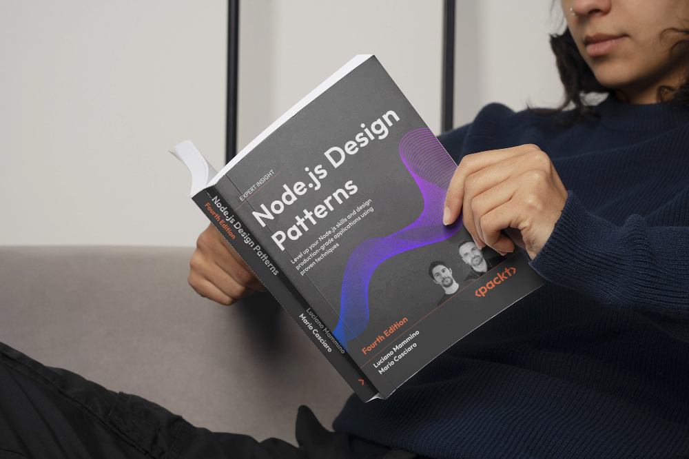
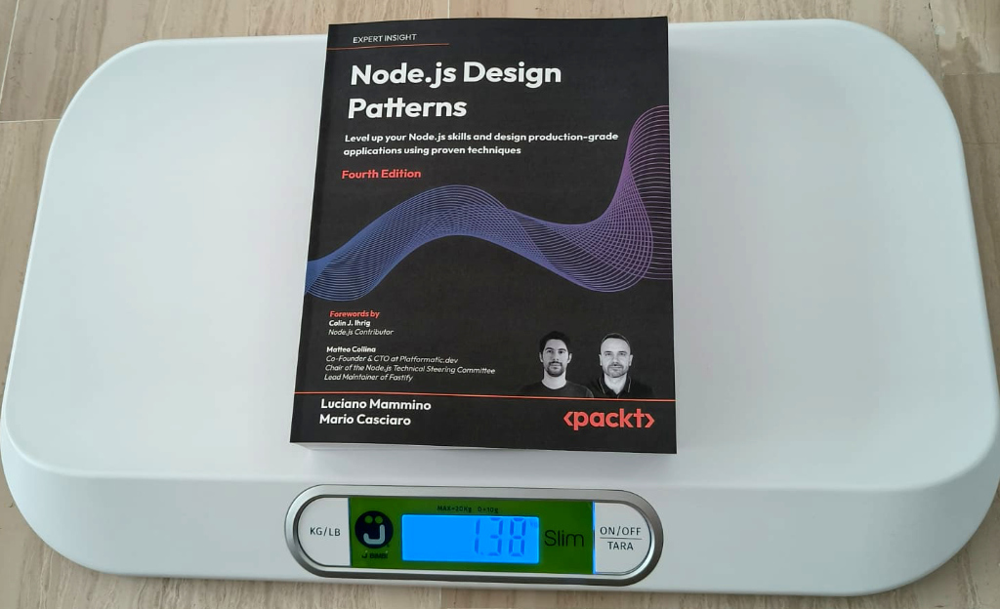
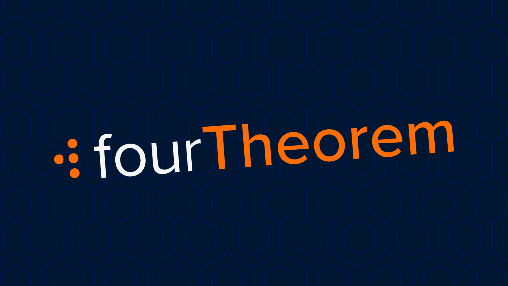
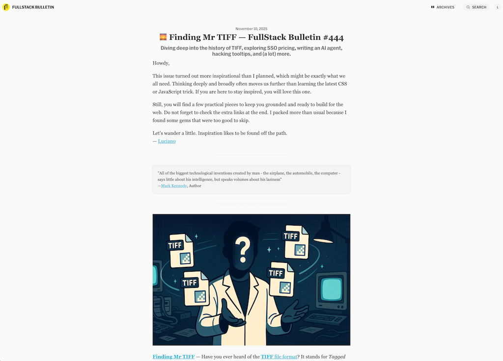
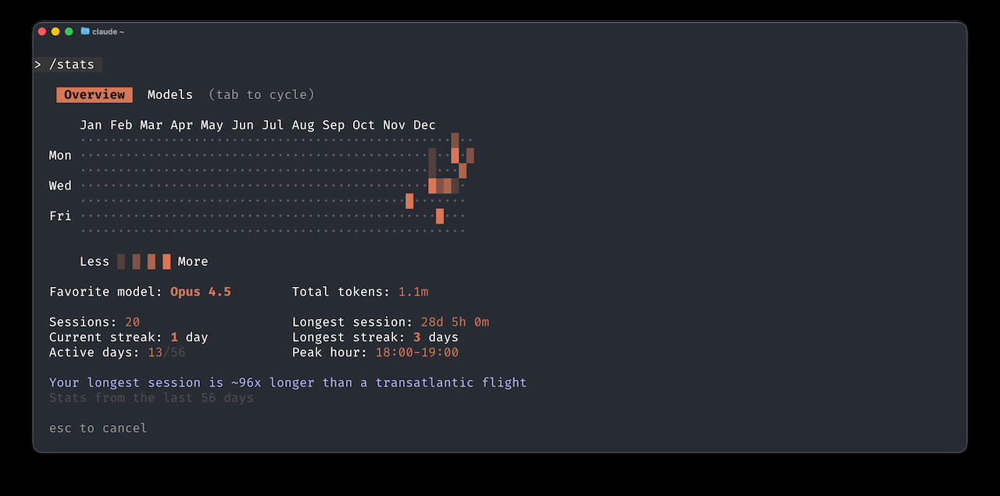
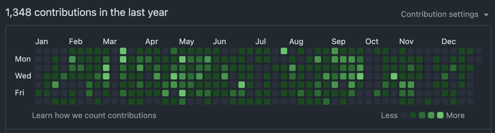
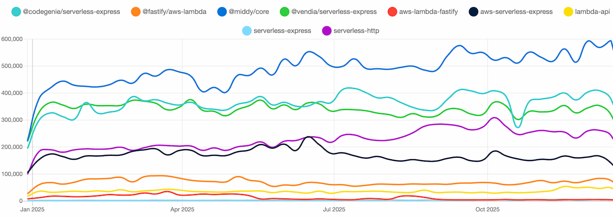
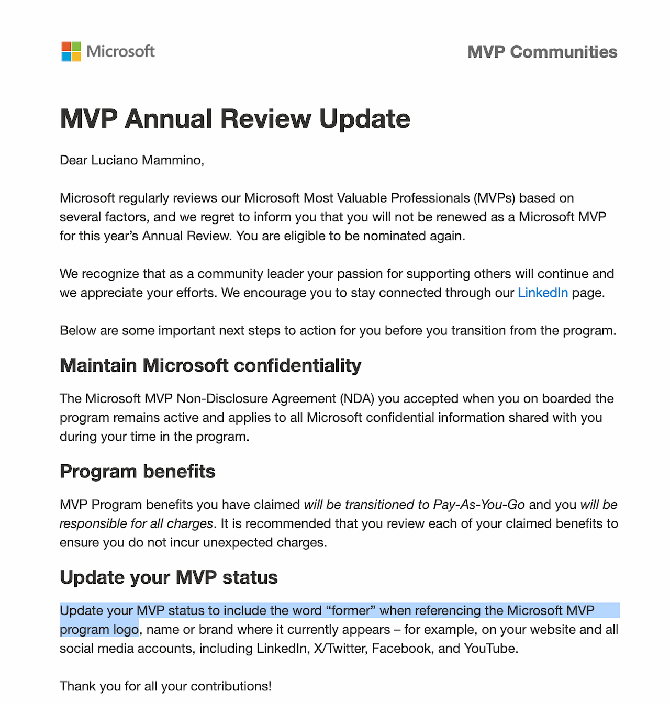

2025: That's a wrap! 🌯

Another lap around the sun completed and, as (my very own) tradition dictates, it's time for yet another self-indulgent review of all the things I have (and maybe I haven't) accomplished professionally and personally in 2025.

The usual disclaimer applies: I write these posts mostly for myself. They are my own time capsule, a way to look back and reflect on what I've done and where I'm going. If you've stumbled upon this post and you're brave enough to read through it, I hope you're armed with a steaming cup of coffee (or hot chocolate, I don't judge) to keep you warm and awake through these cold winter days. You'll need it!

P.S. If you need an incentive to power through: this year brought a _personal_ unexpected surprise that might just make it the best year ever for me. But no spoilers... you'll have to read all the way to the end to find out!

## Hitting the shelves with Node.js Design Patterns 4th edition

Let's start with what has probably been one of the biggest highlights of my year: the release of the **fourth edition** of _Node.js Design Patterns_!

[Node.js Design Patterns](https://nodejsdesignpatterns.com/) is a book I co-authored with the amazing [Mario Casciaro](https://twitter.com/mariocasciaro). It's a comprehensive guide that takes you from the fundamentals of Node.js all the way to advanced design patterns for building scalable and production-ready applications.

This year marks a huge milestone: after 5 years since the third edition, we released the **fourth edition** on September 25, 2025!

This new edition is fully updated for **Node.js 24** and features modern JavaScript throughout, with ECMAScript modules and async/await as the default patterns. The biggest addition is **Chapter 10**, an entirely new chapter dedicated to testing patterns and best practices, reflecting the fact that Node.js's built-in test runner has become a first-class citizen. We also had to make some tough choices: the Universal (isomorphic) JavaScript chapter was removed since tools like React and Next.js have reshaped how that topic is approached, and well... the book was already pushing 700+ pages!

Speaking of pages, here's a fun fact: at some point during the writing process, we realized with the publisher that we had exceeded the maximum number of pages allowed by Amazon's print-on-demand system. We literally had to cut down some content to make it fit!

<small>Yes, the picture above shows the book on a scale, weighing in at a hefty **1.38 kg** (about 3 pounds for those of you who like non-standard units 🙃)! Definitely not a light read, but hey, knowledge comes at a weight! And if you're in trouble you can always use it to defend yourself! 🙈</small>

Jokes aside, this edition also marks a personal milestone for me. Mario was incredibly kind and gave me the spotlight by putting my name first on the cover for the very first time. If you've read [the story of how I came to work on this book](/nodejs-design-patterns-fourth-edition), you'll understand why this is such an honor and a meaningful milestone for me as an author.

Producing this new edition was quite intense: for the majority of the second half of 2025, this book was my main focus outside of work. Countless evenings and weekends went into reviewing, rewriting, and polishing every chapter. But seeing the final result makes it all worth it.

If you want to know all the details about what's new in this edition, check out [the dedicated announcement post](/nodejs-design-patterns-fourth-edition).

... And if you'll have a chance to read it, make sure to leave us a review on Amazon or Goodreads. Reviews really help authors like us reach more readers! Probably the biggest gift you can give us, especially if you enjoyed the book!

I'm not sure how much time I'll have for the book in 2026, but there's certainly some promotion work to do and I have a list of blog articles I want to write to complement the book's content. Stay tuned on the [Node.js Design Patterns blog](https://nodejsdesignpatterns.com/blog)!

> A mind needs books as a sword needs a whetstone, if it is to keep its edge.  
> — Tyrion Lannister

## Making progress on Crafting Lambda Functions in Rust

[Crafting Lambda Functions in Rust](https://rust-lambda.com/) is a book I am co-authoring with the brilliant [James Eastham](https://jameseastham.co.uk/). It's a hands-on guide that teaches you how to build serverless applications on AWS using Rust, from the basics all the way to production-ready patterns. This one is a **self-published** project and while it's still a work in progress, it's already available as **early access** at a discounted price. The deal is simple: you get everything that's available now for a lower price, and any future updates are free. It's a sneak peek into the content as it develops, and a way to support the project too!

I have to be honest: working on two books at the same time was _tough_. Probably the thing I struggled the most with during the year. As always, I underestimated both the amount of free time I would have and the effort needed to write content, especially when it's new content on novel topics where the research required is non-trivial. But if there's one thing that has been holding true throughout my career is that we, software developers, are always pretty optimistic when it comes to estimating time and effort! Will we ever learn? Probably not...

But back to the book(s)... At some point, it became overwhelming to juggle both projects, and I had to almost pause this book to focus on Node.js Design Patterns. A huge thanks goes to James for being so understanding and flexible with the timelines, and for taking care of the book while I was buried in Node.js patterns! Also thanks to all the current early-access readers for understanding my position and being patient with the slower pace of releases.

Despite the time constraints, we still managed to ship **3 solid releases** throughout the year:

**Release 1** focused on polish and modernisation: we squashed a ton of typos and inconsistencies (big shout-out to David Behroozi, Darko Mesaroš, and Gary Sassano for their sharp-eyed feedback!), updated all code examples to align with the new `cargo-lambda` project structure, and added a brand new **CDK deployment appendix** for those who prefer CDK over SAM.

**Release 2** brought **Chapter 7: Configuration**. This chapter dives deep into the art of passing parameters to your Lambda functions: from environment variables to cleanly separating configuration from code, all the way to securely managing secrets with AWS Systems Manager Parameter Store and AWS Secrets Manager. We also added a **Terraform appendix** for those who prefer Terraform over SAM or CDK for deploying their Rust Lambda functions.

**Release 3** was the big one: **Chapter 8: Event-driven systems**. This 100+ page monster covers the philosophy of event-driven architectures and then gets practical with SQS, EventBridge, and Kinesis Data Streams. We upgraded our running URL shortener example to behave like a proper production system: offloading work to async flows, making it more extensible, and showing real trade-offs. Alongside Chapter 8, we also did a comprehensive pass across the entire manuscript, settling on British English (I suggested _Italenglish_, but James wasn't having it...), simplifying Rust snippets, and adding more security and production warnings.

And we're not done yet! We're almost ready to publish a new chapter dedicated to **observability** with Rust, Lambda, and OpenTelemetry. All the content is written and there's quite a lot of it—we're now in the reviewing and refining phase, just adding the finishing touches. Stay tuned for early 2026!

Our plan for 2026 is to complete the book and, hopefully, make it available as a printed edition too. Stay tuned!

By the way, I now have a [dedicated page for all my books](/books) on this site. Check it out if you want to see what else I've been writing!

> There is nothing to writing. All you do is sit down at a typewriter and bleed.  
> ― Ernest Hemingway

## Approaching 5 years of growth at FourTheorem

Phew, almost 5 years! In February 2026 I'll hit the five-year mark at [FourTheorem](https://fourtheorem.com/), and yet it still feels like a fresh and welcoming place every single day. Tons of exciting projects, great people to work with, and countless opportunities to grow. Every day brings a new lesson. So let me take a minute to thank [Peter](https://www.linkedin.com/in/peterelger/), [Fiona](https://www.linkedin.com/in/fiona-mc-kenna-174172a2/), and [Eoin](https://www.linkedin.com/in/eoins/), the minds, souls, and hearts behind FourTheorem, for creating such an amazing place to work at. Looking forward to many more years of collaboration and growth together!

If you've never heard of FourTheorem before, we are an AWS consulting partner specialising in serverless-first architectures and application modernisation. We help organisations move to the cloud, optimise their infrastructure, and build scalable, cost-effective solutions. If you want to know more, check out our [website](https://fourtheorem.com/)!

Throughout 2025 I had the pleasure to work on a super ambitious and fun project. I can't fully disclose all the details yet, but what I can tell you is that it was a **multi-brand e-commerce-like platform** where I got to exercise pretty much all my programming muscles: backend APIs with Node.js and TypeScript (running on Lambda), data modelling with DynamoDB, frontend components with React and Next.js, and infrastructure as code with AWS CDK. It was a blast and I learned a ton! The best part? The whole system is configurable and allows you to deploy multiple brands from the same codebase, each with different themes, products, and even custom features such as payment gateways or quote engines. Super cool stuff, and I'm really proud of the results.

This project also gave me the chance to experiment with some exciting new technologies: fully static client-side autocompletion widgets using [Orama](https://orama.com/), [TanStack Query](https://tanstack.com/query) for data fetching, [Zod](https://zod.dev/) for schema validation, and an API-first design approach using [TypeSpec](https://typespec.io/) to generate models and clients from the spec.

Overall, this was probably one of the coolest full-stack JavaScript/TypeScript serverless projects I've worked on in a while, and I'm super grateful to FourTheorem and our customer for trusting me with it and giving me the freedom to explore and learn new things.

Now I'm excited to see what 2026 has in store for us at FourTheorem! The team and the customer base are steadily growing, and new opportunities are popping up all the time. Stay tuned for more updates and chances for me to share my learnings!

P.S. We are always hiring at FourTheorem! If you're a passionate developer looking for a great place to work, check out our [careers page](https://fourtheorem.com/careers) and reach out!

P.P.S. This year we also got a **new logo**! I hope you'll get used to it and still recognize us!

> Think like a proton. Always positive.  
> — Unknown

## Keeping the AWS conversation going with AWS Bites

[AWS Bites](https://awsbites.com/) is the show I run with [Eoin](https://www.linkedin.com/in/eoins/) (from FourTheorem) where we chat about AWS topics in short, bite-sized episodes. Well, sometimes not too bite-sized... but we try to find a good balance between comprehensiveness and brevity!

In 2025 we've been less consistent than previous years (busy times!), but we kept going and that's what matters. We released **13 new episodes** covering a variety of AWS topics. My favourite episode, and probably the one that got the most traction, was [138. How Do You Become A Cloud Architect?](https://awsbites.com/138-how-do-you-become-a-cloud-architect/).

<iframe style="position: absolute; top:0; left: 0; width: 100%; height: 100%;" src="https://www.youtube.com/embed/Ruz_hDcyhz0" frameborder="0" allowfullscreen></iframe>

The numbers keep growing: we've almost reached **4.5k subscribers** and **160k views** on [YouTube](https://www.youtube.com/@AWSBites), plus **3.3k followers** and **75k plays** on [Spotify](https://open.spotify.com/show/3Lh7PzqBFV6yt5WsTAmO5q). In total, we've reached **168k plays** across all platforms (as monitored by Spotify)!

As always, it's been a lot of fun to create the cover art for every episode. I expected AI would remove some of the fun, but it's actually making it easier to experiment with different styles and ideas. I still do the final touches (and sometimes even more) manually though! I hope people enjoy the cover arts as much as I enjoy making them. If you want to see all of them, you'll find them on the [official website](https://awsbites.com/).

There have been lots of interesting announcements during the last re:Invent in Vegas, like Lambda Durable Functions and Lambda Managed Instances. We'll surely cover those as soon as possible! If you're interested in these topics (and AWS in general), make sure to follow us on whatever podcast channel you prefer!

> There was a star riding through clouds one night, and I said to the star, "Consume me".  
> ― Virginia Woolf

## Spreading knowledge on stage (and online)

This year I did a bit less public speaking than usual. Between book writing and wanting to spend more time with family (and travel less), I had to be more selective with my engagements. Still, I managed to deliver **8 different talks** throughout the year:

- [**Those unknown Static APIs**](/speaking/static-apis-coderful/) at Coderful (Aci Castello, Italy) - January 24
- [**Serverless Rust: Your Low-Risk Entry Point to Rust in Production**](/speaking/serverless-rust-rust-global-2025/) at Rust Global (London, England) - February 21
- [**Let's talk about Rust: Rust and AWS Serverless with Luciano**](/speaking/rust-and-aws-serverless-gbe-podcast/) at GBE Podcast (Remote) - March 27
- [**Building Secure and Efficient SaaS Platforms on AWS Serverless**](/speaking/saas-on-aws-serverless-aws-community-day-italy-2025/) at AWS Community Day Italy (Milan, Italy) - April 2
- [**AWS Lambda: Rust to the Rescue**](/speaking/aws-lambda-rust-to-the-rescue-aws-ug-catania/) at AWS User Group Catania (Remote) - April 17
- [**Sviluppatore Senior**](/speaking/sviluppatore-senior-il-podcast-open-source/) at Il Podcast Open Source (Remote) - May 7
- [**Rust Roundtable**](/speaking/rust-roundtable-francesco-ciulla/) at Francesco Ciulla's Channel (Remote) - May 30
- [**Node.js Design Patterns (4th ed) AMA Session**](/speaking/nodejs-design-patterns-4th-edition-ama-packt-webinar/) at Packt Webinar (Remote) - November 13

By the way, I recently updated this website to have a dedicated page for each talk, where you can find slides and video recordings when available. Check out the [speaking page](/speaking/) for the full archive!

My favourite talk of the year was probably the closing keynote I delivered with [James Eastham](https://jameseastham.co.uk/) at **Rust Global 2025** in London. It was an honour to share the stage with James and talk about our journey with Rust and AWS Lambda to such an engaged audience.

<iframe style="position: absolute; top:0; left: 0; width: 100%; height: 100%;" src="https://www.youtube.com/embed/xLatWq6D6g4" frameborder="0" allowfullscreen></iframe>

After many years travelling a lot for conferences, I still have to evaluate how much travel I'm willing to do in 2026. Part of me is eager to get back in full swing into the conferences game, while the other is enjoying a more relaxed lifestyle. We'll see what the new year will bring. I don't need to take this decision in a rush. Meanwhile, if there's a cool conference you want to invite me to, make sure to reach out. I will definitely consider it!

> Share your knowledge. It's a way to achieve immortality.  
> – Dalai Lama

## Reaching 450 issues of FullStack Bulletin

[FullStack Bulletin](https://fullstackbulletin.com/) is a free weekly newsletter I co-founded with [Andrea Mangano](https://andreamangano.com/). Every week we hand-pick **7 curated articles** (sometimes more 😌) on full-stack web development and related topics, plus a book recommendation and an inspirational tech quote. It's our way of helping fellow developers stay current with all the good stuff happening in our industry.

Last year I wasn't sure whether to keep it going or not, but eventually I decided to push through and I'm glad I did. I actually managed to stay quite consistent, publishing a new issue almost every week and reaching the astounding number of 450 issues published in total!

I also invested some time in modernising the infrastructure: we moved away from Mailchimp to [Buttondown](https://buttondown.com/). This made things a bit smoother and easier to manage. On top of that, I changed the format a little bit. I'm now investing a lot more time to make the selected content feel more curated and personal. If you've been reading the newsletter for the last few months, you probably noticed this change: I'm trying to explain why I liked each particular piece and identify broader themes across different articles. Let me know if you liked the new format!

From a growth perspective, the newsletter is still growing slowly but steadily. Right now we have about **3,000 subscribers**, which is not a lot, but it's a nice community of folks who seem to genuinely enjoy the content we share. I have gladly noticed that lately people are more engaged and likely to reach out. I love that, so please keep doing it, keep replying to the newsletter, and keep sharing your thoughts!

We're always looking for sponsors to help cover the costs of running the newsletter and maybe make it sustainable in the long run. If you're interested, [reach out](mailto:luciano@fullstackbulletin.com)!

For 2026, I'm hoping to keep the momentum going and maybe hit 500 issues. I'd also love to figure out how to grow the audience base a little faster. I think this newsletter would be much more valuable if it hit 6,000 subscribers, and it would also be much easier to attract sponsors and for me to dedicate more time to it, making it even more valuable for everyone. If you have suggestions on how to grow, I'm all ears! Another way you can help is by [subscribing to the newsletter](https://fullstackbulletin.com/) and sharing it with your friends!

> Love only grows by sharing.  
> — Brian Tracy

## (Not really) live coding on Twitch

One of the side projects I've kept going over the last few years has been weekly coding live streams with my friend [Roberto Gambuzzi](https://github.com/gambuzzi). We generally use these sessions as an excuse to run various experiments and learn Rust together, though occasionally we play with other technologies too (like Zig!).

Not a very productive year on this front, I have to admit. Roberto and I managed to do only **one live stream** this year!

<iframe style="position: absolute; top:0; left: 0; width: 100%; height: 100%;" src="https://www.youtube.com/embed/2AlioCMxsFU" frameborder="0" allowfullscreen></iframe>

This is mostly due to lack of time and energy on my side. Hopefully 2026 will be better and we'll manage to resume streaming more consistently! I certainly missed our fun times learning Rust together and building things live.

If you want to stay tuned for future streams, make sure to follow us on [Twitch](https://www.twitch.tv/loige) and subscribe to the [YouTube channel](https://www.youtube.com/@Loige) where we upload all the recordings!

> The only way to learn a new programming language is by writing programs in it.  
> — Dennis Ritchie

## Writing (just a few) articles and blog posts

Not the most prolific year for blogging, I have to admit. Between working on two books and everything else going on, I didn't have much time or energy left for writing articles. Still, I managed to publish a few pieces:

**On this blog:**

- [2024 - A year in Review](/2024-a-year-in-review) - My annual tradition of looking back at the previous year
- [Debugging AWS API Gateway HTTP with OIDC-JWT authorizers](/debugging-api-gateway-http-oidc-jwt-authorizer) - A quick post about a frustrating debugging session that taught me about the `FailOnWarnings` option
- [Node.js Design Patterns Fourth Edition](/nodejs-design-patterns-fourth-edition) - The announcement for the new edition of the book

**On external sites:**

- [Reading and Writing Files in Node.js - The Complete Modern Guide](https://nodejsdesignpatterns.com/blog/reading-writing-files-nodejs/) - A comprehensive guide published on the Node.js Design Patterns website

That's just **4 articles** in total. Not great, but quality over quantity, right? Hopefully 2026 will be a more productive year on this front!

One thing that I have found interesting is that I found myself leaning a lot more than I could ever anticipate on AI for writing. I know this might sound controversial, but hear me out: I don't just delegate _all_ my writing to AI. Instead, I make a first pretty detailed draft and then let the AI do a first pass at polishing the text, fixing grammar, and improving flow. After that, I do a final pass myself to make sure everything sounds like me and that the technical details are accurate. This approach has saved me a ton of time and effort, allowing me to focus more on the content rather than getting bogged down in the writing process. Admittedly, writing in English, which is not my mother tongue, can be more challenging and time-consuming than I'd like it to be. It's been a game-changer for me, and I plan to keep using it in the future! This is something I started doing only in the last few months of 2025, so it'll be interesting to see how this evolves in 2026. Hopefully it will allow me to create more content without sacrificing quality throughout 2026!

PS: here's a screenshot from my usage of Claude Code, which I am finding particularly useful for these kinds of tasks (other than coding tasks)!

<small>My longest session is ~96x longer than a transatlantic flight... LOL!</small>

> It’s harder to read code than to write it.  
> — Joel Spolsky

## Contributing to Open Source

I always like to do some open source whenever I have the chance. I like to contribute to projects I use (even in small ways) and I like to share almost everything I do in an open-source fashion. No surprise that I kept my commit race going in 2025... not in a crazy way, but it was great to be able to keep things going.

In 2025 I created **68 Pull Requests** and **11 new public repositories**. Here's a list of my most meaningful contributions:

### New projects

- [`lmammino/s3-migrate`](https://github.com/lmammino/s3-migrate): A CLI to help you move all your objects between S3-compatible storage systems. This one got **34 stars** already!
- [`lmammino/tinyb36`](https://github.com/lmammino/tinyb36): A tiny Rust crate to convert an integer to its string representation using a base-36 encoding scheme.
- [`lmammino/rental-station-static-api-demo`](https://github.com/lmammino/rental-station-static-api-demo): A simple demo to showcase the concept of static APIs (with full-text search using Orama!). This is something I created as a demo for my talk [Those unknown Static APIs
  ](/speaking/static-apis-coderful/) presented this year at Coderful.
- [`lmammino/geo-redirect-lambda`](https://github.com/lmammino/geo-redirect-lambda): A Lambda function written in Rust to redirect users to specific URLs depending on their geographic location.
- [`lmammino/reading-and-writing-files-with-nodejs-examples`](https://github.com/lmammino/reading-and-writing-files-with-nodejs-examples): Code examples for the article on reading and writing files with Node.js. Created for [an article published on the Node.js Design Patterns website](https://nodejsdesignpatterns.com/blog/reading-writing-files-nodejs/).
- [`lmammino/sample-events-website`](https://github.com/lmammino/sample-events-website): A sample demo website where you can browse events and book your ticket. This one was quickly vibe-coded and used as an example for writing end-to-end tests with Playwright. Something I needed for the chapter dedicated to testing in the fourth edition of Node.js Design Patterns.
- [`lmammino/can-you-renew-your-italian-passport-abroad`](https://github.com/lmammino/can-you-renew-your-italian-passport-abroad): Automation that checks if there are spots available to renew your Italian passport at your local embassy (anyone who tried to renew their Italian passport abroad knows the struggle!)... yes, this year I also needed to renew my passport!
- [`lmammino/rebrandly-links-export`](https://github.com/lmammino/rebrandly-links-export): A tool to export your links from Rebrandly. Sadly, I moved away from Rebrandly this year and wanted to have a local backup of all my links and a way to migrate them elsewhere.
- [`lmammino/homebrew-tap`](https://github.com/lmammino/homebrew-tap): My personal Homebrew tap for distributing CLI tools. Right now I am using it to publish `jwtinfo`.
- [`lmammino/codecrafters-kafka`](https://github.com/lmammino/codecrafters-kafka): My solution for the Codecrafters Kafka challenge in Rust. Mostly incomplete...

### Contributions to external projects

- [`aws/aws-lambda-rust-runtime`](https://github.com/aws/aws-lambda-rust-runtime/pull/1063): Improved ergonomics of `SqsBatchResponse` and `KinesisEventResponse` for the official AWS Lambda Rust runtime.
- [`vercel/next.js`](https://github.com/vercel/next.js/pull/80942): Documentation update for the backend-for-frontend pattern.
- [`middyjs/middy`](https://github.com/middyjs/middy/pull/1335): Updated fourTheorem logo on the Middy website.
- [`fastify/fastify-vite`](https://github.com/fastify/fastify-vite/pull/224): Documentation improvements for project structure and getting started guide.

### Contributions to own projects

- [`lmammino/jwtinfo`](https://github.com/lmammino/jwtinfo): Added support for JWE tokens, `--full` flag to display both header and claims, and improved the publishing process using `dist`. Also opened issues for future JWE decryption support and library restructuring.
- [`lmammino/primitive`](https://github.com/lmammino/primitive): A fork of the original `primitive` by Michael Fogleman. This tool reproduces images using geometric primitives and I use it to generate header images for this blog. I updated the fork to keep it compatible with recent versions of the Go compiler.
- [`FullStackBulletin/automation`](https://github.com/FullStackBulletin/automation): Fixed failing tests and general maintenance. Migrated the newsletter system to Buttondown (from Mailchimp).

To close this section here's my ritual GitHub yearly contribution graph! I know it's just vanity, but it's fun!

For 2026, I'm hoping to keep the momentum going. I have a few ideas for new projects and I'd love to contribute more to some of the tools I use daily. Let's see what the new year will bring!

> Open source is a public good and across every industry, we have a responsibility to come together to improve and support the security of open-source software we all depend on.  
> — Jim Zemlin

## Watching Middy thrive

[Middy](https://middy.js.org/) is a Node.js middleware engine for AWS Lambda. It helps you organise your Lambda code by separating business logic from cross-cutting concerns like authentication, validation, error handling, and serialization. Think of it as a way to keep your handlers clean and focused while reusable middleware takes care of all the boilerplate.

While I originally created Middy a few years ago, I haven't been much involved in recent years since [Will Farrell](https://github.com/willfarrell) stepped up as main maintainer. So this section is more about tracking the progress of Middy than me being able to take any credit for it!

**Version 7 is coming!** There's already an [alpha release](https://github.com/middyjs/middy/releases/tag/7.0.0-alpha.3) available. I'm particularly excited to see that it adds support for **[Durable Functions](https://docs.aws.amazon.com/lambda/latest/dg/durable-functions.html)** in AWS Lambda. This is a testament to how hard Will is pushing to keep Middy relevant and up to date: Durable Functions was only announced at re:Invent 2025, less than a month ago!

Middy is still the leading framework in this space, approaching **600k weekly downloads** on npm!

<small>

Multi-series time-series chart (Jan–Dec 2025, 0–600k) comparing package usage/download trends. **@middy/core** leads throughout, rising from ~400k to nearly **600k** by December. A second tier (**serverless-express**, **@codegenie/serverless-express**, **@vendia/serverless-express**) sits mostly in the **~300k–420k** range, with a brief dip around early October before recovering. **serverless-http** climbs from ~180k to ~300k mid/late year, while **aws-serverless-express** trends down toward ~150k. The remaining packages stay below **~100k**.

</small>

The project is also close to **4,000 stars** on GitHub (currently at 3,877). If you like Middy, make sure to [give it a star](https://github.com/middyjs/middy)! Even better, consider [sponsoring Will](https://github.com/sponsors/willfarrell) to support the project and keep it thriving!

For 2026, I expect version 7 to be released and I'm curious to see how the community will adopt the new Durable Functions support. I might also try to get more involved again, at least to help with documentation and community support. Let's see how things unfold!

> We shape our tools, and thereafter our tools shape us.  
> — Marshall McLuhan

## Some other random stuff

This year (in December) I renewed my [AWS Certified Solutions Architect – Professional](https://aws.amazon.com/certification/certified-solutions-architect-professional/) certification which had expired early this April. Always good to keep these things up to date! I didn't write a detailed article about it this time because, I have to admit, I had to wing it a little bit and I think I was lucky enough to pass it at the first try! This one is always a very challenging exam: a full half day of intense brain work. If you want to know more about how I prepared for it in the past, check out my [2022 year in review](/2022-a-year-in-review) where I wrote a bit more about my approach.

I'm now studying for the [AWS Certified AI Practitioner](https://aws.amazon.com/certification/certified-ai-practitioner/), because it seems like a fun one and I'm curious to learn more about what AWS has to offer when it comes to generative AI. Things are stabilising a little bit in the AI space and I'm starting to see real projects where we can leverage AI for good reasons, not just because it sounds cool (or excites investors) to say we did!

Now a little bit of bad news: I am not an MVP anymore... or should I say I am now a _former_ MVP (as they suggest in their goodbye letter)? My MVP status was not renewed this year. Unfortunately, you don't get much feedback on why, so I could only speculate... but I'm not going to do that. I'm just going to say it was a fun ride while it lasted, and I'm grateful for all the opportunities and connections it brought me. Onwards and upwards!

<small>Here you can see the full email I received from Microsoft! Well, goodbye MVP program, it was nice knowing you!</small>

On the bright side, I'm still a [Codemotion Ambassador](https://www.codemotion.com/) and happy to support one of the coolest tech communities out there (and definitely the biggest/coolest tech conference in Italy)!

For 2026, I'm hoping to pass the AI Practitioner exam and maybe tackle one more certification. We'll see how much time I'll have for studying, but it's always fun to learn new things and keep my skills sharp!

> Success is the sum of small efforts, repeated day in and day out.  
> — Robert Collier

## Some more personal achievements

I kept training quite consistently this year and in June I finally got promoted to **Brown Belt in Brazilian Jiu-Jitsu**! After years of training and dedication, I finally achieved this milestone. It's been a challenging journey, but every step has been worth it. Huge thanks to my coaches and training partners for their support and guidance along the way. I honestly don't feel like I deserve it, but that's the way it's supposed to be... at least if I listen to more experienced practitioners! 🤙

I didn't run much this year and Strava got a bit disappointed with me! But the good news is that I got to spend some time with family in Rome, and that's where during the summer break I managed to squeeze in a few running sessions. I finally ran around the Colosseum and the Roman Forum, which had been on my bucket list for a while! Such an incredible experience to run through such historic landmarks. Definitely a highlight of my year!

<small>In the picture above, on the left it's a photo of me with my coaches Jorge Santos and Xandy right after the graduation ceremony in Dublin. Such a proud moment for me! (Sorry for the low res, but I had to cut this frame out from a social video!) On the right, you can see me running around the Colosseum in Rome. Such an epic backdrop for a run!</small>

I also got to visit a few cool places. My favourites were Iceland, Paris, and the Italian Alps! I'll leave you with some pics below. Can you geo-tag them all? 😉

And now onto the biggest news and gift of 2025... **I became a dad!** Yes, in September 2025 my wife and I welcomed our first child into our family. It's been an incredible journey so far, filled with joy, challenges, and countless unforgettable moments. Parenthood is a whole new adventure, and I'm embracing every bit of it. Looking forward to all the milestones and memories to come! And sorry ahead of time if this means I'll be less productive and less present online and at various in-person events... but hey, priorities, right?

<small>Isn't he cute when he smiles? 😍</small>

> Life is what happens when you're busy making other plans.  
> — John Lennon

## Wrapping up the wrap up 🌯🌯

This year was a fantastic year full of learning, growth, and joy. I couldn't ask for anything better and it will be hard to match it in 2026. But let's be hopeful and keep pushing forward! I will certainly try my best on the things I can control!

I certainly wouldn't be where I am today without the support of my family, friends, colleagues, and the amazing community around me. Thank you all for being part of my journey!

OMG, are you still reading!? I think at this point you are either my mom or a serial stalker... or maybe both! Either way, thanks for sticking around till the end. I hope you found some interesting tidbits in my 2025 review. If you did, feel free to reach out and share your thoughts or just say hi... or even better, share some highlights of your 2025! You can also leave a comment below. Seriously, I always love hearing from readers!

See you in 2026! Happy New Year! 🎉

> The secret to a good life is not to have what you want, but to want what you have.  
> — Rabbi Hyman Schachtel
