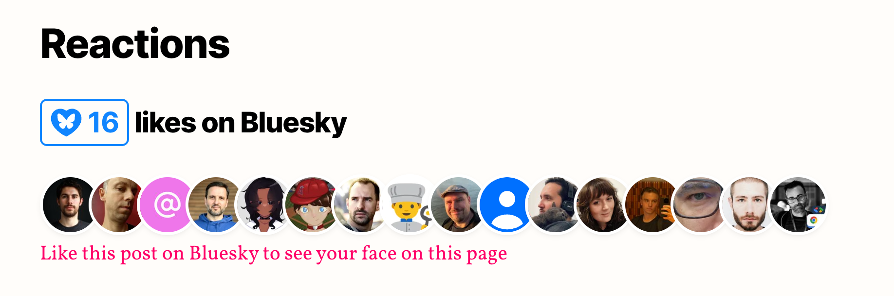
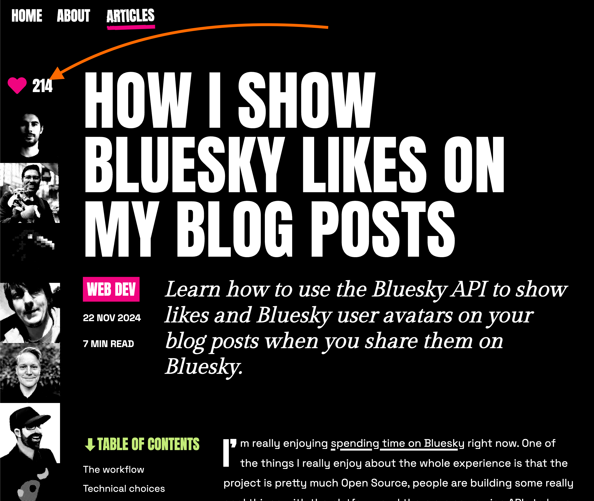

This afternoon I was reading [Lea Verou's article on external import maps](https://lea.verou.me/blog/2026/external-import-maps-today/), a really good read, but that's not really the point of this article... the point is that, as I scrolled to the bottom of the article, something else caught my eye: a neat little section showing Bluesky likes, complete with avatars of the people who had liked the post.



Then I remembered that I had already seen something like this somewhere else: [Salma Alam-Naylor's blog](https://whitep4nth3r.com/blog/show-bluesky-likes-on-blog-posts/) also had a similar feature showing Bluesky engagement on her posts. Salma's one has an even more original design:



What I really like here is the clever use of CSS filters combined with a background dotted pattern to create this halftone-like effect on the avatars. It's a great example of how a little bit of CSS creativity can go a long way in making a feature feel unique and integrated with the site's design. You should seriously go and check the CSS using the browser dev tools, it's really cool!

But I digress... again! The point here is that what I thought at this point is... _"I'd love to add this Bluesky integration on my blog too!"_

Here's how I went from _"I want that"_ to _"it's live"_ in about an hour... admittedly, with a little help from Claude Code.

## How it started

I admit I was a bit in a rush and needed to complete my next issue of [FullStack Bulletin](https://fullstackbulletin.com), so while I was working on that, I decided to fire up Claude Code and ask it to investigate both Lea's and Salma's blogs to see how they implemented the feature and come back to me with a detailed summary. I was hoping for some quick insights that I could then apply to my own blog.

Once I finished the issue and had a bit more time, I came back to the conversation with Claude Code, and what it found made me realize that this feature can be implemented in a really simple and elegant way using a web component package called `bluesky-likes` built by Lea Verou herself.

## The `bluesky-likes` package

The [`bluesky-likes`](https://www.npmjs.com/package/bluesky-likes) package provides two web components that can be easily integrated into any website to display Bluesky likes and the avatars of the people who liked a post, all without needing any server-side code or API keys.

- **`<bluesky-likes>`**: displays the like count
- **`<bluesky-likers>`**: renders an avatar grid of the people who liked the post

The simplest possible usage looks like this:

```html
<!-- index.html -->
<script type="module" src="https://esm.sh/bluesky-likes/autoload"></script>

<bluesky-likes src="https://bsky.app/profile/you/post/abc123"></bluesky-likes>
people liked this post

<bluesky-likers src="https://bsky.app/profile/you/post/abc123"></bluesky-likers>
```

That's it. You point the `src` attribute to a Bluesky post URL and the components do the rest.

A few things I really like about this package:

- **Tiny**: ~2 KB gzipped, zero dependencies.
- **No API keys**: it uses the public Bluesky API (`app.bsky.feed.getLikes`) client-side, so there's no server-side code, no auth tokens, no environment variables, no CORS issues!
- **Themeable**: CSS custom properties that penetrate the shadow DOM, so you can match your site's design.
- **Autoload script**: discovers the components in the DOM automatically, no manual `customElements.define()` needed.
- **Accessible**: screen reader support and skip links built in.

Under the hood, the component calls the public `app.bsky.feed.getLikes` endpoint to fetch liker profiles, then renders the avatars inside a shadow DOM grid. Simple and effective.

If you want a more detailed peek at what this package does under the hood, you can check out [this Codepen](https://codepen.io/dmitrysharabin/pen/Jodbyqm), which, based on the package's README, seems to have been the inspiration for the initial implementation. It's about 50 lines of vanilla JS, and it shows really clearly how you can interact with the Bluesky APIs from a web browser.


## Step 1: Adding the schema field

So the next step was about how to bring this into my blog setup.

This blog is a static site built with [Astro](https://astro.build/) and uses Zod schemas for content collections. The first thing I needed was a way to associate a Bluesky post URL with each blog post.

One line change in `src/content/config.ts`:

```ts
// src/content/config.ts
// ...
const posts = defineCollection({
  loader: glob({ pattern: '**/[^_]*.md(x)?', base: './src/content/posts' }),
  schema: ({ image }) =>
    z.object({
      title: z.string(),
      subtitle: z.string().optional().nullable(),
      description: z.string().optional().nullable(),
      date: z.coerce.date(),
      updated: z.coerce.date().optional(),
      header_img: image().optional(),
      status: z.enum(['published', 'draft']),
      tags: z.array(z.string()),
      bluesky_url: z.string().url().optional().nullable(), // 👈 new!
    }),
})
```

Now each post's frontmatter can optionally include a `bluesky_url` field:

```yaml
# src/content/posts/sample-blog-post/index.md
---
title: My awesome post
slug: my-awesome-post
date: 2026-03-08T12:00:00.000Z
status: published
tags:
  - javascript
bluesky_url: https://bsky.app/profile/loige.co/post/abc123
---

This is the best blog post ever!
```


## Step 2: Building the component

Next up, I needed an easy way to include this in my blog post pages. A dedicated Astro component seemed the right abstraction that I could easily bring into the blog post page template. Here's what the full `BlueskyReactions.astro` looks like:

```astro
<!-- BlueskyReactions.astro -->
---
interface Props {
  blueskyUrl: string
}

const { blueskyUrl } = Astro.props
---

<div class="mt-8 pt-8 border-t border-text-100">
  <h3 class="text-text-500 font-bold">Bluesky Love</h3>
  <p class="text-text-400 text-sm mt-1">
    <bluesky-likes src={blueskyUrl}></bluesky-likes> awesome folks liked this article
    on Bluesky
  </p>
  <div class="mt-4">
    <bluesky-likers src={blueskyUrl} max="50"></bluesky-likers>
  </div>
  <p class="mt-4">
    <a
      href={blueskyUrl}
      target="_blank"
      rel="noopener noreferrer"
      class="text-primary-500 hover:text-primary-600 underline text-sm"
    >
      Like or comment on Bluesky
    </a>
  </p>
</div>

<style>
  bluesky-likes {
    --bluesky-likes-color: var(--color-primary-500);
  }

  bluesky-likers {
    --avatar-size: 2.5em;
    --avatar-border: 0.12em solid var(--color-bg-600);
    --avatar-shadow: 0 0.1em 0.3em -0.2em rgb(0 0 0 / 0.3);
    --more-background: var(--color-primary-500);
    --more-color-text: var(--color-bg-100);
  }
</style>

<script is:inline type="module">
  import 'https://esm.sh/bluesky-likes/autoload'
</script>
```

Let me walk through the key parts:

- **Props and conditional rendering**: The component takes a `blueskyUrl` prop. As we'll see in the next step, the page template only renders this component when `bluesky_url` is set in the post's frontmatter. No URL, no section, no script loaded. Progressive enhancement at its finest.

- **The web components**: We use both `<bluesky-likes>` (for the count) and `<bluesky-likers>` (for the avatar grid), each pointing to the same Bluesky post URL via the `src` attribute. The `max="50"` on `<bluesky-likers>` caps the number of displayed avatars.

- **The CTA link**: A simple link inviting readers to _"Like or comment on Bluesky"_. Because if you're going to show likes, you might as well encourage more of them!

- **CSS custom properties**: This is where the theming magic happens. The `bluesky-likes` package exposes CSS custom properties that penetrate the shadow DOM, so we can map them to the blog's existing design tokens. Since my blog uses CSS custom properties for its color scheme (with `--color-primary-500`, `--color-bg-600`, etc. adapting to dark/light mode), the Bluesky section automatically looks right in both themes. No extra work needed.

- **The `esm.sh` import**: You might notice I'm importing from `esm.sh` rather than `unpkg`. I originally tried `unpkg`, but ran into an issue: `unpkg` doesn't resolve the package's exports map correctly, which resulted in a 404 on the autoload module. Switching to `esm.sh` fixed it immediately. Things don't always work on the first try!

- **`is:inline` directive**: The `is:inline` on the `<script>` tag tells Astro not to bundle or process this script. It gets injected as-is into the HTML. This is important because we want the browser to fetch the module directly from `esm.sh` at runtime.


## Step 3: Wiring it into the post page

With the component ready, integrating it into the post page was just three lines in `src/pages/[...slug].astro`:

First, the import at the top:

```astro
<!-- src/pages/[...slug].astro -->
---
// ...
import BlueskyReactions from '../components/BlueskyReactions.astro'
---
```

Then, the conditional render in the template:

```astro
<!-- src/pages/[...slug].astro -->
<!-- ... -->
{post.data.bluesky_url && (
  <BlueskyReactions blueskyUrl={post.data.bluesky_url} />
)}
<!-- ... -->
```

I placed it between the "Found a typo?" section and the Disqus comments. It felt like the natural spot: after you've read the article and before the general comments section. And since it's conditionally rendered, posts without a `bluesky_url` won't show the section or load the script at all.


## Step 4: Finding all my Bluesky posts

OK so the code was done, but I had a problem: I needed to find all the Bluesky post URLs where I had shared links to my blog articles. This turned out to be the most tedious part of the process.

Thankfully, I discovered the awesome [`bsky` CLI by mattn](https://github.com/mattn/bsky), a command-line client for Bluesky (written in Go) that lets you inspect posts and threads as JSON, from the comfort of your CLI.

The workflow was something like this:

1. Search for posts from my profile that mention `loige.co`
2. For each match, grab the AT Protocol URI (the `at://did:.../app.bsky.feed.post/<post_id>` format)
3. Use `bsky thread --json "at://..."` to inspect threads and find the root post with the blog link
4. Some posts had the link directly, others were threads where the blog URL was in a reply. In those cases, I used the root of the thread
5. When multiple posts pointed to the same article, I picked the one with the most engagement

I ended up using Claude Code to help automate the matching and frontmatter updates across 13 posts. This is exactly the kind of tedious-but-scriptable work where AI tooling shines: _"here are 13 Bluesky URLs and 200 blog posts, match them up and update the frontmatter."_ Done in minutes rather than an hour of manual copy-pasting.

The best bit is that I didn't need a Bluesky MCP or anything like that. I just told Claude Code to use the `bsky` CLI and its built-in `--help` command to figure out how to get the data it needed.


## The result

If you want to see the feature in action, scroll down to the bottom of this very post! (Well, once I share this on Bluesky and add the URL to the frontmatter, that is.)

In the meantime, you can check it out on posts like [I am co-authoring a book about Rust and Lambda](/coauthoring-a-book-about-rust-and-lambda/) or [2025 - A year in Review](/2025-a-year-in-review/), both of which already have Bluesky likes wired up.

The section adapts nicely to both dark and light mode, thanks to the CSS custom property mapping. It's a small detail, but it makes the feature feel native rather than bolted on.


## Conclusion

To sum it up, here's what it took to add Bluesky likes to this blog:

- **1 line** of schema (`bluesky_url` field in the Zod config)
- **46 lines** of component code (`BlueskyReactions.astro`)
- **3 lines** of page integration (import + conditional render)

A big shoutout to [Lea Verou](https://lea.verou.me/) for building the excellent `bluesky-likes` package and to [Salma Alam-Naylor](https://whitep4nth3r.com/) for the original inspiration. The beauty of web components is that they're framework-agnostic: this same approach would work on Next.js, Hugo, Eleventy, or a plain HTML page.

If you liked this article, you know what to do: hit that like button on Bluesky and your avatar will show up right below!
