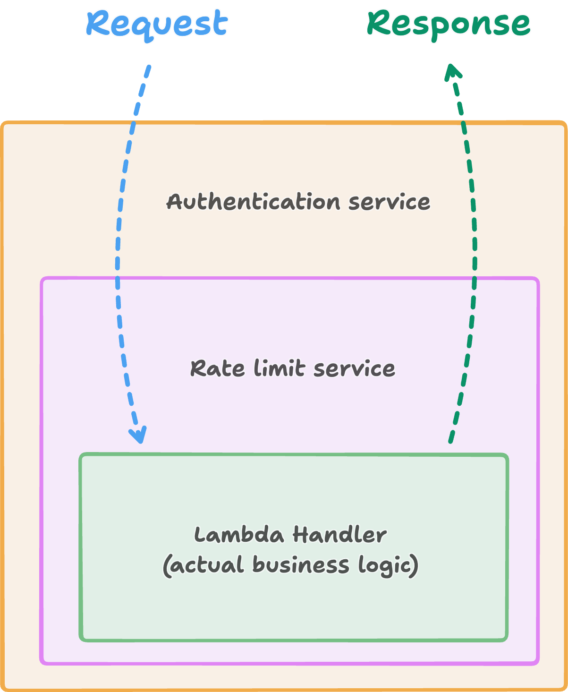

There is one pattern that has been my secret sauce for AWS Lambda code for
almost as long as I have been writing AWS Lambda code: the **middleware pattern**.
If you have touched a modern web framework in the last decade (Express,
Fastify, NestJS, Laravel, Django, Rails, FastAPI, ... take your pick), you have almost certainly used this pattern, probably
without even noticing. It is everywhere, and I love it!

I love it so much that, back in 2017, I started an open source project called
[**Middy**](https://middy.js.org) just to bring it to Node.js Lambdas. Today,
Middy is widely used in the Node.js serverless ecosystem, and the pattern has
been recognised as incredibly useful for keeping Lambda handlers clean and
maintainable.

Recently I was building a rate limiter for a Rust Lambda project at work, and I
realised the generalised version of what I learned would make a great blog post.
This is that post!

<aside class="callout callout-note">

I'm co-writing the book [**Crafting Lambda Functions in Rust**](https://rust-lambda.com) with [James Eastham](https://blog.jameseastham.co.uk/). It takes you from zero to hero on AWS Lambda with Rust, and you do not need to be an expert in either Lambda or Rust to follow along: the book is designed to be accessible, very hands-on, and packed with runnable examples. Middleware is one of the topics we cover in much more depth, with extra examples and exercises.

</aside>

We will start by talking about the pattern itself and why it is such a good fit
for Lambda. Then we will look at how it maps onto Rust by introducing [**tower**](https://docs.rs/tower), the
generic middleware engine you can use with **tokio** and that is already sitting at the core of the AWS Lambda Rust
runtime. To get ourselves familiar with tower's interface, we will build a few small pieces of middleware to warm up, and finally put together a
complete DynamoDB-backed IP rate limiter that you can use
as a template for your own middleware.

If you want to skip ahead to the code, the full working example lives at
[github.com/lmammino/rust-lambda-middleware-example](https://github.com/lmammino/rust-lambda-middleware-example).

## The pattern that keeps on paying off

The "middleware pattern" is what happens when you take the Gang of Four
[Chain of Responsibility](https://en.wikipedia.org/wiki/Chain-of-responsibility_pattern)
pattern and give it a friendlier name... and also a slightly more confusing one,
because it risks collision with the older, broader
[systems-integration sense of "middleware"](https://en.wikipedia.org/wiki/Middleware). Naming things is hard, so let's accept that and let's move on!

The idea is to create an abstraction that allows you to compose small, reusable units of logic around a core handler. It passes a request through an ordered chain of
handlers, and each handler can choose to handle the request, transform it, or
pass it along. A request comes in and travels down through the chain. A response
that is ready to go out comes back up through the chain in reverse order. Each
middleware gets a chance to influence the round trip.


In a Lambda function, a middleware is a thin wrapper around your core handler.
In practice, each wrapper owns one cross-cutting concern: logging, request tracing,
authentication, input validation, output shaping, CORS, error envelopes, rate
limiting. You compose them in a stack, and the core handler stays laser
focused on the actual business logic.

This matters a lot in Lambda for two reasons:

1. Cross-cutting concerns are everywhere. A single service often has ten or
   fifteen Lambda handlers, and each one needs the same five or six things
   (parse JWT, decode body, enforce schema, emit structured logs, add response headers). Without middleware, the
   temptation is to copy-paste it into every handler. The day you need to
   change any of that, you'll have to carefully update files all around the project.
2. Handlers stay readable. When business logic is not buried under a few hundreds lines
   of boilerplate, it becomes much easier to reason about, test, and review.

On top of that, committing to the pattern turns every cross-cutting concern
into a small, self-contained unit of **reusable**, **configurable**, and
**testable** logic. For example, You write a JWT verifier middleware once, unit-test it in
isolation (no Lambda, no API Gateway, no mocks), ship it, and then just
plug it into every handler that needs it. Multiply that across every
cross-cutting concern in your stack and the maintainability and quality
dividend becomes really hard to ignore.

That copy-paste fatigue around validation, error handling, and
(de)serialisation is exactly what pushed me to start Middy. It now ships
[30+ official middleware](https://middy.js.org/docs/middlewares/intro), plus
many more maintained by the community.

## Does this pattern make sense in Rust?

Rust on Lambda is growing up fast. And for good reasons! If you want the long version of why Rust is
such a great fit, check out my older post on
[why you should consider Rust for your Lambdas](/posts/why-you-should-consider-rust-for-your-lambdas/).

The short version: Rust Lambdas have the same cross-cutting concerns as any
other Lambda runtime. So the same ergonomic problem exists, and we need the
same kind of solution.

But there is a pretty good news which makes Rust a bit unique among the other Lambda runtimes, and honestly the reason I wanted to write this post:
**the AWS Lambda Rust runtime already ships a middleware engine...** it's built in, and almost
nobody uses it! Almost every Rust Lambda codebase I have reviewed in the last year
bolts logging, auth, and validation directly into the handler, unaware that
there is a proper composable middleware layer sitting one import away. To be
fair, I have occasionally seen Rust Lambda codebases that work around this
with clever helper functions, macros, or trait extensions, and some of those
solutions are genuinely elegant. None of them quite match the convenience
and composability of a real middleware stack, though. Once you see this
pattern in action, you cannot unsee it, and that alone is reason enough to
keep reading.

## Enter **tower**: the middleware engine under the Rust Lambda runtime

Before we dive in, it is worth clearing up a common misconception. You will
sometimes hear people say that middleware in Rust Lambda comes from
`lambda_http`. That is not quite right, and it matters because the pattern is
more general than that.

[**tower**](https://crates.io/crates/tower) is a generic middleware engine for
the [tokio](https://tokio.rs/) async runtime. It is not specific to Lambda,
HTTP, or AWS. Anything built on tokio can be composed with tower layers, which
is why you will find tower underneath
[hyper](https://hyper.rs/), [axum](https://github.com/tokio-rs/axum),
[tonic](https://github.com/hyperium/tonic) (gRPC),
[reqwest](https://github.com/seanmonstar/reqwest)'s retry middleware, and plenty
of other ecosystem crates.

The official [`aws-lambda-rust-runtime`](https://github.com/aws/aws-lambda-rust-runtime)
is itself a tokio application, and it exposes every Lambda handler as a tower
`Service`. This is true at the **base runtime level**, not just at the
`lambda_http` level. Your SQS consumer, your S3 event handler, your custom
EventBridge Lambda: they are all tower services, and they can all be wrapped
with tower middleware which can help you to manage cross-cutting concerns like logging, validation, error handling, and more in a consistent and reusable way.

The `lambda_http` crate is just a convenient wrapper that specialises the
request and response types to HTTP. The middleware ergonomics come from tower,
sitting one layer below. In this post we will focus on HTTP because it is the
most common Lambda shape and also the one that arguably benefits most from this pattern, but everything here applies to non-HTTP events with
minor adjustments.

### The two core traits

Tower is built around two traits. The first is `Service`. Conceptually, it is
a function from a request to a future that resolves to a response, plus a
readiness signal:

```rust
pub trait Service<Request> {
    type Response;
    type Error;
    type Future: Future<Output = Result<Self::Response, Self::Error>>;

    fn poll_ready(&mut self, cx: &mut Context<'_>) -> Poll<Result<(), Self::Error>>;
    fn call(&mut self, request: Request) -> Self::Future;
}
```

`call` is the interesting method: it does the work. `poll_ready` is a
backpressure hook, used by services that need to buffer or throttle (a
connection pool, for instance). For Lambda middleware you will almost always
just delegate `poll_ready` to the inner service, because the real backpressure
in Lambda is managed by the runtime itself.

The second trait is `Layer`. A layer is a factory that wraps a `Service` and
produces a new `Service`:

```rust
pub trait Layer<S> {
    type Service;
    fn layer(&self, inner: S) -> Self::Service;
}
```

Most custom middleware is written as a pair: a `XxxLayer` that captures the
configuration, and an `XxxService<S>` that is produced when the layer is
applied to an inner service `S`.

Layers are composed with `ServiceBuilder`, which stacks them onto a base
service:

```rust
let service = ServiceBuilder::new()
    .layer(authentication)
    .layer(rate_limit)
    .service(handler);
```

The stack applies outer-first on the request, outer-last on the response. So
for this example the request hits `authentication`, then `rate_limit`, then
`handler`; and the response goes back through `rate_limit`, then
`authentication`.

A subtle but important point: in that snippet, `handler` itself has to be a
`Service` too. A stack of tower layers eventually terminates in one innermost
`Service` that actually does the work, and in our case that is the Lambda
handler. There are two ways to produce that terminal service:

1. Wrap a plain `async fn` with [`tower::service_fn`](https://docs.rs/tower/latest/tower/fn.service_fn.html).
   This is by far the most common choice, and what we will use throughout
   the rest of the post.
2. Write a full `impl Service` for your handler type. Reach for this when
   you need fine-grained control over `poll_ready` (backpressure on a
   connection pool, for instance) or when the handler owns typed mutable
   state that you want to manage explicitly.

For Lambda handlers, option 1 is nearly always enough.

Visually, the composition looks like a stack of nested boxes. The request
travels down from the outermost layer to the terminal handler: first through
the authentication middleware, then through the rate limiting middleware, and
finally into the Lambda handler. The response travels back up in reverse order:



Each middleware gets a crack at the request on the way in, and another crack
at the response on the way out. Authentication can reject unauthorised requests
before they reach the rest of the stack, rate limiting can reject or throttle
excessive traffic before it reaches the handler, and the handler can stay
focused on the actual business logic. That is the whole mental model.

### A no-op middleware

Before doing anything useful, let us look at the shape of a tower middleware.
This one passes every request through untouched:

```rust
use std::task::{Context, Poll};
use lambda_http::tower::{Layer, Service};

#[derive(Clone)]
pub struct NoopLayer;

impl<S> Layer<S> for NoopLayer {
    type Service = NoopService<S>;
    fn layer(&self, inner: S) -> Self::Service {
        NoopService { inner }
    }
}

pub struct NoopService<S> { inner: S }

impl<S, R> Service<R> for NoopService<S>
where
    S: Service<R>,
{
    type Response = S::Response;
    type Error = S::Error;
    type Future = S::Future;

    fn poll_ready(&mut self, cx: &mut Context<'_>) -> Poll<Result<(), Self::Error>> {
        self.inner.poll_ready(cx)
    }

    fn call(&mut self, request: R) -> Self::Future {
        self.inner.call(request)
    }
}
```

That is the whole shape. Everything else we do in this post is just more
interesting implementations of `call`.

<details class="rabbit">
<summary>Wait, why can't I just write <code>async fn call</code>?</summary>

A fair question. Rust 1.75 stabilised async functions in traits (AFIT), so
you might reasonably expect to be able to write:

```rust
impl<S> Service<Req> for MyMiddleware<S> {
    async fn call(&mut self, req: Req) -> Result<Response, Error> { ... }
}
```

You cannot, and it is not your fault. The tower `Service` trait predates
AFIT and has a specific shape that needs a **nameable** `Future` associated
type with `Send + 'static` bounds. Two limitations of AFIT get in the way:

1. The future returned by an `async fn` in a trait is anonymous, so you
   cannot name it to satisfy `type Future = ...`.
2. AFIT does not yet offer a stable way to add `Send + 'static` bounds to
   that returned future without reaching for unstable features or the
   `trait-variant` crate, and the tower ecosystem really wants
   `Future: Send + 'static`.

So every tower middleware falls back to one of these patterns:

- Use `tower::service_fn` to wrap a plain `async fn`. This is what you do
  for the terminal handler (our Lambda function) in the vast majority of
  cases, and it is exactly what we do in `main.rs` later on.
- For a real stateful `Service` impl (the middleware we write in the rest
  of this post), declare `type Future = Pin<Box<dyn Future<Output = ...> + Send>>`
  and write `call` as `Box::pin(async move { ... })`. You are not really
  hand-rolling `poll`, you are just boxing an `async` block. The one heap
  allocation per request costs nothing worth measuring in Lambda.

There is ongoing work on an async-native `Service` trait, but until it
lands, `Box::pin(async move { … })` is the idiomatic shape.

</details>

### A logging middleware

Let us look at something practical. Here is a middleware that logs the HTTP
method, path, and response status:

```rust
use std::future::Future;
use std::pin::Pin;
use std::task::{Context, Poll};

use http::{Request, Response};
use lambda_http::tower::{Layer, Service};
use lambda_http::{tracing, Body};

#[derive(Clone)]
pub struct LogLayer;

impl<S> Layer<S> for LogLayer {
    type Service = LogService<S>;
    fn layer(&self, inner: S) -> Self::Service { LogService { inner } }
}

pub struct LogService<S> { inner: S }

impl<S> Service<Request<Body>> for LogService<S>
where
    S: Service<Request<Body>, Response = Response<Body>> + Send + 'static,
    S::Future: Send,
    S::Error: Send,
{
    type Response = Response<Body>;
    type Error = S::Error;
    type Future = Pin<Box<dyn Future<Output = Result<Self::Response, Self::Error>> + Send>>;

    fn poll_ready(&mut self, cx: &mut Context<'_>) -> Poll<Result<(), Self::Error>> {
        self.inner.poll_ready(cx)
    }

    fn call(&mut self, request: Request<Body>) -> Self::Future {
        let method = request.method().clone();
        let path = request.uri().path().to_string();
        let fut = self.inner.call(request);
        Box::pin(async move {
            let response = fut.await?;
            tracing::info!(method = %method, path = %path, status = %response.status(), "request");
            Ok(response)
        })
    }
}
```

Three things worth pointing out:

1. We clone `method` and copy `path` **before** calling `self.inner.call(...)`,
   because `call` takes the request by value. If you try to read them after,
   the compiler will stop you (the request has moved). This is a pattern you
   will see in every non-trivial middleware.
2. The `Future` type is `Pin<Box<dyn Future<...> + Send>>`. Boxing is necessary
   here because the future is generic over the inner service and we cannot
   write it out concretely. It costs a heap allocation per request, which is
   negligible for Lambda workloads.
3. The trait bounds (`S: Service<..., Response = Response<Body>> + Send + 'static`,
   `S::Future: Send`) look intimidating the first time you see them, but they
   are boilerplate. Copy-paste them, adjust the types, move on.
4. The work inside the `async move` block happens **after** `fut.await?`.
   That is a deliberate choice: the log line only makes sense once we have
   the response status, so we wait for the inner service to produce a
   response before emitting the log. If you wanted to validate the request
   or reject it for an auth failure, you would do that work **above** the
   `fut.await?` line, and return early with an error response before the
   inner service ever runs. Conceptually: code before the `await` inspects
   or transforms the **request**; code after the `await` inspects or
   transforms the **response**. In this particular middleware we do
   neither: we log, and we hand the response back untouched. The next
   middleware will show the mirror case, mutating the response on its way
   out.

### A header-injecting middleware

One more warm-up, this time mutating the outgoing response:

```rust collapse={1-14}
use http::{HeaderValue, Response};
use lambda_http::tower::{Layer, Service};
use lambda_http::Body;
use std::future::Future;
use std::pin::Pin;
use std::task::{Context, Poll};

#[derive(Clone)]
pub struct PoweredByLayer;

impl<S> Layer<S> for PoweredByLayer {
    type Service = PoweredByService<S>;
    fn layer(&self, inner: S) -> Self::Service { PoweredByService { inner } }
}

pub struct PoweredByService<S> { inner: S }

impl<S> Service<http::Request<Body>> for PoweredByService<S>
where
    S: Service<http::Request<Body>, Response = Response<Body>> + Send + 'static,
    S::Future: Send,
{
    type Response = Response<Body>;
    type Error = S::Error;
    type Future = Pin<Box<dyn Future<Output = Result<Self::Response, Self::Error>> + Send>>;

    fn poll_ready(&mut self, cx: &mut Context<'_>) -> Poll<Result<(), Self::Error>> {
        self.inner.poll_ready(cx)
    }

    fn call(&mut self, request: http::Request<Body>) -> Self::Future {
        let fut = self.inner.call(request);
        Box::pin(async move {
            let mut response = fut.await?;
            response
                .headers_mut()
                .insert("x-powered-by", HeaderValue::from_static("rust"));
            Ok(response)
        })
    }
}
```

Same shape, slightly different `call` body. You can see how this quickly
becomes muscle memory.

### Testing without Lambda

One last piece of the puzzle. The tower crate exposes a useful trait called
[`ServiceExt`](https://docs.rs/tower/latest/tower/trait.ServiceExt.html) that
adds a `.oneshot(request)` helper. It lets you call a service once in a
test, without standing up any runtime or mock infrastructure:

```rust
use lambda_http::tower::ServiceExt;

let response = my_service.oneshot(request).await.unwrap();
assert_eq!(response.status(), StatusCode::OK);
```

We will lean on this heavily in the rate limiter tests.

## A real world example: DynamoDB-backed IP rate limiting

Time to build something useful. We are going to write a middleware that
enforces a per-IP rate limit using a DynamoDB atomic counter, and it will
emit the standard response headers so clients can self-pace.

<details class="rabbit">
<summary>Why not just use API Gateway usage plans?</summary>

Good question. For many use cases, API Gateway usage plans are fine. But they have key limitations regarding observability and flexibility. Building your own middleware gives you the shape of limits that fits your business logic, and more importantly, it allows you to tell your clients exactly how much quota they have left (which is exactly what I wanted to achieve myself in my latest project).

1. **If you are on HTTP API (v2), usage plans do not exist.** Period. They
   are a REST API (v1) feature only.
2. **Even on REST, usage plans are invisible to clients.** API Gateway will
   reject you with a 429 once you are over the limit, but it will not tell
   you how many requests you have left or when the counter resets. There are
   no `RateLimit-*` response headers. Compare that with
   [GitHub's REST API](https://docs.github.com/en/rest/using-the-rest-api/rate-limits-for-the-rest-api),
   where every response carries `X-RateLimit-Limit`, `X-RateLimit-Remaining`,
   and `X-RateLimit-Reset`. Modern clients use those headers to pace
   themselves gracefully, and your clients cannot do that when you only hand
   them a 429 after the fact.
3. **API keys must exist before the first request.** This is awkward for
   dynamic user bases, and the hard cap of 10,000 keys per account per
   region makes it unworkable for consumer-scale apps.
4. **Quota buckets reset only daily or monthly.** If your business logic
   wants a 15-minute window, usage plans will not help you.

For a deeper tour of this tradeoff space (including WAF rate-based rules and CloudFront Functions tricks), Warren Parad has a great write-up: [Exceeding AWS rate-limiting, CloudFront, usage plans](https://warrenparad.net/articles/exceeding-the-aws-rate-limiting-cloudfront-usage-plans).
</details>

### What we are building

The requirements:

- Key the limit on **client IP**. This keeps the tutorial simple. Real apps
  often prefer a stable user ID from a JWT claim; swapping the
  key-extraction function is a one-line change once the rest is in place.
- **Fixed window**, configurable via a `window_secs` parameter. We default
  to 900 seconds (15 minutes) because it is a common choice.
- **Atomic counter in DynamoDB**, with TTL-based cleanup. No cron, no scans.
- **Standard response headers** on every successful response: `RateLimit-Limit`,
  `RateLimit-Remaining`, `RateLimit-Reset`. These are the names from the
  [IETF draft](https://datatracker.ietf.org/doc/draft-ietf-httpapi-ratelimit-headers/),
  which are similar to GitHub's `X-RateLimit-*` but without the `X-` prefix.
  Either convention is fine; I prefer the draft names because they are where
  the web is heading. If your clients expect the GitHub form, change the
  header names in one spot and you are done.
- A plain JSON `429` body with a `Retry-After` header when the limit is hit.

One honest caveat before we start. We are using a **fixed-window counter**,
which is the simplest thing that could possibly work. It has one well-known
downside: a motivated client can burst up to `2 × max_requests` across a
window boundary (everything right before the flip, plus everything right
after). The standard fixes are a token bucket or a sliding window, and the
middleware shape stays identical; only the counter arithmetic changes. For
this post we will stick to the fixed window because it keeps the focus on
middleware mechanics. Swapping the algorithm is left as a follow-up.

## The code

The companion repo lives at
[github.com/lmammino/rust-lambda-middleware-example](https://github.com/lmammino/rust-lambda-middleware-example).
The layout is simple:

```text
rust-lambda-middleware-example/
├── Cargo.toml
├── template.yaml
└── src/
    ├── main.rs
    ├── ip_extractor.rs
    └── rate_limit.rs
```

Here is the `Cargo.toml`:

```toml title="Cargo.toml" {12}
[package]
name = "rust-lambda-middleware-example"
version = "0.1.0"
edition = "2021"

[[bin]]
name = "hello"
path = "src/main.rs"

[dependencies]
lambda_http = "1"
tokio = { version = "1", features = ["macros", "rt-multi-thread"] }
http = "1"
serde = { version = "1", features = ["derive"] }
serde_json = "1"
async-trait = "0.1"
thiserror = "2"
aws-config = { version = "1", features = ["behavior-version-latest"] }
aws-sdk-dynamodb = "1"
```

Notice that we are not pulling in `tower` directly. Since `lambda_http` 1.0,
the runtime re-exports the bits of tower we need under `lambda_http::tower::*`
(`Layer`, `Service`, `ServiceBuilder`, `ServiceExt`, `service_fn`, and so on).
That guarantees we always end up with the exact tower version the runtime is
built against, which avoids a whole class of trait-mismatch headaches. The
`aws-config` `behavior-version-latest` feature pins the SDK to sensible
recent defaults.

### Extracting the client IP

First we need to know who is making the request. In Lambda, the client IP
arrives via headers set by whatever sits between the client and the function:
API Gateway, CloudFront, a custom proxy, and so on. The convention is to walk
a priority list:

```rust title="src/ip_extractor.rs"
use std::net::IpAddr;
use std::str::FromStr;

use lambda_http::Request;

pub fn extract_ip(request: &Request) -> Option<IpAddr> {
    let headers = request.headers();

    if let Some(value) = headers.get("x-forwarded-for") {
        if let Ok(s) = value.to_str() {
            if let Some(ip) = parse_forwarded_for(s) {
                return Some(ip);
            }
        }
    }

    if let Some(value) = headers.get("x-real-ip") {
        if let Ok(s) = value.to_str() {
            if let Ok(ip) = IpAddr::from_str(s.trim()) {
                return Some(ip);
            }
        }
    }

    if let Some(value) = headers.get("cf-connecting-ip") {
        if let Ok(s) = value.to_str() {
            if let Ok(ip) = IpAddr::from_str(s.trim()) {
                return Some(ip);
            }
        }
    }

    None
}

fn parse_forwarded_for(header: &str) -> Option<IpAddr> {
    header
        .split(',')
        .map(str::trim)
        .find_map(|candidate| IpAddr::from_str(candidate).ok())
}
```

`X-Forwarded-For` can contain a comma-separated list (each proxy on the path
appends its view of the client), so we walk it and take the first valid IP.
We then fall back to `X-Real-IP` (common with nginx-style proxies) and
`CF-Connecting-IP` (Cloudflare). If none of these are set, we give up and
return `None`; the caller will decide what to do.

A word of caution. These headers are only trustworthy if you control every
hop between the client and the Lambda. Behind API Gateway, an ALB, or
CloudFront they are set by the proxy and safe. If you expose a Lambda
function URL directly, any caller can forge them. The middleware below
fails **open** when it cannot determine an IP (letting the request through
rather than locking out legitimate traffic), which is the right default
for this class of problem; make the opposite choice if your threat model
demands it.

This IP extractor is adapted from a small helper I built for
[geo-redirect-lambda](https://github.com/lmammino/geo-redirect-lambda/blob/main/lambda/src/ip_extractor.rs),
which has been running in production for a while without drama.

### The rate limit middleware

Now the main event. I will show the file in three passes so we can talk
about each piece.

#### The config and the layer

```rust title="src/rate_limit.rs (1 of 3)" showLineNumbers
use std::net::IpAddr;
use std::sync::Arc;

use http::Response;
use lambda_http::tower::Layer;
use lambda_http::Body;

/// Information passed to a custom over-limit response builder.
pub struct OverLimitCtx {
    pub ip: IpAddr,
    pub limit: u32,
    pub reset_at: u64,
    pub retry_after: u64,
}

type OverLimitFn = Arc<dyn Fn(OverLimitCtx) -> Response<Body> + Send + Sync>;
type UnavailableFn = Arc<dyn Fn() -> Response<Body> + Send + Sync>;

#[derive(Clone)]
pub struct RateLimitConfig {
    pub table_name: String,
    pub max_requests: u32,
    pub window_secs: u64,
}

#[derive(Clone)]
pub struct RateLimitLayer {
    config: Arc<RateLimitConfig>,
    client: aws_sdk_dynamodb::Client,
    over_limit: OverLimitFn,
    unavailable: UnavailableFn,
}

impl RateLimitLayer {
    pub fn new(config: RateLimitConfig, client: aws_sdk_dynamodb::Client) -> Self {
        Self {
            config: Arc::new(config),
            client,
            over_limit: Arc::new(default_over_limit_response),
            unavailable: Arc::new(default_unavailable_response),
        }
    }

    /// Override the response returned when a client is over the limit.
    pub fn on_over_limit<F>(mut self, f: F) -> Self
    where
        F: Fn(OverLimitCtx) -> Response<Body> + Send + Sync + 'static,
    {
        self.over_limit = Arc::new(f);
        self
    }

    /// Override the response returned when the counter store is unreachable.
    pub fn on_unavailable<F>(mut self, f: F) -> Self
    where
        F: Fn() -> Response<Body> + Send + Sync + 'static,
    {
        self.unavailable = Arc::new(f);
        self
    }
}

impl<S> Layer<S> for RateLimitLayer {
    type Service = RateLimitService<S>;

    fn layer(&self, inner: S) -> Self::Service {
        let store: Arc<dyn RateLimitStore> = Arc::new(DynamoDbRateLimitStore {
            client: self.client.clone(),
        });
        RateLimitService {
            inner,
            store,
            config: Arc::clone(&self.config),
            over_limit: Arc::clone(&self.over_limit),
            unavailable: Arc::clone(&self.unavailable),
        }
    }
}
```

A few things worth pointing out:

- `RateLimitConfig` holds the plain data (table name, limits). Wrapping it
  in `Arc` once in `RateLimitLayer::new` means every subsequent `.clone()`
  (and there are a few, because tower sometimes clones services for
  concurrent calls) is just a refcount bump.
- The DynamoDB `Client` is itself cheap to clone (it shares an inner
  connection pool behind an `Arc`), so we just clone it.
- `OverLimitFn` and `UnavailableFn` are type aliases for boxed closures. They
  are the **extension points** for the middleware: by default we hand back a
  small JSON `429` (over-limit) or `503` (counter store unreachable), but
  `on_over_limit` and `on_unavailable` let users plug in their own response
  builders without forking the crate. This is a pattern worth stealing for
  any reusable middleware: ship sensible defaults, expose the tasteful
  override hooks. We will see the default builders themselves in part three.
- The `Layer::layer` impl is where we construct the inner `Service`. Notice
  we also create a `RateLimitStore` here; we will get to why it is a trait
  in a moment.

#### The service

```rust title="src/rate_limit.rs (2 of 3)" showLineNumbers {41-42,52,59} collapse={1-11,22-33}
use std::future::Future;
use std::pin::Pin;
use std::task::{Context, Poll};
use std::time::{SystemTime, UNIX_EPOCH};

use http::Response;
use lambda_http::tower::Service;
use lambda_http::{tracing, Body};
use tracing::Instrument;

use crate::ip_extractor::extract_ip;

pub struct RateLimitService<S> {
    inner: S,
    store: Arc<dyn RateLimitStore>,
    config: Arc<RateLimitConfig>,
    over_limit: OverLimitFn,
    unavailable: UnavailableFn,
}

impl<S> Service<http::Request<Body>> for RateLimitService<S>
where
    S: Service<http::Request<Body>, Response = Response<Body>> + Send + 'static,
    S::Future: Send,
    S::Error: Send,
{
    type Response = Response<Body>;
    type Error = S::Error;
    type Future = Pin<Box<dyn Future<Output = Result<Self::Response, Self::Error>> + Send>>;

    fn poll_ready(&mut self, cx: &mut Context<'_>) -> Poll<Result<(), Self::Error>> {
        self.inner.poll_ready(cx)
    }

    fn call(&mut self, request: http::Request<Body>) -> Self::Future {
        let config = Arc::clone(&self.config);
        let store = Arc::clone(&self.store);
        let over_limit = Arc::clone(&self.over_limit);
        let unavailable = Arc::clone(&self.unavailable);

        let ip = extract_ip(&request);
        let inner_future = self.inner.call(request);

        Box::pin(async move {
            let Some(ip) = ip else {
                tracing::warn!("rate_limit: could not determine client IP, allowing request");
                return inner_future.await;
            };

            let now = current_epoch_secs();
            let window = config.window_secs.max(1);
            let bucket = now / window;
            let reset_at = bucket.saturating_add(1).saturating_mul(window);
            let seconds_until_reset = reset_at.saturating_sub(now);

            let pk = format!("{ip}#{bucket}");
            let ttl = reset_at.saturating_add(window);

            let span = tracing::info_span!("rate_limit", ip = %ip, window = bucket);
            async move {
                let count = match store.increment_and_get(&config.table_name, &pk, ttl).await {
                    Ok(c) => c,
                    Err(e) => {
                        tracing::error!(error = %e, "rate_limit: DynamoDB error");
                        return Ok(unavailable());
                    }
                };

                let limit = config.max_requests;
                tracing::debug!(count, limit, "rate_limit decision");
                if count > limit {
                    return Ok(over_limit(OverLimitCtx {
                        ip,
                        limit,
                        reset_at,
                        retry_after: seconds_until_reset,
                    }));
                }

                let mut response = inner_future.await?;
                let remaining = limit.saturating_sub(count);
                append_rate_limit_headers(response.headers_mut(), limit, remaining, reset_at);
                Ok(response)
            }
            .instrument(span)
            .await
        })
    }
}

fn current_epoch_secs() -> u64 {
    SystemTime::now()
        .duration_since(UNIX_EPOCH)
        .map(|d| d.as_secs())
        .unwrap_or(0)
}
```

A few things worth unpacking:

- **We extract the IP before calling `inner.call(request)`**. Same pattern as
  the logging middleware: once `call` is invoked, the request has moved. If
  you try to read headers after, the compiler will stop you.
- **The window bucket is one line of arithmetic**: `bucket = now / window_secs`.
  Every request that lands within a window maps to the same bucket integer,
  and the reset time is `(bucket + 1) * window_secs`. This is why the PK
  format is `"{ip}#{bucket}"`: every bucket gets its own row, and rows for
  old buckets age out via TTL.
- **TTL is set to `reset_at + window_secs`**, one window past the reset. This
  gives late-arriving requests in the same bucket a consistent view of the
  counter.
- **Fail open on missing IP, fail closed on DynamoDB errors.** No IP means
  we cannot key the counter, so the best we can do is log and pass through.
  A DynamoDB outage, on the other hand, is something we deliberately do
  *not* want to silently let traffic past, so we hand back the configurable
  `unavailable` response (a 503 by default).
- **A tracing span wraps the per-request work.** The inner `async move`
  block is `.instrument(span)`-ed so every log emitted while the limiter is
  running carries the client IP and the current window bucket as structured
  fields. This is invaluable when you are staring at CloudWatch trying to
  figure out why one client is getting 429s and another is not. The
  `tracing::debug!` line inside the span gives you a per-request decision
  log you can switch on at will.
- **`poll_ready` just delegates**. Tower's contract says the caller must
  invoke `poll_ready` on us before calling `call`. We forward that call to
  the inner service, which is all we need.

#### The response helpers and the store

```rust title="src/rate_limit.rs (3 of 3)"
use http::HeaderValue;
use serde::Serialize;

fn append_rate_limit_headers(headers: &mut http::HeaderMap, limit: u32, remaining: u32, reset_at: u64) {
    if let Ok(v) = HeaderValue::from_str(&limit.to_string()) {
        headers.insert("RateLimit-Limit", v);
    }
    if let Ok(v) = HeaderValue::from_str(&remaining.to_string()) {
        headers.insert("RateLimit-Remaining", v);
    }
    if let Ok(v) = HeaderValue::from_str(&reset_at.to_string()) {
        headers.insert("RateLimit-Reset", v);
    }
}

#[derive(Serialize)]
struct RateLimitErrorBody<'a> {
    error: &'a str,
    retry_after: u64,
}

fn default_over_limit_response(ctx: OverLimitCtx) -> Response<Body> {
    let body = serde_json::to_string(&RateLimitErrorBody {
        error: "rate limit exceeded",
        retry_after: ctx.retry_after,
    })
    .unwrap_or_else(|_| r#"{"error":"rate limit exceeded"}"#.to_string());

    Response::builder()
        .status(429)
        .header("content-type", "application/json")
        .header("Retry-After", ctx.retry_after.to_string())
        .header("RateLimit-Limit", ctx.limit.to_string())
        .header("RateLimit-Remaining", "0")
        .header("RateLimit-Reset", ctx.reset_at.to_string())
        .body(body.into())
        .expect("valid 429 response")
}

fn default_unavailable_response() -> Response<Body> {
    Response::builder()
        .status(503)
        .header("content-type", "application/json")
        .body(r#"{"error":"service unavailable"}"#.into())
        .expect("valid 503 response")
}
```

The 429 body is deliberately simple: just a short JSON payload with
`error` and `retry_after`. The HTTP status code plus the standard headers
already carry all the semantics that matter. The 503 fallback is even
shorter: when the counter store is unreachable, the safest thing we can
do is refuse traffic with a generic "service unavailable", which is exactly
what `503` means. If your callers expect a `Retry-After` even on 503s, plug
in your own builder via `RateLimitLayer::on_unavailable`.

Now the DynamoDB store. I like to put the storage logic behind a small
trait, because it makes the service trivial to unit-test with an in-memory
mock:

```rust title="src/rate_limit.rs (store)" showLineNumbers
#[async_trait::async_trait]
trait RateLimitStore: Send + Sync {
    async fn increment_and_get(
        &self,
        table_name: &str,
        pk: &str,
        ttl: u64,
    ) -> Result<u32, RateLimitStoreError>;
}

#[derive(Debug, thiserror::Error)]
enum RateLimitStoreError {
    #[error("DynamoDB error: {0}")]
    DynamoDb(String),
}

struct DynamoDbRateLimitStore {
    client: aws_sdk_dynamodb::Client,
}

#[async_trait::async_trait]
impl RateLimitStore for DynamoDbRateLimitStore {
    async fn increment_and_get(
        &self,
        table_name: &str,
        pk: &str,
        ttl: u64,
    ) -> Result<u32, RateLimitStoreError> {
        let result = self
            .client
            .update_item()
            .table_name(table_name)
            .key("pk", aws_sdk_dynamodb::types::AttributeValue::S(pk.to_string()))
            .update_expression("ADD #calls :one SET #ttl = if_not_exists(#ttl, :ttl_val)")
            .expression_attribute_names("#calls", "calls")
            .expression_attribute_names("#ttl", "ttl")
            .expression_attribute_values(":one", aws_sdk_dynamodb::types::AttributeValue::N("1".to_string()))
            .expression_attribute_values(":ttl_val", aws_sdk_dynamodb::types::AttributeValue::N(ttl.to_string()))
            .return_values(aws_sdk_dynamodb::types::ReturnValue::UpdatedNew)
            .send()
            .await
            .map_err(|e| RateLimitStoreError::DynamoDb(e.to_string()))?;

        let count = result
            .attributes()
            .and_then(|attrs| attrs.get("calls"))
            .and_then(|v| v.as_n().ok())
            .and_then(|n| n.parse::<u32>().ok())
            .ok_or_else(|| {
                RateLimitStoreError::DynamoDb(
                    "missing or invalid 'calls' attribute in UpdateItem response".to_string(),
                )
            })?;

        Ok(count)
    }
}
```

The DynamoDB update expression is the important part:

```text
ADD #calls :one SET #ttl = if_not_exists(#ttl, :ttl_val)
```

`ADD #calls :one` is an **atomic increment**; if the attribute does not
exist yet, DynamoDB creates it with the initial value (effectively `0 + 1`).
`SET #ttl = if_not_exists(#ttl, :ttl_val)` stamps the row with a TTL only
on first write, so repeat calls in the same bucket do not keep rewriting it.
With `ReturnValue::UpdatedNew`, DynamoDB hands us back the new counter
value, which is exactly what we need.

### Testing the middleware

Because `RateLimitService` is generic over `RateLimitStore`, we can unit
test it with a plain in-memory mock, without ever touching DynamoDB. Here is
the mock and two representative tests (the full suite is in the repo):

```rust title="src/rate_limit.rs (tests)" showLineNumbers collapse={27-38}
#[cfg(test)]
mod tests {
    use super::*;
    use http::{Request, StatusCode};
    use lambda_http::tower::ServiceExt;
    use std::convert::Infallible;
    use std::sync::Mutex;

    struct MockRateLimitStore {
        counters: Mutex<std::collections::HashMap<String, u32>>,
    }

    #[async_trait::async_trait]
    impl RateLimitStore for MockRateLimitStore {
        async fn increment_and_get(
            &self,
            _table_name: &str,
            pk: &str,
            _ttl: u64,
        ) -> Result<u32, RateLimitStoreError> {
            let mut counters = self.counters.lock().unwrap();
            let count = counters.entry(pk.to_string()).or_insert(0);
            *count += 1;
            Ok(*count)
        }
    }

    async fn ok_handler(_req: Request<Body>) -> Result<Response<Body>, Infallible> {
        Ok(Response::builder().status(200).body(Body::Empty).unwrap())
    }

    fn request_with_ip(ip: &str) -> Request<Body> {
        Request::builder()
            .uri("http://example.com/")
            .header("x-forwarded-for", ip)
            .body(Body::Empty)
            .unwrap()
    }

    #[tokio::test]
    async fn under_limit_calls_inner_service() {
        let config = Arc::new(RateLimitConfig {
            table_name: "t".into(),
            max_requests: 10,
            window_secs: 60,
        });
        let store: Arc<dyn RateLimitStore> = Arc::new(MockRateLimitStore {
            counters: Mutex::new(Default::default()),
        });
        let service = RateLimitService::with_store(lambda_http::tower::service_fn(ok_handler), store, config);

        let response = service.oneshot(request_with_ip("203.0.113.1")).await.unwrap();

        assert_eq!(response.status(), StatusCode::OK);
        assert_eq!(response.headers().get("RateLimit-Remaining").unwrap(), "9");
    }

    #[tokio::test]
    async fn over_limit_returns_429() {
        let config = Arc::new(RateLimitConfig {
            table_name: "t".into(),
            max_requests: 1,
            window_secs: 60,
        });
        let store: Arc<dyn RateLimitStore> = Arc::new(MockRateLimitStore {
            counters: Mutex::new(Default::default()),
        });

        let service = RateLimitService::with_store(
            lambda_http::tower::service_fn(ok_handler),
            Arc::clone(&store),
            Arc::clone(&config),
        );
        let first = service.oneshot(request_with_ip("203.0.113.2")).await.unwrap();
        assert_eq!(first.status(), StatusCode::OK);

        let service = RateLimitService::with_store(lambda_http::tower::service_fn(ok_handler), store, config);
        let second = service.oneshot(request_with_ip("203.0.113.2")).await.unwrap();
        assert_eq!(second.status(), StatusCode::TOO_MANY_REQUESTS);
    }
}
```

The `with_store` constructor is a `#[cfg(test)]` helper that lets tests
inject the mock:

```rust title="src/rate_limit.rs (test helper)"
#[cfg(test)]
impl<S> RateLimitService<S> {
    fn with_store(inner: S, store: Arc<dyn RateLimitStore>, config: Arc<RateLimitConfig>) -> Self {
        Self {
            inner,
            store,
            config,
            over_limit: Arc::new(default_over_limit_response),
            unavailable: Arc::new(default_unavailable_response),
        }
    }
}
```

No local DynamoDB, no network, no flaky tests. Every edge case (under limit,
over limit, different IPs, store errors, missing IP) can be covered in
milliseconds. This is the main reason I always reach for the store-trait
pattern in Lambda middleware that touches external state.

### Wiring it all up in `main.rs`

Here is the full Lambda entry point:

```rust title="src/main.rs" showLineNumbers
use lambda_http::tower::ServiceBuilder;
use lambda_http::{run, service_fn, tracing, Body, Error, Request, Response};
use serde_json::json;

mod ip_extractor;
mod rate_limit;

use rate_limit::{RateLimitConfig, RateLimitLayer};

async fn handler(_request: Request) -> Result<Response<Body>, Error> {
    let body = json!({ "message": "hello, rusty middleware" }).to_string();
    Ok(Response::builder()
        .status(200)
        .header("content-type", "application/json")
        .body(body.into())?)
}

#[tokio::main]
async fn main() -> Result<(), Error> {
    tracing::init_default_subscriber();

    let aws_config = aws_config::load_from_env().await;
    let dynamodb_client = aws_sdk_dynamodb::Client::new(&aws_config);

    let table_name =
        std::env::var("RATE_LIMIT_TABLE_NAME").expect("RATE_LIMIT_TABLE_NAME must be set");
    let max_requests: u32 = std::env::var("RATE_LIMIT_MAX_REQUESTS")
        .ok()
        .and_then(|v| v.parse().ok())
        .unwrap_or(10);
    let window_secs: u64 = std::env::var("RATE_LIMIT_WINDOW_SECS")
        .ok()
        .and_then(|v| v.parse().ok())
        .unwrap_or(900);

    let rate_limit = RateLimitLayer::new(
        RateLimitConfig { table_name, max_requests, window_secs },
        dynamodb_client,
    );

    let service = ServiceBuilder::new()
        .layer(rate_limit)
        .service(service_fn(handler));

    // For Lambda Managed Instances, swap `run` for `lambda_http::run_concurrent`
    // and enable the `concurrency-tokio` feature on `lambda_http`. On classic
    // Lambda (AWS_LAMBDA_MAX_CONCURRENCY <= 1) the two behave identically.
    run(service).await
}
```

The handler is a trivial hello-world. The shape that matters is the last
three statements:

```rust
let service = ServiceBuilder::new()
    .layer(rate_limit)
    .service(service_fn(handler));

run(service).await
```

`ServiceBuilder` stacks layers, `service_fn` wraps our `async fn handler`
as a `Service`, and `lambda_http::run` drives the whole thing from the
Lambda runtime. Add more layers (logging, auth, CORS) by chaining more
`.layer(...)` calls. That is the whole middleware story.

Tower layers from the wider ecosystem compose just as cleanly. For example,
to put CORS in front of the rate limiter you would add
[`tower_http::cors::CorsLayer`](https://docs.rs/tower-http/latest/tower_http/cors/struct.CorsLayer.html)
to your dependencies and write:

```rust
use lambda_http::tower::ServiceBuilder;
use tower_http::cors::CorsLayer;

let service = ServiceBuilder::new()
    .layer(CorsLayer::permissive())  // outer: runs first on the way in
    .layer(rate_limit)               // inner: our middleware
    .service(service_fn(handler));
```

The same `Layer` and `Service` traits we used to write the rate limiter
let it slot in next to anything else in the Tower ecosystem.

## Deploying with SAM

Let us ship this. Here is a `template.yaml` that provisions the DynamoDB
table, builds the Rust Lambda with
[cargo-lambda](https://www.cargo-lambda.info/), and wires up an HTTP API
endpoint:

```yaml title="template.yaml" showLineNumbers {31-33,38}
AWSTemplateFormatVersion: '2010-09-09'
Transform: AWS::Serverless-2016-10-31
Description: Hello-world Rust Lambda with a tower-based DynamoDB rate limit middleware.

Parameters:
  MaxRequests:
    Type: Number
    Default: 10
  WindowSecs:
    Type: Number
    Default: 900

Globals:
  Function:
    Timeout: 5
    MemorySize: 128
    Architectures:
      - arm64

Resources:
  RateLimitTable:
    Type: AWS::DynamoDB::Table
    Properties:
      BillingMode: PAY_PER_REQUEST
      AttributeDefinitions:
        - AttributeName: pk
          AttributeType: S
      KeySchema:
        - AttributeName: pk
          KeyType: HASH
      TimeToLiveSpecification:
        AttributeName: ttl
        Enabled: true

  HelloFunction:
    Type: AWS::Serverless::Function
    Metadata:
      BuildMethod: rust-cargolambda
    Properties:
      FunctionName: !Sub ${AWS::StackName}-hello
      CodeUri: .
      Handler: bootstrap
      Runtime: provided.al2023
      Environment:
        Variables:
          RATE_LIMIT_TABLE_NAME: !Ref RateLimitTable
          RATE_LIMIT_MAX_REQUESTS: !Ref MaxRequests
          RATE_LIMIT_WINDOW_SECS: !Ref WindowSecs
      Policies:
        - DynamoDBCrudPolicy:
            TableName: !Ref RateLimitTable
      Events:
        Hello:
          Type: HttpApi
          Properties:
            Path: /
            Method: get

Outputs:
  HelloApi:
    Value: !Sub https://${ServerlessHttpApi}.execute-api.${AWS::Region}.amazonaws.com/
  RateLimitTableName:
    Value: !Ref RateLimitTable
```

Two pieces worth calling out:

- `Metadata: BuildMethod: rust-cargolambda` tells `sam build` to delegate the
  build to cargo-lambda, which will produce a correctly-named `bootstrap`
  binary for the `provided.al2023` runtime. No custom Makefile required.
- The DynamoDB table has `TimeToLiveSpecification` on a `ttl` attribute, so
  DynamoDB will quietly delete expired counter rows for us.

To deploy, install
[cargo-lambda](https://www.cargo-lambda.info/guide/installation.html) and the
[AWS SAM CLI](https://docs.aws.amazon.com/serverless-application-model/latest/developerguide/install-sam-cli.html),
then:

```sh
sam build
sam deploy --guided
```

SAM will ask for a stack name and region on the first run, and remember
your choices in a local `samconfig.toml`. When the deploy finishes, grab the
`HelloApi` URL from the stack outputs.

Now let us poke it. On the first call:

```sh
curl -i https://<your-api-id>.execute-api.<region>.amazonaws.com/
```

```http frame="terminal"
HTTP/2 200
content-type: application/json
ratelimit-limit: 10
ratelimit-remaining: 9
ratelimit-reset: 1745081400

{"message":"hello, rusty middleware"}
```

Keep calling (fish syntax, adjust for your shell):

```sh
for i in (seq 1 12)
  curl -i https://<your-api-id>.execute-api.<region>.amazonaws.com/
end
```

Requests 1 through 10 come back 200 with `RateLimit-Remaining` counting down.
Request 11 trips the limiter:

```http frame="terminal"
HTTP/2 429
content-type: application/json
retry-after: 732
ratelimit-limit: 10
ratelimit-remaining: 0
ratelimit-reset: 1745081400

{"error":"rate limit exceeded","retry_after":732}
```

Wait out the window (or redeploy with a smaller `WindowSecs` parameter),
and you are back at 10 remaining. You can peek at the raw counters if you
are curious:

```sh
aws dynamodb scan --table-name <stack-name>-RateLimitTable-<suffix>
```

## Wrapping up

If this post has done its job, two ideas should now be sitting next to each
other in your head:

1. **The middleware pattern is worth every bit of hype it has accumulated in
   the Node.js / Python / Go web worlds.** It keeps Lambda handlers small,
   composable, and easy to test. It was a huge part of the appeal of
   [middy](https://middy.js.org) in 2017, and it is just as valuable today.
2. **Rust Lambda has it too, sitting right there in the runtime.** Because
   the `aws-lambda-rust-runtime` is built on tokio, every handler is already
   a tower `Service`; writing a middleware is a matter of implementing two
   traits and chaining a `ServiceBuilder`.

Once you start thinking in layers, it gets addictive. A real Rust Lambda
typically stacks auth, logging, request validation, response signing, CORS,
and rate limiting, and the handler is left to do the one thing it actually
cares about. That is the same shape middy gives Node.js, and it is within
reach here too.

Some next steps you might enjoy:

- Add a JWT verification layer (swap the IP-based key for a user claim).
- Trade the fixed window for a token-bucket implementation; the middleware
  skeleton stays identical.
- Move the limiter key to something that survives IP changes for
  authenticated users.
- Try the same pattern on a non-HTTP Lambda (SQS, EventBridge); the
  `lambda_runtime` crate exposes the same `Service`-based API.

As a reminder, all the code in this post is collected in a working sample at
[github.com/lmammino/rust-lambda-middleware-example](https://github.com/lmammino/rust-lambda-middleware-example).
Clone it, `sam deploy`, and you are five minutes away from a working
example in your own AWS account.

### Further reading

- [middy.js.org](https://middy.js.org): the Node.js middleware engine that
  started this whole rabbit hole for me.
- [tower on crates.io](https://crates.io/crates/tower) and the
  [tower docs](https://docs.rs/tower).
- [`lambda_http` on docs.rs](https://docs.rs/lambda_http/latest/lambda_http/):
  the HTTP abstraction on top of the Rust Lambda runtime.
- [`aws-lambda-rust-runtime`](https://github.com/aws/aws-lambda-rust-runtime):
  where the whole story starts.
- [cargo-lambda](https://www.cargo-lambda.info/): the build tool that makes
  Rust Lambda practical.
- Warren Parad's
  [Exceeding AWS rate-limiting, CloudFront, usage plans](https://warrenparad.net/articles/exceeding-the-aws-rate-limiting-cloudfront-usage-plans)
  for a broader tour of rate-limit tradeoffs on AWS.
- [GitHub's REST rate limit docs](https://docs.github.com/en/rest/using-the-rest-api/rate-limits-for-the-rest-api):
  a practical example of how to expose rate limit state to clients.
- My older Rust Lambda pieces:
  [why Rust for Lambda](/posts/why-you-should-consider-rust-for-your-lambdas/)
  and
  [coauthoring a book about Rust and Lambda](/posts/coauthoring-a-book-about-rust-and-lambda/).

Happy layering, and if you end up writing your own Lambda middleware, I
would love to hear about them on Bluesky.
