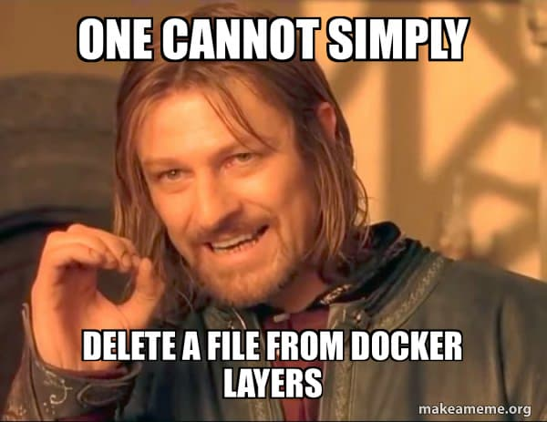

<!-- SOCIAL/OPTIONAL IMAGE: "TIL: file names you can't use in a container image" illustration (rabbit descending through stacked container layers, `.wh.foo` erasing `foo`). Alt text is in the frontmatter comment above. -->

The other week I was looking into some Docker shenanigans, specifically
[**SOCI**](https://github.com/awslabs/soci-snapshotter) (Seekable OCI). In a
nutshell, SOCI builds an index of the contents of your container image layers,
so that a container can start before the whole image has been downloaded, and
the files it needs are lazily fetched as they are accessed. (Spoiler: there
will probably be an [AWS Bites](https://awsbites.com) episode about SOCI soon,
so stay tuned there if you are curious.)

While reading about compressed layers, indexes and lazy loading, I started
poking at my own understanding of Docker images. And I didn't love what I
found.

I have been using Docker for years. I could happily tell you that "an image is
made of a stack of immutable layers" and I would probably even draw you a nice
diagram with some boxes stacked on top of each other. But if you asked me what
those layers _actually contain_, my answer would get hand-wavy pretty quickly.

One question in particular got stuck in my head:

> If Docker layers are basically tar archives applied on top of one another to
> produce a filesystem, how can one layer **delete** a file created by a
> previous layer?

Think about it for a second. A tar archive can say "here's a file called
`foo`". A later tar archive can say "here's another version of `foo`". But tar
doesn't have a generic operation that says "please delete `foo` from the
archive that came before me".

And, of course, once I started asking that question, I had to find out.

Spoiler: the answer involves magic file names, "opaque" directories, a whole
namespace of perfectly valid Linux file names that you can't faithfully put in
a container image, and a Docker image that behaves differently after you
export it and import it again. Let's jump down the rabbit hole together! 🐇

## Tar: a brilliant, boring choice

Before we start digging, let me share a thought that has been bouncing around
my head since I started this investigation.

Using tar as the foundation for image layers feels, in retrospect, like a
brilliantly pragmatic engineering choice. Tar is:

- **ubiquitous**: every Unix-like system has tooling for it;
- **simple**: it's a sequence of entries, nothing fancy;
- **streamable**: you can process it as it arrives, without random access;
- **extremely well understood**: it has been around since the late 70s;
- **decent at describing Unix filesystems**: permissions, ownership, timestamps,
  symlinks, and more.

But tar was designed to describe a bunch of _files_. It was not designed to
describe a _diff between two filesystems_.

My feeling (and I want to be clear that this is my interpretation, not a
historical account of why the Docker and OCI folks made these choices) is that
this is what often happens when you reuse an existing technology for something
slightly beyond its original purpose: it works great, until you hit an
impedance mismatch. And then you need a convention, or a workaround, to bridge
the gap.

**Whiteouts**, which we are about to meet, feel like exactly one of those moments.

By the end of this article, I'd love for you to tell me whether you think
this is an elegant extension of tar or a slightly hacky workaround. I can see
arguments for both.

## So what is a Docker image layer, really?

Let's start from something familiar:

```dockerfile
FROM alpine:3.20

RUN apk add --no-cache curl

COPY app /app

RUN echo "hello" > /app/hello.txt
```

You have probably heard that "every Dockerfile instruction creates a layer".
That's not quite right. The steps that change the filesystem (like `RUN`,
`COPY` and `ADD`) produce filesystem changes that end up as image layers,
while other instructions (like `ENV`, `CMD`, `EXPOSE` or `LABEL`) only
tweak the image _configuration_.

In fact, a container image is more than just filesystem data. Roughly
speaking, it's made of:

- a **manifest**, which lists all the pieces that make up the image;
- an **image configuration**, with things like environment variables, the
  default command, the working directory, and so on;
- an **ordered list of filesystem layers**.

For this article, we mostly care about the last one: the filesystem layers.

For our Dockerfile, the stack of layers looks something like this:

```text
Layer 3   add /app/hello.txt
Layer 2   add /app/*
Layer 1   install curl (and whatever apk touches)
Layer 0   Alpine base filesystem
             ↓
         merged view
```

<!-- DIAGRAM: stacked filesystem layers. Layer 3 ─── add /app/hello.txt, Layer 2 ─── add /app/*, Layer 1 ─── install curl, Layer 0 ─── Alpine base filesystem, arrow down to "Merged container filesystem". Purpose: introduce composition. -->

The order matters. When a container runs, it doesn't see a folder called
"Layer 0", another folder called "Layer 1" and so on. It sees the **combined
result** of applying all the layers, one after the other, in order:

```text
layer 0
   +
layer 1
   +
layer 2
   +
layer 3
   =
filesystem visible to the container
```

A quick note on vocabulary: since what really matters is the order in which
layers are applied, in this article I'll talk about **earlier** and **later**
layers. Elsewhere (including the OCI spec and the OverlayFS docs) you'll often
see them called **lower** and **upper** layers, because they're usually drawn
as a stack. Same thing, different metaphor.

The other important property is that layers are **immutable**. Once a layer
is created, it never changes. A new layer doesn't edit a previous one: it
describes _another_ set of changes that gets applied after the previous ones.

This immutability is what makes a lot of the Docker magic possible:

- **caching**: if nothing changed, a build step can reuse the existing layer;
- **sharing**: 20 images based on `alpine:3.20` can share the same base layer,
  on disk and over the network;
- **content-addressed distribution**: each layer is identified by the hash of
  its content, so registries and clients can tell whether they already have it.

OK, so far nothing new. But what's _inside_ one of these layers?

## A layer is a filesystem changeset

Here's where we need to be a little more precise than "a layer is a tar
archive".

The [OCI Image Specification](https://github.com/opencontainers/image-spec/blob/main/layer.md)
(the standard that describes the format of container images, which Docker
images follow these days) calls a layer an **image layer filesystem
changeset**. When an image is distributed (for instance, when you push it to
or pull it from a registry), each layer is represented as a tar-based
changeset. The tar payload is usually compressed too, most commonly with gzip
or zstd (the spec defines media types such as
`application/vnd.oci.image.layer.v1.tar+gzip` and
`application/vnd.oci.image.layer.v1.tar+zstd`).

This doesn't mean that Docker keeps a pile of `.tar.gz` files around and
extracts them every time you start a container. Locally, the storage driver
(for example, [overlay2](https://docs.docker.com/engine/storage/drivers/overlayfs-driver/))
keeps each layer as an extracted directory and uses a union filesystem to
stack them. The tar representation is how layers are _serialized_ and moved
around. Keep this distinction in mind, because it's going to come back to bite
us later!

From now on, I'll casually talk about "the layer tar", but remember: that's
the serialized form, not necessarily what's sitting on your disk.

> **The key idea:** A layer is not a complete filesystem. It is a filesystem
> changeset that only has meaning when applied after the layers that came before it.

So what does a changeset contain? According to the OCI spec, there are three
types of change:

- **Additions**
- **Modifications**
- **Removals**

Additions and modifications are easy to represent in tar. Removals are the
interesting one. But let's take things in order.

A tar archive is basically a sequential stream of entries. Each entry has a
header with the path and some metadata, followed by the file contents (where
applicable). Among the metadata that a layer entry carries, you'll find:

- the permissions (mode);
- the owner (UID and GID);
- the modification time;
- the link target, for symlinks and hard links;
- extended attributes, where supported.

So a layer tar might conceptually look like this:

```text
app/
app/index.js
app/config.json
etc/my-app.conf
```

When this changeset is applied on top of the previous filesystem:

- paths that don't exist yet are **added**;
- paths that already exist are **replaced**;
- directories that exist on both sides **merge** into one.

The spec actually makes a point of saying that layer changesets are
_applied_, rather than simply extracted as tar archives. This sounds like
a pedantic distinction right now, but hold that thought.

## Adding files is the easy part

Let's say Layer A contains:

```text
/app/
  index.js
```

And Layer B contains:

```text
/app/
  config.json
```

The merged filesystem will be:

```text
/app/
  index.js
  config.json
```

At the tar level, Layer B simply contains an entry for `app/config.json`
(and, typically, one for the parent directory `app/`). No special trick
needed. Tar already knows how to say "here's a file".

The same goes for directories. When a directory exists in an earlier layer and a directory with the same path shows up in a later layer, their contents
compose into a single directory in the final filesystem. (If you are
wondering: the spec says that the later directory's attributes, like
permissions and ownership, replace those of the existing one. The children
are merged, not replaced.)

So far so good. This sounds simple enough, right?

## Changing a file doesn't change the old layer

What about modifying an existing file?

Let's say Layer 1 contains `/app/config.json`:

```json
{ "debug": false }
```

And Layer 2 contains another `/app/config.json`:

```json
{ "debug": true }
```

The container will see the Layer 2 version, with `debug` set to `true`.

This is how a modification is represented: the new layer simply ships a new,
**complete** version of the file. The OCI spec is pretty explicit about it:
"Additions and Modifications are represented the same in the changeset tar
archive". There's no binary patch, no "change byte 12 from `f` to `t`".
Changed one character in a 200 MB file? Congratulations, your new layer
contains a brand new 200 MB file! 🎉

And, crucially, the original version of the file is still there, inside Layer 1. The newer layer doesn't touch the bytes of the older one (layers are immutable, remember?). It just provides an entry that takes precedence.

This has a practical consequence that you might have stumbled into:

```dockerfile
RUN curl -o /tmp/huge-file.tar https://example.com/huge-file.tar
RUN rm /tmp/huge-file.tar
```

The second `RUN` removes the file from the _final filesystem_, but it doesn't
magically shrink the layer created by the first `RUN`. That layer is immutable
and it still contains the whole file. This is why "I deleted the giant file in
the next `RUN` instruction" doesn't save you from shipping the giant file's
layer (and why you often see downloads, extraction and cleanup chained in a
single `RUN`, or multi-stage builds).

But wait a second... we just said that the second `RUN` "removes the file".
What does that layer actually contain?

## How do you delete a file from a layer?

This is the question that sent me down the rabbit hole in the first place.

Let's try to recap what we know so far and see if we can come up with some kind of educated guess...

Let's say Layer 1 contains:

```text
/app/
  index.js
  old-config.json
```

And we want the result after Layer 2 to be:

```text
/app/
  index.js
```

What should Layer 2 contain?

- It **can't modify Layer 1**, because layers are immutable.
- It **can't just "not mention" `old-config.json`**, because absence in a
  layer simply means "this layer has no change for that path". If absence
  meant deletion, every layer would have to list every single file in the
  filesystem to keep it alive, and we'd lose the whole point of layers.
- And **tar has no "negative file"**. There's no entry type that means "the
  thing that used to be here, please make it go away".

Take a moment to think about how you would solve this. If you were designing
the format, what would you do?

Take your time, I'll be here waiting...



Got an idea?

Great, now let's see how OCI does it.

## Meet the whiteout

To remove `/app/old-config.json`, the newer layer contains an entry called:

```text
/app/.wh.old-config.json
```

That's it. I swear, that's the trick. 😅

The `.wh.` prefix (short for **whiteout**) means: "when applying this layer,
remove the path from earlier layers whose name is whatever follows `.wh.`".

```text
Layer 1
/app/
  index.js
  old-config.json

Layer 2
/app/
  .wh.old-config.json

         ↓ apply layers

Result
/app/
  index.js
```

<!-- DIAGRAM: whiteout. Layer 2: /app/.wh.old-config.json — Layer 1: /app/index.js, /app/old-config.json — arrow down — Result: /app/index.js only, old-config.json is absent. Purpose: make the deletion mechanism visually obvious. -->

Note that `.wh.old-config.json` is present in the **layer archive**, but it
is not supposed to become a regular file in the final filesystem. It's an
_instruction_ encoded as a specially named tar entry. After the layer is
applied:

- the earlier `old-config.json` is gone from the merged view;
- the whiteout itself is also hidden (the spec says: "Once a whiteout is
  applied, the whiteout itself MUST also be hidden").

Now, here's the part I find most interesting. **Tar itself has no idea that
`.wh.old-config.json` is special.** As far as tar is concerned, it's just a
regular file with a weird name. In fact, the spec even says so: "regardless of
the path being deleted, the whiteout file is a regular file in the archive".

It's the OCI consumer, the thing that _applies_ the layer, that looks at the
name and says: "Ah! You don't actually want this file. You want me to remove
`old-config.json` from an earlier layer."

> **Whiteouts are not a tar feature.** They are an OCI convention encoded
> using specially named tar entries.

So that's what "applied, rather than simply extracted" means. If you just ran
`tar -xf` on a layer, you would end up with a bunch of `.wh.*` files lying
around, and nothing would be deleted.

So apparently we solved this one by inventing files
that aren't really files.

I'll leave it to you to decide whether you think that's _elegant_ or _hacky_. It surely is _clever_, but otherwise I have mixed feelings myself.

Anyway, a couple more rules from the spec are worth knowing, because they'll matter
later:

- **Whiteouts only apply to earlier layers.** A whiteout can't delete a
  file that was added in the _same_ layer. Quoting the spec: "Files that are
  present in the same layer as a whiteout file can only be hidden by whiteout
  files in subsequent layers."
- **A `.wh.` entry with nothing after the prefix is invalid**, and
  implementations "SHOULD return an error when encountering such an entry".
- The spec describes a whiteout as an **empty** file. Keep this one in your
  back pocket too.

### What about directories?

The same mechanism works for directories. If an earlier layer contains:

```text
/app/cache/
  a
  b
  c
```

A following layer containing:

```text
/app/.wh.cache
```

removes the entire `cache` directory, along with everything inside it.

Nice and consistent. But sometimes we want something slightly different.

## There's an even stranger whiteout

What if we don't want to delete the directory, but we want to say: "keep this
directory, but forget about everything it inherited from earlier layers"?

This can happen, for instance, when a build step deletes a directory and
recreates it with completely new contents. The directory still exists, but
none of the old children should show up.

One option is to add a whiteout for every single child. That works, but imagine you have a large build folder with hundreds or even thousands of child files or folders (yes, like a `node_modules` 😏), it wouldn't be convenient to have to create a whiteout for each one of them, right?

In fact, OCI has a dedicated marker for this case, and it's the weirdest file name in
this whole article:

```text
.wh..wh..opq
```

Yes, that's `.wh.` twice, followed by `.opq`, which stands for **opaque**. An
opaque whiteout inside a directory means: "for this directory, don't merge in
the children inherited from earlier layers".

Let's see an example to better understand this concept.

Suppose we have a directory called `/node_modules` in an earlier layer, with two subdirectories:

```text
/node_modules/
  left-pad/
    index.js
  event-stream/
    index.js
```

Later layer:

```text
/node_modules/
  .wh..wh..opq
  colors/
    index.js
```

Result:

```text
/node_modules/
  colors/
    index.js
```

The `/node_modules` directory stays, the earlier `left-pad` and
`event-stream` directories disappear, and the new `colors` directory from the same layer as the marker survives. The spec also clarifies that the opaque marker is processed
_before_ the other entries of that directory in the same layer, regardless of
the order in which they appear in the archive, so it only ever hides stuff
from earlier layers.

(Fun fact: the spec says that implementations SHOULD generate layers using
explicit per-file whiteouts, but MUST accept opaque ones.)

OK, at this point I felt pretty good about my new mental model. And then my
brain did the thing it always does.

## Wait... what if my file is actually called `.wh.foo`?

BTW, am I the weird one, or did your brain come up with the same question? 🧠

Anyway... Linux is perfectly happy with a file called `.wh.foo`:

```sh
touch .wh.foo
ls -a
# .  ..  .wh.foo
```

There's nothing invalid about that name on a normal Unix filesystem. It's a
hidden file (it starts with a dot) with a slightly odd name. Yes, but it's still a perfectly valid file, that's all.

But in an OCI layer, an entry called `.wh.foo` already _means_ "delete `foo`
from earlier layers". How would you tell the two apart?

- There's no flag in the tar entry saying `this_is_a_literal_file = true`.
- There's no escaping convention, like `.wh.literal.wh.foo`.
- There's no PAX header or extended attribute defined by OCI to distinguish
  "a regular file named `.wh.foo`" from "a whiteout for `foo`".

<aside class="callout callout-note">

**Wait, what's a PAX header?** The original tar header (the _ustar_ format) is
a fixed-size block with fixed-width fields, which comes with some annoying
limits: paths of at most ~255 characters, file sizes up to ~8 GB, timestamps
with one-second precision, and no room for things like extended attributes.
[PAX](https://pubs.opengroup.org/onlinepubs/9699919799/utilities/pax.html#tag_20_92_13_03)
(from POSIX.1-2001) fixes this without breaking the format: right before a
file's entry, it adds a special entry containing `key=value` records (for
example `path=...`, `mtime=1695565140.123456`, or
`SCHILY.xattr.user.foo=...`) that apply to the entry that follows. Tools that
don't understand a given key can mostly just ignore it.

In other words, PAX is tar's official escape hatch for extra metadata. And
OCI already uses it: the spec requires Windows-specific file attributes to be
encoded as
[PAX vendor extensions](https://github.com/opencontainers/image-spec/blob/main/layer.md#platform-specific-attributes)
(keys like `MSWINDOWS.fileattr` and `MSWINDOWS.rawsd`). So if OCI ever wanted
a "this `.wh.foo` is a literal file, not a whiteout" flag, a PAX record would
be the natural place for it. No such key exists, though, and (as we'll see
later) BuildKit doesn't write any PAX metadata for these entries either.

Fun fact: this exact idea was proposed back in 2016, in
[image-spec#24](https://github.com/opencontainers/image-spec/issues/24):
marking whiteouts with a PAX header (`SCHILY.filetype=whiteout`, which the
[star](https://cdrtools.sourceforge.net/private/man/star/star.4.html) tar
implementation already uses for BSD whiteouts) instead of a magic file name.
It never landed.

</aside>

<!-- DIAGRAM: literal filename collision. A single tar entry "tmp/.wh.foo" with two arrows: "ordinary tar semantics: a file named .wh.foo" vs "OCI layer semantics: delete tmp/foo". -->

So the same bytes can only mean one thing to an OCI consumer. And the spec is
very honest about the consequence:

> As files prefixed with `.wh.` are special whiteout markers, it is not
> possible to create a filesystem which has a file or directory with a name
> beginning with `.wh.`.

Let me restate that more precisely, because it's easy to overgeneralise. Linux
doesn't forbid `.wh.*` names. Your laptop doesn't care. The limitation belongs
to the **OCI image layer representation**: a serialized OCI image cannot
faithfully represent a regular filesystem entry whose name begins with `.wh.`.
The whole `.wh.*` namespace is effectively reserved:

- `.wh.<name>` means "delete `<name>`";
- `.wh..wh..opq` means "this directory is opaque";
- `.wh.` on its own is invalid.

So yes, saying "these are file names you can't use in a container image" is a
bit of a shorthand. As we are about to discover, these names _can_
exist in some places along the way. They just can't survive the trip through
an OCI layer as regular files.

## Of course I had to try it

Reading the spec answered the theoretical question. But now I had another
one: **what does Docker actually do if you try this?**

Does `docker build` reject the file? Does it silently turn it into a
whiteout? Does it escape it somehow? Does the file exist in a later `RUN`
step? And in a container started from the image? What does the layer tar look
like? What happens after exporting and re-importing the image? And what about
`.wh..wh..opq` and the invalid `.wh.`?

At this point, of course, there was only one sensible thing to do: write some
Dockerfiles and try to break them.

As the saying goes, _"in theory there's no difference between theory and
practice. In practice, there is."_ ...And, as we're about to find out, with Docker
there can even be a difference between practice and practice after a
`docker load`.

The result is a small repository with a very honest name:
[**lmammino/broken-dockerfile**](https://github.com/lmammino/broken-dockerfile).
Its description sums it up: _"It works on my machine. Then you push it."_ You can go and check it out... Hey, but only after you finish reading here! 🤨

The repository contains a build context with files literally called `foo`,
`.wh.foo`, `.wh..wh..opq`, `.wh.` and `c`. Each file contains some text
naming itself (for example, `.wh.foo` contains `CONTENT-OF-.wh.foo: I am a
regular file literally named .wh.foo`), so we can always tell what we are
looking at. There are four Dockerfiles, one per experiment, and a script that
pushes each one through a bunch of different paths:

- a regular `docker build`, with probes in `RUN` steps;
- a `docker run` of the resulting image;
- a `docker image save`, with a small Python script that lists every entry in
  the layer tars (type, mode, size, content, PAX headers);
- OCI and filesystem exports via `docker buildx`;
- and, most importantly, two ways of forcing a **fresh unpack of the
  serialized layers**: exporting the image and loading it back with
  `docker image load`, and exporting an OCI layout and using it as the base of
  a new BuildKit build.

To see what's going on, each Dockerfile has one or more small "probe" steps
that list the directory and then check each file of interest:

```dockerfile
RUN ls -la /tmp && \
    for p in /tmp/foo /tmp/.wh.foo; do \
      if [ -e "$p" ]; then \
        echo "EXISTS  $p :: $(cat "$p")"; \
      else \
        echo "MISSING $p"; \
      fi; \
    done
```

The same check also runs inside containers started from the resulting images.
So in the outputs below you'll see lines like these:

```text
EXISTS  /tmp/foo :: CONTENT-OF-foo: I am the regular file named foo
MISSING /tmp/.wh.foo
```

Printing the content too makes it obvious which file we're actually looking
at. I also run the builds with `--progress=plain`, so
the output of a build step is prefixed by BuildKit's step number and timing
(for example `#9 0.117`).

I tested this with Docker Engine 29.4.0 and BuildKit (0.29.0 on the default
builder, 0.32.2 on a temporary `docker-container` builder), running on
OrbStack on an arm64 Mac, with the **overlay2** storage driver and the
containerd image store **disabled**. That last detail matters, and I'll come
back to it. The repository contains the full version matrix, the scripts and
all the raw outputs, so you don't have to take my word for any of this.

Let's see what happens. 👀

## BuildKit says "sure, why not?"

Let's start with the simplest possible case:

```dockerfile
FROM alpine:3.20
COPY .wh.foo /tmp/.wh.foo
```

Drumroll... the build succeeds. No error. No warning. A later `RUN` step
can see the file, content and all. And if I `docker run` the image I just
built, the file is there:

```text
-rw-r--r--    1 root     root            64 Sep 24 14:19 .wh.foo
EXISTS  /tmp/.wh.foo :: CONTENT-OF-.wh.foo: I am a regular file literally named .wh.foo
```

So... did we just prove the OCI spec wrong? 🤔

Nope. So far, we have only built the image and run it on the same machine,
straight from the files that BuildKit wrote to disk. We haven't yet forced the
image to go through an OCI layer _unpack_: nothing has taken the serialized
layer tars and applied them one by one, following the OCI rules. And that's
exactly what happens when an image travels, for example when you export it and
load it somewhere else.

## The local snapshot and the layer archive are not quite the same thing

Remember when I said that the tar representation is how layers are
serialized, not necessarily how they're stored locally? This is where that
distinction stops being pedantic.

BuildKit doesn't work with tarballs internally. It works with filesystem
**snapshots**. When it executes `COPY .wh.foo /tmp/.wh.foo`, it copies a
regular file into a snapshot, and nothing about a snapshot cares about
`.wh.` prefixes. So later `RUN` steps happily see the file.

When I build with the default Docker setup in my environment (overlay2, no
containerd image store), the image ends up in overlay2 directories that
BuildKit wrote directly. When I then `docker run` that image, the daemon
stacks those directories and starts the container. At no point does anything
take a serialized layer tar and _apply_ it according to the OCI rules. Even
`docker image save` reads from those directories and produces tar files: it
_writes_ layer tars, but it doesn't _read_ them back.

So we actually have (at least) two different representations of "the same"
layer:

```text
BuildKit snapshot / local overlay2 directories
   → a directory with a regular file called .wh.foo

serialized OCI layer
   → a tar with an entry called tmp/.wh.foo
```

They are _supposed_ to describe the same thing. For almost every file name
in the universe, they do. But for this pathological file name, their meaning
can diverge.

I want to be careful here: this is what I observed in my environment. I did
not test the containerd image store (which is the default on newer Docker
installs), other snapshotters, or other storage drivers, and some of those
could well behave differently locally. The part that is _not_
environment-specific is what comes next: what the serialized layer means.

## What does the layer tar look like?

Here's how BuildKit serialized that `COPY`, as listed by the inspection
script (this one is from the second experiment, which we'll look at in a
moment):

```text
== layer 3: created_by: COPY .wh.foo /tmp/.wh.foo # buildkit
  DIR  1777 0:0 size=0    tmp
  REG  0644 0:0 size=64   tmp/.wh.foo   <-- .wh. name
         content: 'CONTENT-OF-.wh.foo: I am a regular file literally named .wh.foo'
```

Look at that entry closely:

- it's a plain regular file (`REG`);
- it has the original mode (`0644`);
- it has the original content (64 bytes);
- there's no PAX header, no extended attribute, nothing that says "hey, I'm a
  literal file, not a whiteout".

But from the point of view of OCI layer semantics, `tmp/.wh.foo` is
unambiguously a whiteout for `tmp/foo`. Remember the "whiteouts are empty
files" rule I asked you to keep in your back pocket? This one has 64 bytes of
content, and (spoiler) the unpackers I tested didn't care one bit. The name is
all that matters.

In other words:

```text
tar interpretation:
  a regular file called tmp/.wh.foo

OCI layer interpretation:
  remove tmp/foo from an earlier layer
```


Same tar entry. Different semantic layer on top.

BuildKit managed to represent my local filesystem snapshot as tar bytes,
but those same bytes acquire whiteout semantics as soon as someone interprets
them as an OCI filesystem changeset. I think this is a beautiful example of
the difference between a **serialization format** (tar) and the **protocol**
that interprets it (OCI layer application).

Time to put on the lab coat and do some science! 🧪

## Experiment 1: `foo` and `.wh.foo` in the same layer

The first Dockerfile copies both files in a single instruction, so they end up
in the same layer:

```dockerfile
FROM alpine:3.20
COPY foo .wh.foo /tmp/
```

During the build, and when running the locally built image, both files are
there:

```text
EXISTS  /tmp/foo :: CONTENT-OF-foo: I am the regular file named foo
EXISTS  /tmp/.wh.foo :: CONTENT-OF-.wh.foo: I am a regular file literally named .wh.foo
```

The serialized layer contains both entries, as regular files:

```text
== layer 1: created_by: COPY foo .wh.foo /tmp/ # buildkit
  DIR  1777 0:0 size=0    tmp
  REG  0644 0:0 size=64   tmp/.wh.foo   <-- .wh. name
  REG  0644 0:0 size=48   tmp/foo
```

Now let's force a fresh unpack. To do that, I build the image again with a
separate BuildKit instance (a `docker-container` builder), export it straight
to a tarball instead of the local Docker image store, and then load that
tarball into Docker:

```sh
docker buildx build --builder whiteout-test-builder \
  --output type=docker,dest=image.tar \
  -f dockerfiles/exp1-same-layer.Dockerfile -t whiteout-test:exp1 context

docker image load -i image.tar
```

Since the Docker daemon doesn't already have the layers created by our `COPY`,
it has no choice but to unpack the serialized layer tars itself. (I also
re-imported the image into BuildKit as an OCI layout, which forces a fresh
unpack in a different way: check the repo for that one.) This is what we get:

```text
EXISTS  /tmp/foo :: CONTENT-OF-foo: I am the regular file named foo
MISSING /tmp/.wh.foo
```

`.wh.foo` is gone, but `foo` survived! Why?

Because whiteouts **only apply to earlier layers**. The unpacker saw
`tmp/.wh.foo`, decided it was a whiteout, and (as the spec requires) did not
materialise it as a file. But `foo` was added in the _same_ layer as the
whiteout, and a whiteout can't hide a sibling from its own layer. So `foo`
stays.

So the only casualty was `.wh.foo` itself: `foo` survived because it lives in
the same layer as the whiteout. But what if `foo` lived in an _earlier_
layer instead? 😏

## Experiment 2: put `foo` in the previous layer and everything changes

This is the experiment that I consider the real smoking gun.

```dockerfile
FROM alpine:3.20
COPY foo /tmp/foo
# (probe step)
COPY .wh.foo /tmp/.wh.foo
# (probe step)
```

(The probe steps are the ones described earlier; check the repo for the exact
Dockerfile.)

This time `foo` lives in an earlier layer, and `.wh.foo` comes later. During the
build, both files exist:

```text
#9 0.117 EXISTS  /tmp/foo :: CONTENT-OF-foo: I am the regular file named foo
#9 0.118 EXISTS  /tmp/.wh.foo :: CONTENT-OF-.wh.foo: I am a regular file literally named .wh.foo
```

`docker run` on the locally built image shows both files too. And if we peek
into the overlay2 storage, `.wh.foo` is sitting there as an ordinary file in
the later layer's directory, while `foo` lives in the earlier one:

```text
--- .../wkkj2txp7r07grph3iul4ig40/diff/tmp
-rw-r--r--    1 root     root            64 Sep 24 14:19 .wh.foo
--- .../r947zefzt51na5a3xwujcba4w/diff/tmp
-rw-r--r--    1 root     root            48 Sep 24 14:19 foo
```

Everything looks fine. It works on my machine! ✅

Now let's force a fresh unpack of the serialized layers, exactly like we did
before:

```text
MISSING /tmp/foo
MISSING /tmp/.wh.foo
```

**Both files are gone.** 💥

Here's exactly what happened:

1. the earlier layer added `/tmp/foo`;
2. the later layer was serialized with a regular tar entry called
   `tmp/.wh.foo`;
3. the unpacker (both `dockerd` and BuildKit, in my tests) interpreted that
   entry as a whiteout;
4. so it removed `/tmp/foo` coming from the earlier layer;
5. and, as the spec requires, it did not materialise the whiteout itself;
6. therefore, neither path exists.

<!-- DIAGRAM: BuildKit round trip. "BuildKit snapshot: /tmp/foo, /tmp/.wh.foo" → (serialize as OCI layer) → "tar entry: tmp/.wh.foo" → (OCI unpack) → "/tmp/foo gone, /tmp/.wh.foo gone". Probably the single most useful diagram in the article. -->

Let that sink in for a moment.

A file
that I never asked to delete (`foo`) is gone, deleted by a file that I simply
asked to copy.

> A filesystem state that BuildKit can represent internally is not
> necessarily a filesystem state that an OCI layer can faithfully serialize and
> reconstruct.

"It works on my machine" has rarely been this literal.

But wait, who exports images to tarballs anyway? The way most of us ship
images is `docker build` followed by `docker push`. So I also tried exactly
that: a plain `docker build` with the default builder, a `docker push` to a
local registry, and then a `docker pull` + `docker run` on two brand new Docker
daemons (running in `docker:dind` containers) that had never seen these
layers. One of them used the containerd image store (the default on new
installs) and the other one the classic overlay2 storage driver.

Same result on both: `/tmp/foo` and `/tmp/.wh.foo` are both gone. And the
layer stored in the registry contains the very same regular-file entry
`tmp/.wh.foo` that we saw before. So yes, it really works on my machine, then
you push it, and it doesn't work anywhere else. 🙃

## Experiment 3: opaque whiteouts, for real

Is this specific to `.wh.foo`? Let's try the opaque marker. The earlier layers
create a directory with two files:

```dockerfile
FROM alpine:3.20
RUN mkdir /tmp/dir && echo lower-a > /tmp/dir/a && echo lower-b > /tmp/dir/b
COPY .wh..wh..opq c /tmp/dir/
```

During the build (and on the locally built image), the marker is just a
regular file and everything is visible:

```text
#9 0.135 -rw-r--r--    1 root     root            74 Sep 24 14:19 .wh..wh..opq
#9 0.135 -rw-r--r--    1 root     root             8 Sep 24 14:24 a
#9 0.135 -rw-r--r--    1 root     root             8 Sep 24 14:24 b
#9 0.135 -rw-r--r--    1 root     root            54 Sep 24 14:19 c
```

The serialized layer, once again, contains a plain regular-file entry:

```text
== layer 3: created_by: COPY .wh..wh..opq c /tmp/dir/ # buildkit
  DIR  0755 0:0 size=0    tmp/dir
  REG  0644 0:0 size=74   tmp/dir/.wh..wh..opq   <-- .wh. name
  REG  0644 0:0 size=54   tmp/dir/c
```

And after a fresh unpack:

```text
MISSING /tmp/dir/a
MISSING /tmp/dir/b
EXISTS  /tmp/dir/c :: CONTENT-OF-c: added in the same layer as .wh..wh..opq
MISSING /tmp/dir/.wh..wh..opq
```

That's the opaque whiteout doing exactly what the spec says:

- the children inherited from the earlier layer (`a` and `b`) are gone;
- `c`, which came in the same layer as the marker, survives;
- the marker itself is hidden.

So the collision isn't a quirk of one file name. It's the whole reserved
namespace.

## Experiment 4: the `.wh.` that shouldn't exist

Finally, the edge case of the edge cases: a file called just `.wh.`, which the
spec says is an invalid whiteout.

```dockerfile
FROM alpine:3.20
COPY .wh. /tmp/.wh.
```

BuildKit doesn't reject it. The build succeeds, the image runs locally, and
`/tmp/.wh.` shows up with its content. The layer tar contains a regular file
entry `tmp/.wh.`.

The trouble starts when something tries to unpack that layer. The BuildKit
re-import fails, pretty explicitly:

```text
ERROR: failed to build: failed to solve: failed to compute cache key: invalid whiteout name: .wh.: invalid archive
```

And `docker image load` fails with a lower-level error:

```text
failed to mknod('/tmp', S_IFCHR, 0): file exists
```

I won't try to reverse-engineer that `mknod` error in detail here (more on
character devices in a second), but it looks like the loader tried to turn
the whiteout into an overlay whiteout for... the empty name, i.e. the parent
directory itself, which already exists. The useful takeaway is simpler: **BuildKit let me
create a local image that can't subsequently be consumed as a valid OCI
filesystem layer**. Build succeeds, export succeeds, load fails.

(If you're curious, the BuildKit error comes from
[containerd's archive package](https://github.com/containerd/containerd/blob/main/pkg/archive/tar.go),
which checks that the target of a whiteout lives _inside_ the whiteout's
directory. `.wh.` targets the directory itself, so it fails that check.)

To be fair to BuildKit, the rule that makes `.wh.` invalid is very fresh. It
was only added to the spec in May 2026
([PR #1314](https://github.com/opencontainers/image-spec/pull/1314)), after
someone asked in
[image-spec#1301](https://github.com/opencontainers/image-spec/issues/1301)
what a bare `.wh.` is supposed to do. Until then, the spec simply didn't say,
and different tools did different things: in that thread, one of the
maintainers noticed that umoci treated it as an opaque whiteout! The ink is
barely dry on this one.

## For extra weirdness: the legacy builder

The repository also runs every experiment with the legacy builder
(`DOCKER_BUILDKIT=0`), which you probably shouldn't be using in 2026 anyway,
but it's an interesting comparison.

The legacy builder applies whiteout semantics much earlier: **at `COPY`
time**, during the build itself. So:

- in experiment 1, `.wh.foo` disappears immediately and `foo` stays;
- in experiment 2, both `foo` and `.wh.foo` are gone already in the next
  `RUN` step;
- in experiment 3, `a`, `b` and the marker vanish, and `c` stays;
- in experiment 4, the build fails at the `COPY` step with the same
  `mknod` error we saw before.

The funny part is that `docker image save` then fails for every one of these
images, with errors like:

```text
open .../merged/tmp/.wh.foo: no such file or directory
```

So the legacy builder produces a filesystem that matches the OCI semantics
from the start, but then trips over the missing file when it tries to
serialize the image. Different parts of the Docker stack clearly disagree
about _when_ these names should acquire their special meaning. The repository
has the complete matrix if you want the gory details.

### OCI whiteouts are not OverlayFS whiteouts

In experiment 2 with the legacy builder, the overlay2 upper directory
contained this:

```text
c---------  0,0  foo
```

That's not a `.wh.foo` file. It's a **character device** with device number
0/0, which is how the Linux
[OverlayFS](https://docs.kernel.org/filesystems/overlayfs.html) represents a
whiteout on disk (opaque directories, instead, are marked with an extended
attribute). That's also likely why `mknod(..., S_IFCHR, 0)` showed up in the
`.wh.` error: the loader was translating OCI whiteouts into overlay
whiteouts.

This is a good reminder that the `.wh.*` convention belongs to the OCI
**layer format**. A storage driver is free to represent "this file is
deleted" in whatever way its filesystem supports, and translate between the
two when importing or exporting layers. The whole mess we've seen happens at
the boundary between those representations.

## Is this a bug?

I'll admit that naming the repository `broken-dockerfile` was a bit
provocative. So, let's be fair.

**The OCI behaviour is not a bug.** It's explicitly specified. The spec tells
you that `.wh.*` names are whiteouts and that a filesystem containing
them can't be represented. Every unpacker I tested did exactly what the spec
says.

**Whether BuildKit should reject or warn about literal `.wh.*` paths** before
producing an image that can't round-trip cleanly is a separate question. It's
a tooling and API-design choice, and there may be good reasons (performance,
compatibility, "garbage in, garbage out") for not checking every path.

The limitation itself is well known upstream. It has been discussed since
before OCI 1.0:
[image-spec#24](https://github.com/opencontainers/image-spec/issues/24) ("Any
chance of changing the whiteout file approach?"), opened in 2016 and still
open, points out that with this scheme "base images can no longer contain
arbitrary data". But I couldn't find any BuildKit issue about rejecting or
warning on these names at build time (as of September 2026). And, reading the
code, the layer writer that BuildKit uses (again, containerd's archive package)
only generates `.wh.` names for _deletions_: added files are written under
whatever name they have, with no check. So I don't want to claim that BuildKit
is "broken". It's just a case that nothing currently guards against.

The way I'd put it is:

> The format is doing exactly what the spec says. The surprising part is that
> the build pipeline lets us create a state whose serialized meaning is
> different.

Also, a couple of things I didn't test, which might be fun follow-ups:
_building_ with the containerd image store enabled (I only used it to pull), and creating the file from a `RUN` step (for example
`RUN touch /tmp/.wh.foo`) rather than with `COPY`. If you try them, let me
know what happens!

## So what did we actually learn?

Let's zoom back out. Here's what I'm taking home from this rabbit hole.

### 1. Layers are changesets, not snapshots of the whole filesystem

Each layer only makes sense when applied after the ones that came before it. This is
also why extracting a single layer tar somewhere doesn't give you the
filesystem that a container sees (and why just running `tar -xf` on all of them
isn't enough either: you'd need to apply the whiteouts).

### 2. Adding and modifying are easy. Deleting is not

Tar already knows how to carry files, directories and their metadata.
Additions and modifications are just entries. Deletion is "negative" state,
and tar has no concept of it, so OCI had to invent a convention: whiteouts.

"Easy", though, doesn't mean "efficient". A modification isn't optimised to
save bytes in any way: change a single byte in a file, and the new layer
contains the _entire_ file again, with that one byte changed. There's no delta
encoding, like the one `git` uses to pack objects or `rsync` uses to transfer
files. Just a brand new full copy of the file.

### 3. Deleting doesn't delete bytes from old layers

A whiteout hides a file from the merged filesystem, but the old layer, and
all its bytes, are still part of the image. Same for modifications: a new
version of a file doesn't shrink the old one. This explains a lot of "why is
my image so big?" moments.

It's also why, if you want to delete files to keep your image small (think
package manager caches or temporary downloads), you need to do it in the
**same** `RUN` instruction that creates them:

```dockerfile
RUN apt-get update && \
    apt-get install -y curl && \
    rm -rf /var/lib/apt/lists/*
```

A layer only captures the difference between the filesystem before and after
its build step. If a file is created and deleted within the same step, it's
simply not there at the end, so it never makes it into any layer (and no
whiteout is needed either). Delete it in the next `RUN`, instead, and you get
a whiteout on top of a layer that still carries all those bytes.

### 4. `.wh.*` isn't just an odd implementation detail

It creates a genuine representational limitation. A perfectly valid Unix
filesystem can contain `.wh.foo`, but an OCI image layer can't encode it as a
regular file, because that name already has protocol-level meaning.

Thankfully, the naming scheme is awkward enough that you're very unlikely to
ever give a real file a name starting with `.wh.`. At the very least, in over
10 years of using Docker, I have never bumped into an issue caused by this
limitation (if you consider one person's experience a statistically
significant sample, that is 😅).

### 5. The builder's internal state and the serialized image can differ

This was the most surprising discovery for me. In the setup I tested,
BuildKit's snapshots (and the local image built from them) can contain states
that the OCI layer format simply cannot round-trip. Everything works locally,
and then the image means something different somewhere else.

### 6. Formats inherit the compromises of what they're built on

This is probably the most important takeaway from a systems design
perspective. Tar was a pragmatic foundation. Whiteouts are the extra convention that lets
a tar-based changeset express something tar itself was never designed to
express. And conventions like that tend to have sharp edges in the corners.

Sure, whiteouts could have been built on PAX headers instead (as proposed
back in 2016), which would arguably have been a better fit: a PAX record lives
in the entry's metadata, so it wouldn't reserve any file names. But either way,
it would still be a convention layered on top of tar, a workaround for
something tar simply can't express on its own.

Whenever you reuse an existing format for a purpose it wasn't designed for,
you'll probably need to add conventions on top of it, and every convention you
add eventually reserves some part of the input space. So it's worth asking
early: what can my users no longer express?

### The cheat sheet

Here's the whole thing in one table:

| Filesystem change                      | Layer representation                  |
| -------------------------------------- | ------------------------------------- |
| Add `foo`                              | tar entry `foo`                       |
| Modify `foo`                           | new, complete tar entry `foo`         |
| Delete `foo` from an earlier layer     | `.wh.foo`                             |
| Ignore inherited directory contents    | `.wh..wh..opq`                        |
| Regular file literally named `.wh.foo` | can't be represented unambiguously 🤷 |

## So, is it a hack?

I promised you we'd come back to this.

On one hand: **yes, it's a little hacky**. Reserving magic file names leaks a
protocol convention into what otherwise looks like an ordinary filesystem
namespace. A layer entry doesn't mean what tar says it means, and you only
find out if you know the rules. And it produces funny edge cases, like the
ones we just saw, where an innocent `COPY` deletes a different file, but only
after the image travels somewhere else.

And it turns out I'm not the only one who thinks so. At the beginning of this
article, I said that my take on tar and whiteouts was just an intuition. Well,
[image-spec#24](https://github.com/opencontainers/image-spec/issues/24) gave me
some actual history: according to people involved in the spec, the `.wh.`
scheme was inherited from AUFS, the union filesystem early Docker was built on.
As one of the maintainers put it: "the original image code was just based on
how AUFS did things because AUFS was the only real union filesystem at the
time". Another one was even more blunt: "The `.wh.` is a silly approach."

On the other hand: **it's also extremely pragmatic**, and I'd go as far as
calling it elegant. OCI keeps using plain, standard tar archives. Any tool
that can read tar can read a layer. Generating a layer is just writing a tar.
And with one tiny naming convention, you get deletion semantics without
inventing a brand new archive format and all the tooling that would come with
it. The price is that you can't have files starting with `.wh.` in your
images, which... let's be honest, is a price very few people will ever notice.
(Again, if you consider me a statistically valid sample: it took me over 10
years to find out, and not because of an actual bug, but because I
accidentally started reading the spec!)

That's pretty much the argument that won in that same thread: "Is there a
realistic use case for distributing `.wh.` files, other than packing up a
container runtime into an image?", followed by the observation that there are
already "millions of container images using this approach". Changing it would
mean every implementation having to support two formats forever, just to
unlock a handful of weird file names.

Personally, I lean towards: _it feels hacky, but I really admire how simple
and practical it is_. Boring technology, plus a little bit of protocol glue.

## Wrapping up

All of this started because I was trying to understand SOCI. I went looking
for answers about lazy-loading compressed container layers, and somehow ended
up learning about magic `.wh.*` files and building a repository full of
intentionally broken Dockerfiles. Pretty standard rabbit-hole-driven
development, I suppose. (And yes, the SOCI stuff is coming, keep an eye on
[AWS Bites](https://awsbites.com)!)

I started with what felt like a fairly mundane question: "how does Docker
delete a file?". The answer turned out to involve magic file names, opaque
directories, an entire reserved namespace of file names, and a Docker image
that changes its filesystem after being exported and imported again. Not bad
for one innocent question!

If I had to condense everything into a mental model, it would be this:
**layers aren't miniature filesystems. They are ordered filesystem
changesets.** The filesystem a container sees is what you get after
interpreting all those changesets, in order, following the OCI rules.
Additions and modifications are plain tar entries, deletions are whiteouts,
and that convention means that a regular file whose name starts with `.wh.`
can't survive the round trip through an OCI image.

I still think tar was a brilliant choice. It's simple, boring, ubiquitous
technology, and boring technology tends to survive. Whiteouts are the little
bit of protocol glue needed to stretch it beyond what tar knows how to
express on its own.

Now I'm curious to hear from you:

- Did you already know about whiteouts? If so, congratulations, you were
  several layers ahead of me! 😄
- Do you know why BuildKit lets these names through without complaining?
- Have you run into other weird consequences of how OCI layers work?
- And the big one: **elegant bit of Unix pragmatism or a hack we've all
  learned to live with?** Feel free to disagree with me!

You can find me on [Bluesky](https://bsky.app/profile/loige.co), and the full
experiment (with all the scripts, logs and version details) is on GitHub at
[lmammino/broken-dockerfile](https://github.com/lmammino/broken-dockerfile).
PRs with more cursed experiments are very welcome. 🐇

### Further reading

- [OCI Image Specification: Image Layer Filesystem Changeset](https://github.com/opencontainers/image-spec/blob/main/layer.md):
  the source of truth for everything about changesets and whiteouts.
- [Docker docs: storage drivers](https://docs.docker.com/engine/storage/drivers/)
  and the [overlay2 driver](https://docs.docker.com/engine/storage/drivers/overlayfs-driver/).
- [Linux kernel docs: Overlay Filesystem](https://docs.kernel.org/filesystems/overlayfs.html),
  if you want to see how whiteouts and opaque directories work at the
  filesystem level.
- [SOCI snapshotter](https://github.com/awslabs/soci-snapshotter): the thing
  that started this whole rabbit hole.
